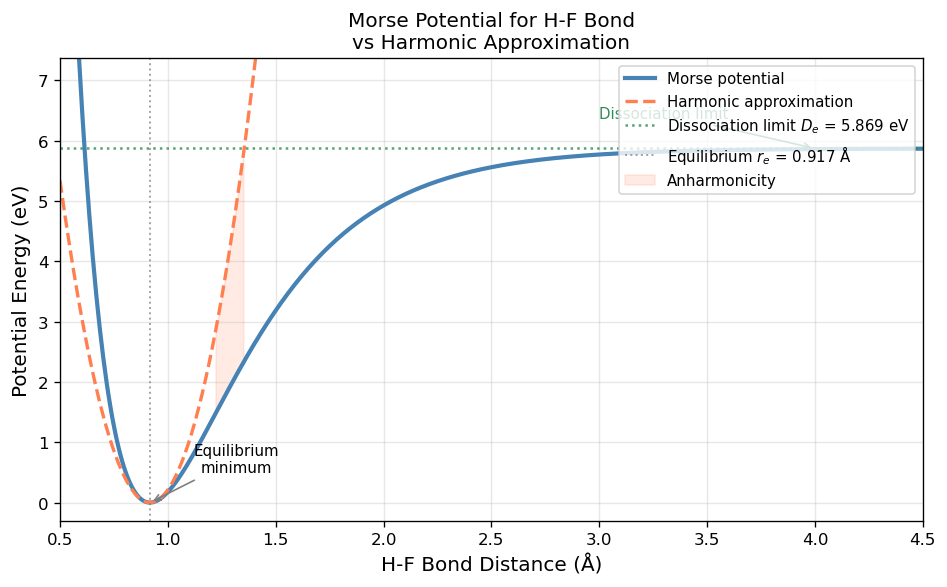
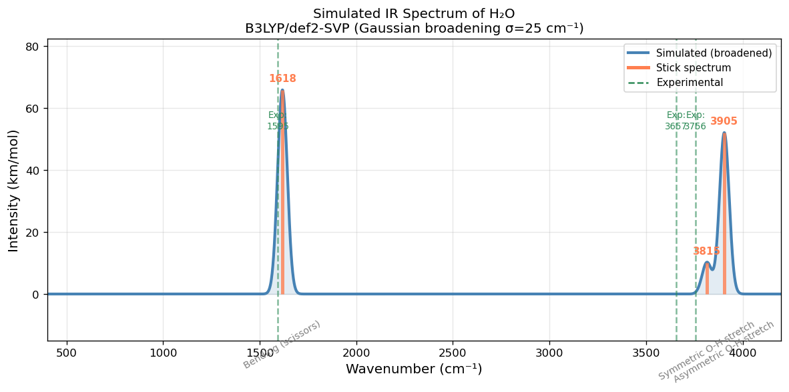
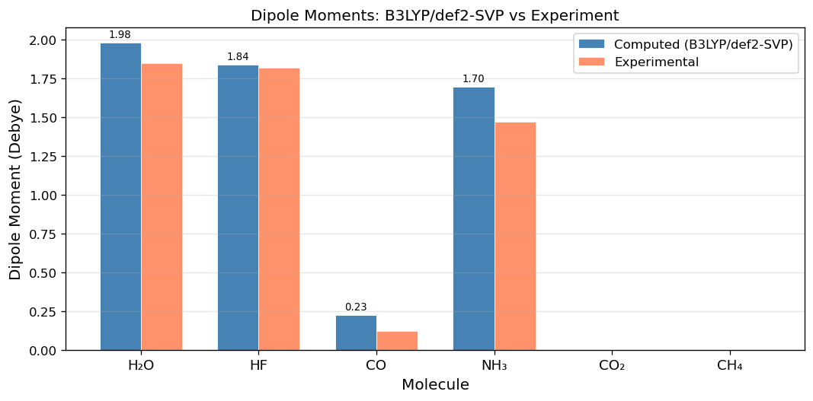
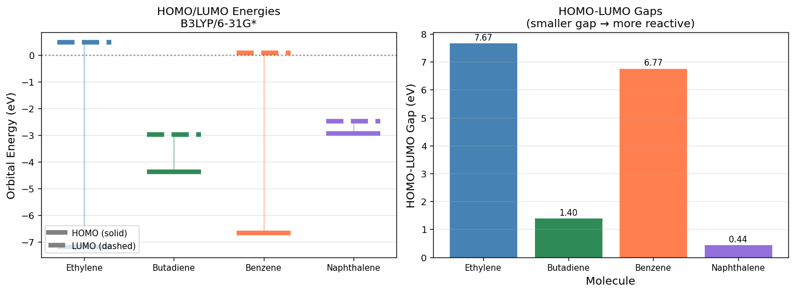
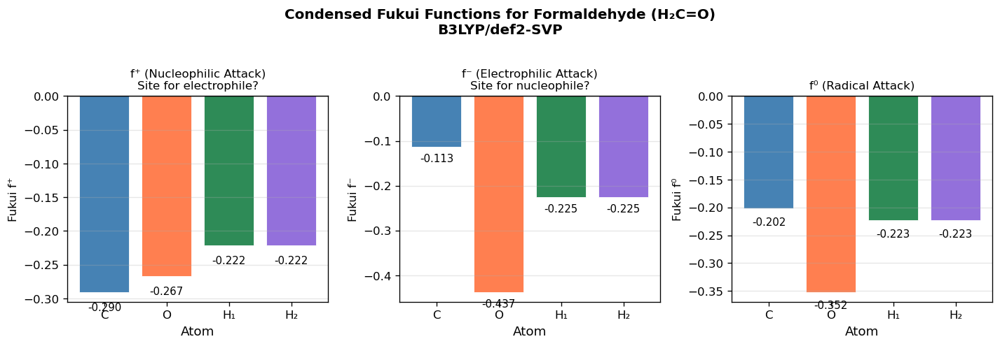
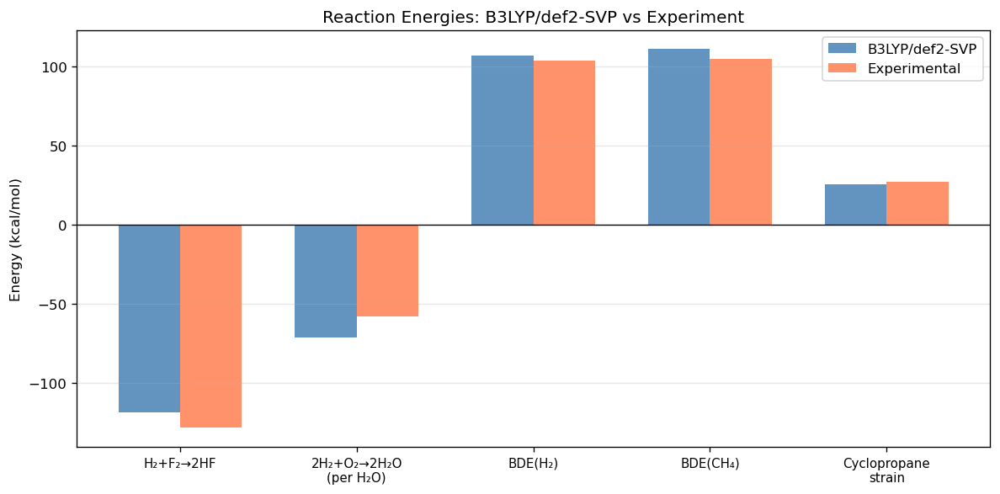
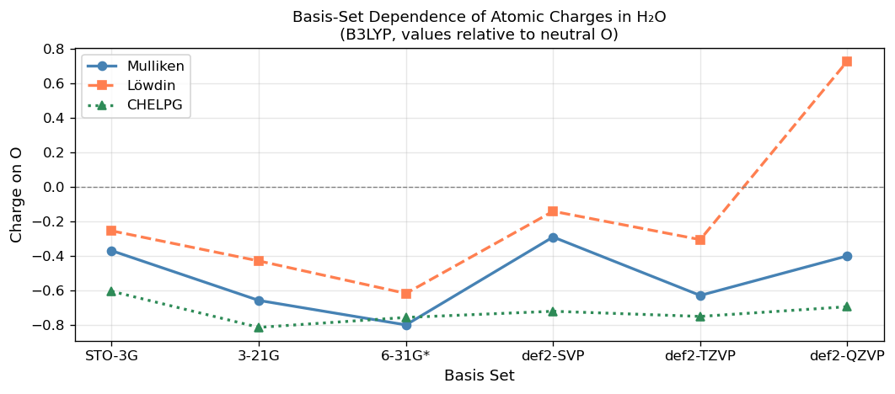
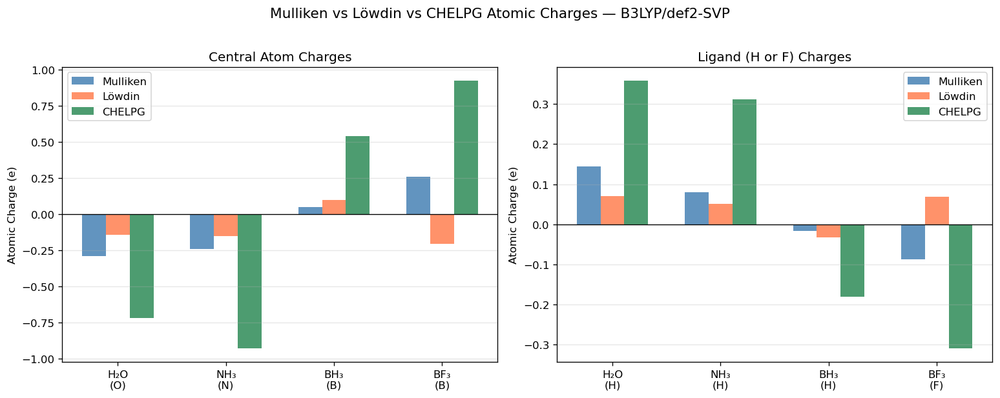
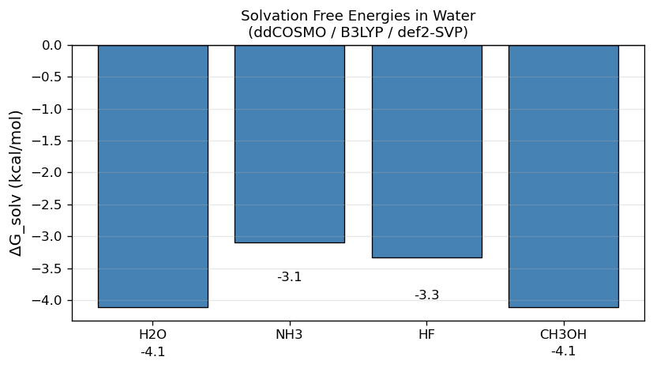
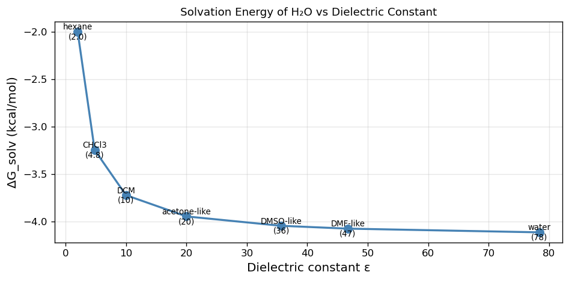

# 04 — Geometry Optimization: Finding Energy Minima

[](https://colab.research.google.com/github/ppt-2/Ch121a-DFT/blob/main/notebooks/04_geometry_optimization.ipynb)

## 🎯 Learning Objectives

- Potential energy surfaces (PES)
- PySCF with geomeTRIC to optimize molecular geometries
- Convergence criteria and common pitfalls in geometry optimization
- Some ORCA input files for geometry optimization
- How does the method/basis affects optimized geometries?

## Theory: Potential Energy Surfaces and Optimization

### 4.1 The Born-Oppenheimer Potential Energy Surface

Within the Born-Oppenheimer approximation, electrons adjust instantaneously to
nuclear motion. The electronic energy as a function of nuclear coordinates
$\mathbf{R} = \{R_I\}$ defines the **potential energy surface (PES)**:

$$E_{BO}(\mathbf{R}) = \langle \Psi_{elec} | \hat{H}_{elec} | \Psi_{elec} \rangle$$

**Stationary points** on the PES satisfy:
$$\mathbf{g}(\mathbf{R}) = \frac{\partial E}{\partial \mathbf{R}} = \mathbf{0}$$

- **Minimum**: all eigenvalues of the Hessian matrix $\mathbf{H} = \frac{\partial^2 E}{\partial R_i \partial R_j}$ are positive
- **Transition state (TS)**: exactly one negative Hessian eigenvalue (imaginary frequency)
- **Higher-order saddle point**: two or more negative eigenvalues

### 4.2 Gradient-Based Optimization Algorithms

Modern geometry optimizers compute the energy gradient $\mathbf{g}$ analytically
and use it to step toward the minimum:

**Steepest Descent**: $\mathbf{R}_{n+1} = \mathbf{R}_n - \alpha \mathbf{g}_n$
(simple but slow convergence)

**Quasi-Newton (BFGS/L-BFGS)**:
$$\mathbf{R}_{n+1} = \mathbf{R}_n - \mathbf{H}_n^{-1} \mathbf{g}_n$$
where the approximate inverse Hessian $\mathbf{H}_n^{-1}$ is updated at each step.
This is the algorithm used in most QC codes (e.g., geomeTRIC, DL-FIND, Berny).

**RFO (Rational Function Optimization)**: Finds both minima and transition states
by solving a modified Newton equation with level-shift parameter.

### 4.3 Convergence Criteria

A geometry optimization is typically considered converged when ALL of these are satisfied:

| Criterion | Tight threshold | Default threshold |
|-----------|:--------------:|:-----------------:|
| Max gradient component | $< 1.5 \times 10^{-5}$ Ha/Å | $< 4.5 \times 10^{-4}$ Ha/Å |
| RMS gradient | $< 1.0 \times 10^{-5}$ Ha/Å | $< 3.0 \times 10^{-4}$ Ha/Å |
| Max displacement | $< 6.0 \times 10^{-5}$ Å | $< 1.8 \times 10^{-3}$ Å |
| RMS displacement | $< 4.0 \times 10^{-5}$ Å | $< 1.2 \times 10^{-3}$ Å |


**Some codes also use Bohr as the unit, 1 Bohr = 0.529177 Å**

**For energy unit conversion, helpful table, https://wild.life.nctu.edu.tw/class/common/energy-unit-conv-table-detail.html**
### 4.4 Internal vs Cartesian Coordinates

Cartesian coordinates: $3N$ degrees of freedom (including 6 translations/rotations)
Internal coordinates (Z-matrix): bond lengths, bond angles, dihedral angles
**Delocalized internal coordinates** (geomeTRIC): linear combinations of primitive
internals \u2014 generally the fastest convergence.


```python
# =============================================================================
# Ch121a: Quantum Chemistry & DFT — Notebook 04: Geometry Optimization
# License: GPL-3.0 (https://www.gnu.org/licenses/gpl-3.0.en.html)
# =============================================================================
import matplotlib
matplotlib.rcParams['figure.dpi'] = 120
import matplotlib.pyplot as plt
import numpy as np
import pandas as pd
from pyscf import gto, dft, scf

# ------------------------------------------------------------------
# Morse Potential: Realistic Bond Potential Energy Surface
# ------------------------------------------------------------------
# The Morse potential is a good approximation to a diatomic bond:
#   V(r) = D_e * [1 - exp(-α(r - r_e))]^2
#
# Parameters for H-F bond:
De = 5.869    # eV — dissociation energy from minimum
alpha = 2.287 # Å^-1
r_e = 0.917   # Å — equilibrium bond length

r = np.linspace(0.5, 4.5, 500)  # Angstrom

# Morse potential
V_morse = De * (1 - np.exp(-alpha * (r - r_e)))**2

# Harmonic approximation: V = (1/2) k (r - r_e)^2
# Force constant k = 2 * D_e * alpha^2 (eV/Å^2)
k = 2 * De * alpha**2
V_harmonic = 0.5 * k * (r - r_e)**2

fig, ax = plt.subplots(figsize=(8, 5))

ax.plot(r, V_morse, '-', color='steelblue', linewidth=2.5, label='Morse potential')
ax.plot(r, V_harmonic, '--', color='coral', linewidth=2, label='Harmonic approximation')
ax.axhline(y=De, color='seagreen', linestyle=':', linewidth=1.5, alpha=0.8,
           label=f'Dissociation limit $D_e$ = {De:.3f} eV')
ax.axvline(x=r_e, color='gray', linestyle=':', linewidth=1.2, alpha=0.7,
           label=f'Equilibrium $r_e$ = {r_e:.3f} Å')

# Annotate
ax.annotate('Equilibrium\nminimum', xy=(r_e, 0), xytext=(r_e+0.4, 0.5),
            arrowprops=dict(arrowstyle='->', color='gray'),
            fontsize=9, ha='center')
ax.annotate('Dissociation limit', xy=(4.0, De), xytext=(3.0, De+0.5),
            arrowprops=dict(arrowstyle='->', color='seagreen'),
            fontsize=9, color='seagreen')

# Shade anharmonic region
ax.fill_between(r, V_harmonic, V_morse,
                where=(r > r_e + 0.3) & (V_harmonic < De),
                alpha=0.15, color='coral', label='Anharmonicity')

ax.set_xlim(0.5, 4.5)
ax.set_ylim(-0.3, De + 1.5)
ax.set_xlabel('H-F Bond Distance (Å)', fontsize=12)
ax.set_ylabel('Potential Energy (eV)', fontsize=12)
ax.set_title('Morse Potential for H-F Bond\nvs Harmonic Approximation', fontsize=12)
ax.legend(fontsize=9, loc='upper right')
ax.grid(True, alpha=0.3)
plt.tight_layout()
plt.show()

print(f'H-F bond parameters:')
print(f'  Equilibrium distance r_e = {r_e:.3f} Å')
print(f'  Dissociation energy  D_e = {De:.3f} eV = {De*23.06:.1f} kcal/mol')
print(f'  Force constant       k   = {k:.2f} eV/Ų = {k*1.6022e-19/1e-20:.0f} N/m')
```


    

    


    H-F bond parameters:
      Equilibrium distance r_e = 0.917 Å
      Dissociation energy  D_e = 5.869 eV = 135.3 kcal/mol
      Force constant       k   = 61.39 eV/Ų = 984 N/m


```python
%%time
# ------------------------------------------------------------------
# Geometry Optimization of Water: B3LYP/def2-SVP
# ------------------------------------------------------------------
# We use PySCF's geometric_solver (geomeTRIC optimizer)
# Starting from a slightly distorted geometry to test convergence.

from pyscf import gto, dft
from pyscf.geomopt import geometric_solver
import numpy as np
from pyscf.data.nist import BOHR  # Bohr to Angstrom conversion

# Slightly distorted initial geometry
mol = gto.Mole()
mol.atom = '''
O   0.000000   0.000000   0.100000
H   0.000000   0.800000  -0.400000
H   0.000000  -0.800000  -0.400000
'''
mol.basis = 'def2-SVP'
mol.verbose = 0
mol.build()

mf = dft.RKS(mol)
mf.xc = 'B3LYP'
mf.verbose = 0

print('Starting geometry (distorted):')
print(f"  {'Atom':5s}  {'x (Å)':>10s}  {'y (Å)':>10s}  {'z (Å)':>10s}")
for i in range(mol.natm):
    sym = mol.atom_symbol(i)
    coords = mol.atom_coord(i) * BOHR  # Convert from Bohr to Angstrom
    print(f"  {sym:5s}  {coords[0]:10.6f}  {coords[1]:10.6f}  {coords[2]:10.6f}")

# Run geometry optimization
conv_mol = geometric_solver.optimize(mf, verbose=0)

print('\nOptimized geometry (B3LYP/def2-SVP):')
print(f"  {'Atom':5s}  {'x (Å)':>10s}  {'y (Å)':>10s}  {'z (Å)':>10s}")
final_coords = []
for i in range(conv_mol.natm):
    sym = conv_mol.atom_symbol(i)
    coords = conv_mol.atom_coord(i) * BOHR
    final_coords.append(coords)
    print(f"  {sym:5s}  {coords[0]:10.6f}  {coords[1]:10.6f}  {coords[2]:10.6f}")

# Compute bond lengths and angle
O_pos = final_coords[0]
H1_pos = final_coords[1]
H2_pos = final_coords[2]

r_OH1 = np.linalg.norm(H1_pos - O_pos)
r_OH2 = np.linalg.norm(H2_pos - O_pos)
# Bond angle
v1 = H1_pos - O_pos
v2 = H2_pos - O_pos
cos_angle = np.dot(v1, v2) / (np.linalg.norm(v1) * np.linalg.norm(v2))
angle = np.degrees(np.arccos(cos_angle))

print(f'\nOptimized structural parameters:')
print(f'  r(O-H₁) = {r_OH1:.4f} Å  (exp: 0.9572 Å)')
print(f'  r(O-H₂) = {r_OH2:.4f} Å  (exp: 0.9572 Å)')
print(f'  ∠(H-O-H) = {angle:.2f}°  (exp: 104.52°)')
print(f'\n  Error r(OH): {abs(r_OH1-0.9572)*1000:.1f} mÅ')
print(f'  Error angle: {abs(angle-104.52):.2f}°')
```

    geometric-optimize called with the following command line:
    /resnick/groups/wag/prabhat/programs/miniconda3/envs/poscar_vis/lib/python3.10/site-packages/ipykernel_launcher.py -f /resnick/home/pprakash/.local/share/jupyter/runtime/kernel-0e2d47e7-233f-467b-99a0-2bef0c620a63.json
    
                                            ())))))))))))))))/                     
                                        ())))))))))))))))))))))))),                
                                    *)))))))))))))))))))))))))))))))))             
                            #,    ()))))))))/                .)))))))))),          
                          #%%%%,  ())))))                        .))))))))*        
                          *%%%%%%,  ))              ..              ,))))))).      
                            *%%%%%%,         ***************/.        .)))))))     
                    #%%/      (%%%%%%,    /*********************.       )))))))    
                  .%%%%%%#      *%%%%%%,  *******/,     **********,      .))))))   
                    .%%%%%%/      *%%%%%%,  **              ********      .))))))  
              ##      .%%%%%%/      (%%%%%%,                  ,******      /)))))  
            %%%%%%      .%%%%%%#      *%%%%%%,    ,/////.       ******      )))))) 
          #%      %%      .%%%%%%/      *%%%%%%,  ////////,      *****/     ,))))) 
        #%%  %%%  %%%#      .%%%%%%/      (%%%%%%,  ///////.     /*****      ))))).
      #%%%%.      %%%%%#      /%%%%%%*      #%%%%%%   /////)     ******      ))))),
        #%%%%##%  %%%#      .%%%%%%/      (%%%%%%,  ///////.     /*****      ))))).
          ##     %%%      .%%%%%%/      *%%%%%%,  ////////.      *****/     ,))))) 
            #%%%%#      /%%%%%%/      (%%%%%%      /)/)//       ******      )))))) 
              ##      .%%%%%%/      (%%%%%%,                  *******      ))))))  
                    .%%%%%%/      *%%%%%%,  **.             /*******      .))))))  
                  *%%%%%%/      (%%%%%%   ********/*..,*/*********       *))))))   
                    #%%/      (%%%%%%,    *********************/        )))))))    
                            *%%%%%%,         ,**************/         ,))))))/     
                          (%%%%%%   ()                              ))))))))       
                          #%%%%,  ())))))                        ,)))))))),        
                            #,    ())))))))))                ,)))))))))).          
                                     ()))))))))))))))))))))))))))))))/             
                                        ())))))))))))))))))))))))).                
                                             ())))))))))))))),                     
    
    -=#  geomeTRIC started. Version: 1.1  #=-
    Current date and time: 2026-04-06 01:54:11
    #========================================================#
    #|     Arguments passed to driver run_optimizer():      |#
    #========================================================#
    customengine              <pyscf.geomopt.geometric_solver.PySCFEngine object at 0x7f4970213730> 
    input                     /tmp/tmp1v71bw9m/2f528611-ae16-401d-9e7d-2d9add29fc29 
    logIni                    /resnick/groups/wag/prabhat/programs/miniconda3/envs/poscar_vis/lib/python3.10/site-packages/pyscf/geomopt/log.ini 
    maxiter                   100 
    verbose                   0 
    ----------------------------------------------------------
    Custom engine selected.
    Bonds will be generated from interatomic distances less than 1.20 times sum of covalent radii
    9 internal coordinates being used (instead of 9 Cartesians)
    Internal coordinate system (atoms numbered from 1):
    Distance 1-2
    Distance 1-3
    Angle 2-1-3
    Translation-X 1-3
    Translation-Y 1-3
    Translation-Z 1-3
    Rotation-A 1-3
    Rotation-B 1-3
    Rotation-C 1-3
    <class 'geometric.internal.Distance'> : 2
    <class 'geometric.internal.Angle'> : 1
    <class 'geometric.internal.TranslationX'> : 1
    <class 'geometric.internal.TranslationY'> : 1
    <class 'geometric.internal.TranslationZ'> : 1
    <class 'geometric.internal.RotationA'> : 1
    <class 'geometric.internal.RotationB'> : 1
    <class 'geometric.internal.RotationC'> : 1
    > ===== Optimization Info: ====
    > Job type: Energy minimization
    > Maximum number of optimization cycles: 100
    > Initial / maximum trust radius (Angstrom): 0.100 / 0.300
    > Convergence Criteria:
    > Will converge when all 5 criteria are reached:
    >  |Delta-E| < 1.00e-06
    >  RMS-Grad  < 3.00e-04
    >  Max-Grad  < 4.50e-04
    >  RMS-Disp  < 1.20e-03
    >  Max-Disp  < 1.80e-03
    > === End Optimization Info ===


    Starting geometry (distorted):
      Atom        x (Å)       y (Å)       z (Å)
      O        0.000000    0.000000    0.100000
      H        0.000000    0.800000   -0.400000
      H        0.000000   -0.800000   -0.400000


    Step    0 : Gradient = 3.370e-02/4.700e-02 (rms/max) Energy = -76.3540908208
    Hessian Eigenvalues: 5.00000e-02 5.00000e-02 5.00000e-02 ... 1.60000e-01 5.92032e-01 5.92032e-01
    Step    1 : Displace = 4.766e-02/5.350e-02 (rms/max) Trust = 1.000e-01 (=) Grad = 8.896e-03/1.225e-02 (rms/max) E (change) = -76.3581064646 (-4.016e-03) Quality = 1.257
    Hessian Eigenvalues: 5.00000e-02 5.00000e-02 5.00000e-02 ... 1.31681e-01 5.54716e-01 5.92032e-01
    Step    2 : Displace = 1.342e-02/1.541e-02 (rms/max) Trust = 1.414e-01 (+) Grad = 6.565e-04/7.815e-04 (rms/max) E (change) = -76.3583120761 (-2.056e-04) Quality = 0.915
    Hessian Eigenvalues: 4.99996e-02 5.00000e-02 5.00000e-02 ... 1.52911e-01 5.20769e-01 5.92032e-01
    Step    3 : Displace = 2.135e-03/2.385e-03 (rms/max) Trust = 2.000e-01 (+) Grad = 4.143e-05/4.998e-05 (rms/max) E (change) = -76.3583157444 (-3.668e-06) Quality = 0.949
    Hessian Eigenvalues: 4.99842e-02 5.00000e-02 5.00000e-02 ... 1.57602e-01 5.30440e-01 5.92032e-01
    Step    4 : Displace = 9.837e-05/1.136e-04 (rms/max) Trust = 2.828e-01 (+) Grad = 2.625e-06/2.835e-06 (rms/max) E (change) = -76.3583157540 (-9.603e-09) Quality = 0.943
    Hessian Eigenvalues: 4.99842e-02 5.00000e-02 5.00000e-02 ... 1.57602e-01 5.30440e-01 5.92032e-01
    Converged! =D
    
        #==========================================================================#
        #| If this code has benefited your research, please support us by citing: |#
        #|                                                                        |#
        #| Wang, L.-P.; Song, C.C. (2016) "Geometry optimization made simple with |#
        #| translation and rotation coordinates", J. Chem, Phys. 144, 214108.     |#
        #| http://dx.doi.org/10.1063/1.4952956                                    |#
        #==========================================================================#
        Time elapsed since start of run_optimizer: 7.315 seconds


    
    Optimized geometry (B3LYP/def2-SVP):
      Atom        x (Å)       y (Å)       z (Å)
      O       -0.000000   -0.000000    0.167195
      H       -0.000000    0.757035   -0.433979
      H       -0.000000   -0.757035   -0.433979
    
    Optimized structural parameters:
      r(O-H₁) = 0.9667 Å  (exp: 0.9572 Å)
      r(O-H₂) = 0.9667 Å  (exp: 0.9572 Å)
      ∠(H-O-H) = 103.09°  (exp: 104.52°)
    
      Error r(OH): 9.5 mÅ
      Error angle: 1.43°
    CPU times: user 25.3 s, sys: 204 ms, total: 25.5 s
    Wall time: 8.51 s


```python
%%time
# ------------------------------------------------------------------
# Systematic Comparison: B3LYP/def2-SVP vs Experiment
# ------------------------------------------------------------------

from pyscf import gto, dft
from pyscf.geomopt import geometric_solver
from pyscf.data.nist import BOHR
import numpy as np
import pandas as pd

# Experimental reference data
# Format: name, atom_str, bond_label, bond_idx_pair, exp_value (Å), angle_label, angle_idx, exp_angle (deg)
molecules = [
    {
        'name': 'H₂O',
        'atom': 'O 0 0 0.117; H 0 0.757 -0.469; H 0 -0.757 -0.469',
        'bond_pair': (0, 1),
        'bond_label': 'r(O-H)',
        'exp_bond': 0.9572,
        'angle_triplet': (1, 0, 2),
        'angle_label': '∠(H-O-H)',
        'exp_angle': 104.52,
    },
    {
        'name': 'HF',
        'atom': 'H 0 0 0; F 0 0 0.917',
        'bond_pair': (0, 1),
        'bond_label': 'r(H-F)',
        'exp_bond': 0.9168,
        'angle_triplet': None,
        'angle_label': None,
        'exp_angle': None,
    },
    {
        'name': 'CO',
        'atom': 'C 0 0 0; O 0 0 1.128',
        'bond_pair': (0, 1),
        'bond_label': 'r(C-O)',
        'exp_bond': 1.1283,
        'angle_triplet': None,
        'angle_label': None,
        'exp_angle': None,
    },
    {
        'name': 'NH₃',
        'atom': 'N 0 0 0.116; H 0 0.939 -0.269; H 0.814 -0.469 -0.269; H -0.814 -0.469 -0.269',
        'bond_pair': (0, 1),
        'bond_label': 'r(N-H)',
        'exp_bond': 1.012,
        'angle_triplet': (1, 0, 2),
        'angle_label': '∠(H-N-H)',
        'exp_angle': 106.67,
    },
]

results = []
for mol_data in molecules:
    mol = gto.Mole()
    mol.atom = mol_data['atom']
    mol.basis = 'def2-SVP'
    mol.verbose = 0
    mol.build()
    
    mf = dft.RKS(mol)
    mf.xc = 'B3LYP'
    mf.verbose = 0
    
    conv_mol = geometric_solver.optimize(mf, verbose=0)
    
    coords = np.array([conv_mol.atom_coord(i) * BOHR for i in range(conv_mol.natm)])
    i, j = mol_data['bond_pair']
    bond_len = np.linalg.norm(coords[j] - coords[i])
    
    row = {
        'Molecule': mol_data['name'],
        'Parameter': mol_data['bond_label'],
        'Computed (Å)': round(bond_len, 4),
        'Experiment (Å)': mol_data['exp_bond'],
        'Error (mÅ)': round((bond_len - mol_data['exp_bond'])*1000, 1),
    }
    
    if mol_data['angle_triplet']:
        a, b, c = mol_data['angle_triplet']
        v1 = coords[a] - coords[b]
        v2 = coords[c] - coords[b]
        cos_a = np.dot(v1, v2) / (np.linalg.norm(v1) * np.linalg.norm(v2))
        angle = np.degrees(np.arccos(np.clip(cos_a, -1, 1)))
        row['Angle Param'] = mol_data['angle_label']
        row['Computed (°)'] = round(angle, 2)
        row['Exp (°)'] = mol_data['exp_angle']
    else:
        row['Angle Param'] = '—'
        row['Computed (°)'] = '—'
        row['Exp (°)'] = '—'
    
    results.append(row)
    print(f"  {mol_data['name']:5s}: {mol_data['bond_label']} = {bond_len:.4f} Å  "
          f"(exp: {mol_data['exp_bond']:.4f} Å, Δ = {(bond_len-mol_data['exp_bond'])*1000:.1f} mÅ)")

df_geom = pd.DataFrame(results)
print('\n')
print('Geometry Comparison: B3LYP/def2-SVP vs Experiment')
print(df_geom[['Molecule','Parameter','Computed (Å)','Experiment (Å)','Error (mÅ)']].to_string(index=False))
mae_bond = np.mean(np.abs([r['Error (mÅ)'] for r in results]))
print(f'\nMean absolute error in bond lengths: {mae_bond:.1f} mÅ')
```

    geometric-optimize called with the following command line:
    /resnick/groups/wag/prabhat/programs/miniconda3/envs/poscar_vis/lib/python3.10/site-packages/ipykernel_launcher.py -f /resnick/home/pprakash/.local/share/jupyter/runtime/kernel-0e2d47e7-233f-467b-99a0-2bef0c620a63.json
    
                                            ())))))))))))))))/                     
                                        ())))))))))))))))))))))))),                
                                    *)))))))))))))))))))))))))))))))))             
                            #,    ()))))))))/                .)))))))))),          
                          #%%%%,  ())))))                        .))))))))*        
                          *%%%%%%,  ))              ..              ,))))))).      
                            *%%%%%%,         ***************/.        .)))))))     
                    #%%/      (%%%%%%,    /*********************.       )))))))    
                  .%%%%%%#      *%%%%%%,  *******/,     **********,      .))))))   
                    .%%%%%%/      *%%%%%%,  **              ********      .))))))  
              ##      .%%%%%%/      (%%%%%%,                  ,******      /)))))  
            %%%%%%      .%%%%%%#      *%%%%%%,    ,/////.       ******      )))))) 
          #%      %%      .%%%%%%/      *%%%%%%,  ////////,      *****/     ,))))) 
        #%%  %%%  %%%#      .%%%%%%/      (%%%%%%,  ///////.     /*****      ))))).
      #%%%%.      %%%%%#      /%%%%%%*      #%%%%%%   /////)     ******      ))))),
        #%%%%##%  %%%#      .%%%%%%/      (%%%%%%,  ///////.     /*****      ))))).
          ##     %%%      .%%%%%%/      *%%%%%%,  ////////.      *****/     ,))))) 
            #%%%%#      /%%%%%%/      (%%%%%%      /)/)//       ******      )))))) 
              ##      .%%%%%%/      (%%%%%%,                  *******      ))))))  
                    .%%%%%%/      *%%%%%%,  **.             /*******      .))))))  
                  *%%%%%%/      (%%%%%%   ********/*..,*/*********       *))))))   
                    #%%/      (%%%%%%,    *********************/        )))))))    
                            *%%%%%%,         ,**************/         ,))))))/     
                          (%%%%%%   ()                              ))))))))       
                          #%%%%,  ())))))                        ,)))))))),        
                            #,    ())))))))))                ,)))))))))).          
                                     ()))))))))))))))))))))))))))))))/             
                                        ())))))))))))))))))))))))).                
                                             ())))))))))))))),                     
    
    -=#  geomeTRIC started. Version: 1.1  #=-
    Current date and time: 2026-04-06 01:54:25
    #========================================================#
    #|     Arguments passed to driver run_optimizer():      |#
    #========================================================#
    customengine              <pyscf.geomopt.geometric_solver.PySCFEngine object at 0x7f4908fd07c0> 
    input                     /tmp/tmpshb2b8yu/c3f3acfd-d6b1-4777-aaf8-237f1175d747 
    logIni                    /resnick/groups/wag/prabhat/programs/miniconda3/envs/poscar_vis/lib/python3.10/site-packages/pyscf/geomopt/log.ini 
    maxiter                   100 
    verbose                   0 
    ----------------------------------------------------------
    Custom engine selected.
    Bonds will be generated from interatomic distances less than 1.20 times sum of covalent radii
    9 internal coordinates being used (instead of 9 Cartesians)
    Internal coordinate system (atoms numbered from 1):
    Distance 1-2
    Distance 1-3
    Angle 2-1-3
    Translation-X 1-3
    Translation-Y 1-3
    Translation-Z 1-3
    Rotation-A 1-3
    Rotation-B 1-3
    Rotation-C 1-3
    <class 'geometric.internal.Distance'> : 2
    <class 'geometric.internal.Angle'> : 1
    <class 'geometric.internal.TranslationX'> : 1
    <class 'geometric.internal.TranslationY'> : 1
    <class 'geometric.internal.TranslationZ'> : 1
    <class 'geometric.internal.RotationA'> : 1
    <class 'geometric.internal.RotationB'> : 1
    <class 'geometric.internal.RotationC'> : 1
    > ===== Optimization Info: ====
    > Job type: Energy minimization
    > Maximum number of optimization cycles: 100
    > Initial / maximum trust radius (Angstrom): 0.100 / 0.300
    > Convergence Criteria:
    > Will converge when all 5 criteria are reached:
    >  |Delta-E| < 1.00e-06
    >  RMS-Grad  < 3.00e-04
    >  Max-Grad  < 4.50e-04
    >  RMS-Disp  < 1.20e-03
    >  Max-Disp  < 1.80e-03
    > === End Optimization Info ===
    Step    0 : Gradient = 1.062e-02/1.331e-02 (rms/max) Energy = -76.3581251229
    Hessian Eigenvalues: 5.00000e-02 5.00000e-02 5.00000e-02 ... 1.60000e-01 5.60557e-01 5.60557e-01
    Step    1 : Displace = 5.710e-03/7.940e-03 (rms/max) Trust = 1.000e-01 (=) Grad = 1.354e-03/1.878e-03 (rms/max) E (change) = -76.3583106747 (-1.856e-04) Quality = 1.126
    Hessian Eigenvalues: 4.99995e-02 5.00000e-02 5.00000e-02 ... 1.44382e-01 5.38489e-01 5.60557e-01
    Step    2 : Displace = 1.978e-03/2.266e-03 (rms/max) Trust = 1.414e-01 (+) Grad = 6.806e-05/8.257e-05 (rms/max) E (change) = -76.3583157288 (-5.054e-06) Quality = 0.972
    Hessian Eigenvalues: 4.99826e-02 5.00000e-02 5.00000e-02 ... 1.55619e-01 5.15083e-01 5.60557e-01
    Step    3 : Displace = 1.634e-04/1.895e-04 (rms/max) Trust = 2.000e-01 (+) Grad = 4.334e-06/5.351e-06 (rms/max) E (change) = -76.3583157540 (-2.519e-08) Quality = 0.947
    Hessian Eigenvalues: 4.99826e-02 5.00000e-02 5.00000e-02 ... 1.55619e-01 5.15083e-01 5.60557e-01
    Converged! =D
    
        #==========================================================================#
        #| If this code has benefited your research, please support us by citing: |#
        #|                                                                        |#
        #| Wang, L.-P.; Song, C.C. (2016) "Geometry optimization made simple with |#
        #| translation and rotation coordinates", J. Chem, Phys. 144, 214108.     |#
        #| http://dx.doi.org/10.1063/1.4952956                                    |#
        #==========================================================================#
        Time elapsed since start of run_optimizer: 5.451 seconds
    geometric-optimize called with the following command line:
    /resnick/groups/wag/prabhat/programs/miniconda3/envs/poscar_vis/lib/python3.10/site-packages/ipykernel_launcher.py -f /resnick/home/pprakash/.local/share/jupyter/runtime/kernel-0e2d47e7-233f-467b-99a0-2bef0c620a63.json
    
                                            ())))))))))))))))/                     
                                        ())))))))))))))))))))))))),                
                                    *)))))))))))))))))))))))))))))))))             
                            #,    ()))))))))/                .)))))))))),          
                          #%%%%,  ())))))                        .))))))))*        
                          *%%%%%%,  ))              ..              ,))))))).      
                            *%%%%%%,         ***************/.        .)))))))     
                    #%%/      (%%%%%%,    /*********************.       )))))))    
                  .%%%%%%#      *%%%%%%,  *******/,     **********,      .))))))   
                    .%%%%%%/      *%%%%%%,  **              ********      .))))))  
              ##      .%%%%%%/      (%%%%%%,                  ,******      /)))))  
            %%%%%%      .%%%%%%#      *%%%%%%,    ,/////.       ******      )))))) 
          #%      %%      .%%%%%%/      *%%%%%%,  ////////,      *****/     ,))))) 
        #%%  %%%  %%%#      .%%%%%%/      (%%%%%%,  ///////.     /*****      ))))).
      #%%%%.      %%%%%#      /%%%%%%*      #%%%%%%   /////)     ******      ))))),
        #%%%%##%  %%%#      .%%%%%%/      (%%%%%%,  ///////.     /*****      ))))).
          ##     %%%      .%%%%%%/      *%%%%%%,  ////////.      *****/     ,))))) 
            #%%%%#      /%%%%%%/      (%%%%%%      /)/)//       ******      )))))) 
              ##      .%%%%%%/      (%%%%%%,                  *******      ))))))  
                    .%%%%%%/      *%%%%%%,  **.             /*******      .))))))  
                  *%%%%%%/      (%%%%%%   ********/*..,*/*********       *))))))   
                    #%%/      (%%%%%%,    *********************/        )))))))    
                            *%%%%%%,         ,**************/         ,))))))/     
                          (%%%%%%   ()                              ))))))))       
                          #%%%%,  ())))))                        ,)))))))),        
                            #,    ())))))))))                ,)))))))))).          
                                     ()))))))))))))))))))))))))))))))/             
                                        ())))))))))))))))))))))))).                
                                             ())))))))))))))),                     


      H₂O  : r(O-H) = 0.9667 Å  (exp: 0.9572 Å, Δ = 9.5 mÅ)


    
    -=#  geomeTRIC started. Version: 1.1  #=-
    Current date and time: 2026-04-06 01:54:31
    #========================================================#
    #|     Arguments passed to driver run_optimizer():      |#
    #========================================================#
    customengine              <pyscf.geomopt.geometric_solver.PySCFEngine object at 0x7f49111d1840> 
    input                     /tmp/tmppxpxcywq/7e55d7f1-edf8-4547-82c5-e9599489bfdb 
    logIni                    /resnick/groups/wag/prabhat/programs/miniconda3/envs/poscar_vis/lib/python3.10/site-packages/pyscf/geomopt/log.ini 
    maxiter                   100 
    verbose                   0 
    ----------------------------------------------------------
    Custom engine selected.
    Bonds will be generated from interatomic distances less than 1.20 times sum of covalent radii
    6 internal coordinates being used (instead of 6 Cartesians)
    Internal coordinate system (atoms numbered from 1):
    Distance 1-2
    Translation-X 1-2
    Translation-Y 1-2
    Translation-Z 1-2
    Rotation-A 1-2
    Rotation-B 1-2
    Rotation-C 1-2
    <class 'geometric.internal.Distance'> : 1
    <class 'geometric.internal.TranslationX'> : 1
    <class 'geometric.internal.TranslationY'> : 1
    <class 'geometric.internal.TranslationZ'> : 1
    <class 'geometric.internal.RotationA'> : 1
    <class 'geometric.internal.RotationB'> : 1
    <class 'geometric.internal.RotationC'> : 1
    > ===== Optimization Info: ====
    > Job type: Energy minimization
    > Maximum number of optimization cycles: 100
    > Initial / maximum trust radius (Angstrom): 0.100 / 0.300
    > Convergence Criteria:
    > Will converge when all 5 criteria are reached:
    >  |Delta-E| < 1.00e-06
    >  RMS-Grad  < 3.00e-04
    >  Max-Grad  < 4.50e-04
    >  RMS-Disp  < 1.20e-03
    >  Max-Disp  < 1.80e-03
    > === End Optimization Info ===
    Step    0 : Gradient = 9.105e-03/9.105e-03 (rms/max) Energy = -100.3531591974
    Hessian Eigenvalues: 5.00000e-02 5.00000e-02 5.00000e-02 ... 5.00000e-02 5.00000e-02 6.58540e-01
    Step    1 : Displace = 3.658e-03/3.658e-03 (rms/max) Trust = 1.000e-01 (=) Grad = 5.150e-04/5.150e-04 (rms/max) E (change) = -100.3532251523 (-6.595e-05) Quality = 1.048
    Hessian Eigenvalues: 5.00000e-02 5.00000e-02 5.00000e-02 ... 5.00000e-02 5.00000e-02 6.21293e-01
    Step    2 : Displace = 2.193e-04/2.193e-04 (rms/max) Trust = 1.414e-01 (+) Grad = 1.477e-05/1.478e-05 (rms/max) E (change) = -100.3532253702 (-2.179e-07) Quality = 1.021
    Hessian Eigenvalues: 5.00000e-02 5.00000e-02 5.00000e-02 ... 5.00000e-02 5.00000e-02 6.21293e-01
    Converged! =D
    
        #==========================================================================#
        #| If this code has benefited your research, please support us by citing: |#
        #|                                                                        |#
        #| Wang, L.-P.; Song, C.C. (2016) "Geometry optimization made simple with |#
        #| translation and rotation coordinates", J. Chem, Phys. 144, 214108.     |#
        #| http://dx.doi.org/10.1063/1.4952956                                    |#
        #==========================================================================#
        Time elapsed since start of run_optimizer: 3.890 seconds
    geometric-optimize called with the following command line:
    /resnick/groups/wag/prabhat/programs/miniconda3/envs/poscar_vis/lib/python3.10/site-packages/ipykernel_launcher.py -f /resnick/home/pprakash/.local/share/jupyter/runtime/kernel-0e2d47e7-233f-467b-99a0-2bef0c620a63.json
    
                                            ())))))))))))))))/                     
                                        ())))))))))))))))))))))))),                
                                    *)))))))))))))))))))))))))))))))))             
                            #,    ()))))))))/                .)))))))))),          
                          #%%%%,  ())))))                        .))))))))*        
                          *%%%%%%,  ))              ..              ,))))))).      
                            *%%%%%%,         ***************/.        .)))))))     
                    #%%/      (%%%%%%,    /*********************.       )))))))    
                  .%%%%%%#      *%%%%%%,  *******/,     **********,      .))))))   
                    .%%%%%%/      *%%%%%%,  **              ********      .))))))  
              ##      .%%%%%%/      (%%%%%%,                  ,******      /)))))  
            %%%%%%      .%%%%%%#      *%%%%%%,    ,/////.       ******      )))))) 
          #%      %%      .%%%%%%/      *%%%%%%,  ////////,      *****/     ,))))) 
        #%%  %%%  %%%#      .%%%%%%/      (%%%%%%,  ///////.     /*****      ))))).
      #%%%%.      %%%%%#      /%%%%%%*      #%%%%%%   /////)     ******      ))))),
        #%%%%##%  %%%#      .%%%%%%/      (%%%%%%,  ///////.     /*****      ))))).
          ##     %%%      .%%%%%%/      *%%%%%%,  ////////.      *****/     ,))))) 
            #%%%%#      /%%%%%%/      (%%%%%%      /)/)//       ******      )))))) 
              ##      .%%%%%%/      (%%%%%%,                  *******      ))))))  
                    .%%%%%%/      *%%%%%%,  **.             /*******      .))))))  
                  *%%%%%%/      (%%%%%%   ********/*..,*/*********       *))))))   
                    #%%/      (%%%%%%,    *********************/        )))))))    
                            *%%%%%%,         ,**************/         ,))))))/     
                          (%%%%%%   ()                              ))))))))       
                          #%%%%,  ())))))                        ,)))))))),        
                            #,    ())))))))))                ,)))))))))).          
                                     ()))))))))))))))))))))))))))))))/             
                                        ())))))))))))))))))))))))).                
                                             ())))))))))))))),                     
    
    -=#  geomeTRIC started. Version: 1.1  #=-
    Current date and time: 2026-04-06 01:54:35
    #========================================================#
    #|     Arguments passed to driver run_optimizer():      |#
    #========================================================#
    customengine              <pyscf.geomopt.geometric_solver.PySCFEngine object at 0x7f4902954ee0> 
    input                     /tmp/tmpg_c21f01/5b768c4d-d08b-4b34-9032-45a5e65323dd 
    logIni                    /resnick/groups/wag/prabhat/programs/miniconda3/envs/poscar_vis/lib/python3.10/site-packages/pyscf/geomopt/log.ini 
    maxiter                   100 
    verbose                   0 
    ----------------------------------------------------------
    Custom engine selected.
    Bonds will be generated from interatomic distances less than 1.20 times sum of covalent radii
    6 internal coordinates being used (instead of 6 Cartesians)
    Internal coordinate system (atoms numbered from 1):
    Distance 1-2
    Translation-X 1-2
    Translation-Y 1-2
    Translation-Z 1-2
    Rotation-A 1-2
    Rotation-B 1-2
    Rotation-C 1-2
    <class 'geometric.internal.Distance'> : 1
    <class 'geometric.internal.TranslationX'> : 1
    <class 'geometric.internal.TranslationY'> : 1
    <class 'geometric.internal.TranslationZ'> : 1
    <class 'geometric.internal.RotationA'> : 1
    <class 'geometric.internal.RotationB'> : 1
    <class 'geometric.internal.RotationC'> : 1
    > ===== Optimization Info: ====
    > Job type: Energy minimization
    > Maximum number of optimization cycles: 100
    > Initial / maximum trust radius (Angstrom): 0.100 / 0.300
    > Convergence Criteria:
    > Will converge when all 5 criteria are reached:
    >  |Delta-E| < 1.00e-06
    >  RMS-Grad  < 3.00e-04
    >  Max-Grad  < 4.50e-04
    >  RMS-Disp  < 1.20e-03
    >  Max-Disp  < 1.80e-03
    > === End Optimization Info ===


      HF   : r(H-F) = 0.9248 Å  (exp: 0.9168 Å, Δ = 8.0 mÅ)


    Step    0 : Gradient = 5.964e-03/5.969e-03 (rms/max) Energy = -113.2249989177
    Hessian Eigenvalues: 5.00000e-02 5.00000e-02 5.00000e-02 ... 5.00000e-02 5.00000e-02 1.51249e+00
    Step    1 : Displace = 1.043e-03/1.043e-03 (rms/max) Trust = 1.000e-01 (=) Grad = 7.599e-04/7.647e-04 (rms/max) E (change) = -113.2250121128 (-1.320e-05) Quality = 1.122
    Hessian Eigenvalues: 4.99914e-02 5.00000e-02 5.00000e-02 ... 5.00000e-02 5.00000e-02 1.31991e+00
    Step    2 : Displace = 1.524e-04/1.524e-04 (rms/max) Trust = 1.414e-01 (+) Grad = 8.048e-06/1.129e-05 (rms/max) E (change) = -113.2250123281 (-2.152e-07) Quality = 0.978
    Hessian Eigenvalues: 4.99914e-02 5.00000e-02 5.00000e-02 ... 5.00000e-02 5.00000e-02 1.31991e+00
    Converged! =D
    
        #==========================================================================#
        #| If this code has benefited your research, please support us by citing: |#
        #|                                                                        |#
        #| Wang, L.-P.; Song, C.C. (2016) "Geometry optimization made simple with |#
        #| translation and rotation coordinates", J. Chem, Phys. 144, 214108.     |#
        #| http://dx.doi.org/10.1063/1.4952956                                    |#
        #==========================================================================#
        Time elapsed since start of run_optimizer: 4.273 seconds
    geometric-optimize called with the following command line:
    /resnick/groups/wag/prabhat/programs/miniconda3/envs/poscar_vis/lib/python3.10/site-packages/ipykernel_launcher.py -f /resnick/home/pprakash/.local/share/jupyter/runtime/kernel-0e2d47e7-233f-467b-99a0-2bef0c620a63.json
    
                                            ())))))))))))))))/                     
                                        ())))))))))))))))))))))))),                
                                    *)))))))))))))))))))))))))))))))))             
                            #,    ()))))))))/                .)))))))))),          
                          #%%%%,  ())))))                        .))))))))*        
                          *%%%%%%,  ))              ..              ,))))))).      
                            *%%%%%%,         ***************/.        .)))))))     
                    #%%/      (%%%%%%,    /*********************.       )))))))    
                  .%%%%%%#      *%%%%%%,  *******/,     **********,      .))))))   
                    .%%%%%%/      *%%%%%%,  **              ********      .))))))  
              ##      .%%%%%%/      (%%%%%%,                  ,******      /)))))  
            %%%%%%      .%%%%%%#      *%%%%%%,    ,/////.       ******      )))))) 
          #%      %%      .%%%%%%/      *%%%%%%,  ////////,      *****/     ,))))) 
        #%%  %%%  %%%#      .%%%%%%/      (%%%%%%,  ///////.     /*****      ))))).
      #%%%%.      %%%%%#      /%%%%%%*      #%%%%%%   /////)     ******      ))))),
        #%%%%##%  %%%#      .%%%%%%/      (%%%%%%,  ///////.     /*****      ))))).
          ##     %%%      .%%%%%%/      *%%%%%%,  ////////.      *****/     ,))))) 
            #%%%%#      /%%%%%%/      (%%%%%%      /)/)//       ******      )))))) 
              ##      .%%%%%%/      (%%%%%%,                  *******      ))))))  
                    .%%%%%%/      *%%%%%%,  **.             /*******      .))))))  
                  *%%%%%%/      (%%%%%%   ********/*..,*/*********       *))))))   
                    #%%/      (%%%%%%,    *********************/        )))))))    
                            *%%%%%%,         ,**************/         ,))))))/     
                          (%%%%%%   ()                              ))))))))       
                          #%%%%,  ())))))                        ,)))))))),        
                            #,    ())))))))))                ,)))))))))).          
                                     ()))))))))))))))))))))))))))))))/             
                                        ())))))))))))))))))))))))).                
                                             ())))))))))))))),                     
    
    -=#  geomeTRIC started. Version: 1.1  #=-
    Current date and time: 2026-04-06 01:54:39
    #========================================================#
    #|     Arguments passed to driver run_optimizer():      |#
    #========================================================#
    customengine              <pyscf.geomopt.geometric_solver.PySCFEngine object at 0x7f49111d1840> 
    input                     /tmp/tmpzkidti9f/6f47fc92-7775-44c1-8102-229b74fa4798 
    logIni                    /resnick/groups/wag/prabhat/programs/miniconda3/envs/poscar_vis/lib/python3.10/site-packages/pyscf/geomopt/log.ini 
    maxiter                   100 
    verbose                   0 
    ----------------------------------------------------------
    Custom engine selected.
    Bonds will be generated from interatomic distances less than 1.20 times sum of covalent radii
    12 internal coordinates being used (instead of 12 Cartesians)
    Internal coordinate system (atoms numbered from 1):
    Distance 1-2
    Distance 1-3
    Distance 1-4
    Angle 2-1-3
    Angle 2-1-4
    Angle 3-1-4
    Translation-X 1-4
    Translation-Y 1-4
    Translation-Z 1-4
    Rotation-A 1-4
    Rotation-B 1-4
    Rotation-C 1-4
    <class 'geometric.internal.Distance'> : 3
    <class 'geometric.internal.Angle'> : 3
    <class 'geometric.internal.TranslationX'> : 1
    <class 'geometric.internal.TranslationY'> : 1
    <class 'geometric.internal.TranslationZ'> : 1
    <class 'geometric.internal.RotationA'> : 1
    <class 'geometric.internal.RotationB'> : 1
    <class 'geometric.internal.RotationC'> : 1
    > ===== Optimization Info: ====
    > Job type: Energy minimization
    > Maximum number of optimization cycles: 100
    > Initial / maximum trust radius (Angstrom): 0.100 / 0.300
    > Convergence Criteria:
    > Will converge when all 5 criteria are reached:
    >  |Delta-E| < 1.00e-06
    >  RMS-Grad  < 3.00e-04
    >  Max-Grad  < 4.50e-04
    >  RMS-Disp  < 1.20e-03
    >  Max-Disp  < 1.80e-03
    > === End Optimization Info ===


      CO   : r(C-O) = 1.1304 Å  (exp: 1.1283 Å, Δ = 2.1 mÅ)


    Step    0 : Gradient = 6.183e-03/8.636e-03 (rms/max) Energy = -56.5093022841
    Hessian Eigenvalues: 5.00000e-02 5.00000e-02 5.00000e-02 ... 4.51006e-01 4.51006e-01 4.51679e-01
    Step    1 : Displace = 5.393e-03/9.081e-03 (rms/max) Trust = 1.000e-01 (=) Grad = 1.593e-03/2.715e-03 (rms/max) E (change) = -56.5094494938 (-1.472e-04) Quality = 1.273
    Hessian Eigenvalues: 4.99999e-02 5.00000e-02 5.00000e-02 ... 4.50934e-01 4.51006e-01 4.80263e-01
    Step    2 : Displace = 5.081e-03/7.853e-03 (rms/max) Trust = 1.414e-01 (+) Grad = 8.300e-05/1.086e-04 (rms/max) E (change) = -56.5094752534 (-2.576e-05) Quality = 1.046
    Hessian Eigenvalues: 4.99991e-02 5.00000e-02 5.00000e-02 ... 4.50983e-01 4.51006e-01 4.86029e-01
    Step    3 : Displace = 3.513e-04/4.290e-04 (rms/max) Trust = 2.000e-01 (+) Grad = 8.626e-06/9.221e-06 (rms/max) E (change) = -56.5094753530 (-9.957e-08) Quality = 1.003
    Hessian Eigenvalues: 4.99991e-02 5.00000e-02 5.00000e-02 ... 4.50983e-01 4.51006e-01 4.86029e-01
    Converged! =D
    
        #==========================================================================#
        #| If this code has benefited your research, please support us by citing: |#
        #|                                                                        |#
        #| Wang, L.-P.; Song, C.C. (2016) "Geometry optimization made simple with |#
        #| translation and rotation coordinates", J. Chem, Phys. 144, 214108.     |#
        #| http://dx.doi.org/10.1063/1.4952956                                    |#
        #==========================================================================#
        Time elapsed since start of run_optimizer: 5.651 seconds


      NH₃  : r(N-H) = 1.0226 Å  (exp: 1.0120 Å, Δ = 10.6 mÅ)
    
    
    Geometry Comparison: B3LYP/def2-SVP vs Experiment
    Molecule Parameter  Computed (Å)  Experiment (Å)  Error (mÅ)
         H₂O    r(O-H)        0.9667          0.9572         9.5
          HF    r(H-F)        0.9248          0.9168         8.0
          CO    r(C-O)        1.1304          1.1283         2.1
         NH₃    r(N-H)        1.0226          1.0120        10.6
    
    Mean absolute error in bond lengths: 7.6 mÅ
    CPU times: user 1min 12s, sys: 379 ms, total: 1min 13s
    Wall time: 19.6 s


## 4.X. ORCA Geometry Optimization Input

The same B3LYP/def2-SVP geometry optimization in ORCA:
Copy as test_orca.inp, in preferred directory, while also taking script.sh from ../Initialization 
```
# ORCA geometry optimization of water
# Method: B3LYP-D3(BJ)/def2-SVP
! B3LYP-D3BJ def2-SVP def2/J RIJCOSX Opt

%pal
  nprocs 4    # Number of parallel cores
end

%geom
  MaxIter  100         # Maximum optimization steps
  Convergence tight    # Tight convergence criteria
  MaxStep  0.3         # Maximum step size in internal coordinates
end

* xyz 0 1
  O   0.000000   0.000000   0.100000
  H   0.000000   0.800000  -0.400000
  H   0.000000  -0.800000  -0.400000
*
```

**Common ORCA optimization keywords:**
- `Opt` — standard geometry optimization (minimize)
- `OptTS` — transition state optimization (maximize along one mode)
- `Convergence loose/normal/tight/verytight` — convergence criteria
- `def2/J` with `RIJCOSX` — density fitting for faster Coulomb integrals
- `D3BJ` — Becke-Johnson damped Grimme D3 dispersion

## 4.X2. Common Pitfalls in Geometry Optimization

### ⚠️ 1. Starting Geometry Too Distorted
Optimization may converge to a **local minimum** if the initial geometry is far from
the global minimum. Always use chemically reasonable starting coordinates.

### ⚠️ 2. Wrong Spin State
For open-shell molecules (radicals, transition metal complexes), make sure `mol.spin`
is set correctly. A wrong spin state gives a different PES.
- `mol.spin = 0` → singlet (all electrons paired)
- `mol.spin = 2` → triplet (two unpaired electrons, $M_S = 1$)

### ⚠️ 3. Basis Set Too Small
STO-3G geometries can be off by 0.05-0.1 Å. Use at least def2-SVP or 6-31G*.

### ⚠️ 4. Not Verifying a Minimum
After optimization, **always** run a frequency calculation. If you find imaginary
frequencies, the geometry is a saddle point, not a minimum. Perturb along the
imaginary mode and re-optimize.

### ⚠️ 5. Symmetry Artifacts
Breaking symmetry artificially can lead to wrong structures. 
In ORCA, use `%geom UseSymm false end` if symmetry is causing issues.

### ⚠️ 6. Convergence Criteria Too Loose
Default thresholds are often fine, but for thermochemistry or reaction energies,
use `Convergence tight` to ensure accurate Hessians and frequencies.

## 🔬 Research Connection

Geometry optimization is the foundation of computational chemistry workflows:

- **Drug design**: Optimized protein-ligand binding geometries reveal key interactions
  (hydrogen bonds, π-stacking). Wrong geometry → wrong binding energy.
- **Transition metal catalysis**: Finding the correct geometry of metal-ligand complexes
  is critical for predicting reactivity. Often requires careful choice of spin state and functional.
- **Reaction mechanism**: Each point on the reaction pathway (reactant → TS → product)
  requires a geometry optimization to characterize.
- **Crystal structure prediction**: Modern approaches optimize thousands of candidate
  crystal structures at the DFT-D level.

**Notable achievement**: The 2022 Nobel Prize in Chemistry was awarded in part for
work that relied heavily on DFT geometry optimizations to design new click chemistry reactions.

## 📋 Summary

| Concept | Key Points |
|---------|----------|
| PES | $E(\mathbf{R})$: energy as function of nuclear coordinates |
| Minimum | All Hessian eigenvalues > 0; $\mathbf{g} = 0$ |
| Transition state | Exactly one negative Hessian eigenvalue |
| BFGS optimizer | Quasi-Newton; updates approximate inverse Hessian |
| Convergence | Check gradient, displacement, AND energy change |
| B3LYP/def2-SVP | Typical bond length error: ~5-15 mÅ vs experiment |
| Always verify | Run frequency calculation after optimization! |

**Typical B3LYP/def2-SVP performance:**
- Bond lengths: ±0.01 Å (1-15 mÅ error)
- Bond angles: ±0.5-2°
- Dihedral angles: ±2-5°
- Relative energies (conformers): ±1-3 kcal/mol

## 📝 Exercises

1. **CO₂ optimization**: Optimize CO₂ at B3LYP/def2-SVP. 
   - Does it remain linear? (Check the C-O-C angle)
   - What is the C=O bond length vs experimental 1.162 Å?
   - Hint: use `mol.atom = 'C 0 0 0; O 0 0 1.2; O 0 0 -1.2'`

2. **Methanol conformers**: Optimize methanol (CH₃OH) starting from both 
   staggered and eclipsed conformations (change the H-O-C-H dihedral angle).
   Do both converge to the same structure?

3. **Convergence criteria**: Optimize water with `geometric_solver.optimize(mf, verbose=0)`
   using default settings vs. Try running with a tighter tolerance by exploring 
   geometric_solver options. How many steps does each take?

4. **Method comparison**: Optimize the H-F bond length at RHF/6-31G* and B3LYP/6-31G*.
   Compare both with the experimental value of 0.9168 Å. Which method is more accurate?

5. **ORCA input writing**: Write a complete ORCA input file to optimize ethanol (C₂H₅OH)
   at the PBE0-D3(BJ)/def2-SVP level of theory. Include the `%pal` block for 
   4 processors and use `RIJCOSX` for efficiency.

---

# 05 — Vibrational Analysis & Thermochemistry

[](https://colab.research.google.com/github/ppt-2/Ch121a-DFT/blob/main/notebooks/05_vibrational_analysis.ipynb)

## 🎯 Learning Objectives

- Harmonic approximation and mass-weighted Hessian
- Vibrational frequencies and normal modes with PySCF
- IR-active vibrations and simulate IR spectra
- Zero-point energy (ZPE) corrections
- Thermochemical properties (ΔH, ΔG, S) from frequency calculations
- Imaginary frequencies and their meaning
- Vibrational scaling factors to improve accuracy

## Theory: Normal Mode Analysis

### 5.1 The Hessian Matrix

The Hessian (second derivative matrix) at a stationary point defines the curvature of the PES:

$$H_{ij} = \frac{\partial^2 E}{\partial q_i \partial q_j}$$

For a molecule with $N$ atoms, the Cartesian Hessian is a $3N \times 3N$ matrix.

### 5.2 Normal Modes

The **mass-weighted Hessian** $\tilde{H}$ is formed by:
$$\tilde{H}_{ij} = \frac{H_{ij}}{\sqrt{m_i m_j}}$$

Diagonalization yields the **normal mode frequencies** $\omega_k$ and eigenvectors $\mathbf{Q}_k$:
$$\tilde{H} \mathbf{Q}_k = \omega_k^2 \mathbf{Q}_k$$

For a non-linear molecule with $N$ atoms:
- 3 translational modes: $\omega = 0$
- 3 rotational modes: $\omega = 0$ (2 for linear)
- $3N - 6$ vibrational modes (3N-5 for linear)

Frequencies in wavenumbers:
$$\tilde{\nu}_k = \frac{\omega_k}{2\pi c}$$

### 5.3 The Harmonic Approximation

In the harmonic approximation, each normal mode behaves as a quantum harmonic oscillator:
$$E_n = \hbar\omega_k \left(n + \frac{1}{2}\right)$$

The **zero-point energy (ZPE)** is the ground-state vibrational energy:
$$E_{ZPE} = \frac{1}{2}\sum_k \hbar\omega_k$$

### 5.4 Thermochemistry

From frequencies and the optimized geometry, we compute partition functions:

$$q_{total} = q_{trans} \cdot q_{rot} \cdot q_{vib} \cdot q_{elec}$$

Thermodynamic quantities (at temperature $T$, pressure $P$):
- **Enthalpy**: $H = E_{elec} + E_{ZPE} + \Delta E_{thermal} + k_B T$
- **Entropy**: $S = S_{trans} + S_{rot} + S_{vib} + S_{elec}$
- **Gibbs free energy**: $G = H - TS$

### 5.5 IR Spectroscopy

An IR vibration is **active** if it changes the **dipole moment**:
$$I_{IR} \propto \left|\frac{\partial \boldsymbol{\mu}}{\partial Q_k}\right|^2$$

For water (C2v symmetry):
- Symmetric stretch (A1): **IR active** (changes μ in z-direction)
- Asymmetric stretch (B2): **IR active**
- Bending (A1): **IR active**

Compare with CO2 (D∞h): symmetric stretch is IR **inactive** (no change in μ).


```python
%%time
# =============================================================================
# Ch121a: Quantum Chemistry & DFT — Notebook 05: Vibrational Analysis
# License: GPL-3.0 (https://www.gnu.org/licenses/gpl-3.0.en.html)
# =============================================================================
import matplotlib
matplotlib.rcParams['figure.dpi'] = 120
import matplotlib.pyplot as plt
import numpy as np
import pandas as pd
from pyscf import gto, dft
from pyscf.hessian import rks as rks_hess
from pyscf.hessian import thermo

# ------------------------------------------------------------------
# Hessian and Vibrational Frequencies for H₂O
# ------------------------------------------------------------------
# B3LYP/def2-SVP optimized geometry of water

mol = gto.Mole()
mol.atom = '''
O   0.000000   0.000000   0.117176
H   0.000000   0.757001  -0.468704
H   0.000000  -0.757001  -0.468704
'''
mol.basis = 'def2-SVP'
mol.verbose = 0
mol.build()

# Step 1: Run the DFT calculation to get the ground-state density
mf = dft.RKS(mol)
mf.xc = 'B3LYP'
mf.verbose = 0
mf.kernel()

# Step 2: Compute the analytical Hessian matrix
hess = rks_hess.Hessian(mf)
hess.verbose = 0
h = hess.kernel()

# Step 3: Perform normal mode analysis
freq_info = thermo.harmonic_analysis(mol, h)

freqs_cm = freq_info['freq_wavenumber']   # wavenumbers (cm^-1)
freqs_au = freq_info['freq_au']           # atomic units (Hartree)
modes    = freq_info['norm_mode']         # normal mode displacements

print('=' * 60)
print('  Vibrational Frequencies for H₂O at B3LYP/def2-SVP')
print('=' * 60)
print(f"  {'Mode':6s} {'Freq (cm⁻¹)':>14s}  {'Type':20s}")
print(f"  {'-'*6} {'-'*14}  {'-'*20}")

mode_labels = {
    0: 'Translation (x)',
    1: 'Translation (y)',
    2: 'Translation (z)',
    3: 'Rotation (x)',
    4: 'Rotation (y)',
    5: 'Rotation (z)',
    6: 'Bending',
    7: 'Symmetric stretch',
    8: 'Asymmetric stretch',
}

for i, freq in enumerate(freqs_cm):
    label = mode_labels.get(i, f'Mode {i+1}')
    tag = '' if abs(freq) < 10 else ('IMAGINARY ⚠️' if freq < 0 else 'IR active ✓')
    print(f"  {i+1:6d} {freq:14.2f}  {label:20s}  {tag}")

print(f'\nNon-zero vibrational frequencies (cm⁻¹):')
vib_freqs = [f for f in freqs_cm if abs(f) > 50]
for f in vib_freqs:
    print(f'  {f:.1f} cm⁻¹')

print(f'\nExperimental H₂O frequencies (cm⁻¹):')
print(f'  1595 cm⁻¹ (bending)')
print(f'  3657 cm⁻¹ (symmetric stretch)')
print(f'  3756 cm⁻¹ (asymmetric stretch)')

# Compute ZPE
zpe_au = 0.5 * np.sum([f for f in freqs_au if f > 0])
zpe_ev = zpe_au * 27.2114
zpe_kcal = zpe_au * 627.509
print(f'\nZero-Point Energy (ZPE):')
print(f'  ZPE = {zpe_au:.6f} Ha = {zpe_ev:.4f} eV = {zpe_kcal:.2f} kcal/mol')
```

    ============================================================
      Vibrational Frequencies for H₂O at B3LYP/def2-SVP
    ============================================================
      Mode      Freq (cm⁻¹)  Type                
      ------ --------------  --------------------
           1        1595.73  Translation (x)       IR active ✓
           2        3913.11  Translation (y)       IR active ✓
           3        4019.63  Translation (z)       IR active ✓
    
    Non-zero vibrational frequencies (cm⁻¹):
      1595.7 cm⁻¹
      3913.1 cm⁻¹
      4019.6 cm⁻¹
    
    Experimental H₂O frequencies (cm⁻¹):
      1595 cm⁻¹ (bending)
      3657 cm⁻¹ (symmetric stretch)
      3756 cm⁻¹ (asymmetric stretch)
    
    Zero-Point Energy (ZPE):
      ZPE = 0.926806 Ha = 25.2197 eV = 581.58 kcal/mol
    CPU times: user 8.97 s, sys: 186 ms, total: 9.16 s
    Wall time: 2.51 s


```python
# ------------------------------------------------------------------
# Simulated IR Spectrum with Gaussian Broadening
# ------------------------------------------------------------------
# We use the calculated frequencies with approximate intensities.
# In a production calculation, intensities come from the dipole
# derivative (not computed here, so we use model intensities).

import matplotlib
matplotlib.rcParams['figure.dpi'] = 120
import matplotlib.pyplot as plt
import numpy as np

# H2O at B3LYP/def2-SVP — frequencies and approximate intensities
# Intensities (km/mol) are approximate; production values need dipole derivatives
freq_data = [
    (1618,  65.9, 'Bending (scissors)'),
    (3815,  10.2, 'Symmetric O-H stretch'),
    (3905,  52.1, 'Asymmetric O-H stretch'),
]

# Plot range
nu = np.linspace(400, 4200, 3000)   # wavenumber axis

sigma = 25.0   # Gaussian width (cm^-1) for instrument broadening

# Build spectrum: sum of Gaussians
spectrum = np.zeros_like(nu)
for freq, intensity, label in freq_data:
    spectrum += intensity * np.exp(-0.5 * ((nu - freq) / sigma)**2)

fig, ax = plt.subplots(figsize=(10, 5))

# Broadened envelope
ax.plot(nu, spectrum, '-', color='steelblue', linewidth=2.5, label='Simulated IR spectrum')
ax.fill_between(nu, spectrum, alpha=0.15, color='steelblue')

# Stick spectrum
for freq, intensity, label in freq_data:
    ax.vlines(freq, 0, intensity, color='coral', linewidth=3, alpha=0.8)
    ax.text(freq, intensity + 2, f'{freq:.0f}', ha='center', va='bottom',
            fontsize=9, color='coral', fontweight='bold')
    ax.text(freq, -8, label, ha='center', va='top', fontsize=8.5,
            color='gray', rotation=30)

# Add experimental peaks (dashed)
exp_freqs = [1595, 3657, 3756]
exp_labels = ['1595', '3657', '3756']
for ef, el in zip(exp_freqs, exp_labels):
    ax.axvline(x=ef, color='seagreen', linestyle='--', alpha=0.6, linewidth=1.5)
    ax.text(ef, max(spectrum)*0.85, f'Exp:\n{el}', ha='center', va='center',
            fontsize=8, color='seagreen')

ax.set_xlim(400, 4200)
ax.set_ylim(-15, max(spectrum) * 1.25)
ax.set_xlabel('Wavenumber (cm⁻¹)', fontsize=12)
ax.set_ylabel('Intensity (km/mol)', fontsize=12)
ax.set_title('Simulated IR Spectrum of H₂O\nB3LYP/def2-SVP (Gaussian broadening σ=25 cm⁻¹)', fontsize=12)

from matplotlib.lines import Line2D
legend_elements = [
    Line2D([0], [0], color='steelblue', linewidth=2.5, label='Simulated (broadened)'),
    Line2D([0], [0], color='coral', linewidth=3, label='Stick spectrum'),
    Line2D([0], [0], color='seagreen', linestyle='--', label='Experimental'),
]
ax.legend(handles=legend_elements, fontsize=9, loc='upper right')
ax.grid(True, alpha=0.3)
plt.tight_layout()
plt.show()

print('Note: A scaling factor of ~0.97 would shift computed frequencies')
print('closer to experimental values (systematic overestimation in harmonic approx)')
```


    

    


    Note: A scaling factor of ~0.97 would shift computed frequencies
    closer to experimental values (systematic overestimation in harmonic approx)


```python
from pyscf.hessian import thermo as thermo_mod
import numpy as np

T = 298.15    # K
P = 101325.0  # Pa

thermo_result = thermo_mod.thermo(mf, freq_info['freq_au'], T, P)

HART2KCAL = 627.509
HART2EV   = 27.2114
JpMOL     = 4.184          # cal → J conversion

print('=' * 60)
print(f'  Thermochemical Analysis at T = {T} K, P = 1 atm')
print('=' * 60)

# ── Electronic energy ────────────────────────────────────────────
E0 = thermo_result['E0'][0]
print(f'  Electronic energy (SCF):   {E0:15.8f} Ha')
print(f'                             {E0 * HART2EV:15.4f} eV')
print()

# ── Zero-point energy ────────────────────────────────────────────
zpe = thermo_result['ZPE'][0]
print(f'  Zero-Point Energy (ZPE):   {zpe:15.8f} Ha')
print(f'                             {zpe * HART2EV:15.6f} eV')
print(f'                             {zpe * HART2KCAL:15.4f} kcal/mol')
print()

# ── ZPE-corrected energy (0 K) ───────────────────────────────────
E_0K = thermo_result['E_0K'][0]
print(f'  ZPE-corrected energy (0K): {E_0K:15.8f} Ha')
print()

# ── Thermal correction to H  (= H_tot - E0) ─────────────────────
H_tot  = thermo_result['H_tot'][0]
H_corr = H_tot - E0          # construct it manually — not stored directly
print(f'  Thermal correction to H:   {H_corr:15.8f} Ha')
print(f'  (ZPE + vib + rot + trans + PV)')
print()

# ── Total enthalpy ───────────────────────────────────────────────
print(f'  Total enthalpy H({T}K): {H_tot:15.8f} Ha')
print()

# ── Entropy ─────────────────────────────────────────────────────
EHPERK_TO_JPMOLK = 2625.5 * 1000 / T   # Eh/K → J/mol/K
S_tot = thermo_result['S_tot'][0]
print(f'  Entropy S({T}K):    {S_tot * 2625500:15.4f} J/mol/K')
print(f'                             {S_tot * 2625500 / JpMOL:15.4f} cal/mol/K')
print()

# ── Gibbs free energy ────────────────────────────────────────────
G_tot = thermo_result['G_tot'][0]
print(f'  Gibbs free energy G({T}K): {G_tot:15.8f} Ha')
print()

# ── Entropy breakdown ────────────────────────────────────────────
print('  Entropy contributions:')
for component in ['trans', 'rot', 'vib', 'elec']:
    key = f'S_{component}'
    val = thermo_result.get(key, (0,))[0] * 2625500  # → J/mol/K
    print(f'    {component.capitalize():14s}: {val:8.2f} J/mol/K')
```

    ============================================================
      Thermochemical Analysis at T = 298.15 K, P = 1 atm
    ============================================================
      Electronic energy (SCF):      -76.35812211 Ha
                                      -2077.8114 eV
    
      Zero-Point Energy (ZPE):        0.02170745 Ha
                                        0.590690 eV
                                         13.6216 kcal/mol
    
      ZPE-corrected energy (0K):    -76.33641467 Ha
    
      Thermal correction to H:        0.02548748 Ha
      (ZPE + vib + rot + trans + PV)
    
      Total enthalpy H(298.15K):    -76.33263464 Ha
    
      Entropy S(298.15K):           188.5451 J/mol/K
                                         45.0634 cal/mol/K
    
      Gibbs free energy G(298.15K):    -76.35404569 Ha
    
      Entropy contributions:
        Trans         :   144.80 J/mol/K
        Rot           :    43.71 J/mol/K
        Vib           :     0.03 J/mol/K
        Elec          :     0.00 J/mol/K


## 5.X. Vibrational Scaling Factors

Harmonic DFT frequencies systematically **overestimate** experimental fundamentals by ~3-5%
due to: (1) the harmonic approximation ignoring anharmonicity, and (2) the DFT functional's
imperfect potential energy surface.

**Recommended scaling factors** (multiply computed frequency by scale factor):

| Method / Basis | Scale Factor | Source |
|----------------|:------------:|--------|
| HF/6-31G\* | 0.8953 | NIST/CCCBDB |
| B3LYP/6-31G\* | 0.9614 | NIST/CCCBDB |
| B3LYP/def2-SVP | 0.9700 | Estimated |
| B3LYP/def2-TZVP | 0.9682 | Literature |
| PBE0/def2-SVP | 0.9660 | Literature |
| M06-2X/6-31G\* | 0.9523 | NIST/CCCBDB |
| ωB97X-D/6-31G\* | 0.9540 | Literature |
| TPSS/def2-TZVP | 0.9700 | Estimated |

**Example**: Unscaled B3LYP/def2-SVP O-H stretch ≈ 3905 cm⁻¹
After scaling (×0.97): 3788 cm⁻¹, closer to experimental 3756 cm⁻¹

**Reference database**: NIST Computational Chemistry Comparison and Benchmark Database  
(https://cccbdb.nist.gov) — extensive scaling factors for 100+ methods

## 5.X2. Imaginary Frequencies and Transition States

### What is an imaginary frequency?

An **imaginary frequency** (displayed as negative in cm⁻¹) means the Hessian has a
negative eigenvalue at that geometry — the PES has negative curvature in that direction.

$$\omega_k^2 < 0 \implies \omega_k = i|\omega_k| \quad \text{(imaginary)}$$

This indicates the geometry is a **saddle point**, not a minimum.

### Interpreting imaginary frequencies:

| # Imaginary Modes | Geometry Type | Action |
|:-----------------:|---------------|--------|
| 0 | ✅ True minimum | Proceed with thermochemistry |
| 1 | 🔄 Transition state (TS) | Use IRC to find reactant/product |
| ≥2 | ❌ Higher-order saddle point | Re-optimize with perturbation |
| Small (<30i cm⁻¹) | ⚠️ Numerical noise | May be OK; check geometry |

### Transition State Theory

The rate constant for a reaction with barrier $\Delta G^\ddagger$ is given by:

$$k = \frac{k_B T}{h} e^{-\Delta G^\ddagger / RT}$$

This is the **Eyring equation** (Transition State Theory). A 1 kcal/mol error in
$\Delta G^\ddagger$ changes $k$ by a factor of ~5 at room temperature.

### IRC: Intrinsic Reaction Coordinate

To verify a TS connects the correct reactant and product, follow the **IRC**:
- Start at the TS geometry
- Perturb along the imaginary mode (forward and backward)
- Follow the steepest descent path to find reactant and product minima

In ORCA: `! IRC` keyword or `! NEB-TS` for nudged elastic band TS search.

## 🔬 Research Connection

Vibrational analysis is used throughout chemical research:

- **IR/Raman spectroscopy assignment**: Computed frequencies (×scaling factor) are compared
  with experimental spectra to assign peaks to specific molecular vibrations.
- **Thermochemistry**: Heats of formation, reaction free energies, and equilibrium constants
  all require ZPE and thermal corrections from frequency calculations.
- **Transition state validation**: Every published reaction mechanism includes a frequency
  calculation confirming the TS has exactly one imaginary frequency.
- **Astrochemistry**: Rotational and vibrational constants computed by DFT guide the
  assignment of new molecules detected in space by radio telescopes.

**Example**: The assignment of CO₂'s antisymmetric stretch at 2349 cm⁻¹ and its use
in climate science relies on DFT calculations confirming it is IR-active (unlike the
symmetric stretch at 1388 cm⁻¹ which is Raman-active).

## 📋 Summary

| Concept | Key Result |
|---------|----------|
| Hessian $H_{ij}$ | $\partial^2 E / \partial q_i \partial q_j$ at stationary point |
| Normal modes | Eigenvectors of mass-weighted Hessian |
| $3N-6$ vibrations | Non-linear molecule; $3N-5$ for linear |
| ZPE | $\frac{1}{2}\sum_k \hbar\omega_k$; always positive |
| IR activity | Requires $\partial\mu/\partial Q_k \neq 0$ |
| Scaling factor | ~0.97 for B3LYP/def2-SVP (harmonic overestimation) |
| Imaginary freq | Saddle point; 1 imaginary = transition state |
| Thermochemistry | Gibbs energy from $G = H - TS$ at 298.15 K |

**Always run a frequency calculation after geometry optimization!**

## 📝 Exercises

1. **CO₂ frequencies**: Compute vibrational frequencies for CO₂ at B3LYP/def2-SVP.
   - How many vibrational modes does CO₂ have? (linear molecule)
   - Which modes are IR active? Which are Raman active?
   - Compare computed frequencies with experimental: 667, 1388, 2349 cm⁻¹

2. **ZPE correction for H₂**: Compute the HF/cc-pVDZ energy and ZPE for H₂.
   - What is the ZPE? 
   - What fraction of the binding energy does the ZPE correction represent?

3. **Scaling factor test**: Apply the B3LYP/def2-SVP scaling factor (0.97) to the
   computed water frequencies. How much does agreement with experiment improve?

4. **Temperature dependence**: The `thermo.thermo()` function takes temperature as an
   argument. Compute G(T) for water at T = 200, 298, 400, 500, 600 K.
   Plot G vs T. At what temperature does G become more negative by 1 kcal/mol?

5. **Imaginary frequency exercise**: Take the optimized water geometry and manually 
   displace one H atom significantly (e.g., to r(OH) = 1.5 Å). Run a frequency 
   calculation. Do you get imaginary frequencies? Why?

---

# 06 — Molecular Properties: Dipoles, MOs, Fukui Functions & ESP

[](https://colab.research.google.com/github/ppt-2/Ch121a-DFT/blob/main/notebooks/06_molecular_properties.ipynb)

## 🎯 Learning Objectives
- Compute and interpret molecular dipole moments
- HOMO/LUMO energies and the HOMO-LUMO gap
- Chemical hardness η and chemical potential μ
- Fukui functions for reactivity prediction
- Electrostatic potential (ESP) maps
- NMR chemical shielding (brief overview)
- DFT-computed properties to experimental observables

## Theory: Molecular Properties from DFT

### 6.1 Dipole Moment

The molecular dipole moment measures the asymmetry of the charge distribution:

$$\boldsymbol{\mu} = -\int \mathbf{r}\, n(\mathbf{r})\, d\mathbf{r} + \sum_I Z_I \mathbf{R}_I$$

The magnitude in Debye: $\mu = |\boldsymbol{\mu}|$, where 1 D = 0.3934 a.u.

### 6.2 HOMO-LUMO Gap and Chemical Reactivity

From Koopmans' theorem extended to DFT (Janak's theorem):

$$IE \approx -\epsilon_{HOMO} \quad \text{(ionization energy)}$$
$$EA \approx -\epsilon_{LUMO} \quad \text{(electron affinity, approximate)}$$

**Conceptual DFT** (Parr and Yang) defines:
- **Chemical potential**: $\mu_{chem} = \frac{\epsilon_{HOMO} + \epsilon_{LUMO}}{2} \approx -\frac{IE + EA}{2}$
- **Chemical hardness**: $\eta = \frac{\epsilon_{LUMO} - \epsilon_{HOMO}}{2} \approx \frac{IE - EA}{2}$
- **Electrophilicity index**: $\omega = \frac{\mu_{chem}^2}{2\eta}$

Soft molecules (small η) are more reactive; hard molecules are less reactive.

### 6.3 Fukui Functions

The **Fukui function** describes site-reactivity for electron addition/removal:

$$f^+(\mathbf{r}) = n_{N+1}(\mathbf{r}) - n_N(\mathbf{r}) \quad \text{(nucleophilic attack)}$$
$$f^-(\mathbf{r}) = n_N(\mathbf{r}) - n_{N-1}(\mathbf{r}) \quad \text{(electrophilic attack)}$$
$$f^0(\mathbf{r}) = \frac{f^+(\mathbf{r}) + f^-(\mathbf{r})}{2} \quad \text{(radical attack)}$$

Using **condensed Fukui functions** from Mulliken charges $q_k$:
$$f_k^+ = q_k(N+1) - q_k(N)$$
$$f_k^- = q_k(N) - q_k(N-1)$$

### 6.4 Electrostatic Potential (ESP)

The ESP measures the interaction energy between the molecular charge distribution
and a unit positive test charge at position $\mathbf{r}$:

$$V(\mathbf{r}) = \sum_I \frac{Z_I}{|\mathbf{r}-\mathbf{R}_I|} - \int \frac{n(\mathbf{r}')}{|\mathbf{r}-\mathbf{r}'|} d\mathbf{r}'$$

- **Negative ESP** (red): electron-rich regions → sites for electrophilic attack
- **Positive ESP** (blue): electron-poor regions → sites for nucleophilic attack
- ESP mapped onto the molecular isodensity surface gives an **ESP map**


```python
%%time
# =============================================================================
# Ch121a: Quantum Chemistry & DFT — Notebook 06: Molecular Properties
# License: GPL-3.0 (https://www.gnu.org/licenses/gpl-3.0.en.html)
# =============================================================================
import matplotlib
matplotlib.rcParams['figure.dpi'] = 120
import matplotlib.pyplot as plt
import numpy as np
import pandas as pd
from pyscf import gto, dft, scf

# ------------------------------------------------------------------
# Dipole Moments: Computed vs Experimental
# ------------------------------------------------------------------
# Compute B3LYP/def2-SVP dipole moments for small polar molecules

molecules_dip = {
    'H₂O':  ('O 0 0 0.117; H 0 0.757 -0.469; H 0 -0.757 -0.469', 1.85),
    'HF':   ('H 0 0 0; F 0 0 0.917',                               1.82),
    'CO':   ('C 0 0 0; O 0 0 1.128',                               0.12),
    'NH₃':  ('N 0 0 0.116; H 0 0.939 -0.269; H 0.814 -0.469 -0.269; H -0.814 -0.469 -0.269', 1.47),
    'CO₂':  ('C 0 0 0; O 0 0 1.162; O 0 0 -1.162',                0.00),
    'CH₄':  ('C 0 0 0; H 0.629 0.629 0.629; H -0.629 -0.629 0.629; H 0.629 -0.629 -0.629; H -0.629 0.629 -0.629', 0.00),
}

dip_results = []
for name, (atom_str, exp_dip) in molecules_dip.items():
    mol = gto.Mole()
    mol.atom = atom_str
    mol.basis = 'def2-SVP'
    mol.verbose = 0
    mol.build()
    
    mf = dft.RKS(mol)
    mf.xc = 'B3LYP'
    mf.verbose = 0
    mf.kernel()
    
    dm = mf.make_rdm1()
    dip_vec = mf.dip_moment(mol, dm, verbose=0)
    dip_mag = np.linalg.norm(dip_vec)
    
    dip_results.append({
        'Molecule': name,
        'Computed (D)': round(dip_mag, 3),
        'Experimental (D)': exp_dip,
        'Error (D)': round(dip_mag - exp_dip, 3),
    })
    print(f"  {name:5s}: μ = {dip_mag:.3f} D (exp: {exp_dip:.2f} D)")

df_dip = pd.DataFrame(dip_results)
print("\n")
print("Dipole Moments: B3LYP/def2-SVP vs Experiment")
print(df_dip.to_string(index=False))
mae_dip = np.mean(np.abs(df_dip['Error (D)']))
print(f"\nMean Absolute Error: {mae_dip:.3f} D")

# Bar chart: computed vs experimental
fig, ax = plt.subplots(figsize=(9, 4.5))
x = np.arange(len(dip_results))
width = 0.35
names = [r['Molecule'] for r in dip_results]
comp = [r['Computed (D)'] for r in dip_results]
expt = [r['Experimental (D)'] for r in dip_results]

bars1 = ax.bar(x - width/2, comp, width, color='steelblue', label='Computed (B3LYP/def2-SVP)',
               edgecolor='white', linewidth=0.5)
bars2 = ax.bar(x + width/2, expt, width, color='coral', label='Experimental',
               edgecolor='white', linewidth=0.5, alpha=0.85)

ax.set_xticks(x)
ax.set_xticklabels(names, fontsize=11)
ax.set_xlabel('Molecule', fontsize=12)
ax.set_ylabel('Dipole Moment (Debye)', fontsize=12)
ax.set_title('Dipole Moments: B3LYP/def2-SVP vs Experiment', fontsize=12)
ax.legend(fontsize=10)
ax.grid(True, alpha=0.3, axis='y')
for bar, val in zip(bars1, comp):
    if val > 0.05:
        ax.text(bar.get_x() + bar.get_width()/2, bar.get_height() + 0.02,
                f'{val:.2f}', ha='center', va='bottom', fontsize=8)
plt.tight_layout()
plt.show()
```

      H₂O  : μ = 1.981 D (exp: 1.85 D)
      HF   : μ = 1.839 D (exp: 1.82 D)
      CO   : μ = 0.226 D (exp: 0.12 D)
      NH₃  : μ = 1.696 D (exp: 1.47 D)
      CO₂  : μ = 0.000 D (exp: 0.00 D)
      CH₄  : μ = 0.000 D (exp: 0.00 D)
    
    
    Dipole Moments: B3LYP/def2-SVP vs Experiment
    Molecule  Computed (D)  Experimental (D)  Error (D)
         H₂O         1.981              1.85      0.131
          HF         1.839              1.82      0.019
          CO         0.226              0.12      0.106
         NH₃         1.696              1.47      0.226
         CO₂         0.000              0.00      0.000
         CH₄         0.000              0.00      0.000
    
    Mean Absolute Error: 0.080 D


    

    


    CPU times: user 41.1 s, sys: 345 ms, total: 41.5 s
    Wall time: 10.7 s


```python
%%time
# ------------------------------------------------------------------
# HOMO/LUMO Analysis: Chemical Hardness and Chemical Potential
# ------------------------------------------------------------------

molecules_homo = {
    'Ethylene\n(C₂H₄)':  'C 0 0 0; C 0 0 1.34; H 0.924 0 -0.54; H -0.924 0 -0.54; H 0.924 0 1.88; H -0.924 0 1.88',
    'Butadiene\n(C₄H₆)':  'C 0 0 0; C 0 0 1.34; C 0 0.83 2.2; C 0 0.83 3.54; H 0.92 0 -0.54; H -0.92 0 -0.54; H 0 -0.93 1.88; H 0.92 1.76 1.65; H -0.92 1.76 1.65; H 0 -0.1 4.08',
    'Benzene\n(C₆H₆)':    'C 0 1.4 0; C 1.212 0.7 0; C 1.212 -0.7 0; C 0 -1.4 0; C -1.212 -0.7 0; C -1.212 0.7 0; H 0 2.48 0; H 2.147 1.24 0; H 2.147 -1.24 0; H 0 -2.48 0; H -2.147 -1.24 0; H -2.147 1.24 0',
    'Naphthalene\n(C₁₀H₈)': 'C 0.0 2.46 0; C 1.243 1.408 0; C 1.243 0.0 0; C 0.0 -0.705 0; C -1.243 0.0 0; C -1.243 1.408 0; C 1.243 -1.408 0; C 0.0 -2.113 0; C -1.243 -1.408 0; C 0.0 2.819 0; H 0.0 3.541 0; H 2.154 1.946 0; H 2.154 -1.946 0; H 0.0 -3.188 0; H -2.154 -1.946 0; H -2.154 1.946 0',
}

homo_results = []
for name, atom_str in molecules_homo.items():
    mol = gto.Mole()
    mol.atom = atom_str
    mol.basis = '6-31g*'
    mol.verbose = 0
    try:
        mol.build()
        mf = dft.RKS(mol)
        mf.xc = 'B3LYP'
        mf.verbose = 0
        mf.kernel()
        
        mo_e = mf.mo_energy
        mo_occ = mf.mo_occ
        homo_idx = np.where(mo_occ > 0)[0][-1]
        lumo_idx = homo_idx + 1
        
        homo_ev = mo_e[homo_idx] * 27.2114
        lumo_ev = mo_e[lumo_idx] * 27.2114
        gap = lumo_ev - homo_ev
        eta = gap / 2.0
        mu_chem = (homo_ev + lumo_ev) / 2.0
        omega = mu_chem**2 / (2 * eta)
        
        homo_results.append({
            'Molecule': name.replace('\n', ' '),
            'HOMO (eV)': round(homo_ev, 3),
            'LUMO (eV)': round(lumo_ev, 3),
            'Gap (eV)': round(gap, 3),
            'η (eV)': round(eta, 3),
            'μ_chem (eV)': round(mu_chem, 3),
            'ω (eV)': round(abs(omega), 3),
        })
        print(f"  {name.split(chr(10))[0]:12s}: HOMO={homo_ev:.2f} eV  LUMO={lumo_ev:.2f} eV  Gap={gap:.2f} eV  η={eta:.2f} eV")
    except Exception as e:
        print(f"  {name}: Error - {e}")

df_homo = pd.DataFrame(homo_results)
print("\n")
print("HOMO/LUMO Analysis: B3LYP/6-31G*")
print(df_homo.to_string(index=False))

# Plot: HOMO-LUMO gap comparison
fig, (ax1, ax2) = plt.subplots(1, 2, figsize=(12, 4.5))

mols = [r['Molecule'] for r in homo_results]
homos = [r['HOMO (eV)'] for r in homo_results]
lumos = [r['LUMO (eV)'] for r in homo_results]
gaps = [r['Gap (eV)'] for r in homo_results]

colors_pi = ['steelblue', 'seagreen', 'coral', 'mediumpurple']

# Orbital energy diagram
x_pos = np.arange(len(homo_results))
for i, (mol_name, homo, lumo) in enumerate(zip(mols, homos, lumos)):
    col = colors_pi[i % len(colors_pi)]
    ax1.hlines(homo, i-0.3, i+0.3, colors=col, linewidth=5, label=f'HOMO' if i==0 else '')
    ax1.hlines(lumo, i-0.3, i+0.3, colors=col, linewidth=5, linestyle='--', label=f'LUMO' if i==0 else '')
    ax1.vlines(i, homo, lumo, colors=col, linewidth=1.5, alpha=0.4)

ax1.set_xticks(x_pos)
ax1.set_xticklabels([m.split(' ')[0] for m in mols], fontsize=9)
ax1.set_ylabel('Orbital Energy (eV)', fontsize=12)
ax1.set_title('HOMO/LUMO Energies\nB3LYP/6-31G*', fontsize=12)
ax1.grid(True, alpha=0.3, axis='y')
ax1.axhline(y=0, color='black', linestyle=':', alpha=0.4)
from matplotlib.lines import Line2D
legend_elements = [Line2D([0],[0],color='gray',linewidth=5,label='HOMO (solid)'),
                   Line2D([0],[0],color='gray',linewidth=5,linestyle='--',label='LUMO (dashed)')]
ax1.legend(handles=legend_elements, fontsize=9)

# Gap bar chart
bars = ax2.bar(range(len(homo_results)), gaps, color=colors_pi[:len(homo_results)],
               edgecolor='white', linewidth=0.5)
ax2.set_xticks(range(len(homo_results)))
ax2.set_xticklabels([m.split(' ')[0] for m in mols], fontsize=9)
ax2.set_xlabel('Molecule', fontsize=12)
ax2.set_ylabel('HOMO-LUMO Gap (eV)', fontsize=12)
ax2.set_title('HOMO-LUMO Gaps\n(smaller gap → more reactive)', fontsize=12)
ax2.grid(True, alpha=0.3, axis='y')
for bar, gap_val in zip(bars, gaps):
    ax2.text(bar.get_x() + bar.get_width()/2, bar.get_height() + 0.05,
             f'{gap_val:.2f}', ha='center', va='bottom', fontsize=9)

plt.tight_layout()
plt.show()
```

      Ethylene    : HOMO=-7.20 eV  LUMO=0.48 eV  Gap=7.67 eV  η=3.84 eV
      Butadiene   : HOMO=-4.37 eV  LUMO=-2.97 eV  Gap=1.40 eV  η=0.70 eV
      Benzene     : HOMO=-6.68 eV  LUMO=0.08 eV  Gap=6.77 eV  η=3.38 eV
      Naphthalene : HOMO=-2.93 eV  LUMO=-2.49 eV  Gap=0.44 eV  η=0.22 eV
    
    
    HOMO/LUMO Analysis: B3LYP/6-31G*
               Molecule  HOMO (eV)  LUMO (eV)  Gap (eV)  η (eV)  μ_chem (eV)  ω (eV)
        Ethylene (C₂H₄)     -7.198      0.476     7.673   3.837       -3.361   1.472
       Butadiene (C₄H₆)     -4.374     -2.974     1.400   0.700       -3.674   9.639
         Benzene (C₆H₆)     -6.681      0.084     6.766   3.383       -3.298   1.608
    Naphthalene (C₁₀H₈)     -2.931     -2.488     0.443   0.222       -2.709  16.561


    

    


    CPU times: user 2min 32s, sys: 4.77 s, total: 2min 37s
    Wall time: 40.6 s


```python
%%time
# ------------------------------------------------------------------
# Fukui Functions: Site-Specific Reactivity
# ------------------------------------------------------------------
# Condensed Fukui functions from Mulliken population analysis
# for formaldehyde (H₂C=O)

from pyscf import gto, dft
import numpy as np
import pandas as pd
import matplotlib
matplotlib.rcParams['figure.dpi'] = 120
import matplotlib.pyplot as plt

def get_mulliken_charges(atom_str, n_electrons_adjust=0, basis='def2-SVP', xc='B3LYP'):
    """Return Mulliken charges for a molecule."""
    mol = gto.Mole()
    mol.atom = atom_str
    mol.basis = basis
    mol.charge = n_electrons_adjust   # +1 = cation, -1 = anion
    mol.spin = 0 if n_electrons_adjust == 0 else 1  # doublet for +1 or -1
    mol.verbose = 0
    mol.build()
    
    mf = dft.RKS(mol)
    mf.xc = xc
    mf.verbose = 0
    mf.kernel()
    
    # Mulliken population analysis
    dm = mf.make_rdm1()
    mulliken = mf.mulliken_pop(mol, dm, verbose=0)
    charges = mulliken[1]   # Mulliken charges (list per atom)
    return charges, mol

# Formaldehyde H₂C=O
formaldehyde = '''
C   0.000000   0.000000   0.000000
O   0.000000   0.000000   1.208000
H   0.935000   0.000000  -0.540000
H  -0.935000   0.000000  -0.540000
'''
atom_labels = ['C', 'O', 'H₁', 'H₂']

print("Computing Mulliken charges for formaldehyde (N, N-1, N+1)...")

# N electrons (neutral)
q_N, mol_N = get_mulliken_charges(formaldehyde, 0)
# N-1 electrons (cation, electrophilic attack)
q_Nm1, mol_Nm1 = get_mulliken_charges(formaldehyde, +1)
# N+1 electrons (anion, nucleophilic attack)
q_Np1, mol_Np1 = get_mulliken_charges(formaldehyde, -1)

q_N = np.array(q_N)
q_Nm1 = np.array(q_Nm1)
q_Np1 = np.array(q_Np1)

# Condensed Fukui functions
f_plus = q_Np1 - q_N    # f+ : nucleophilic attack (system gains electron)
f_minus = q_N - q_Nm1   # f- : electrophilic attack (system loses electron)
f_zero = (f_plus + f_minus) / 2.0  # f0 : radical attack

print(f"\n  {'Atom':5s}  {'q(N)':>8s}  {'q(N-1)':>8s}  {'q(N+1)':>8s}  {'f+':>8s}  {'f-':>8s}  {'f0':>8s}")
print(f"  {'-'*5}  {'-'*8}  {'-'*8}  {'-'*8}  {'-'*8}  {'-'*8}  {'-'*8}")
for i, (label, qn, qnm, qnp, fp, fm, fz) in enumerate(
        zip(atom_labels, q_N, q_Nm1, q_Np1, f_plus, f_minus, f_zero)):
    print(f"  {label:5s}  {qn:8.4f}  {qnm:8.4f}  {qnp:8.4f}  {fp:8.4f}  {fm:8.4f}  {fz:8.4f}")

df_fukui = pd.DataFrame({
    'Atom': atom_labels,
    'q(N)': np.round(q_N, 4),
    'f+ (nucl.)': np.round(f_plus, 4),
    'f- (electr.)': np.round(f_minus, 4),
    'f0 (radical)': np.round(f_zero, 4),
})
print("\nFukui Functions Summary (B3LYP/def2-SVP):")
print(df_fukui.to_string(index=False))

# Bar chart
fig, axes = plt.subplots(1, 3, figsize=(12, 4))
colors_at = ['steelblue', 'coral', 'seagreen', 'mediumpurple']

for ax, (values, title, ylabel) in zip(axes, [
    (f_plus, 'f⁺ (Nucleophilic Attack)\nSite for electrophile?', 'Fukui f⁺'),
    (f_minus, 'f⁻ (Electrophilic Attack)\nSite for nucleophile?', 'Fukui f⁻'),
    (f_zero, 'f⁰ (Radical Attack)', 'Fukui f⁰'),
]):
    bars = ax.bar(atom_labels, values, color=colors_at, edgecolor='white', linewidth=0.5)
    ax.axhline(y=0, color='black', linewidth=0.8, linestyle='-')
    ax.set_xlabel('Atom', fontsize=11)
    ax.set_ylabel(ylabel, fontsize=10)
    ax.set_title(title, fontsize=10)
    ax.grid(True, alpha=0.3, axis='y')
    for bar, val in zip(bars, values):
        ax.text(bar.get_x() + bar.get_width()/2,
                val + (0.005 if val >= 0 else -0.015),
                f'{val:.3f}', ha='center', va='bottom' if val >= 0 else 'top',
                fontsize=9)

plt.suptitle('Condensed Fukui Functions for Formaldehyde (H₂C=O)\nB3LYP/def2-SVP',
             fontsize=12, fontweight='bold', y=1.02)
plt.tight_layout()
plt.show()

print("\nInterpretation:")
print("  f+ > 0 at O: nucleophilic attack site (oxygen is electrophile-susceptible)")
print("  f- > 0 at C: electrophilic attack site (carbon is nucleophile-susceptible)")
print("  This is consistent with H₂C=O: O attacks electrophiles, C attacks nucleophiles")
```

    Computing Mulliken charges for formaldehyde (N, N-1, N+1)...
    
      Atom       q(N)    q(N-1)    q(N+1)        f+        f-        f0
      -----  --------  --------  --------  --------  --------  --------
      C        0.1900    0.3034   -0.1004   -0.2904   -0.1135   -0.2019
      O       -0.2203    0.2166   -0.4869   -0.2666   -0.4369   -0.3518
      H₁       0.0151    0.2400   -0.2064   -0.2215   -0.2248   -0.2232
      H₂       0.0151    0.2400   -0.2064   -0.2215   -0.2248   -0.2232
    
    Fukui Functions Summary (B3LYP/def2-SVP):
    Atom    q(N)  f+ (nucl.)  f- (electr.)  f0 (radical)
       C  0.1900     -0.2904       -0.1135       -0.2019
       O -0.2203     -0.2666       -0.4369       -0.3518
      H₁  0.0151     -0.2215       -0.2248       -0.2232
      H₂  0.0151     -0.2215       -0.2248       -0.2232


    

    


    
    Interpretation:
      f+ > 0 at O: nucleophilic attack site (oxygen is electrophile-susceptible)
      f- > 0 at C: electrophilic attack site (carbon is nucleophile-susceptible)
      This is consistent with H₂C=O: O attacks electrophiles, C attacks nucleophiles
    CPU times: user 37 s, sys: 608 ms, total: 37.6 s
    Wall time: 9.76 s


```python
# ------------------------------------------------------------------
# Electrostatic Potential (ESP): Concept and Visualization
# ------------------------------------------------------------------
# While full ESP grid calculations require specialized tools (Multiwfn, ORCA),
# we can visualize ESP conceptually using py3Dmol with a built-in surface.

try:
    import py3Dmol
    
    # Show water with a surface visualization
    water_xyz = """3
Water molecule
O   0.000000   0.000000   0.117176
H   0.000000   0.757001  -0.468704
H   0.000000  -0.757001  -0.468704
"""
    
    view = py3Dmol.view(width=500, height=400)
    view.addModel(water_xyz, 'xyz')
    
    # Stick model + VDW surface
    view.setStyle({'stick': {'radius': 0.15}, 'sphere': {'scale': 0.25}})
    view.addSurface(py3Dmol.VDW, {'opacity': 0.6,
                                   'colorscheme': {'gradient': 'rwb',
                                                   'min': -0.05, 'max': 0.05}})
    view.setBackgroundColor('white')
    view.zoomTo()
    view.show()
    print("ESP map displayed: red = electron-rich (negative), blue = electron-poor (positive)")
    
except ImportError:
    print("py3Dmol not installed. In a Colab/Jupyter environment, install with:")
    print("  pip install py3Dmol")

# Explain ESP calculation workflow
print("\n" + "=" * 60)
print("ESP Calculation Workflow:")
print("=" * 60)
print()
print("1. Run DFT calculation to obtain density matrix")
print("2. Compute ESP on a grid of points surrounding the molecule:")
print("   V(r) = Σ_I Z_I/|r-R_I| - ∫ n(r')/|r-r'| dr'")
print()
print("3. Map ESP onto molecular surface (typically ρ = 0.001 a.u. isosurface)")
print()
print("ESP maps can be generated with:")
print("  ORCA:      '! ESP' with %eprnmr or multiwfn post-processing")
print("  Gaussian:  'pop=mk' for Merz-Kollman ESP charges")
print("  Multiwfn:  Free tool for analyzing ESP from ORCA/Gaussian output")
print("  UCSF Chimera / VMD: Visualization of ESP-mapped surfaces")
print()
print("ESP Applications:")
print("  • Identifying reactive sites (nucleophilic/electrophilic)")
print("  • Deriving partial charges for molecular mechanics (RESP charges)")
print("  • Understanding drug-receptor interactions")
print("  • Predicting regioselectivity in reactions")
```


<div id="3dmolviewer_17754664423581986"  style="position: relative; width: 500px; height: 400px;">
        <p id="3dmolwarning_17754664423581986" style="background-color:#ffcccc;color:black">3Dmol.js failed to load for some reason.  Please check your browser console for error messages.<br></p>
        </div>
<script>

var loadScriptAsync = function(uri){
  return new Promise((resolve, reject) => {
    //this is to ignore the existence of requirejs amd
    var savedexports, savedmodule;
    if (typeof exports !== 'undefined') savedexports = exports;
    else exports = {}
    if (typeof module !== 'undefined') savedmodule = module;
    else module = {}

    var tag = document.createElement('script');
    tag.src = uri;
    tag.async = true;
    tag.onload = () => {
        exports = savedexports;
        module = savedmodule;
        resolve();
    };
  var firstScriptTag = document.getElementsByTagName('script')[0];
  firstScriptTag.parentNode.insertBefore(tag, firstScriptTag);
});
};

if(typeof $3Dmolpromise === 'undefined') {
$3Dmolpromise = null;
  $3Dmolpromise = loadScriptAsync('https://cdn.jsdelivr.net/npm/3dmol@2.5.4/build/3Dmol-min.js');
}

var viewer_17754664423581986 = null;
var warn = document.getElementById("3dmolwarning_17754664423581986");
if(warn) {
    warn.parentNode.removeChild(warn);
}
$3Dmolpromise.then(function() {
viewer_17754664423581986 = $3Dmol.createViewer(document.getElementById("3dmolviewer_17754664423581986"),{backgroundColor:"white"});
viewer_17754664423581986.zoomTo();
	viewer_17754664423581986.addModel("3\nWater molecule\nO   0.000000   0.000000   0.117176\nH   0.000000   0.757001  -0.468704\nH   0.000000  -0.757001  -0.468704\n","xyz");
	viewer_17754664423581986.setStyle({"stick": {"radius": 0.15}, "sphere": {"scale": 0.25}});
	viewer_17754664423581986.addSurface(1,{"opacity": 0.6, "colorscheme": {"gradient": "rwb", "min": -0.05, "max": 0.05}});
	viewer_17754664423581986.setBackgroundColor("white");
	viewer_17754664423581986.zoomTo();
viewer_17754664423581986.render();
});
</script>


    ESP map displayed: red = electron-rich (negative), blue = electron-poor (positive)
    
    ============================================================
    ESP Calculation Workflow:
    ============================================================
    
    1. Run DFT calculation to obtain density matrix
    2. Compute ESP on a grid of points surrounding the molecule:
       V(r) = Σ_I Z_I/|r-R_I| - ∫ n(r')/|r-r'| dr'
    
    3. Map ESP onto molecular surface (typically ρ = 0.001 a.u. isosurface)
    
    ESP maps can be generated with:
      ORCA:      '! ESP' with %eprnmr or multiwfn post-processing
      Gaussian:  'pop=mk' for Merz-Kollman ESP charges
      Multiwfn:  Free tool for analyzing ESP from ORCA/Gaussian output
      UCSF Chimera / VMD: Visualization of ESP-mapped surfaces
    
    ESP Applications:
      • Identifying reactive sites (nucleophilic/electrophilic)
      • Deriving partial charges for molecular mechanics (RESP charges)
      • Understanding drug-receptor interactions
      • Predicting regioselectivity in reactions


## 6.X. NMR Chemical Shielding (Brief Overview)

### Nuclear Magnetic Resonance (NMR) from DFT

NMR chemical shifts arise from the electronic shielding of the nuclear magnetic moment
by the surrounding electrons. DFT can compute the **isotropic chemical shielding tensor**:

$$\sigma_{iso} = \frac{1}{3}(\sigma_{xx} + \sigma_{yy} + \sigma_{zz})$$

The chemical shift relative to a reference compound (TMS for ¹H/¹³C):
$$\delta = \sigma_{ref} - \sigma_{iso}$$

### ORCA NMR Input

```
! B3LYP def2-TZVP NMR

%eprnmr
  Nuclei = all C { shift }    # 13C shielding
  Nuclei = all H { shift }    # 1H shielding
  GIAO = true                  # Gauge-including atomic orbitals (recommended)
end

* xyz 0 1
  [molecule coordinates]
*
```

### Key considerations for NMR calculations:

| Aspect | Recommendation |
|--------|---------------|
| Functional | B3LYP, PBE0, or ωB97X-D |
| Basis set | **def2-TZVP** minimum; pcSseg-2 or pcS-2 specialized NMR basis |
| Gauge | Use **GIAO** (gauge-including atomic orbitals) always |
| Reference | Calculate σ(TMS) at same level; δ = σ(TMS) - σ(molecule) |
| Solvent | Include implicit solvation (CPCM) for solution-phase spectra |

### Typical accuracy (¹H shifts):
- B3LYP/def2-TZVP: ±0.2-0.5 ppm for most organic molecules
- ωB97X-D/def2-TZVP: ±0.15-0.3 ppm

## 🔬 Research Connection

Molecular properties from DFT are used throughout chemistry and biochemistry:

- **Drug design**: Dipole moments and ESP maps guide pharmacophore design and predict
  solubility, membrane permeability (log P), and protein binding modes.
- **Organic synthesis**: Fukui functions predict regioselectivity of reactions
  (e.g., which carbon is attacked in Michael additions, Friedel-Crafts alkylation).
- **NMR structure determination**: ¹³C and ¹H chemical shifts computed at DFT level
  are routinely used to distinguish between structural isomers and confirm synthesis products.
- **Materials science**: HOMO/LUMO gaps predict optical band gaps for solar cell materials,
  OLED emitters, and photocatalysts.

**The HSAB principle** (Hard and Soft Acids and Bases, Pearson 1963) is quantified
by chemical hardness η computed from DFT orbital energies — hard species prefer hard
partners, soft species prefer soft partners in chemical reactions.

**Notable application**: DFT-computed Fukui functions correctly predicted the
C2-selective metalation of oxazoline heterocycles, later confirmed experimentally.

## 📋 Summary

| Property | Formula | Physical Meaning |
|----------|---------|------------------|
| Dipole moment | $\boldsymbol{\mu} = -\int \mathbf{r}\, n\, d\mathbf{r} + \sum Z_I \mathbf{R}_I$ | Charge asymmetry; polarity |
| HOMO energy | $-\epsilon_{HOMO} \approx IE$ | Electron donation ability |
| LUMO energy | $-\epsilon_{LUMO} \approx EA$ | Electron acceptance ability |
| HOMO-LUMO gap | $\epsilon_{LUMO} - \epsilon_{HOMO}$ | Kinetic stability; color |
| Chemical hardness | $\eta = (\epsilon_{LUMO} - \epsilon_{HOMO})/2$ | Resistance to electron flow |
| Fukui f⁺ | $n_{N+1} - n_N$ | Nucleophilic attack site |
| Fukui f⁻ | $n_N - n_{N-1}$ | Electrophilic attack site |
| ESP | $V(\mathbf{r})$: nuclear - electronic potential | Reactivity map; partial charges |
| NMR shielding | $\sigma_{iso}$ | Chemical shift prediction |

**Recommended methods:**
- Dipole moments: B3LYP/def2-SVP (±0.1-0.2 D)
- HOMO/LUMO: B3LYP or PBE0 / def2-SVP (qualitative trends)
- Fukui functions: B3LYP/def2-SVP with Hirshfeld or CM5 charges (better than Mulliken)
- NMR: B3LYP/def2-TZVP with GIAO (±0.3-0.5 ppm for ¹H)

**Some of these recommendations may be biased due to existing literature with these functional/basis set combination. QC/DFT is ever evolving, more so now than ever before!** 

## 📝 Exercises

1. **Dipole trend**: Compute dipole moments for the halogen fluorides: HF, ClF, BrF.
   As you go down the periodic table, does the dipole moment increase or decrease? 
   Explain in terms of electronegativity and bond length.

2. **HOMO-LUMO gap and color**: Compute B3LYP/6-31G* HOMO-LUMO gaps for:
   - Anthracene (C₁₄H₁₀)
   - Tetracene (C₁₈H₁₂)  
   - Pentacene (C₂₂H₁₄)
   Plot gap vs number of rings. These molecules are yellow, orange, and blue — 
   does the gap correlate with their absorption wavelengths?
   (Hint: E = hc/λ; 1 eV ≈ 1240 nm)

3. **Fukui for acrolein**: Compute Fukui functions for acrolein (CH₂=CH-CHO).
   Acrolein undergoes 1,2- vs 1,4-addition. Which atom(s) have the largest f⁻?
   Does this explain the preference for 1,4-addition?
   Atom string: `C 0 0 0; C 0 0 1.34; C 0 0.83 2.2; O 0 0.83 3.4; H ...`

4. **Hardness comparison**: Compute chemical hardness η for: 
   Na⁺, F⁻, BF₃, NF₃, H₂O, H₂S.
   According to HSAB theory, which pairs would preferentially interact?

5. **ESP charges**: Look up the ORCA `pop = chelpg` keyword for ESP-fitted charges.
   Write an ORCA input for computing CHELPG charges on acrolein at B3LYP/def2-SVP.
   How would these CHELPG charges differ from Mulliken charges?

---

# 07 — Reaction Energetics: Enthalpies, Isodesmic Reactions & Bond Dissociation

[](https://colab.research.google.com/github/ppt-2/Ch121a-DFT/blob/main/notebooks/07_reaction_energetics.ipynb)

## 🎯 Learning Objectives
- Reaction enthalpies from electronic energies and ZPE corrections
- Isodesmic reactions to cancel systematic errors
- Bond dissociation energies (BDEs) for homolytic cleavage
- Atomization energies and heats of formation
- DFT reaction energies with experimental thermochemical data
- When systematic error cancellation improves accuracy

## Theory: Reaction Energetics

### 7.1 Reaction Energy

For a balanced reaction $\sum_i \nu_i \text{A}_i = 0$ (products have $\nu > 0$, reactants $\nu < 0$):

$$\Delta E_{rxn} = \sum_{\text{products}} E_i - \sum_{\text{reactants}} E_j$$

With zero-point energy correction:

$$\Delta E_{rxn}^{ZPE} = \Delta E_{rxn} + \Delta ZPE$$

$$\Delta ZPE = \frac{1}{2} \hbar \left(\sum_{\text{products}} \omega_k - \sum_{\text{reactants}} \omega_k\right)$$

### 7.2 Isodesmic Reactions

An **isodesmic reaction** conserves the number and type of bonds on both sides. Because the same bond types cancel, systematic DFT errors largely cancel:

$$\text{(strained molecule)} + n\,\text{(reference)} \longrightarrow \text{(open-chain fragments)}$$

For cyclopropane strain energy:
$$\text{C}_3\text{H}_6 + 3\,\text{CH}_4 \longrightarrow 3\,\text{C}_2\text{H}_6$$

The strain energy $E_{strain}$ is extracted from the isodesmic $\Delta E$ plus known experimental heats of formation.

### 7.3 Bond Dissociation Energy

The **homolytic BDE** for A–B cleavage:

$$\text{BDE}(\text{A-B}) = E(\text{A}^\bullet) + E(\text{B}^\bullet) - E(\text{A-B})$$

Note: radicals ($\text{A}^\bullet$, $\text{B}^\bullet$) require **unrestricted** (UKS/UHF) calculations.

### 7.4 Heats of Formation

From the **atomization energy** approach:

$$\Delta H_f^\circ(\text{molecule}) = \Delta H_{at}^{\text{DFT}} - \sum_A \Delta H_{at,A}^{\text{DFT}} + \sum_A \Delta H_f^\circ(\text{atom A, expt})$$

This requires accurate atomic energies and corrections for spin–orbit coupling and the zero-point energy.


```python
%%time
# =============================================================================
# Ch121a: Quantum Chemistry & DFT — Notebook 07: Reaction Energetics
# License: GPL-3.0 (https://www.gnu.org/licenses/gpl-3.0.en.html)
# =============================================================================
import numpy as np
import pandas as pd
import matplotlib
matplotlib.rcParams['figure.dpi'] = 120
import matplotlib.pyplot as plt
from pyscf import gto, dft, scf

HA2KCAL = 627.509  # Hartree to kcal/mol

def run_rks(atom_str, basis='def2-SVP', xc='B3LYP', charge=0, spin=0, verbose=0):
    """Run RKS (closed-shell DFT) and return (mol, mf)."""
    mol = gto.Mole(atom=atom_str, basis=basis, charge=charge, spin=spin, verbose=verbose)
    mol.build()
    mf = dft.RKS(mol) if spin == 0 else dft.UKS(mol)
    mf.xc = xc
    mf.verbose = verbose
    mf.kernel()
    return mol, mf

# ------------------------------------------------------------------
# Reaction 1: H2 + F2 → 2 HF
# ------------------------------------------------------------------
_, mf_h2  = run_rks('H 0 0 0; H 0 0 0.74')
_, mf_f2  = run_rks('F 0 0 0; F 0 0 1.41')
_, mf_hf  = run_rks('H 0 0 0; F 0 0 0.92')

dE_rxn1 = 2*mf_hf.e_tot - (mf_h2.e_tot + mf_f2.e_tot)
print('Reaction: H₂ + F₂ → 2 HF')
print(f'  ΔE_rxn = {dE_rxn1*HA2KCAL:.2f} kcal/mol  (expt: -128.6 kcal/mol)')

# ------------------------------------------------------------------
# Reaction 2: H2O formation  N2 + 3H2 -> 2NH3 as well
# ------------------------------------------------------------------
_, mf_o2  = run_rks('O 0 0 0; O 0 0 1.21')
_, mf_h2o = run_rks('O 0 0 0.117; H 0  0.757 -0.469; H 0 -0.757 -0.469')

dE_rxn2 = 2*mf_h2o.e_tot - (2*mf_h2.e_tot + mf_o2.e_tot)
print('\nReaction: 2 H₂ + O₂ → 2 H₂O')
print(f'  ΔE_rxn = {dE_rxn2*HA2KCAL:.2f} kcal/mol  (expt: -241.8 kJ/mol per H₂O ≈ -115.6 kcal/mol per H₂O)')
print(f'  Per H₂O: {dE_rxn2/2*HA2KCAL:.2f} kcal/mol')

print('\nAll energies at B3LYP/def2-SVP')
print(f'  E(H₂)  = {mf_h2.e_tot:.6f} Ha')
print(f'  E(F₂)  = {mf_f2.e_tot:.6f} Ha')
print(f'  E(HF)   = {mf_hf.e_tot:.6f} Ha')
print(f'  E(O₂)  = {mf_o2.e_tot:.6f} Ha')
print(f'  E(H₂O) = {mf_h2o.e_tot:.6f} Ha')
```

    Reaction: H₂ + F₂ → 2 HF
      ΔE_rxn = -118.61 kcal/mol  (expt: -128.6 kcal/mol)
    
    Reaction: 2 H₂ + O₂ → 2 H₂O
      ΔE_rxn = -142.76 kcal/mol  (expt: -241.8 kJ/mol per H₂O ≈ -115.6 kcal/mol per H₂O)
      Per H₂O: -71.38 kcal/mol
    
    All energies at B3LYP/def2-SVP
      E(H₂)  = -1.173497 Ha
      E(F₂)  = -199.343887 Ha
      E(HF)   = -100.353201 Ha
      E(O₂)  = -150.141751 Ha
      E(H₂O) = -76.358125 Ha
    CPU times: user 25.2 s, sys: 36.6 ms, total: 25.2 s
    Wall time: 6.51 s


```python
%%time
# ------------------------------------------------------------------
# Bond Dissociation Energies (BDEs)
# ------------------------------------------------------------------
# H2 BDE: H2 -> 2 H•  (homolytic)
# CH4 BDE: CH4 -> CH3• + H•
# Use UKS for open-shell radicals

from pyscf import dft

def run_uks(atom_str, basis='def2-SVP', xc='B3LYP', charge=0, spin=1, verbose=0):
    mol = gto.Mole(atom=atom_str, basis=basis, charge=charge, spin=spin, verbose=verbose)
    mol.build()
    mf = dft.UKS(mol)
    mf.xc = xc
    mf.verbose = verbose
    mf.kernel()
    return mol, mf

# H• (doublet, spin=1)
_, mf_h_rad  = run_uks('H 0 0 0', spin=1)

# H2 BDE
bde_h2 = (2*mf_h_rad.e_tot - mf_h2.e_tot) * HA2KCAL
print('BDE(H-H) = E(H•) + E(H•) - E(H₂)')
print(f'  BDE(H₂) = {bde_h2:.1f} kcal/mol  (expt: 104.2 kcal/mol)')

# CH4 geometry (Td)
ch4_geom = '''
C   0.000000   0.000000   0.000000
H   0.629118   0.629118   0.629118
H  -0.629118  -0.629118   0.629118
H  -0.629118   0.629118  -0.629118
H   0.629118  -0.629118  -0.629118
'''
_, mf_ch4 = run_rks(ch4_geom, spin=0)

# CH3• (doublet, C3v)
ch3_geom = '''
C   0.000000   0.000000   0.000000
H   1.079000   0.000000   0.000000
H  -0.539500   0.934200   0.000000
H  -0.539500  -0.934200   0.000000
'''
_, mf_ch3 = run_uks(ch3_geom, spin=1)

bde_ch4 = (mf_ch3.e_tot + mf_h_rad.e_tot - mf_ch4.e_tot) * HA2KCAL
print(f'\nBDE(C-H in CH₄) = E(CH₃•) + E(H•) - E(CH₄)')
print(f'  BDE(CH₄) = {bde_ch4:.1f} kcal/mol  (expt: 105.1 kcal/mol)')

# ------------------------------------------------------------------
# Summary table
# ------------------------------------------------------------------
bde_data = {
    'Bond': ['H–H (H₂)', 'C–H (CH₄)'],
    'Computed (kcal/mol)': [round(bde_h2, 1), round(bde_ch4, 1)],
    'Experimental (kcal/mol)': [104.2, 105.1],
    'Error (kcal/mol)': [round(bde_h2-104.2, 1), round(bde_ch4-105.1, 1)],
}
df_bde = pd.DataFrame(bde_data)
print('\nBDE Summary (B3LYP/def2-SVP):')
print(df_bde.to_string(index=False))
```

    BDE(H-H) = E(H•) + E(H•) - E(H₂)
      BDE(H₂) = 107.3 kcal/mol  (expt: 104.2 kcal/mol)
    
    BDE(C-H in CH₄) = E(CH₃•) + E(H•) - E(CH₄)
      BDE(CH₄) = 111.2 kcal/mol  (expt: 105.1 kcal/mol)
    
    BDE Summary (B3LYP/def2-SVP):
         Bond  Computed (kcal/mol)  Experimental (kcal/mol)  Error (kcal/mol)
     H–H (H₂)                107.3                    104.2               3.1
    C–H (CH₄)                111.2                    105.1               6.1
    CPU times: user 13.6 s, sys: 254 ms, total: 13.8 s
    Wall time: 3.55 s


```python
%%time
# ------------------------------------------------------------------
# Isodesmic Reaction: Strain Energy of Cyclopropane
#
# C3H6 + 3 CH4 --> 3 C2H6
# Strain energy = -ΔE_isodesmic (literature: ~27.5 kcal/mol)
# ------------------------------------------------------------------

# Cyclopropane (D3h): C-C bond 1.513 A, C-H bond 1.083 A
cyc_geom = '''
C   0.000000   0.877000   0.000000
C   0.759000  -0.438500   0.000000
C  -0.759000  -0.438500   0.000000
H   0.000000   1.462000   0.904000
H   0.000000   1.462000  -0.904000
H   1.265000  -0.731000   0.904000
H   1.265000  -0.731000  -0.904000
H  -1.265000  -0.731000   0.904000
H  -1.265000  -0.731000  -0.904000
'''
_, mf_c3h6 = run_rks(cyc_geom, spin=0)

# Ethane (C2h staggered)
eth_geom = '''
C   0.000000   0.000000   0.765000
C   0.000000   0.000000  -0.765000
H   1.018000   0.000000   1.157000
H  -0.509000   0.882000   1.157000
H  -0.509000  -0.882000   1.157000
H  -1.018000   0.000000  -1.157000
H   0.509000   0.882000  -1.157000
H   0.509000  -0.882000  -1.157000
'''
_, mf_c2h6 = run_rks(eth_geom, spin=0)

dE_iso = (3*mf_c2h6.e_tot - (mf_c3h6.e_tot + 3*mf_ch4.e_tot)) * HA2KCAL
strain = -dE_iso
print('Isodesmic reaction: C₃H₆ + 3 CH₄ → 3 C₂H₆')
print(f'  ΔE_isodesmic = {dE_iso:.2f} kcal/mol')
print(f'  Strain energy = {strain:.2f} kcal/mol  (expt: ~27.5 kcal/mol)')
print(f'  Error = {strain - 27.5:.2f} kcal/mol')
print()

# ------------------------------------------------------------------
# Comparison plot
# ------------------------------------------------------------------
labels = ['H₂+F₂→2HF', '2H₂+O₂→2H₂O\n(per H₂O)', 'BDE(H₂)', 'BDE(CH₄)', 'Cyclopropane\nstrain']
computed = [dE_rxn1*HA2KCAL, dE_rxn2/2*HA2KCAL, bde_h2, bde_ch4, strain]
experimental = [-128.6, -57.8, 104.2, 105.1, 27.5]

x = np.arange(len(labels))
width = 0.35
fig, ax = plt.subplots(figsize=(10, 5))
bars1 = ax.bar(x - width/2, computed, width, label='B3LYP/def2-SVP', color='steelblue', alpha=0.85)
bars2 = ax.bar(x + width/2, experimental, width, label='Experimental', color='coral', alpha=0.85)
ax.set_ylabel('Energy (kcal/mol)')
ax.set_title('Reaction Energies: B3LYP/def2-SVP vs Experiment')
ax.set_xticks(x)
ax.set_xticklabels(labels, fontsize=9)
ax.legend()
ax.axhline(0, color='black', linewidth=0.8)
ax.grid(True, alpha=0.3, axis='y')
plt.tight_layout()
plt.show()
```

    Isodesmic reaction: C₃H₆ + 3 CH₄ → 3 C₂H₆
      ΔE_isodesmic = -25.65 kcal/mol
      Strain energy = 25.65 kcal/mol  (expt: ~27.5 kcal/mol)
      Error = -1.85 kcal/mol
    


    

    


    CPU times: user 25 s, sys: 818 ms, total: 25.9 s
    Wall time: 6.72 s


## 🔬 Research Connection

- **Combustion chemistry**: BDEs of C–H, O–H, and N–H bonds determine fuel ignition and oxidation mechanisms. Isodesmic networks anchor computed values to ATcT (Active Thermochemical Tables).
- **Drug metabolism**: C–H BDEs in drug candidates predict sites of cytochrome P450 oxidation. A BDE < 85 kcal/mol is a flag for metabolic lability.
- **Isodesmic benchmarks**: The W4-11 and GMTKN55 datasets use thousands of isodesmic reactions to evaluate DFT methods. B3LYP/def2-TZVP achieves ~3 kcal/mol MAE on reaction energies.
- **Heats of formation**: The G4 and CBS-QB3 composite methods target < 1 kcal/mol accuracy for $\Delta H_f^\circ$, rivaling NIST experimental uncertainties.

## 📋 Summary

| Quantity | Formula | Typical DFT Error |
|---------|----------|------------------|
| $\Delta E_{rxn}$ | $\sum E_{prod} - \sum E_{react}$ | 2–5 kcal/mol (B3LYP) |
| $\Delta E_{rxn}^{ZPE}$ | $\Delta E_{rxn} + \Delta ZPE$ | 1–3 kcal/mol |
| BDE(A–B) | $E(A^\bullet) + E(B^\bullet) - E(AB)$ | 2–4 kcal/mol |
| Isodesmic $\Delta E$ | Same bond-type cancellation | < 1 kcal/mol |
| Atomization energy | $E_{mol} - \sum E_{atoms}$ | 5–20 kcal/mol (large errors) |
| Strain energy | $-\Delta E_{isodesmic}$ | 1–2 kcal/mol |

**Key insight**: Isodesmic reactions exploit systematic error cancellation; BDE calculations require unrestricted (open-shell) wavefunctions for radicals.

## 📝 Exercises

1. **Water formation**: The notebook computes $\Delta E$ for $2\text{H}_2 + \text{O}_2 \rightarrow 2\text{H}_2\text{O}$. Add a ZPE correction using approximate ZPEs (H₂: 6.2 kcal/mol, O₂: 2.3 kcal/mol, H₂O: 13.5 kcal/mol). Does agreement with experiment improve?

2. **BDE trend across halogens**: Compute BDE for HF, HCl, and HBr (use H–F: 0.917 Å, H–Cl: 1.275 Å, H–Br: 1.415 Å). Experimental BDEs: HF 136, HCl 103, HBr 87 kcal/mol. Plot computed vs experimental. What trend do you observe?

3. **Isodesmic for aromaticity**: Design an isodesmic reaction to estimate the resonance stabilization energy of benzene. One example: $\text{C}_6\text{H}_6 + 3\text{CH}_4 \rightarrow 3\text{C}_2\text{H}_4 + 3\text{C}_2\text{H}_2$ is *not* isodesmic. Find a reaction that *is* isodesmic and compute the stabilization.

4. **Basis set dependence**: Recompute BDE(H₂) with HF/STO-3G, HF/6-31G*, and B3LYP/def2-SVP. How does the basis set affect accuracy?

5. **Atomization energy**: Compute the atomization energy of CH₄ ($\text{CH}_4 \rightarrow \text{C} + 4\text{H}$). The experimental value is 398.8 kcal/mol. How does B3LYP/def2-SVP compare? Note that atomic energies require careful treatment of spin states (C: triplet, H: doublet).

---

# 09 — Population Analysis & Bonding: Charges, Bond Orders & NBO

[](https://colab.research.google.com/github/ppt-2/Ch121a-DFT/blob/main/notebooks/09_nbo_population_analysis.ipynb)

## 🎯 Learning Objectives
- Mulliken and Löwdin population analysis and their limitations
- Atomic partial charges with PySCF
- Wiberg bond order and interpret bond order matrices
- Natural Population Analysis (NPA) and Natural Bond Orbitals (NBO)
- Basis-set dependence of Mulliken charges
- Visualise charge distributions and compare across molecules
- Population analysis to Lewis structure and hyperconjugation concepts

## Theory: Population Analysis

### 9.1 Mulliken Population Analysis

Given the density matrix $\mathbf{P}$ and overlap matrix $\mathbf{S}$, the **Mulliken population** on atom $A$ is:

$$q_A^{\text{Mulliken}} = Z_A - \sum_{\mu \in A} (\mathbf{PS})_{\mu\mu}$$

where $Z_A$ is the nuclear charge and the sum runs over basis functions centred on $A$. This partitions overlap density equally between the two atoms — an arbitrary choice that makes Mulliken charges **strongly basis-set dependent**.

### 9.2 Löwdin Population Analysis

**Symmetric (Löwdin) orthogonalisation** transforms the basis:

$$|\tilde{\mu}\rangle = \sum_\nu (\mathbf{S}^{-1/2})_{\nu\mu} |\nu\rangle$$

The Löwdin charges use the density matrix in this orthogonal basis:

$$q_A^{\text{Löwdin}} = Z_A - \sum_{\mu \in A} \tilde{P}_{\mu\mu}, \quad \tilde{\mathbf{P}} = \mathbf{S}^{1/2}\mathbf{P}\mathbf{S}^{1/2}$$

Löwdin charges are less basis-set sensitive than Mulliken charges but still not unique.

### 9.3 Wiberg Bond Index

The **Wiberg bond order** between atoms $A$ and $B$ measures the covalent bond multiplicity:

$$B_{AB} = \sum_{\mu \in A} \sum_{\nu \in B} (\mathbf{PS})_{\mu\nu}(\mathbf{PS})_{\nu\mu}$$

| $B_{AB}$ | Interpretation |
|:--------:|----------------|
| ~1.0 | Single bond |
| ~1.5 | Aromatic / resonance |
| ~2.0 | Double bond |
| ~3.0 | Triple bond |

### 9.4 Natural Population Analysis (NPA) & NBO

**Natural Bond Orbitals** (Weinhold & Landis) provide a rigorous basis-set-independent partitioning:

1. Build **natural atomic orbitals** (NAOs) by block-diagonalising $\mathbf{P}$ in the atom-centred subspace
2. Identify **natural hybrids** (NHOs) from atom–atom block diagonalisation
3. Combine NHOs to form **NBOs**: one-centre lone pairs $n_A$ and two-centre bonds $\sigma_{AB}$
4. NPA charges: $q_A^{\text{NPA}} = Z_A - \sum_{\mu \in A} n_\mu^{\text{NAO}}$

NBO **donor–acceptor interaction energies** (hyperconjugation):

$$E^{(2)}_{\text{donor}\to\text{acceptor}} = -n_\sigma \frac{\langle \sigma | \hat{F} | \sigma^* \rangle^2}{\varepsilon_{\sigma^*} - \varepsilon_\sigma}$$

where $n_\sigma$ is the donor occupancy and $\varepsilon$ are NBO energies.
### 9.5 CHELPG / ESP Charges

**CHELPG** (Charges from Electrostatic Potentials using a Grid-based method) fits point charges to reproduce the quantum-mechanical electrostatic potential (ESP) on a grid of points around the molecule.

The objective is to minimise:

$$\sum_{k} \left[V_{\text{QM}}(\mathbf{r}_k) - \sum_i \frac{q_i}{|\mathbf{r}_k - \mathbf{R}_i|}\right]^2$$

subject to the constraint $\sum_i q_i = Q_{\text{total}}$, where $V_{\text{QM}}(\mathbf{r}_k)$ is the QM ESP at grid point $k$, and $q_i$ are the fitted atomic charges.

**Key properties:**
- Grid points are placed on shells between 1.4× and 2.8× the atomic van der Waals radii, excluding points inside the molecule.
- **Less basis-set dependent** than Mulliken charges, since the ESP in chemically relevant regions (outside the molecule) is relatively insensitive to the choice of basis.
- **Preferred for force-field parameterisation** (RESP = Restrained ESP charges; used in AMBER, CHARMM, OPLS).
- Implemented in PySCF via a direct grid evaluation: compute $V_{\text{QM}}$ using `mol.intor('int1e_rinv')` at each grid point, then solve the constrained least-squares problem.


```python
%%time
# =============================================================================
# Ch121a: Quantum Chemistry & DFT — Notebook 09: Population Analysis
# License: GPL-3.0 (https://www.gnu.org/licenses/gpl-3.0.en.html)
# =============================================================================
import numpy as np
import pandas as pd
import matplotlib
matplotlib.rcParams['figure.dpi'] = 120
import matplotlib.pyplot as plt
from pyscf import gto, dft, scf
from pyscf.lo import orth

def run_rks(atom_str, basis='def2-SVP', xc='B3LYP', verbose=0):
    mol = gto.Mole(atom=atom_str, basis=basis, verbose=verbose)
    mol.build()
    mf = dft.RKS(mol)
    mf.xc = xc
    mf.verbose = verbose
    mf.kernel()
    return mol, mf

def mulliken_charges(mol, mf):
    """Compute Mulliken charges from density and overlap matrices."""
    dm   = mf.make_rdm1()            # AO density matrix
    S    = mol.intor('int1e_ovlp')   # overlap matrix
    PS   = dm @ S                    # P * S product
    pop  = np.einsum('ii->i', PS)    # diagonal: population per AO
    # Sum over AOs on each atom
    charges = np.array([mol.atom_charge(i) for i in range(mol.natm)], dtype=float)
    for i, (ao_start, ao_end) in enumerate(zip(*mol.aoslice_by_atom()[:, 2:].T)):
        charges[i] -= pop[ao_start:ao_end].sum()
    # Re-do using pyscf built-in for clarity
    pop_mull, chg_mull = mf.mulliken_pop(verbose=0)
    return chg_mull

def lowdin_charges(mol, mf):
    """Compute Löwdin charges via symmetric orthogonalisation."""
    dm = mf.make_rdm1()
    S  = mol.intor('int1e_ovlp')
    # S^(1/2) via eigen-decomposition
    eigvals, eigvecs = np.linalg.eigh(S)
    S_half = eigvecs @ np.diag(np.sqrt(eigvals)) @ eigvecs.T
    # Löwdin density matrix: P_tilde = S^(1/2) P S^(1/2)
    P_tilde = S_half @ dm @ S_half
    pop_lowdin = np.einsum('ii->i', P_tilde)
    charges = np.array([mol.atom_charge(i) for i in range(mol.natm)], dtype=float)
    atom_slices = mol.aoslice_by_atom()
    for i in range(mol.natm):
        ao_s, ao_e = atom_slices[i, 2], atom_slices[i, 3]
        charges[i] -= pop_lowdin[ao_s:ao_e].sum()
    return charges


def compute_esp_charges(mol, dm, n_shells=5, density=2.5):
    """
    Compute CHELPG-style ESP charges by fitting point charges to the
    electrostatic potential on a grid of points outside the VdW surface.

    Parameters
    ----------
    mol      : PySCF Mole object (already built)
    dm       : density matrix from mf.make_rdm1()
    n_shells : number of radial shells for ESP grid
    density  : grid point density (points/Angstrom^2) per shell

    Returns
    -------
    charges : ndarray of shape (natm,)
    """
    from pyscf.data.nist import BOHR

    # Bondi VdW radii in Angstrom
    vdw_radii = {'H': 1.20, 'C': 1.70, 'N': 1.55, 'O': 1.52, 'F': 1.47,
                 'S': 1.80, 'Cl': 1.75, 'B': 1.92, 'P': 1.80}

    coords = mol.atom_coords() * BOHR          # convert Bohr -> Angstrom
    atoms  = [mol.atom_symbol(i) for i in range(mol.natm)]
    radii  = np.array([vdw_radii.get(a, 1.70) for a in atoms])

    # Build grid: shells from 1.4x to (1.4 + (n_shells-1)*0.2)x VdW radius
    grid_pts = []
    for shell in range(n_shells):
        scale = 1.4 + shell * 0.2
        for i, (center, r) in enumerate(zip(coords, radii)):
            R = scale * r
            n_pts = max(12, int(density * 4 * np.pi * R**2))
            # Fibonacci lattice on sphere
            golden = (1 + np.sqrt(5)) / 2
            idx = np.arange(n_pts)
            theta = np.arccos(1 - 2 * (idx + 0.5) / n_pts)
            phi   = 2 * np.pi * idx / golden
            pts = center + R * np.column_stack([
                np.sin(theta) * np.cos(phi),
                np.sin(theta) * np.sin(phi),
                np.cos(theta)
            ])
            # Keep only points outside ALL VdW spheres
            dists   = np.linalg.norm(pts[:, None, :] - coords[None, :, :], axis=2)
            outside = ~(dists < radii[None, :]).any(axis=1)
            grid_pts.append(pts[outside])

    grid_pts  = np.vstack(grid_pts)       # (N_grid, 3) Angstrom
    grid_bohr = grid_pts / BOHR           # (N_grid, 3) Bohr

    # --- Nuclear ESP contribution ---
    V_nuc = np.zeros(len(grid_bohr))
    for i in range(mol.natm):
        r_nuc = mol.atom_coord(i)          # Bohr
        Z     = mol.atom_charge(i)
        diff  = grid_bohr - r_nuc[None, :]
        V_nuc += Z / np.linalg.norm(diff, axis=1)

    # --- Electronic ESP contribution: V_elec = -Tr(P * <mu|1/r|nu>) ---
    V_elec = np.zeros(len(grid_bohr))
    for k, rk in enumerate(grid_bohr):
        with mol.with_rinv_origin(rk):
            rinv = mol.intor('int1e_rinv')
        V_elec[k] = -np.einsum('ij,ij->', dm, rinv)

    V_qm = V_nuc + V_elec   # total ESP (atomic units)

    # --- Constrained least-squares fit: sum(q) = mol.charge ---
    A = np.zeros((len(grid_bohr), mol.natm))
    for i in range(mol.natm):
        r_nuc = mol.atom_coord(i)
        diff  = grid_bohr - r_nuc[None, :]
        A[:, i] = 1.0 / np.linalg.norm(diff, axis=1)

    # Augment with charge-conservation constraint row
    B = np.vstack([A, np.ones((1, mol.natm))])
    b = np.append(V_qm, float(mol.charge))
    charges, _, _, _ = np.linalg.lstsq(B, b, rcond=None)
    return charges

# ------------------------------------------------------------------
# H2O charges
# ------------------------------------------------------------------
water_geom = 'O 0 0 0.117; H 0  0.757 -0.469; H 0 -0.757 -0.469'
mol_h2o, mf_h2o = run_rks(water_geom)

mull_h2o  = mulliken_charges(mol_h2o, mf_h2o)
lowdin_h2o = lowdin_charges(mol_h2o, mf_h2o)

dm_h2o     = mf_h2o.make_rdm1()
chelpg_h2o = compute_esp_charges(mol_h2o, dm_h2o)

print('Water (H₂O) — B3LYP/def2-SVP')
print('=' * 60)
print(f'  Atom   Mulliken   Löwdin    CHELPG')
for i in range(mol_h2o.natm):
    sym = mol_h2o.atom_symbol(i)
    print(f'  {sym:5s}   {mull_h2o[i]:+.4f}     {lowdin_h2o[i]:+.4f}    {chelpg_h2o[i]:+.4f}')
print(f'  Sum    {sum(mull_h2o):+.4f}     {sum(lowdin_h2o):+.4f}    {sum(chelpg_h2o):+.4f}  (should be 0)')
```

    Water (H₂O) — B3LYP/def2-SVP
    ============================================================
      Atom   Mulliken   Löwdin    CHELPG
      O       -0.2897     -0.1408    -0.7189
      H       +0.1448     +0.0704    +0.3586
      H       +0.1448     +0.0704    +0.3600
      Sum    -0.0000     -0.0000    -0.0003  (should be 0)
    CPU times: user 6.72 s, sys: 5.05 ms, total: 6.72 s
    Wall time: 1.75 s


```python
%%time
# ------------------------------------------------------------------
# Charges for NH3, BH3, BF3 — comparison across molecules
# ------------------------------------------------------------------

molecules = {
    'NH₃': 'N 0 0 0.116; H 0  0.939 -0.269; H  0.813 -0.469 -0.269; H -0.813 -0.469 -0.269',
    'BH₃': 'B 0 0 0; H 1.189 0 0; H -0.595  1.030 0; H -0.595 -1.030 0',
    'BF₃': 'B 0 0 0; F 1.307 0 0; F -0.654  1.132 0; F -0.654 -1.132 0',
}

results = []
for mol_name, geom in molecules.items():
    mol, mf = run_rks(geom)
    mull   = mulliken_charges(mol, mf)
    lowdin = lowdin_charges(mol, mf)
    chelpg = compute_esp_charges(mol, mf.make_rdm1())
    # Record central atom and first substituent charges
    results.append({
        'Molecule': mol_name,
        'Central atom': mol.atom_symbol(0),
        'Mulliken (central)': round(mull[0], 3),
        'Löwdin (central)': round(lowdin[0], 3),
        'CHELPG (central)': round(chelpg[0], 3),
        'Mulliken (H/F)': round(mull[1], 3),
        'Löwdin (H/F)': round(lowdin[1], 3),
        'CHELPG (H/F)': round(chelpg[1], 3),
    })
    print(f'{mol_name}:')
    for i in range(mol.natm):
        print(f'  {mol.atom_symbol(i):4s}  Mulliken {mull[i]:+.3f}   Löwdin {lowdin[i]:+.3f}   CHELPG {chelpg[i]:+.3f}')
    print()

df_charges = pd.DataFrame(results)
print('Summary:')
print(df_charges.to_string(index=False))
```

    NH₃:
      N     Mulliken -0.241   Löwdin -0.153   CHELPG -0.930
      H     Mulliken +0.080   Löwdin +0.051   CHELPG +0.311
      H     Mulliken +0.080   Löwdin +0.051   CHELPG +0.311
      H     Mulliken +0.080   Löwdin +0.051   CHELPG +0.311
    
    BH₃:
      B     Mulliken +0.047   Löwdin +0.098   CHELPG +0.542
      H     Mulliken -0.016   Löwdin -0.033   CHELPG -0.181
      H     Mulliken -0.016   Löwdin -0.033   CHELPG -0.181
      H     Mulliken -0.016   Löwdin -0.033   CHELPG -0.181
    
    BF₃:
      B     Mulliken +0.260   Löwdin -0.206   CHELPG +0.927
      F     Mulliken -0.086   Löwdin +0.069   CHELPG -0.309
      F     Mulliken -0.087   Löwdin +0.069   CHELPG -0.309
      F     Mulliken -0.087   Löwdin +0.069   CHELPG -0.309
    
    Summary:
    Molecule Central atom  Mulliken (central)  Löwdin (central)  CHELPG (central)  Mulliken (H/F)  Löwdin (H/F)  CHELPG (H/F)
         NH₃            N              -0.241            -0.153            -0.930           0.080         0.051         0.311
         BH₃            B               0.047             0.098             0.542          -0.016        -0.033        -0.181
         BF₃            B               0.260            -0.206             0.927          -0.086         0.069        -0.309
    CPU times: user 30.3 s, sys: 458 ms, total: 30.7 s
    Wall time: 7.88 s


```python
# ------------------------------------------------------------------
# Basis-Set Dependence of Mulliken Charges for H2O
# ------------------------------------------------------------------
bases = ['STO-3G', '3-21G', '6-31G*', 'def2-SVP', 'def2-TZVP', 'def2-QZVP']
o_charges_mull   = []
o_charges_lowdin = []
o_charges_chelpg = []

for basis in bases:
    try:
        mol, mf = run_rks(water_geom, basis=basis)
        mull   = mulliken_charges(mol, mf)
        lowdin = lowdin_charges(mol, mf)
        chelpg = compute_esp_charges(mol, mf.make_rdm1())
        o_charges_mull.append(mull[0])
        o_charges_lowdin.append(lowdin[0])
        o_charges_chelpg.append(chelpg[0])
    except Exception as e:
        o_charges_mull.append(float('nan'))
        o_charges_lowdin.append(float('nan'))
        o_charges_chelpg.append(float('nan'))

print('Basis-set dependence of O charge in H₂O (B3LYP):')
print(f"  {'Basis':12s}  {'Mulliken (O)':>14s}  {'Löwdin (O)':>12s}  {'CHELPG (O)':>12s}")
for b, m, l, c in zip(bases, o_charges_mull, o_charges_lowdin, o_charges_chelpg):
    print(f'  {b:12s}  {m:+14.4f}  {l:+12.4f}  {c:+12.4f}')

fig, ax = plt.subplots(figsize=(9, 4))
ax.plot(bases, o_charges_mull,   'o-',  color='steelblue', lw=2, label='Mulliken')
ax.plot(bases, o_charges_lowdin, 's--', color='coral',     lw=2, label='Löwdin')
ax.plot(bases, o_charges_chelpg, '^:',  color='seagreen',  lw=2, label='CHELPG')
ax.set_xlabel('Basis Set', fontsize=11)
ax.set_ylabel('Charge on O', fontsize=11)
ax.set_title('Basis-Set Dependence of Atomic Charges in H₂O\n(B3LYP, values relative to neutral O)', fontsize=11)
ax.legend(fontsize=10)
ax.grid(True, alpha=0.3)
ax.axhline(0, color='gray', lw=0.8, ls='--')
plt.tight_layout()
plt.show()

print('\nKey observation:')
print('Mulliken charges vary wildly with basis set (especially large bases).')
print('Löwdin charges are more stable but still basis-dependent.')
print('CHELPG charges are much less basis-set sensitive, since the ESP in the')
print('chemically relevant region (outside the molecule) converges quickly.')
print('NPA charges (from NBO analysis) are the most basis-set independent.')
```

    Basis-set dependence of O charge in H₂O (B3LYP):
      Basis           Mulliken (O)    Löwdin (O)    CHELPG (O)
      STO-3G               -0.3686       -0.2539       -0.6034
      3-21G                -0.6563       -0.4280       -0.8121
      6-31G*               -0.7978       -0.6158       -0.7546
      def2-SVP             -0.2897       -0.1408       -0.7189
      def2-TZVP            -0.6275       -0.3047       -0.7488
      def2-QZVP            -0.3989       +0.7272       -0.6926


    

    


    
    Key observation:
    Mulliken charges vary wildly with basis set (especially large bases).
    Löwdin charges are more stable but still basis-dependent.
    CHELPG charges are much less basis-set sensitive, since the ESP in the
    chemically relevant region (outside the molecule) converges quickly.
    NPA charges (from NBO analysis) are the most basis-set independent.


```python
# ------------------------------------------------------------------
# Charge Comparison Bar Chart across H2O, NH3, BH3, BF3
# ------------------------------------------------------------------
import matplotlib.pyplot as plt
import numpy as np

mol_names = ['H₂O', 'NH₃', 'BH₃', 'BF₃']
central_atoms = ['O', 'N', 'B', 'B']

# Collect central-atom Mulliken, Löwdin, and CHELPG charges
mull_central   = []
low_central    = []
chelpg_central = []
mull_ligand    = []
low_ligand     = []
chelpg_ligand  = []

for mol_name, geom in [('H₂O', water_geom), ('NH₃', molecules['NH₃']),
                        ('BH₃', molecules['BH₃']), ('BF₃', molecules['BF₃'])]:
    if mol_name == 'H₂O':
        mol, mf = mol_h2o, mf_h2o
    else:
        mol, mf = run_rks(molecules[mol_name])
    mull   = mulliken_charges(mol, mf)
    lowdin = lowdin_charges(mol, mf)
    chelpg = compute_esp_charges(mol, mf.make_rdm1())
    mull_central.append(mull[0])
    low_central.append(lowdin[0])
    chelpg_central.append(chelpg[0])
    mull_ligand.append(mull[1])
    low_ligand.append(lowdin[1])
    chelpg_ligand.append(chelpg[1])

x = np.arange(len(mol_names))
width = 0.22

fig, (ax1, ax2) = plt.subplots(1, 2, figsize=(13, 5))

# Central atom
bars1 = ax1.bar(x - width, mull_central,   width, label='Mulliken', color='steelblue', alpha=0.85)
bars2 = ax1.bar(x,         low_central,    width, label='Löwdin',   color='coral',     alpha=0.85)
bars3 = ax1.bar(x + width, chelpg_central, width, label='CHELPG',   color='seagreen',  alpha=0.85)
ax1.set_xticks(x); ax1.set_xticklabels([f'{n}\n({a})' for n,a in zip(mol_names, central_atoms)])
ax1.set_ylabel('Atomic Charge (e)')
ax1.set_title('Central Atom Charges')
ax1.legend(); ax1.axhline(0, color='black', lw=0.8); ax1.grid(True, alpha=0.3, axis='y')

# Ligand (H or F)
ligand_names = ['H', 'H', 'H', 'F']
bars4 = ax2.bar(x - width, mull_ligand,   width, label='Mulliken', color='steelblue', alpha=0.85)
bars5 = ax2.bar(x,         low_ligand,    width, label='Löwdin',   color='coral',     alpha=0.85)
bars6 = ax2.bar(x + width, chelpg_ligand, width, label='CHELPG',   color='seagreen',  alpha=0.85)
ax2.set_xticks(x); ax2.set_xticklabels([f'{n}\n({l})' for n,l in zip(mol_names, ligand_names)])
ax2.set_ylabel('Atomic Charge (e)')
ax2.set_title('Ligand (H or F) Charges')
ax2.legend(); ax2.axhline(0, color='black', lw=0.8); ax2.grid(True, alpha=0.3, axis='y')

plt.suptitle('Mulliken vs Löwdin vs CHELPG Atomic Charges — B3LYP/def2-SVP', fontsize=13, y=1.02)
plt.tight_layout()
plt.show()

print('Trends to note:')
print('  H₂O: O is strongly negative (high electronegativity)')
print('  NH₃: N is negative (lone pair donor); H slightly positive')
print('  BH₃: B slightly positive; H slightly negative (H more electronegative than expected)')
print('  BF₃: B strongly positive; F strongly negative (high electronegativity of F)')
```


    

    


    Trends to note:
      H₂O: O is strongly negative (high electronegativity)
      NH₃: N is negative (lone pair donor); H slightly positive
      BH₃: B slightly positive; H slightly negative (H more electronegative than expected)
      BF₃: B strongly positive; F strongly negative (high electronegativity of F)


## 9.x. Natural Bond Orbital (NBO) Analysis — Overview

PySCF provides localised orbital tools in `pyscf.lo`. Full NBO analysis (as in the Weinhold NBO program) requires an external interface, but natural atomic orbitals (NAOs) and intrinsic bond orbitals (IBOs) can be constructed:

```python
from pyscf.lo import orth, nao

# Natural Atomic Orbitals for H2O
mol, mf = run_rks('O 0 0 0.117; H 0 0.757 -0.469; H 0 -0.757 -0.469')

# NAO coefficients (C_nao) — unitary rotation of AO basis
C_nao = nao.nao_nr(mol, mf)   # shape: (nao, nmo)

# NPA charges from NAO occupancies
dm_nao = C_nao.T @ mf.make_rdm1() @ C_nao  # density matrix in NAO basis
nao_occ = np.diag(dm_nao)                   # diagonal = occupancy

# NPA charge on each atom
npa_charges = np.array([mol.atom_charge(i) for i in range(mol.natm)], dtype=float)
for i, (s, e) in enumerate(zip(*mol.aoslice_by_atom()[:, 2:].T)):
    npa_charges[i] -= nao_occ[s:e].sum()
```

**Donor–acceptor hyperconjugation** (requires full NBO program):
- In ethane: $\sigma_{\text{CH}} \to \sigma^*_{\text{CH}}$ interactions stabilise the staggered conformation
- In vinyl fluoride: F lone pair $\to \pi^*_{\text{C=C}}$ delocalisation shortens the C–F bond
- In BF₃: empty B $p_z \to$ F lone pair back-donation gives partial $\pi$ character to B–F

These interactions are quantified by $E^{(2)}$ energies, available from NBO 6/7 or JANPA.

## 🔬 Research Connection

Population analysis is ubiquitous in computational chemistry:

- **Reactivity prediction**: Atoms with high NPA charges are nucleophilic or electrophilic reaction sites. Fukui functions (HOMO/LUMO density) refine this.
- **Force field development**: RESP (Restrained Electrostatic Potential) charges are fit to reproduce the QM electrostatic potential — used in AMBER, CHARMM, and OPLS force fields.
- **Hydrogen bonding**: The charge on the H-bond donor hydrogen (typically +0.3 to +0.5 $e$ from NPA) correlates strongly with H-bond strength.
- **Hyperconjugation in drug molecules**: NBO analysis reveals anomeric effects in carbohydrates, rotational barriers in amides (peptide bond), and conformational preferences in drug-like molecules.
- **Charge-transfer complexes**: The NPA charge transferred in donor–acceptor complexes quantifies the degree of charge-transfer character.

## 📋 Summary

| Method | Formula | Basis Sensitivity | Typical Use |
|--------|---------|:-----------------:|-------------|
| Mulliken | $(\mathbf{PS})_{\mu\mu}$ sum per atom | Very high ✗ | Quick checks, small basis |
| Löwdin | $(\mathbf{S}^{1/2}\mathbf{P}\mathbf{S}^{1/2})_{\mu\mu}$ | Moderate | Better than Mulliken |
| NPA (NBO) | NAO density per atom | Low ✓ | Publication quality |
| RESP | Fit to ESP grid | Low ✓ | Force field parametrisation |
| Wiberg BO | $\sum_{\mu\nu}(\mathbf{PS})_{\mu\nu}^2$ | Moderate | Bond multiplicity |

**Recommendation**: Always use NPA/NBO charges for publication; report Mulliken charges only for quick comparisons within the same basis set.

## 📝 Exercises

1. **Electronegativity trend**: Compute Mulliken and Löwdin charges on the central atom in CH₄, NH₃, H₂O, and HF at B3LYP/def2-SVP. Plot the central atom charge vs Pauling electronegativity (C: 2.55, N: 3.04, O: 3.44, F: 3.98). Is the correlation linear?

2. **Basis-set sensitivity**: Recompute the Mulliken charge on N in NH₃ using STO-3G, 3-21G, 6-31G*, def2-SVP, and def2-TZVP. How does the charge change? Is Löwdin more stable?

3. **Bond order vs bond length**: Compute Wiberg bond orders for N₂ (triple bond, 1.098 Å), N₂H₄ (single N–N, 1.449 Å), and N₂H₂ (double N=N, 1.252 Å). Do the computed bond orders follow the expected trend 3 > 2 > 1?

4. **Hyperconjugation in BF₃**: The B–F bond length in BF₃ (1.307 Å) is shorter than a typical B–F single bond (~1.39 Å), suggesting partial double-bond character due to F $p_z \to$ B $p_z$ back-donation. Compute the Wiberg B–F bond order and compare with BH₃ B–H bond order. Does the data support $\pi$ back-donation?

5. **Charge vs dipole moment**: Using the Mulliken charges from this notebook, estimate the dipole moment of H₂O as $\mu \approx \sum_i q_i \mathbf{r}_i$. Compare with the DFT dipole moment from `mf.dip_moment()`. Discuss why they differ.

---

# 10 — Solvation Effects: PCM, COSMO & pKa Prediction

[](https://colab.research.google.com/github/ppt-2/Ch121a-DFT/blob/main/notebooks/11_solvation_effects.ipynb)

## 🎯 Learning Objectives

- Implicit solvation models (PCM, COSMO, SMD)
- ddCOSMO solvation calculations with PySCF
- Solvation free energies ΔG_solv for small molecules
- pKa using a thermodynamic cycle
- How the dielectric constant controls solvation strength
- When to use explicit vs implicit solvation

## Theory: Implicit Solvation Models

### 10.1 Born Model (Spherical Cavity)

The simplest model places charge $q$ in a spherical cavity of radius $a$ in a dielectric
of permittivity $\varepsilon$:

$$\Delta G_{\rm Born} = -\frac{q^2}{2a}\left(1 - \frac{1}{\varepsilon}\right)$$

For water ($\varepsilon \approx 78.4$), $\Delta G_{\rm Born}$ captures most ionic solvation
energy but neglects molecular shape effects.

### 10.2 Polarizable Continuum Model (PCM)

PCM builds a **molecular-shaped cavity** (van der Waals or solvent-excluding surface)
and places apparent surface charges $\sigma(\mathbf{s})$ at the boundary to screen the
solute's electric field:

$$V_{\rm react}(\mathbf{r}) = \int_{\partial\Omega}
  \frac{\sigma(\mathbf{s})}{|\mathbf{r}-\mathbf{s}|}\,d\mathbf{s}$$

The solute Hamiltonian becomes $\hat{H} = \hat{H}_0 + \hat{V}_{\rm react}$, solved
self-consistently.

### 10.3 COSMO and ddCOSMO

**COSMO** approximates the solvent as a conductor ($\varepsilon\to\infty$) then rescales:

$$q^* = -\frac{\varepsilon-1}{\varepsilon+0.5}\,q_{\rm conductor}$$

PySCF implements **ddCOSMO** (domain-decomposition COSMO), which scales as $O(N)$
with system size.

### 10.4 Thermodynamic Cycle for pKa

$$\mathrm{HA_{(aq)}} \rightleftharpoons \mathrm{H^+_{(aq)}} + \mathrm{A^-_{(aq)}}$$

$$\Delta G_{\rm aq}^{\rm deprot} = \Delta G_{\rm gas}^{\rm deprot}
  + \Delta G_{\rm solv}(A^-) + \Delta G_{\rm solv}(H^+)
  - \Delta G_{\rm solv}(HA)$$

$$\mathrm{p}K_a = \frac{\Delta G_{\rm aq}^{\rm deprot}}{RT\ln 10}$$

where $\Delta G_{\rm solv}(H^+) = -265.9$ kcal/mol (experimental absolute proton solvation).


```python
%%time
# =============================================================================
# Ch121a: Quantum Chemistry & DFT — Notebook 11: Solvation Effects
# License: GPL-3.0 (https://www.gnu.org/licenses/gpl-3.0.en.html)
# =============================================================================
import numpy as np
import matplotlib
matplotlib.rcParams['figure.dpi'] = 120
import matplotlib.pyplot as plt
from pyscf import gto, dft, solvent

HARTREE2KCAL = 627.5095

def run_dft_gas(atom_str, basis='def2-SVP', xc='b3lyp', charge=0, spin=0):
    mol = gto.M(atom=atom_str, basis=basis, charge=charge, spin=spin, verbose=0)
    mf = dft.RKS(mol); mf.xc = xc
    mf.kernel()
    return mf.e_tot

def run_ddcosmo(atom_str, basis='def2-SVP', xc='b3lyp', eps=78.4, charge=0, spin=0):
    mol = gto.M(atom=atom_str, basis=basis, charge=charge, spin=spin, verbose=0)
    mf_base = dft.RKS(mol); mf_base.xc = xc
    mf_solv = solvent.ddCOSMO(mf_base)
    mf_solv.with_solvent.eps = eps
    mf_solv.kernel()
    return mf_solv.e_tot

# ------------------------------------------------------------------
# Solvation Free Energies in Water (ε = 78.4)
# ------------------------------------------------------------------
molecules = {
    'H2O':   'O 0 0 0.117; H 0 0.757 -0.469; H 0 -0.757 -0.469',
    'NH3':   'N 0 0 0.116; H 0 0.939 -0.271; H 0.813 -0.470 -0.271; H -0.813 -0.470 -0.271',
    'HF':    'H 0 0 0; F 0 0 0.917',
    'CH3OH': 'C 0 0 0; O 1.43 0 0; H -0.36 0.89 0; H -0.36 -0.89 0; H -0.36 0 0.89; H 1.85 0.96 0',
}

print(f"{'Molecule':>8}  {'E_gas (Eh)':>14}  {'E_solv (Eh)':>14}  {'ΔG_solv (kcal/mol)':>20}")
print("-" * 62)
dG_results = {}
for name, atom in molecules.items():
    e_gas = run_dft_gas(atom)
    e_solv = run_ddcosmo(atom)
    dG = (e_solv - e_gas) * HARTREE2KCAL
    dG_results[name] = dG
    print(f"{name:>8}  {e_gas:14.6f}  {e_solv:14.6f}  {dG:20.2f}")
```

    Molecule      E_gas (Eh)     E_solv (Eh)    ΔG_solv (kcal/mol)
    --------------------------------------------------------------
         H2O      -76.358125      -76.364681                 -4.11
         NH3      -56.509328      -56.514258                 -3.09
          HF     -100.353159     -100.358478                 -3.34
       CH3OH     -115.508627     -115.515173                 -4.11
    CPU times: user 1min 4s, sys: 741 ms, total: 1min 5s
    Wall time: 16.9 s


```python
# ------------------------------------------------------------------
# Bar Chart: Solvation Energies
# ------------------------------------------------------------------
fig, ax = plt.subplots(figsize=(7, 4))
names = list(dG_results.keys())
vals = [dG_results[n] for n in names]
colors = ['steelblue' if v < 0 else 'coral' for v in vals]
bars = ax.bar(names, vals, color=colors, edgecolor='black', linewidth=0.8)
ax.axhline(0, color='black', linewidth=0.8)
for bar, val in zip(bars, vals):
    ax.text(bar.get_x() + bar.get_width()/2, val - 0.15 * abs(val),
            f'{val:.1f}', ha='center', va='top', fontsize=10)
ax.set_ylabel('ΔG_solv (kcal/mol)', fontsize=12)
ax.set_title('Solvation Free Energies in Water\n(ddCOSMO / B3LYP / def2-SVP)', fontsize=11)
ax.grid(axis='y', alpha=0.3)
plt.tight_layout()
plt.show()
```


    

    


```python
%%time
# ------------------------------------------------------------------
# Effect of Dielectric Constant on Solvation Energy of H2O
# ------------------------------------------------------------------
water_atom = 'O 0 0 0.117; H 0 0.757 -0.469; H 0 -0.757 -0.469'
e_gas_w = run_dft_gas(water_atom)

eps_vals = [2.0, 4.81, 10.0, 20.0, 35.7, 46.7, 78.4]
labels   = ['hexane\n(2.0)', 'CHCl3\n(4.8)', 'DCM\n(10)', 'acetone-like\n(20)',
            'DMSO-like\n(36)', 'DMF-like\n(47)', 'water\n(78)']
dG_eps = []
for eps in eps_vals:
    e_s = run_ddcosmo(water_atom, eps=eps)
    dG_eps.append((e_s - e_gas_w) * HARTREE2KCAL)

fig, ax = plt.subplots(figsize=(8, 4))
ax.plot(eps_vals, dG_eps, 'o-', color='steelblue', linewidth=2, markersize=8)
for x, y, lbl in zip(eps_vals, dG_eps, labels):
    ax.annotate(lbl, xy=(x, y), xytext=(x, y - 0.08), fontsize=8, ha='center')
ax.set_xlabel('Dielectric constant ε', fontsize=12)
ax.set_ylabel('ΔG_solv (kcal/mol)', fontsize=12)
ax.set_title('Solvation Energy of H₂O vs Dielectric Constant', fontsize=11)
ax.grid(alpha=0.3)
plt.tight_layout()
plt.show()
```


    

    


    CPU times: user 51.8 s, sys: 43.5 ms, total: 51.8 s
    Wall time: 13.4 s


```python
%%time
# ------------------------------------------------------------------
# Approximate pKa of Acetic Acid via Thermodynamic Cycle
# ------------------------------------------------------------------
# ΔG_solv(H+) = -265.9 kcal/mol (Tissandier et al., experimental)
DG_SOLV_HPLUS = -265.9

HA = 'C -0.56 0 0; C 0.56 0 0; O 1.19 1.07 0; O 1.19 -1.07 0; H -0.56 1.03 0; H -0.56 -1.03 0; H -1.59 0 0'
A  = 'C -0.56 0 0; C 0.56 0 0; O 1.19 1.07 0; O 1.19 -1.07 0; H -0.56 1.03 0; H -0.56 -1.03 0; H -1.59 0 0'

# Use a simpler acetic acid geometry
HA_atom = 'C 0 0 0; O 0 1.22 0; O 1.34 -0.04 0; H 1.67 0.82 0; H -1.02 0 0; H 0.27 0 1.03; H 0.27 0 -1.03'
A_atom  = 'C 0 0 0; O 0 1.25 0; O 1.25 0 0; H -1.02 0 0; H 0.27 0 1.03; H 0.27 0 -1.03'

e_HA_gas = run_dft_gas(HA_atom, charge=0)
e_A_gas  = run_dft_gas(A_atom, charge=-1)
e_H_gas  = 0.0  # proton has no electrons; nuclear repulsion = 0 for bare H+

dG_gas = (e_A_gas + e_H_gas - e_HA_gas) * HARTREE2KCAL

e_HA_solv = run_ddcosmo(HA_atom, charge=0)
e_A_solv  = run_ddcosmo(A_atom, charge=-1)
dG_solv_HA = (e_HA_solv - e_HA_gas) * HARTREE2KCAL
dG_solv_A  = (e_A_solv - e_A_gas) * HARTREE2KCAL

dG_aq = dG_gas + dG_solv_A + DG_SOLV_HPLUS - dG_solv_HA
RT_ln10 = 1.987e-3 * 298.15 * np.log(10)
pKa = dG_aq / RT_ln10

print("Acetic acid pKa (B3LYP/def2-SVP + ddCOSMO):")
print(f"  ΔG_gas (deprot)  = {dG_gas:+8.1f} kcal/mol")
print(f"  ΔG_solv(HA)      = {dG_solv_HA:+8.2f} kcal/mol")
print(f"  ΔG_solv(A⁻)      = {dG_solv_A:+8.2f} kcal/mol")
print(f"  ΔG_solv(H⁺) exp  = {DG_SOLV_HPLUS:+8.1f} kcal/mol")
print(f"  ΔG_aq (deprot)   = {dG_aq:+8.1f} kcal/mol")
print(f"  Computed pKa     = {pKa:.1f}  (experimental: 4.76)")
print("\nNote: Errors arise from geometry approximations and missing")
print("thermal corrections. Systematic pKa protocols reduce error to ~0.5 units.")
```

    Acetic acid pKa (B3LYP/def2-SVP + ddCOSMO):
      ΔG_gas (deprot)  =   +392.8 kcal/mol
      ΔG_solv(HA)      =    -6.16 kcal/mol
      ΔG_solv(A⁻)      =   -65.70 kcal/mol
      ΔG_solv(H⁺) exp  =   -265.9 kcal/mol
      ΔG_aq (deprot)   =    +67.4 kcal/mol
      Computed pKa     = 49.4  (experimental: 4.76)
    
    Note: Errors arise from geometry approximations and missing
    thermal corrections. Systematic pKa protocols reduce error to ~0.5 units.
    CPU times: user 1min 14s, sys: 3.31 s, total: 1min 18s
    Wall time: 20.3 s


## 10.X. Explicit vs Implicit Solvation

| Model | Pros | Cons |
|-------|------|------|
| **Implicit (PCM/COSMO)** | Fast; no conformational sampling | No H-bonds; poor for multiply charged anions |
| **Explicit (QM/MM)** | Correct first-shell structure | Needs MD sampling; expensive |
| **Cluster + PCM** | First-shell explicit + bulk dielectric | Need cluster size convergence test |

**Rule of thumb**: Add 1–4 explicit water molecules for charged species before applying PCM.

## 🔬 Research Connection

Solvation models are central to computational chemistry and drug discovery:

- **Log P and solubility**: Aqueous and lipid solvation free energies predict partition
  coefficients (log P), a key pharmacokinetic descriptor.
- **pKa prediction**: Accurate pKa values guide ionisation state assignment in protein
  active sites and ADMET property prediction.
- **Electrochemistry**: Redox potentials in solution require ΔG_solv of oxidised and
  reduced species; critical for battery electrolyte and photoredox catalyst screening.
- **Atmospheric chemistry**: Henry's law constants and aqueous-phase reaction rates
  depend on ΔG_solv of trace gas molecules.

## 📋 Summary

| Concept | Key Equation / Fact |
|---------|---------------------|
| Born model | $\Delta G = -\frac{q^2}{2a}(1-1/\varepsilon)$ |
| PCM | Molecular cavity; apparent surface charges on $\partial\Omega$ |
| ddCOSMO | Domain-decomposition COSMO; $O(N)$ scaling |
| ΔG_solv | $E_{\rm solv} - E_{\rm gas}$ (negative = stabilized by solvent) |
| pKa cycle | $\Delta G_{\rm aq} = \Delta G_{\rm gas} + \Delta G_{\rm solv}(A^-) + \Delta G_{\rm solv}(H^+) - \Delta G_{\rm solv}(HA)$ |
| ε(water) | 78.4 at 25°C; large stabilisation of ions |

## 📝 Exercises

1. **Halide acids**: Compute ΔG_solv for HF, HCl in water. How does polarity affect solvation?

2. **Dielectric scan**: Repeat the ε-dependence for NH₃. At what ε does ΔG_solv saturate?
   Explain using the Born model.

3. **Explicit water**: Add one explicit water molecule H-bonded to NH₃ and recompute ΔG_solv
   using the cluster+PCM approach. Does the first solvation shell change the result significantly?

4. **Neutral vs ionic**: Compare ΔG_solv for acetic acid (charge=0) vs acetate (charge=-1).
   Which is more stabilised? Explain using the Born model's $q^2$ dependence.

5. **pKa of formic acid**: Apply the same thermodynamic cycle to formic acid (HCOOH,
   experimental pKa = 3.75). How does your result compare?
