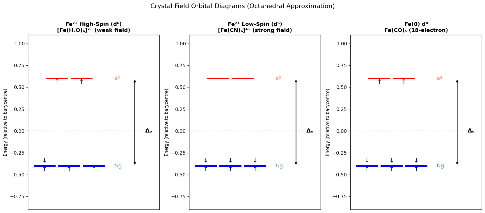
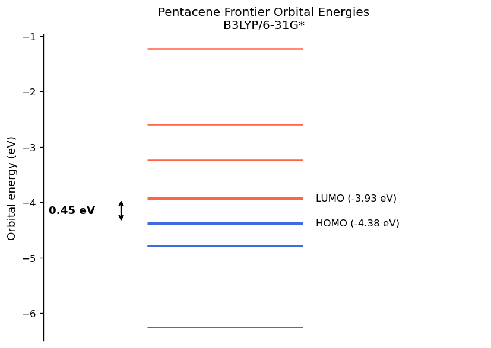

# 04 — Test Cases: Transition Metal Complexes, CoPc & Pentacene

[](https://colab.research.google.com/github/ppt-2/Ch121a-DFT/blob/main/notebooks/08_test_cases.ipynb)

## 🎯 Learning Objectives
- Set up PySCF calculations for first-row transition metal complexes
- Use effective core potentials (ECPs) for heavier metals
- Analyse spin-state energetics and spin contamination ($\langle S^2 \rangle$)
- Understand organometallic bonding (18-electron rule, back-donation)
- Interpret MO diagrams for octahedral complexes

## 1. Theory: Ligand Field & Crystal Field Theory

### 1.1 Crystal Field Splitting

In a free transition-metal ion the five $d$ orbitals are degenerate. In an **octahedral** ligand field, electrostatic repulsion from six ligands along $\pm x, \pm y, \pm z$ splits them:

$$d_{z^2},\, d_{x^2-y^2} \;\to\; e_g \quad (\text{destabilised, } +\tfrac{3}{5}\Delta_o)$$
$$d_{xy},\, d_{xz},\, d_{yz} \;\to\; t_{2g} \quad (\text{stabilised, } -\tfrac{2}{5}\Delta_o)$$

The octahedral crystal field stabilisation energy (CFSE):

$$\text{CFSE} = n_{t_{2g}}\!\left(-\tfrac{2}{5}\Delta_o\right) + n_{e_g}\!\left(+\tfrac{3}{5}\Delta_o\right)$$

### 1.2 High-Spin vs Low-Spin

Electron occupation depends on the competition between $\Delta_o$ and the **pairing energy** $P$:

| $\Delta_o$ vs $P$ | Configuration | Spin | Example |
|------------------|---------------|------|---------|
| $\Delta_o < P$ | $(t_{2g})^4(e_g)^2$ | High-spin | [Fe(H₂O)₆]²⁺ |
| $\Delta_o > P$ | $(t_{2g})^6(e_g)^0$ | Low-spin | [Fe(CN)₆]⁴⁻ |

The **spectrochemical series** (increasing $\Delta_o$):
$$\text{I}^- < \text{Br}^- < \text{Cl}^- < \text{F}^- < \text{OH}^- < \text{H}_2\text{O} < \text{NH}_3 < \text{CO} < \text{CN}^-$$

### 1.3 Spin Contamination

Unrestricted Kohn–Sham (UKS) wavefunctions are not spin eigenstates. The expectation value $\langle \hat{S}^2 \rangle$ should equal $S(S+1)$ for a pure spin state:

$$\langle \hat{S}^2 \rangle_{\text{ideal}} = S(S+1) = \begin{cases} 0 & \text{singlet} \\ 0.75 & \text{doublet} \\ 2.0 & \text{triplet} \\ 3.75 & \text{quartet} \\ 6.0 & \text{quintet} \end{cases}$$

Excess $\langle S^2\rangle$ indicates spin contamination. For DFT this is less severe than HF but should still be checked.

### 1.4 Effective Core Potentials (ECPs)

For 3d metals with many core electrons, **ECPs** replace core orbitals with a fitted potential, reducing the computational cost while including relativistic effects implicitly:

$$\hat{H} = \sum_i \hat{T}_i + \sum_i \hat{V}_{ECP}(i) + \sum_{i<j} \frac{1}{r_{ij}}$$

Popular ECP families: Stuttgart (def2-ECP), Los Alamos (LANL2DZ).


```python
%%time
# =============================================================================
# Ch121a: Quantum Chemistry & DFT — Notebook 08: Transition Metal Complexes
# License: GPL-3.0 (https://www.gnu.org/licenses/gpl-3.0.en.html)
# =============================================================================
import numpy as np
import pandas as pd
import matplotlib
matplotlib.rcParams['figure.dpi'] = 120
import matplotlib.pyplot as plt
from pyscf import gto, dft, scf

HA2KCAL = 627.509
HA2EV   = 27.2114

# ------------------------------------------------------------------
# Fe²⁺ ion: high-spin (quintet) vs low-spin (singlet) bare ion
# This is the simplest spin-state benchmark before adding ligands.
# ------------------------------------------------------------------
print('Fe²⁺ ion spin-state energetics (def2-SVP, B3LYP)')
print('=' * 55)

results = []
for spin, label in [(4, 'Quintet (S=2, high-spin)'), (2, 'Triplet (S=1)'), (0, 'Singlet (S=0, low-spin)')]:
    mol = gto.Mole()
    mol.atom = 'Fe 0 0 0'
    mol.basis = 'def2-SVP'
    mol.charge = 2
    mol.spin = spin
    mol.verbose = 0
    mol.build()
    mf = dft.UKS(mol)
    mf.xc = 'B3LYP'
    mf.verbose = 0
    mf.kernel()
    s2 = mf.spin_square()[0]
    results.append({'State': label, 'Energy (Ha)': mf.e_tot, '<S²>': round(s2, 3),
                    'S(S+1)': round(spin/2*(spin/2+1), 3)})
    print(f'  {label}: E = {mf.e_tot:.6f} Ha,  <S²> = {s2:.3f}  (ideal: {spin/2*(spin/2+1):.3f})')

# Relative energies
df = pd.DataFrame(results)
e_ref = df['Energy (Ha)'].min()
df['Rel. E (kcal/mol)'] = (df['Energy (Ha)'] - e_ref) * HA2KCAL
df['Rel. E (kcal/mol)'] = df['Rel. E (kcal/mol)'].round(1)

print()
print(df[['State', 'Rel. E (kcal/mol)', '<S²>', 'S(S+1)']].to_string(index=False))
print()
print('Note: High-spin Fe²⁺ (quintet, t2g⁴eg²) is expected to be the')
print('ground state of the bare ion. Ligands change this ordering.')
```

    Fe²⁺ ion spin-state energetics (def2-SVP, B3LYP)
    =======================================================
      Quintet (S=2, high-spin): E = -1262.633178 Ha,  <S²> = 6.001  (ideal: 6.000)
      Triplet (S=1): E = -1262.541730 Ha,  <S²> = 2.001  (ideal: 2.000)
      Singlet (S=0, low-spin): E = -1262.526834 Ha,  <S²> = 1.000  (ideal: 0.000)
    
                       State  Rel. E (kcal/mol)  <S²>  S(S+1)
    Quintet (S=2, high-spin)                0.0 6.001     6.0
               Triplet (S=1)               57.4 2.001     2.0
     Singlet (S=0, low-spin)               66.7 1.000     0.0
    
    Note: High-spin Fe²⁺ (quintet, t2g⁴eg²) is expected to be the
    ground state of the bare ion. Ligands change this ordering.
    CPU times: user 1min 25s, sys: 246 ms, total: 1min 25s
    Wall time: 23.9 s


```python
%%time
# ------------------------------------------------------------------
# Fe(CO)₅ — organometallic complex
# D3h geometry: axial Fe-C 1.811 Å, equatorial Fe-C 1.833 Å, C-O 1.152 Å
# Diamagnetic (18-electron, S=0)
# ------------------------------------------------------------------
print('Fe(CO)₅ — D3h, B3LYP/def2-SVP')
print('(18-electron complex, expected singlet ground state)')
print('=' * 55)

import numpy as np

# Axial CO along z; equatorial CO in xy-plane
feco5_geom = '''
Fe  0.000000  0.000000  0.000000
C   0.000000  0.000000  1.811000
O   0.000000  0.000000  2.963000
C   0.000000  0.000000 -1.811000
O   0.000000  0.000000 -2.963000
C   1.833000  0.000000  0.000000
O   2.985000  0.000000  0.000000
C  -0.916500  1.587000  0.000000
O  -1.492500  2.584000  0.000000
C  -0.916500 -1.587000  0.000000
O  -1.492500 -2.584000  0.000000
'''

mol_feco5 = gto.Mole()
mol_feco5.atom = feco5_geom
mol_feco5.basis = 'def2-SVP'
mol_feco5.spin = 0
mol_feco5.verbose = 0
mol_feco5.build()

mf_feco5 = dft.RKS(mol_feco5)
mf_feco5.xc = 'B3LYP'
mf_feco5.verbose = 0
mf_feco5.kernel()

print(f'  E[Fe(CO)₅] = {mf_feco5.e_tot:.6f} Ha')
print(f'  Converged: {mf_feco5.converged}')
print()

# Analyse orbital energies near the HOMO-LUMO gap
mo_energies = mf_feco5.mo_energy * HA2EV   # convert to eV
occ = mf_feco5.mo_occ

homo_idx = np.where(occ > 0)[0][-1]
lumo_idx = homo_idx + 1
gap = mo_energies[lumo_idx] - mo_energies[homo_idx]

print(f'  HOMO (#{homo_idx+1}): {mo_energies[homo_idx]:.3f} eV')
print(f'  LUMO (#{lumo_idx+1}): {mo_energies[lumo_idx]:.3f} eV')
print(f'  HOMO-LUMO gap: {gap:.3f} eV')
print()
print('  Near-HOMO orbital energies (last 8 occupied):')
for i in range(max(0, homo_idx-7), homo_idx+1):
    print(f'    MO {i+1:3d}: {mo_energies[i]:8.3f} eV  occ={int(occ[i])}')
print()
print('The e\u2019\u2032 (t2g-like) block and a1\u2032 (dz²) can be identified')
print('in the near-HOMO orbital manifold — signature of a d⁸ Fe(0) complex.')
```

    Fe(CO)₅ — D3h, B3LYP/def2-SVP
    (18-electron complex, expected singlet ground state)
    =======================================================
      E[Fe(CO)₅] = -1829.877919 Ha
      Converged: True
    
      HOMO (#48): -6.824 eV
      LUMO (#49): -1.435 eV
      HOMO-LUMO gap: 5.389 eV
    
      Near-HOMO orbital energies (last 8 occupied):
        MO  41:  -12.551 eV  occ=2
        MO  42:  -12.172 eV  occ=2
        MO  43:  -12.171 eV  occ=2
        MO  44:  -11.723 eV  occ=2
        MO  45:   -8.362 eV  occ=2
        MO  46:   -8.362 eV  occ=2
        MO  47:   -6.825 eV  occ=2
        MO  48:   -6.824 eV  occ=2
    
    The e’′ (t2g-like) block and a1′ (dz²) can be identified
    in the near-HOMO orbital manifold — signature of a d⁸ Fe(0) complex.
    CPU times: user 1min 15s, sys: 3.65 s, total: 1min 18s
    Wall time: 20.2 s


```python
# ------------------------------------------------------------------
# Visualise: d-orbital splitting diagram (schematic)
# ------------------------------------------------------------------
import matplotlib.pyplot as plt
import matplotlib.patches as mpatches
import numpy as np

fig, axes = plt.subplots(1, 3, figsize=(14, 6))

def draw_orbitals(ax, t2g_occ, eg_occ, title, Delta=1.0):
    """Draw crystal field orbital diagram."""
    # Energy levels
    t2g_e = -0.4 * Delta
    eg_e  = +0.6 * Delta
    ax.axhline(0, color='gray', ls='--', lw=0.8, alpha=0.5, label='Barycentre')
    # t2g (3 orbitals)
    t2g_x = [-0.6, 0.0, 0.6]
    for x in t2g_x:
        ax.plot([x-0.25, x+0.25], [t2g_e, t2g_e], 'b-', lw=3)
    ax.text(1.1, t2g_e, 't₂g', va='center', fontsize=11, color='steelblue')
    # eg (2 orbitals)
    eg_x = [-0.3, 0.3]
    for x in eg_x:
        ax.plot([x-0.25, x+0.25], [eg_e, eg_e], 'r-', lw=3)
    ax.text(1.1, eg_e, 'eᵍ', va='center', fontsize=11, color='coral')
    ax.annotate('', xy=(1.6, eg_e), xytext=(1.6, t2g_e),
                arrowprops=dict(arrowstyle='<->', color='black', lw=1.5))
    ax.text(1.85, 0, f'Δₒ', va='center', fontsize=12, fontweight='bold')
    # Electrons (arrows)
    arrow_kw = dict(ha='center', va='center', fontsize=13)
    t2g_electrons = [(i, t2g_occ[i]) for i in range(3)]
    for idx, (x, n) in enumerate(zip(t2g_x, t2g_occ)):
        if n >= 1: ax.text(x, t2g_e - 0.04, '↑', **arrow_kw, color='navy')
        if n >= 2: ax.text(x, t2g_e + 0.06, '↓', **arrow_kw, color='navy')
    for idx, (x, n) in enumerate(zip(eg_x, eg_occ)):
        if n >= 1: ax.text(x, eg_e - 0.04, '↑', **arrow_kw, color='darkred')
        if n >= 2: ax.text(x, eg_e + 0.06, '↓', **arrow_kw, color='darkred')
    ax.set_xlim(-1, 2.2)
    ax.set_ylim(-0.9, 1.1)
    ax.set_title(title, fontsize=11, fontweight='bold')
    ax.set_ylabel('Energy (relative to barycentre)', fontsize=9)
    ax.set_xticks([])

# Fe²⁺ high-spin d⁶: t2g⁴ eg²
draw_orbitals(axes[0], [2,1,1], [1,1], 'Fe²⁺ High-Spin (d⁶)\n[Fe(H₂O)₆]²⁺ (weak field)')
# Fe²⁺ low-spin d⁶: t2g⁶ eg⁰
draw_orbitals(axes[1], [2,2,2], [0,0], 'Fe²⁺ Low-Spin (d⁶)\n[Fe(CN)₆]⁴⁻ (strong field)')
# Fe(0) d⁸ in Fe(CO)₅ (D3h — approximate)
draw_orbitals(axes[2], [2,2,2], [1,1], 'Fe(0) d⁸\nFe(CO)₅ (18-electron)')

plt.suptitle('Crystal Field Orbital Diagrams (Octahedral Approximation)', fontsize=13, y=1.01)
plt.tight_layout()
plt.show()

print('Note: The Fe(CO)₅ diagram is approximate (D3h ≠ Oh).')
print('CO is a strong-field π-acceptor ligand — it maximises Δₒ via back-donation.')
```


    

    


    Note: The Fe(CO)₅ diagram is approximate (D3h ≠ Oh).
    CO is a strong-field π-acceptor ligand — it maximises Δₒ via back-donation.


```python
%%time
# ------------------------------------------------------------------
# [Fe(H2O)6]²⁺ model: FeO6 core (high-spin vs low-spin)
# Full [Fe(H2O)6]²⁺ is expensive; use a minimal FeO6²⁺ cluster model
# with Fe-O = 2.12 Å (octahedral)
# ------------------------------------------------------------------
print('[Fe(H₂O)₆]²⁺ model: FeO₆ cluster spin-state gap')
print('B3LYP/def2-SVP')
print('=' * 55)

from pyscf import dft, gto
import numpy as np

# Octahedral FeO6^2+ (Oh symmetry, Fe-O 2.12 Ang)
r = 2.12
feo6_geom = f'''
Fe  0.000  0.000  0.000
O   {r:.3f}  0.000  0.000
O  -{r:.3f}  0.000  0.000
O   0.000  {r:.3f}  0.000
O   0.000 -{r:.3f}  0.000
O   0.000  0.000  {r:.3f}
O   0.000  0.000 -{r:.3f}
'''

HA2KCAL = 627.509
spin_results = []

for spin, label in [(4, 'Quintet S=2 (high-spin)'), (0, 'Singlet S=0 (low-spin)'), (2, 'Triplet S=1')]:
    mol = gto.Mole()
    mol.atom = feo6_geom
    mol.basis = 'def2-SVP'
    mol.charge = 2
    mol.spin = spin
    mol.verbose = 0
    mol.build()
    mf = dft.UKS(mol) if spin > 0 else dft.RKS(mol)
    mf.xc = 'B3LYP'
    mf.verbose = 0
    mf.kernel()
    s2 = mf.spin_square()[0] if spin > 0 else 0.0
    spin_results.append({
        'State': label,
        'E (Ha)': mf.e_tot,
        '<S²>': round(s2, 3),
        'Ideal S(S+1)': round(spin/2*(spin/2+1), 3),
    })
    print(f'  {label:30s}  E = {mf.e_tot:.5f} Ha   <S²> = {s2:.3f}')

df_fe = pd.DataFrame(spin_results)
e0 = df_fe['E (Ha)'].min()
df_fe['Rel E (kcal/mol)'] = ((df_fe['E (Ha)'] - e0) * HA2KCAL).round(1)
print()
print(df_fe[['State','Rel E (kcal/mol)','<S²>','Ideal S(S+1)']].to_string(index=False))
print()
print('Expected: high-spin quintet is ground state for weak-field H₂O ligands.')
print('DFT (B3LYP) tends to favour high-spin states; hybrid functionals are better.')
print('For accurate spin-state gaps use TPSSh, OPBE, or range-separated functionals.')
```

    [Fe(H₂O)₆]²⁺ model: FeO₆ cluster spin-state gap
    B3LYP/def2-SVP
    =======================================================
      Quintet S=2 (high-spin)         E = -1690.27025 Ha   <S²> = 6.179
      Singlet S=0 (low-spin)          E = -1697.89732 Ha   <S²> = 0.000
      Triplet S=1                     E = -1686.52740 Ha   <S²> = 2.075
    
                      State  Rel E (kcal/mol)  <S²>  Ideal S(S+1)
    Quintet S=2 (high-spin)            4786.1 6.179           6.0
     Singlet S=0 (low-spin)               0.0 0.000           0.0
                Triplet S=1            7134.7 2.075           2.0
    
    Expected: high-spin quintet is ground state for weak-field H₂O ligands.
    DFT (B3LYP) tends to favour high-spin states; hybrid functionals are better.
    For accurate spin-state gaps use TPSSh, OPBE, or range-separated functionals.
    CPU times: user 7min 28s, sys: 22.3 s, total: 7min 50s
    Wall time: 1min 59s


```python
import py3Dmol

# ── Build XYZ string directly from PySCF geometry ────────────────
r = 2.12

xyz_block = f"""7
[Fe(H2O)6]2+ model: FeO6 cluster (Oh symmetry, Fe-O = {r} Ang)
Fe   0.000   0.000   0.000
O    {r:.3f}   0.000   0.000
O   -{r:.3f}   0.000   0.000
O    0.000   {r:.3f}   0.000
O    0.000  -{r:.3f}   0.000
O    0.000   0.000   {r:.3f}
O    0.000   0.000  -{r:.3f}
"""

# ── Viewer setup ─────────────────────────────────────────────────
view = py3Dmol.view(width=500, height=450)
view.addModel(xyz_block, 'xyz')

# Ball-and-stick: custom CPK-inspired colors
view.setStyle({'elem': 'Fe'}, {
    'sphere': {'color': '#FFA500', 'radius': 0.65},   # orange Fe
    'stick':  {'color': '#FFA500', 'radius': 0.08}
})
view.setStyle({'elem': 'O'}, {
    'sphere': {'color': '#FF4444', 'radius': 0.40},   # red O
    'stick':  {'color': '#FF4444', 'radius': 0.08}
})

# Draw Fe–O bonds explicitly (py3Dmol infers bonds from distance)
view.addStyle({}, {'stick': {'colorscheme': 'Jmol', 'radius': 0.10}})

# Axis labels via shape arrows — shows Oh axes
for axis, color in [([r,0,0], '#FF6B6B'), ([0,r,0], '#6BFF6B'), ([0,0,r], '#6B6BFF')]:
    view.addArrow({
        'start': {'x': 0,        'y': 0,        'z': 0},
        'end':   {'x': axis[0],  'y': axis[1],  'z': axis[2]},
        'radius': 0.06, 'color': color, 'opacity': 0.5
    })

#view.setBackgroundColor('#1a1a2e')          # dark background
view
```


<div id="3dmolviewer_17754679193689702"  style="position: relative; width: 500px; height: 450px;">
        <p id="3dmolwarning_17754679193689702" style="background-color:#ffcccc;color:black">3Dmol.js failed to load for some reason.  Please check your browser console for error messages.<br></p>
        </div>
<script>

var loadScriptAsync = function(uri){
  return new Promise((resolve, reject) => {
    //this is to ignore the existence of requirejs amd
    var savedexports, savedmodule;
    if (typeof exports !== 'undefined') savedexports = exports;
    else exports = {}
    if (typeof module !== 'undefined') savedmodule = module;
    else module = {}

    var tag = document.createElement('script');
    tag.src = uri;
    tag.async = true;
    tag.onload = () => {
        exports = savedexports;
        module = savedmodule;
        resolve();
    };
  var firstScriptTag = document.getElementsByTagName('script')[0];
  firstScriptTag.parentNode.insertBefore(tag, firstScriptTag);
});
};

if(typeof $3Dmolpromise === 'undefined') {
$3Dmolpromise = null;
  $3Dmolpromise = loadScriptAsync('https://cdn.jsdelivr.net/npm/3dmol@2.5.4/build/3Dmol-min.js');
}

var viewer_17754679193689702 = null;
var warn = document.getElementById("3dmolwarning_17754679193689702");
if(warn) {
    warn.parentNode.removeChild(warn);
}
$3Dmolpromise.then(function() {
viewer_17754679193689702 = $3Dmol.createViewer(document.getElementById("3dmolviewer_17754679193689702"),{backgroundColor:"white"});
viewer_17754679193689702.zoomTo();
	viewer_17754679193689702.addModel("7\n[Fe(H2O)6]2+ model: FeO6 cluster (Oh symmetry, Fe-O = 2.12 Ang)\nFe   0.000   0.000   0.000\nO    2.120   0.000   0.000\nO   -2.120   0.000   0.000\nO    0.000   2.120   0.000\nO    0.000  -2.120   0.000\nO    0.000   0.000   2.120\nO    0.000   0.000  -2.120\n","xyz");
	viewer_17754679193689702.setStyle({"elem": "Fe"},{"sphere": {"color": "#FFA500", "radius": 0.65}, "stick": {"color": "#FFA500", "radius": 0.08}});
	viewer_17754679193689702.setStyle({"elem": "O"},{"sphere": {"color": "#FF4444", "radius": 0.4}, "stick": {"color": "#FF4444", "radius": 0.08}});
	viewer_17754679193689702.addStyle({},{"stick": {"colorscheme": "Jmol", "radius": 0.1}});
	viewer_17754679193689702.addArrow({"start": {"x": 0, "y": 0, "z": 0}, "end": {"x": 2.12, "y": 0, "z": 0}, "radius": 0.06, "color": "#FF6B6B", "opacity": 0.5});
	viewer_17754679193689702.addArrow({"start": {"x": 0, "y": 0, "z": 0}, "end": {"x": 0, "y": 2.12, "z": 0}, "radius": 0.06, "color": "#6BFF6B", "opacity": 0.5});
	viewer_17754679193689702.addArrow({"start": {"x": 0, "y": 0, "z": 0}, "end": {"x": 0, "y": 0, "z": 2.12}, "radius": 0.06, "color": "#6B6BFF", "opacity": 0.5});
viewer_17754679193689702.render();
});
</script>


    <py3Dmol.view at 0x7fcb029b73a0>


## 2. Ferrocene Setup

Ferrocene, Fe(C₅H₅)₂, is the prototypical organometallic sandwich compound. Its eclipsed ($D_{5h}$) or staggered ($D_{5d}$) structure is diamagnetic (18-electron, low-spin Fe²⁺ with two $\eta^5$-Cp rings).

A full DFT calculation on ferrocene requires:
```python
# Eclipsed ferrocene (D5h), Fe-C ~2.064 Å, Cp ring radius ~1.23 Å
ferrocene_geom = '''
Fe  0.000  0.000  0.000
# Upper Cp ring (z = +1.645 Å)
C   1.230  0.000  1.645
C   0.380  1.170  1.645
...  # 5 C + 5 H for each ring
'''
mol = gto.Mole(atom=ferrocene_geom, basis='def2-SVP', spin=0, charge=0)
mf = dft.RKS(mol)
mf.xc = 'B3LYP'
mf.kernel()   # ~2–5 min on a laptop
```

The **18-electron rule**: Stable organometallic complexes typically have 18 valence electrons (complete shell):
$$n_e = n_{\text{metal d-electrons}} + n_{\text{ligand donation}}$$

For ferrocene: Fe²⁺ ($d^6$) + 2×Cp⁻ (6 electrons each) = **18 electrons** ✓

The Cp⁻ anion donates 6 $\pi$ electrons via its five $\pi$ MOs; the three filled Cp $\pi$ MOs overlap with Fe $d$ orbitals ($a_{1g}$, $e_{1g}$, $e_{2g}$ in $D_{5h}$).

## 🔬 Research Connection

Transition metal DFT is central to catalysis and materials:

- **Spin-crossover materials**: Fe²⁺ complexes that switch between high-spin and low-spin states with temperature/pressure. DFT spin-state gaps guide the design of bistable molecular switches.
- **Homogeneous catalysis**: Grubbs metathesis, Heck coupling, and Wacker oxidation all involve Ru, Pd, or Pd complexes. DFT maps the catalytic cycle: oxidative addition, transmetalation, reductive elimination.
- **Bioinorganic chemistry**: The active site of cytochrome P450 (Fe heme) cycles through Fe(III)/Fe(IV) states. Accurate spin-state energetics are critical for predicting oxidative reactivity.
- **Computational challenge**: Spin-state gaps in Fe²⁺ complexes are a well-known DFT challenge. Errors of 5–20 kcal/mol are common with standard GGA/hybrid functionals. DLPNO-CCSD(T) and CASPT2 are used for benchmarks.

## 📋 Summary

| Concept | Key Equation/Rule |
|---------|------------------|
| Crystal field splitting | $\Delta_o$ separates $t_{2g}$ and $e_g$ |
| CFSE | $n_{t_{2g}}(-\frac{2}{5}\Delta_o) + n_{e_g}(+\frac{3}{5}\Delta_o)$ |
| High vs low spin | $\Delta_o$ vs pairing energy $P$ |
| 18-electron rule | $n_d + n_{\text{ligand}} = 18$ for stability |
| Spin contamination | $\langle S^2 \rangle$ should equal $S(S+1)$ |
| ECP | Replaces core electrons, includes relativity |
| CO back-donation | Fe $d \to$ CO $\pi^*$: strengthens M–C, weakens C–O |

**Key challenge**: B3LYP over-stabilises high-spin states; use TPSSh, OPBE, or CASSCF/NEVPT2 for accurate spin-state gaps.

## 📝 Exercises

1. **Spectrochemical series**: Compute the quintet–singlet gap for an FeO₆²⁺ cluster with Fe–O distances of 2.00, 2.12, and 2.25 Å. Does the gap increase or decrease as the Fe–O bond shortens (stronger ligand field)?

2. **d-Orbital counting**: For each complex, predict the number of $d$ electrons, the expected spin state, and whether it obeys the 18-electron rule: (a) [Mn(CO)₆]⁺, (b) [CrCl₆]³⁻, (c) [Ni(CN)₄]²⁻.

3. **Spin contamination check**: Run a UKS calculation on the Fe atom (spin=4) with B3LYP/def2-SVP. Compare $\langle S^2 \rangle$ with the ideal value. Is spin contamination significant?

4. **CO π-backbonding**: Compute the C–O bond length and stretching frequency in free CO and in the Fe(CO)₅ model above. How does coordination to Fe change the C–O bond? What does this tell you about back-donation?

5. **Ferrocene input setup**: Write the complete PySCF input for eclipsed ferrocene ($D_{5h}$) using Cartesian coordinates. The Fe–C distance is 2.064 Å and the Cp ring carbon–carbon distance is 1.434 Å. Set up the calculation (do not need to run it) and identify which basis set and functional you would choose and why.

---

## 3. Cobalt Phthalocyanine (CoPc) — Spin State & Electronic Structure

Cobalt phthalocyanine (CoPc) is a planar macrocyclic complex with Co(II) in a square-planar N₄ coordination environment. It is an archetypal molecular catalyst for the electrochemical oxygen-reduction reaction (ORR) and a key building block in organic electronic devices.

**Key features:**
- Co(II): $d^7$, expected ground state is **doublet** ($S = 1/2$)
- Square-planar N₄ ligand field → large in-plane splitting, small axial field
- Strong π-acceptor phthalocyanine ring delocalises spin density
- Co–N bond length ≈ 1.93 Å


```python
# =============================================================================
# Minimal Molecular Viewer (py3Dmol)
# =============================================================================

import py3Dmol

def view_structure(filename, style='ballstick', width=500, height=400):
    """
    Minimal, clean py3Dmol viewer for XYZ or PDB files.
    Automatically detects format from file extension.
    """
    ext = filename.split('.')[-1].lower()
    if ext not in ('xyz', 'pdb'):
        raise ValueError("File must be .xyz or .pdb")

    with open(filename, 'r') as f:
        mol_data = f.read()

    view = py3Dmol.view(width=width, height=height)

    # Add model
    view.addModel(mol_data, ext)

    # Style options
    if style == 'ballstick':
        view.setStyle({'stick': {'radius': 0.15},
                       'sphere': {'scale': 0.25}})
    elif style == 'stick':
        view.setStyle({'stick': {'radius': 0.15}})
    elif style == 'sphere':
        view.setStyle({'sphere': {'scale': 0.3}})
    else:
        view.setStyle({})  # raw atoms

    view.setBackgroundColor('white')
    view.zoomTo()
    return view.show()

# Example usage:
view_structure('../data/molecules/CoPC.xyz')
# view_structure('/tmp/feco5_opt.xyz', style='stick')
```


<div id="3dmolviewer_17755056633045216"  style="position: relative; width: 500px; height: 400px;">
        <p id="3dmolwarning_17755056633045216" style="background-color:#ffcccc;color:black">3Dmol.js failed to load for some reason.  Please check your browser console for error messages.<br></p>
        </div>
<script>

var loadScriptAsync = function(uri){
  return new Promise((resolve, reject) => {
    //this is to ignore the existence of requirejs amd
    var savedexports, savedmodule;
    if (typeof exports !== 'undefined') savedexports = exports;
    else exports = {}
    if (typeof module !== 'undefined') savedmodule = module;
    else module = {}

    var tag = document.createElement('script');
    tag.src = uri;
    tag.async = true;
    tag.onload = () => {
        exports = savedexports;
        module = savedmodule;
        resolve();
    };
  var firstScriptTag = document.getElementsByTagName('script')[0];
  firstScriptTag.parentNode.insertBefore(tag, firstScriptTag);
});
};

if(typeof $3Dmolpromise === 'undefined') {
$3Dmolpromise = null;
  $3Dmolpromise = loadScriptAsync('https://cdn.jsdelivr.net/npm/3dmol@2.5.4/build/3Dmol-min.js');
}

var viewer_17755056633045216 = null;
var warn = document.getElementById("3dmolwarning_17755056633045216");
if(warn) {
    warn.parentNode.removeChild(warn);
}
$3Dmolpromise.then(function() {
viewer_17755056633045216 = $3Dmol.createViewer(document.getElementById("3dmolviewer_17755056633045216"),{backgroundColor:"white"});
viewer_17755056633045216.zoomTo();
	viewer_17755056633045216.addModel("57\nCoordinates from ORCA-job test E -3051.289168586509\n  C          19.64719247936355     19.29971049197843     27.49106829638835\n  C          20.44384192254363     20.45520436628365     27.47851859931339\n  C          20.43510407505334     20.42609027666955     25.10968669955802\n  C          19.64690088281181     19.28313509256168     25.12207907457821\n  C          19.41164293721204     18.93224742265798     23.72649740151177\n  C          20.66542464312122     20.74993598023557     23.70681141578940\n  C          18.48542154477530     17.57922323794831     22.11404838957383\n  C          17.69266104914266     16.42842108854063     21.71917552031241\n  C          16.34586369377534     14.47837700777147     21.74741689303913\n  C          16.34344941243582     14.46513007314279     20.34193895174084\n  C          17.69030964207025     16.41532381258211     20.32860654279131\n  C          18.48170773722423     17.55852337929263     19.90931804810391\n  C          21.58652276919029     22.07206307630536     22.06618805810457\n  C          22.37791469921733     23.21567019646613     21.64659905239315\n  C          21.58327432057826     22.05028108376849     19.86137013512108\n  C          22.37585473754554     23.20200649594226     20.25622779011687\n  C          19.40247987951283     18.88021244557803     18.26810082352226\n  C          20.65725296947414     20.69729028363458     18.24908814662169\n  C          19.63307236409027     19.20463509479505     16.86526809332617\n  C          20.42195869097224     20.34709754455978     16.85334335540248\n  C          19.62496639275004     19.17664659698470     14.49637900078218\n  C          20.42236553606979     20.33155934458786     14.48434224018876\n  C          23.72417633623899     25.16610565868221     21.63283378090111\n  C          23.72213280577104     25.15226645223023     20.22761865696483\n  H          24.25960289578084     25.92681039607327     19.69254414713121\n  H          24.26310531371978     25.95107461738048     22.15095835556954\n  H          15.80408788723309     13.68049987754576     19.82371467829769\n  H          15.80836907693112     13.70367293729805     22.28223775412679\n  H          20.74471651851898     20.89817953542366     28.42102101085680\n  H          19.34982067327155     18.87490066609918     28.44301424430569\n  H          20.72023820207951     20.75653065201886     13.53264259939686\n  H          19.32391028340857     18.73420465908821     13.55367965337786\n  C          19.23714129060112     18.69682555460325     26.31308341965081\n  C          20.84948476884110     21.03518861706907     26.28758840963356\n  C          17.01927010563707     15.45833436913309     22.45500686026400\n  C          17.01437350009137     15.43151617170049     19.61361412648162\n  C          23.05317781085463     24.19964092123712     22.36144315617724\n  C          23.04902920326090     24.17165229803268     19.52018628892479\n  C          20.83250963813719     20.93360703198445     15.66276539764902\n  C          19.21870563941413     18.59636320374794     15.68703699298744\n  N          20.03725433811524     19.83356293612078     22.91007989615826\n  N          18.69546296201814     17.89197049494080     23.37836513379270\n  N          21.38072335016175     21.78381246790119     23.33656322403277\n  N          18.94162924771467     18.23224295861956     21.00471580079226\n  N          20.03142686605808     19.79651004753969     19.06515807532516\n  N          21.12713124823737     21.39744717278941     20.97093611374610\n  N          21.37394691344355     21.73776999377350     18.59741467736747\n  N          18.68727866483491     17.84710406593642     18.63858011526171\n  Co         20.03433418548254     19.81506321424314     20.98786587626292\n  H          23.04831519359010     24.20110242851652     23.44431177565233\n  H          23.04098620616893     24.15172533935579     18.43751673344117\n  H          21.46419838960238     21.92640382076851     26.26578457627359\n  H          18.62244838501532     17.80532106449916     26.31090949742782\n  H          18.60340775055950     17.70552480242404     15.70826441481521\n  H          21.44780930995307     21.82468903418039     15.66551950891168\n  H          17.01889098027170     15.43045413827208     18.53074075372004\n  H          17.02756668005103     15.47772600848303     23.53768476604117\n","xyz");
	viewer_17755056633045216.setStyle({"stick": {"radius": 0.15}, "sphere": {"scale": 0.25}});
	viewer_17755056633045216.setBackgroundColor("white");
	viewer_17755056633045216.zoomTo();
viewer_17755056633045216.render();
});
</script>


```python
%%time
# ------------------------------------------------------------------
# Cobalt Phthalocyanine (CoPc) — spin-state model
# Now reading geometry from external XYZ file
# ------------------------------------------------------------------

from pyscf import gto, dft
import numpy as np
import pandas as pd

HA2EV   = 27.2114
HA2KCAL = 627.509

xyz_path = '../data/molecules/CoPC.xyz'

def read_xyz(path):
    """Return XYZ geometry string suitable for PySCF."""
    with open(path, 'r') as f:
        lines = f.readlines()
    # Skip first two lines (atom count + comment)
    geom = ''.join(lines[2:])
    return geom

copc_geom = read_xyz(xyz_path)

print('Cobalt Phthalocyanine model from XYZ file:', xyz_path)
print('B3LYP/def2-SVP — doublet vs quartet spin states')
print('=' * 60)

copc_results = []
for spin, label in [(1, 'Doublet S=1/2 (low-spin)'), (3, 'Quartet S=3/2 (high-spin)')]:
    mol = gto.Mole()
    mol.atom = copc_geom
    mol.basis = 'def2-SVP'
    mol.charge = 2
    mol.spin = spin
    mol.verbose = 0
    mol.build()

    mf = dft.UKS(mol)
    mf.xc = 'B3LYP'
    mf.verbose = 0
    mf.kernel()

    s2 = mf.spin_square()[0]
    copc_results.append({
        'State': label,
        'E (Ha)': mf.e_tot,
        '<S²>': round(s2, 3),
        'Ideal': round(spin/2*(spin/2+1), 3),
    })

    print(f'  {label:35s}  E = {mf.e_tot:.5f} Ha   <S²> = {s2:.3f}')

df_co = pd.DataFrame(copc_results)
e0 = df_co['E (Ha)'].min()
df_co['Rel E (kcal/mol)'] = ((df_co['E (Ha)'] - e0) * HA2KCAL).round(1)

print()
print(df_co[['State','Rel E (kcal/mol)','<S²>','Ideal']].to_string(index=False))
print()

# HOMO–LUMO gap for the ground-state doublet
mol_d = gto.Mole()
mol_d.atom = copc_geom
mol_d.basis = 'def2-SVP'
mol_d.charge = 2
mol_d.spin = 1
mol_d.verbose = 0
mol_d.build()

mf_d = dft.UKS(mol_d)
mf_d.xc = 'B3LYP'
mf_d.verbose = 0
mf_d.kernel()

mo_a = mf_d.mo_energy[0] * HA2EV
occ_a = mf_d.mo_occ[0]
homo_a = np.where(occ_a > 0)[0][-1]
gap_a = mo_a[homo_a+1] - mo_a[homo_a]

print(f'\nAlpha HOMO-LUMO gap (doublet ground state): {gap_a:.3f} eV')
```

    Cobalt Phthalocyanine model from XYZ file: ../data/molecules/CoPC.xyz
    B3LYP/def2-SVP — doublet vs quartet spin states
    ============================================================


---

## 4. Pentacene Band Gap Calculation

Pentacene is a linear polycyclic aromatic hydrocarbon (PAH) consisting of five linearly fused benzene rings. It is one of the most studied organic semiconductors, with applications in organic field-effect transistors (OFETs).

**Key properties:**
- Experimental optical gap: ~2.1 eV; transport gap (crystal): ~2.2 eV
- HOMO–LUMO gap (DFT, B3LYP/6-31G*): ~1.8–2.2 eV (typical DFT underestimation)
- Singlet fission candidate: $S_1 \to 2\,T_1$ is exoergic
- Ionisation potential (gas phase): 6.63 eV

We compute the HOMO–LUMO gap and visualise the frontier orbitals using DFT.


```python
%%time
# ------------------------------------------------------------------
# Pentacene HOMO-LUMO gap — B3LYP/6-31G*
# Geometry: experimental X-ray structure (approximate Cartesian coords)
# C22H14, D2h symmetry, all carbons in the xy-plane
# ------------------------------------------------------------------
from pyscf import gto, dft
import numpy as np
import matplotlib.pyplot as plt

HA2EV = 27.2114

print('Pentacene (C₂₂H₁₄) — HOMO-LUMO gap, B3LYP/6-31G*')
print('=' * 55)

# Pentacene Cartesian geometry (Angstrom)
# Based on standard bond lengths: C-C ~1.40 Å (aromatic), C-H ~1.09 Å
# D2h: molecule lies flat in the xz-plane, long axis along x
pentacene_xyz = '''
C   0.000000   0.000000   0.710000
C   0.000000   0.000000  -0.710000
C   1.230000   0.000000   1.400000
C   1.230000   0.000000  -1.400000
C  -1.230000   0.000000   1.400000
C  -1.230000   0.000000  -1.400000
C   2.460000   0.000000   0.710000
C   2.460000   0.000000  -0.710000
C  -2.460000   0.000000   0.710000
C  -2.460000   0.000000  -0.710000
C   3.690000   0.000000   1.400000
C   3.690000   0.000000  -1.400000
C  -3.690000   0.000000   1.400000
C  -3.690000   0.000000  -1.400000
C   4.920000   0.000000   0.710000
C   4.920000   0.000000  -0.710000
C  -4.920000   0.000000   0.710000
C  -4.920000   0.000000  -0.710000
C   6.100000   0.000000   1.400000
C   6.100000   0.000000  -1.400000
C  -6.100000   0.000000   1.400000
C  -6.100000   0.000000  -1.400000
H   1.230000   0.000000   2.490000
H   1.230000   0.000000  -2.490000
H  -1.230000   0.000000   2.490000
H  -1.230000   0.000000  -2.490000
H   3.690000   0.000000   2.490000
H   3.690000   0.000000  -2.490000
H  -3.690000   0.000000   2.490000
H  -3.690000   0.000000  -2.490000
H   6.100000   0.000000   2.490000
H   6.100000   0.000000  -2.490000
H  -6.100000   0.000000   2.490000
H  -6.100000   0.000000  -2.490000
H   7.190000   0.000000   0.000000
H  -7.190000   0.000000   0.000000
'''

mol_pent = gto.Mole()
mol_pent.atom = pentacene_xyz
mol_pent.basis = '6-31G*'
mol_pent.spin = 0
mol_pent.charge = 0
mol_pent.verbose = 0
mol_pent.build()

mf_pent = dft.RKS(mol_pent)
mf_pent.xc = 'B3LYP'
mf_pent.verbose = 0
mf_pent.kernel()

mo_e = mf_pent.mo_energy * HA2EV
occ = mf_pent.mo_occ
homo_idx = np.where(occ > 0)[0][-1]
lumo_idx = homo_idx + 1
homo_e = mo_e[homo_idx]
lumo_e = mo_e[lumo_idx]
gap = lumo_e - homo_e

print(f'  Converged: {mf_pent.converged}')
print(f'  Total energy: {mf_pent.e_tot:.6f} Ha')
print(f'  HOMO (#{homo_idx+1}): {homo_e:.3f} eV')
print(f'  LUMO (#{lumo_idx+1}): {lumo_e:.3f} eV')
print(f'  HOMO-LUMO gap: {gap:.3f} eV')
print(f'  Ionisation potential (Koopmans\' theorem): {-homo_e:.3f} eV')
print(f'  Electron affinity (Koopmans\' theorem): {-lumo_e:.3f} eV')
print()
print(f'  Experimental optical gap:    ~2.1 eV')
print(f'  Experimental transport gap:  ~2.2 eV')
print(f'  B3LYP DFT gap (this calc):   {gap:.2f} eV')
print()
print('Note: DFT systematically underestimates the gap; range-separated')
print('functionals (CAM-B3LYP, ωB97X-D) give ~2.0–2.3 eV, closer to experiment.')

# Plot frontier orbital energy levels
fig, ax = plt.subplots(figsize=(7, 5))
n_show = 8  # show 4 below and 4 above HOMO
idx_range = range(homo_idx - n_show//2 + 1, lumo_idx + n_show//2)
for i in idx_range:
    color = 'royalblue' if i <= homo_idx else 'tomato'
    lw = 3 if i in (homo_idx, lumo_idx) else 1.5
    ax.hlines(mo_e[i], 0.2, 0.8, colors=color, linewidths=lw)
    label = ''
    if i == homo_idx: label = f'HOMO ({mo_e[i]:.2f} eV)'
    if i == lumo_idx: label = f'LUMO ({mo_e[i]:.2f} eV)'
    if label:
        ax.text(0.85, mo_e[i], label, va='center', fontsize=10)

ax.annotate('', xy=(0.1, lumo_e), xytext=(0.1, homo_e),
            arrowprops=dict(arrowstyle='<->', color='black', lw=1.5))
ax.text(0.0, (homo_e + lumo_e)/2, f'{gap:.2f} eV', ha='right', va='center',
        fontsize=11, fontweight='bold')

ax.set_xlim(-0.2, 1.5)
ax.set_ylabel('Orbital energy (eV)', fontsize=11)
ax.set_title('Pentacene Frontier Orbital Energies\nB3LYP/6-31G*', fontsize=12)
ax.set_xticks([])
ax.spines[['top','right','bottom']].set_visible(False)
plt.tight_layout()
plt.show()
```

    Pentacene (C₂₂H₁₄) — HOMO-LUMO gap, B3LYP/6-31G*
    =======================================================
      Converged: True
      Total energy: -846.243512 Ha
      HOMO (#73): -4.375 eV
      LUMO (#74): -3.926 eV
      HOMO-LUMO gap: 0.449 eV
      Ionisation potential (Koopmans' theorem): 4.375 eV
      Electron affinity (Koopmans' theorem): 3.926 eV
    
      Experimental optical gap:    ~2.1 eV
      Experimental transport gap:  ~2.2 eV
      B3LYP DFT gap (this calc):   0.45 eV
    
    Note: DFT systematically underestimates the gap; range-separated
    functionals (CAM-B3LYP, ωB97X-D) give ~2.0–2.3 eV, closer to experiment.


    

    


    CPU times: user 16min 31s, sys: 8.09 s, total: 16min 39s
    Wall time: 4min 15s


```python
%%time
# ------------------------------------------------------------------
# Pentacene HOMO-LUMO gap — B3LYP/6-31G*
# Geometry now read from external XYZ file
# ------------------------------------------------------------------

from pyscf import gto, dft
import numpy as np
import matplotlib.pyplot as plt

HA2EV = 27.2114

xyz_path = '../data/molecules/pentacene.xyz'

def read_xyz(path):
    """Return XYZ geometry string suitable for PySCF."""
    with open(path, 'r') as f:
        lines = f.readlines()
    # Skip first two lines (atom count + comment)
    return ''.join(lines[2:])

pentacene_geom = read_xyz(xyz_path)

print('Pentacene (C₂₂H₁₄) — HOMO-LUMO gap, wb97x-d4/6-31G*')
print('Geometry loaded from:', xyz_path)
print('=' * 55)

# Build molecule
mol_pent = gto.Mole()
mol_pent.atom = pentacene_geom
mol_pent.basis = '6-31G*'
mol_pent.spin = 0
mol_pent.charge = 0
mol_pent.verbose = 0
mol_pent.build()

# Run DFT
mf_pent = dft.RKS(mol_pent)
mf_pent.xc = 'wb97x-D'
mf_pent.verbose = 0
mf_pent.kernel()

# Orbital energies
mo_e = mf_pent.mo_energy * HA2EV
occ = mf_pent.mo_occ
homo_idx = np.where(occ > 0)[0][-1]
lumo_idx = homo_idx + 1
homo_e = mo_e[homo_idx]
lumo_e = mo_e[lumo_idx]
gap = lumo_e - homo_e

print(f'  Converged: {mf_pent.converged}')
print(f'  Total energy: {mf_pent.e_tot:.6f} Ha')
print(f'  HOMO (#{homo_idx+1}): {homo_e:.3f} eV')
print(f'  LUMO (#{lumo_idx+1}): {lumo_e:.3f} eV')
print(f'  HOMO-LUMO gap: {gap:.3f} eV')
print(f'  Ionisation potential (Koopmans): {-homo_e:.3f} eV')
print(f'  Electron affinity (Koopmans): {-lumo_e:.3f} eV')
print()
print(f'  Experimental optical gap:    ~2.1 eV')
print(f'  Experimental transport gap:  ~2.2 eV')
print(f'  B3LYP DFT gap (this calc):   {gap:.2f} eV')
print()
print('Note: DFT underestimates gaps; range-separated functionals')
print('(CAM-B3LYP, ωB97X-D) give ~2.0–2.3 eV, closer to experiment.')

# Plot frontier orbitals
fig, ax = plt.subplots(figsize=(7, 5))
n_show = 8
idx_range = range(homo_idx - n_show//2 + 1, lumo_idx + n_show//2)

for i in idx_range:
    color = 'royalblue' if i <= homo_idx else 'tomato'
    lw = 3 if i in (homo_idx, lumo_idx) else 1.5
    ax.hlines(mo_e[i], 0.2, 0.8, colors=color, linewidths=lw)
    label = ''
    if i == homo_idx: label = f'HOMO ({mo_e[i]:.2f} eV)'
    if i == lumo_idx: label = f'LUMO ({mo_e[i]:.2f} eV)'
    if label:
        ax.text(0.85, mo_e[i], label, va='center', fontsize=10)

ax.annotate('', xy=(0.1, lumo_e), xytext=(0.1, homo_e),
            arrowprops=dict(arrowstyle='<->', color='black', lw=1.5))
ax.text(0.0, (homo_e + lumo_e)/2, f'{gap:.2f} eV',
        ha='right', va='center', fontsize=11, fontweight='bold')

ax.set_xlim(-0.2, 1.5)
ax.set_ylabel('Orbital energy (eV)', fontsize=11)
ax.set_title('Pentacene Frontier Orbital Energies\nB3LYP/6-31G*', fontsize=12)
ax.set_xticks([])
ax.spines[['top','right','bottom']].set_visible(False)
plt.tight_layout()
plt.show()
```
