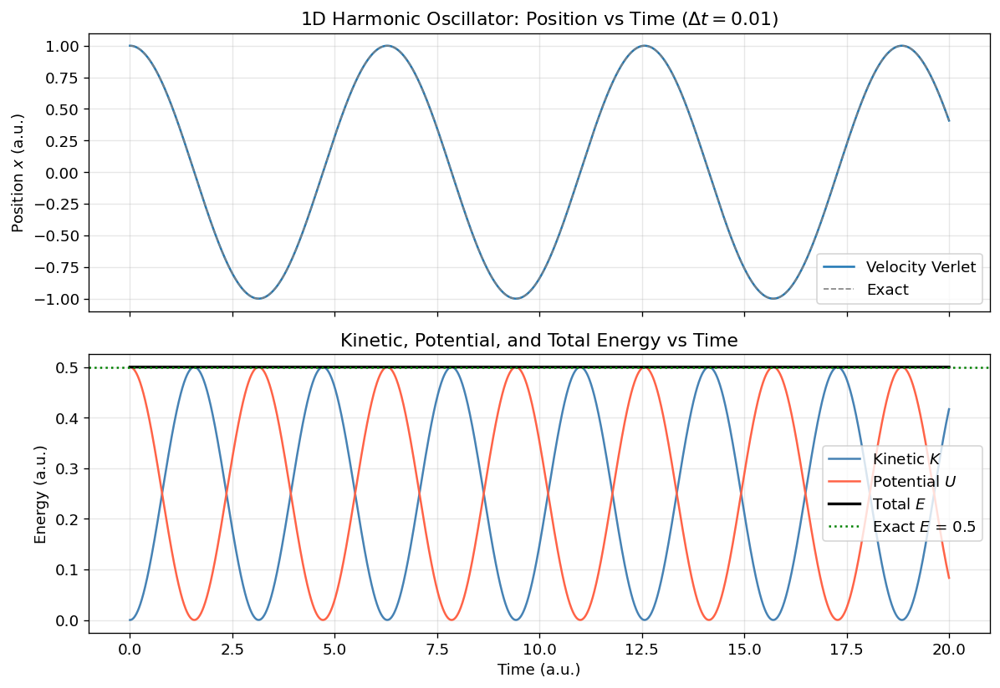
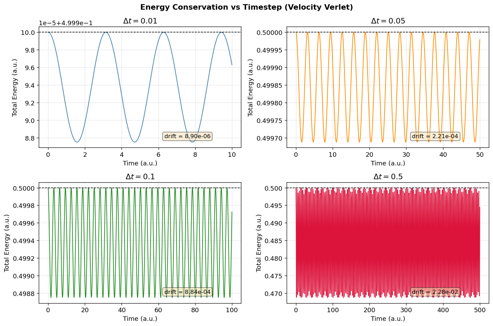
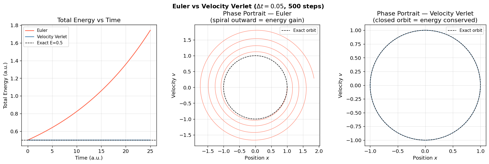
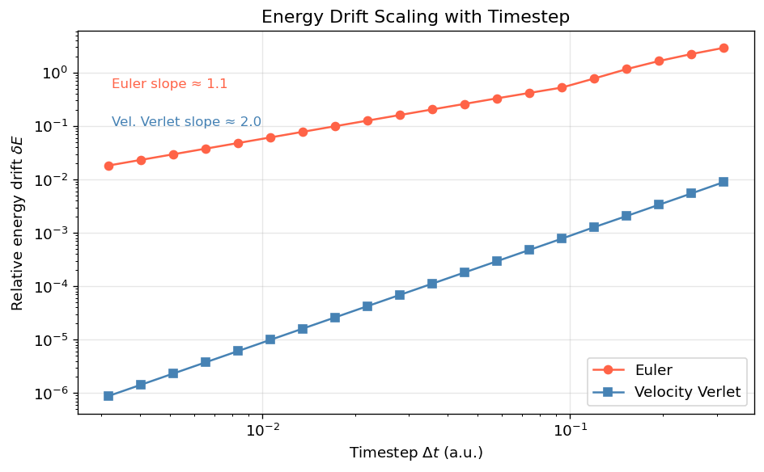
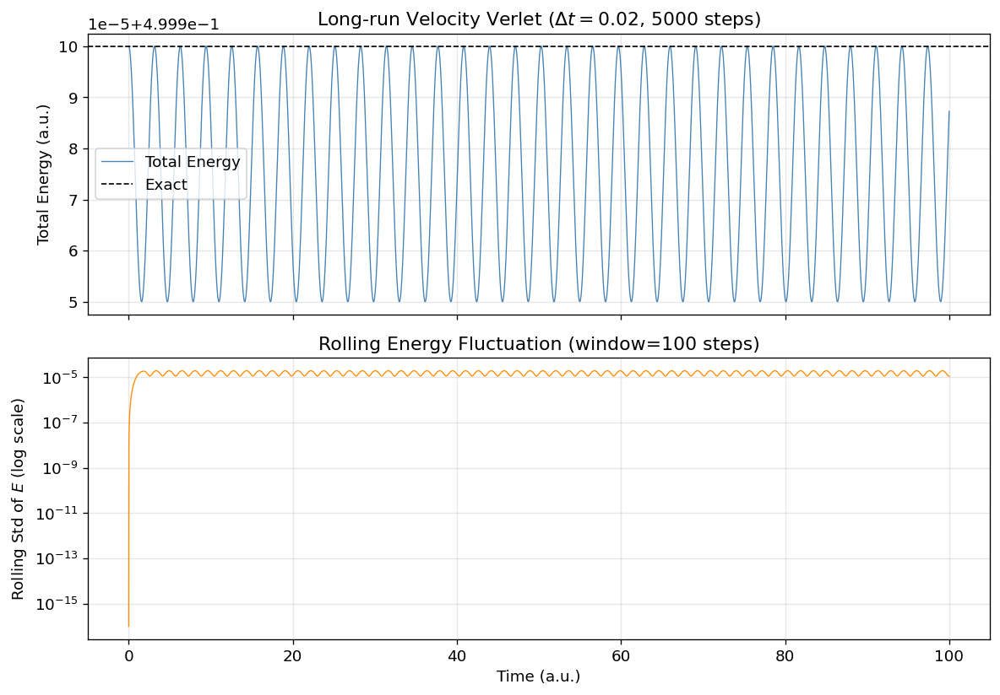
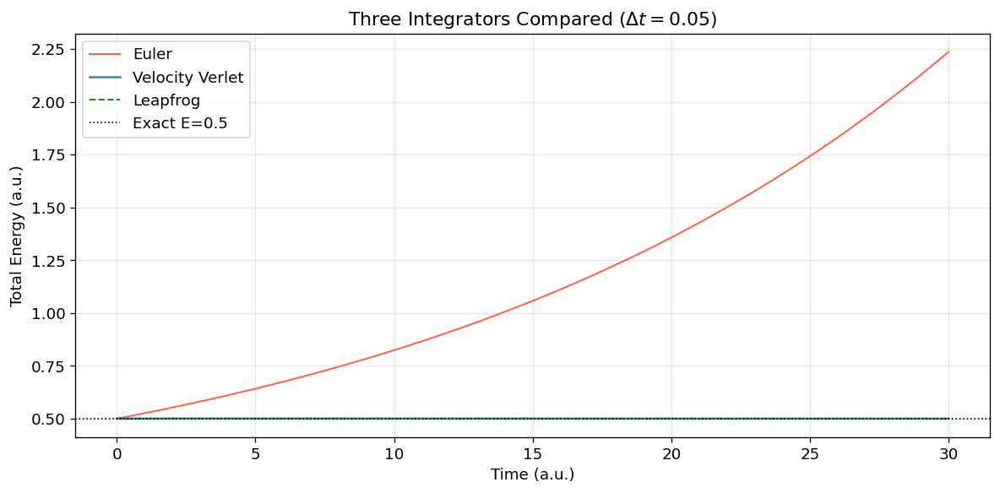

**Ch121a | Module 2: Molecular Dynamics**


[](https://colab.research.google.com/github/ppt-2/Ch121a-DFT/blob/main/Module%202%20-%20Molecular%20dynamics/notebooks/01_introduction_to_md.ipynb)

# Introduction to Molecular Dynamics

---

## Learning Objectives
- Conceptual basis of classical molecular dynamics (MD) simulation
- Some histiry of MD from hard-sphere models to modern simulations
- Newton's equations of motion in the context of an $N$-body system
- Potential energy surface and phase space
- Integration algorithms, **Velocity Verlet** from a Taylor expansion
- Euler, Verlet, Velocity-Verlet, and Leapfrog integrators 
- Ensembles from statistical mechanics (NVE, NVT, NPT, $\mu$VT) and
- Role of integrator timestep : numerical stability and energy conservation
- Simulating a 1D harmonic oscillator and analyze energy conservation as a function of timestep

## What is Molecular Dynamics?

**Molecular Dynamics (MD)** is a computational technique in which the time evolution of a set of interacting
particles is simulated by numerically integrating Newton's classical equations of motion. Each atom is treated
as a point mass; bonds, angles, and non-bonded interactions are described by a set of empirically derived parameters, 'interatomic potentials' commonly called *force-field*.

### Historical Context

| Year | Authors | Milestone |
|------|---------|----------|
| 1957 | Alder & Wainwright | First MD simulation — hard-sphere fluid; demonstrated liquid–solid phase transition |
| 1964 | Rahman | First continuous-potential MD — liquid argon with Lennard-Jones interactions; reproduced experimental structure factors |
| 1977 | McCammon, Gelin & Karplus | First protein MD — bovine pancreatic trypsin inhibitor (BPTI), 9.2 ps |
| 1980s–present | Many groups | Membrane proteins, nucleic acids, drug binding, materials science, QM/MM |

### Modern Applications

- **Drug design**: binding free energies, conformational sampling of targets
- **Materials science**: crack propagation, phase transitions, thermal conductivity
- **Biophysics**: protein folding, membrane dynamics, ion-channel gating
- **Chemical engineering**: diffusion coefficients, viscosity, equation of state

### Conceptual Overview

At its core, MD is simply:

> *Numerically integrate Newton's second law $\mathbf{F} = m\mathbf{a}$ for $N$ interacting particles,
> advancing the system in small timesteps $\Delta t$ to generate a trajectory in phase space.*

The trajectory is a time-ordered sequence of positions $\{\mathbf{r}_i(t)\}$ and momenta $\{\mathbf{p}_i(t)\}$
from which thermodynamic and structural observables are extracted via time averages (ergodic hypothesis).

## The Classical $N$-Body Problem

### Equations of Motion

For a system of $N$ particles with masses $m_i$ at positions $\mathbf{r}_i$, Newton's second law gives:

$$m_i \ddot{\mathbf{r}}_i = \mathbf{F}_i, \quad i = 1, \ldots, N$$

The force on particle $i$ is the negative gradient of the total potential energy $U$:

$$\mathbf{F}_i = -\nabla_{\mathbf{r}_i} U(\mathbf{r}_1, \mathbf{r}_2, \ldots, \mathbf{r}_N)$$

This yields a system of $3N$ coupled second-order ordinary differential equations.

### The Potential Energy Surface (PES)

The function $U(\mathbf{r}_1, \ldots, \mathbf{r}_N)$ is the **potential energy surface** — a $3N$-dimensional hypersurface
whose shape determines all forces. For pairwise-additive interactions:

$$U = \sum_{i<j} u(r_{ij}), \quad r_{ij} = |\mathbf{r}_i - \mathbf{r}_j|$$

In practice, force fields also include bonded terms (bonds, angles, dihedrals) and long-range electrostatics.

### Phase Space and Degrees of Freedom

The complete state of the system is described by a point in **phase space** $\Gamma$:

$$\Gamma = (\mathbf{r}_1, \ldots, \mathbf{r}_N,\; \mathbf{p}_1, \ldots, \mathbf{p}_N) \in \mathbb{R}^{6N}$$

- **$3N$ configurational degrees of freedom**: positions $\mathbf{r}_i$
- **$3N$ momentum degrees of freedom**: $\mathbf{p}_i = m_i \dot{\mathbf{r}}_i$

The total mechanical energy (Hamiltonian) is:

$$H = \sum_{i=1}^{N} \frac{\mathbf{p}_i^2}{2m_i} + U(\mathbf{r}_1, \ldots, \mathbf{r}_N) = K + U$$

Hamilton's equations of motion recover Newton's laws:

$$\dot{\mathbf{r}}_i = \frac{\partial H}{\partial \mathbf{p}_i} = \frac{\mathbf{p}_i}{m_i}, \qquad
\dot{\mathbf{p}}_i = -\frac{\partial H}{\partial \mathbf{r}_i} = \mathbf{F}_i$$

### Conservation Laws in Isolated Systems

For an isolated system (no external forces), the following are conserved:
- Total energy $H$ (if the integrator is symplectic)
- Total linear momentum $\mathbf{P} = \sum_i \mathbf{p}_i$
- Total angular momentum $\mathbf{L} = \sum_i \mathbf{r}_i \times \mathbf{p}_i$

## Force Fields — Overview

A **force-field** is a set of parameters for given equations that approximately represent the potential energy surface $U$. The parameters are fit to reproduce experimental observables or high-level quantum-chemical calculations.

### General Form

$$U = U_{\text{bonds}} + U_{\text{angles}} + U_{\text{dihedrals}} + U_{\text{vdW}} + U_{\text{elec}}$$

### Categories

| Type | Example Potentials | Systems |
|------|-------------------|--------|
| Pair potentials | Lennard-Jones, Morse, Coulomb, Generalized non-bond$^{1}$ | Rare gases, simple liquids, electrostatics |
| Bonded (Class I/II) | AMBER, CHARMM, GROMOS, OPLS | Biomolecules, organic molecules |
| Many-body | EAM (metals), Tersoff/REBO (covalent), ReaxFF (reactive)$^{2}$ | Metals, semiconductors, combustion |
| Polarizable | Drude oscillator, AMOEBA, PQEq$^{3}$ | High-accuracy water and proteins |

1. J. Chem. Phys. 2017, 146 (12), 124117 {https://doi.org/10.1063/1.4978891}
2. J. Phys. Chem. A 2001, 105 (41), 9396–9409. https://doi.org/10.1021/jp004368u 
3. J. Chem. Theory Comput. 2025, 21 (1), 499–515. https://doi.org/10.1021/acs.jctc.4c01435
The **Lennard-Jones (12-6)** pair potential is the archetypal example:

$$u_{LJ}(r) = 4\varepsilon \left[\left(\frac{\sigma}{r}\right)^{12} - \left(\frac{\sigma}{r}\right)^{6}\right]$$

where $\varepsilon$ is the well depth and $\sigma$ is the collision diameter.

> **Notebook 03** covers force fields in depth, including parameter derivation, cutoff schemes,
> and long-range electrostatics (Ewald summation, PME).

## Integration Algorithms

The central numerical task in MD is integrating Newton's equations over many timesteps $\Delta t$.
A good integrator must be:
- **Time-reversible** (physical trajectories are time-symmetric)
- **Symplectic** (preserves phase-space volume — Liouville's theorem)
- Computationally inexpensive per step

### 1. Euler Method

The simplest possible integrator, derived from the first-order Taylor expansion:

$$\mathbf{r}(t+\Delta t) = \mathbf{r}(t) + \mathbf{v}(t)\,\Delta t$$

$$\mathbf{v}(t+\Delta t) = \mathbf{v}(t) + \mathbf{a}(t)\,\Delta t$$

**Truncation error**: $\mathcal{O}(\Delta t^2)$ per step, $\mathcal{O}(\Delta t)$ globally.
**Problems**: not time-reversible, not symplectic — energy drifts systematically upward.

### 2. (Original) Verlet Algorithm

Add the Taylor expansion forward and backward in time:

$$\mathbf{r}(t+\Delta t) = 2\mathbf{r}(t) - \mathbf{r}(t-\Delta t) + \mathbf{a}(t)\,\Delta t^2 + \mathcal{O}(\Delta t^4)$$

**Advantages**: time-reversible, symplectic, $\mathcal{O}(\Delta t^4)$ local error.
**Disadvantages**: no explicit velocity at time $t$; numerical precision issues for large $N$.

### 3. Velocity Verlet Algorithm (Derivation)

Starting from the Taylor expansion of position to second order:

$$\mathbf{r}(t+\Delta t) = \mathbf{r}(t) + \mathbf{v}(t)\,\Delta t + \tfrac{1}{2}\mathbf{a}(t)\,\Delta t^2 + \mathcal{O}(\Delta t^3)$$

For velocities, expand $\mathbf{v}(t+\Delta t)$ and use the trapezoidal approximation for $\dot{\mathbf{a}}$:

$$\mathbf{v}(t+\Delta t) = \mathbf{v}(t) + \frac{\mathbf{a}(t) + \mathbf{a}(t+\Delta t)}{2}\,\Delta t + \mathcal{O}(\Delta t^3)$$

This is **mathematically equivalent** to the original Verlet but provides velocities explicitly and has
better numerical precision. It is **time-reversible** and **symplectic** (a splitting integrator).

**Algorithm (two-step form)**:
1. Compute $\mathbf{r}(t+\Delta t) = \mathbf{r}(t) + \mathbf{v}(t)\Delta t + \tfrac{1}{2}\mathbf{a}(t)\Delta t^2$
2. Compute new forces $\mathbf{F}(t+\Delta t)$ → $\mathbf{a}(t+\Delta t) = \mathbf{F}/m$
3. Compute $\mathbf{v}(t+\Delta t) = \mathbf{v}(t) + \tfrac{1}{2}[\mathbf{a}(t)+\mathbf{a}(t+\Delta t)]\Delta t$

```
# Velocity Verlet Pseudocode
for each timestep:
    r_new = r + v*dt + 0.5*a*dt**2
    a_new = forces(r_new) / m
    v_new = v + 0.5*(a + a_new)*dt
    r, v, a = r_new, v_new, a_new
```

### 4. Leapfrog Algorithm

Positions and velocities are staggered by half a timestep:

$$\mathbf{v}(t+\tfrac{1}{2}\Delta t) = \mathbf{v}(t-\tfrac{1}{2}\Delta t) + \mathbf{a}(t)\,\Delta t$$

$$\mathbf{r}(t+\Delta t) = \mathbf{r}(t) + \mathbf{v}(t+\tfrac{1}{2}\Delta t)\,\Delta t$$

Leapfrog is algebraically equivalent to Velocity Verlet but stores half-step velocities.
Used in GROMACS and many other production codes.

### Summary Comparison

| Integrator | Order | Time-reversible | Symplectic | Explicit $v(t)$ |
|-----------|-------|----------------|-----------|---------------|
| Euler | 1 | No | No | Yes |
| Verlet | 2 | Yes | Yes | No |
| Velocity Verlet | 2 | Yes | Yes | Yes |
| Leapfrog | 2 | Yes | Yes | Half-step |

## Statistical Mechanical Ensembles

An **ensemble** is a collection of all microstates consistent with fixed macroscopic constraints.
The choice of ensemble determines which thermodynamic variables are held constant.

### The Four Major Ensembles

#### 1. Microcanonical Ensemble (NVE)
- **Fixed**: Number of particles $N$, Volume $V$, Energy $E$
- **Partition function**: $\Omega(N,V,E) = $ number of microstates with energy $E$
- **Entropy**: $S = k_B \ln \Omega$
- **When to use**: Checking energy conservation of an integrator; isolated systems; short reference runs.
- *Plain MD (no thermostat/barostat) samples NVE.*

#### 2. Canonical Ensemble (NVT)
- **Fixed**: $N$, $V$, Temperature $T$
- **Partition function**: $Z = \sum_i e^{-E_i/k_BT}$
- **Free energy**: $A = -k_BT \ln Z$ (Helmholtz)
- **When to use**: Equilibration, most biomolecular simulations, free energy calculations.
- *Requires a thermostat (see below).*

#### 3. Isothermal–Isobaric Ensemble (NPT)
- **Fixed**: $N$, Pressure $P$, Temperature $T$
- **Partition function**: $\Delta = \int_0^\infty Z(N,V,T)\,e^{-PV/k_BT}\,dV$
- **Free energy**: $G = -k_BT \ln \Delta$ (Gibbs)
- **When to use**: Simulations at experimental conditions ($P = 1$ atm); density equilibration.
- *Requires both a thermostat and a barostat.*

#### 4. Grand Canonical Ensemble ($\mu$VT)
- **Fixed**: Chemical potential $\mu$, $V$, $T$; $N$ fluctuates
- **Partition function**: $\Xi = \sum_N e^{\mu N/k_BT} Z(N,V,T)$
- **When to use**: Adsorption isotherms, porous materials, open-system problems.
- *Requires particle insertion/deletion (Monte Carlo moves); rarely pure MD.*

### Ergodic Hypothesis

MD exploits the **ergodic hypothesis**: for a sufficiently long trajectory, time averages equal ensemble averages:

$$\langle A \rangle_{\text{ensemble}} = \overline{A}_{\text{time}} = \lim_{T\to\infty} \frac{1}{T}\int_0^T A[\Gamma(t)]\,dt$$

## Thermostats (NVT Control)

To maintain constant temperature, a thermostat couples the system to a heat bath at target temperature $T_0$.
The instantaneous kinetic temperature is:

$$T(t) = \frac{2K(t)}{N_f k_B} = \frac{\sum_i m_i v_i^2}{N_f k_B}$$

where $N_f = 3N - N_{\text{constraints}}$ is the number of degrees of freedom.

### Berendsen Thermostat (Velocity Rescaling)

Rescale velocities every step by factor $\lambda$:

$$\lambda = \sqrt{1 + \frac{\Delta t}{\tau_T}\left(\frac{T_0}{T(t)} - 1\right)}$$

where $\tau_T$ is the coupling time constant.

- **Pros**: Fast, robust, easy to implement.
- **Cons**: Does **not** generate a correct canonical ensemble — kinetic energy fluctuations are suppressed.
  Only use for equilibration, never for production free energy runs.

### Nosé–Hoover Thermostat

Introduces an extended-system variable $s$ (thermostat 'mass' $Q$) into the Lagrangian:

$$\mathcal{L}_{NH} = \frac{1}{2}\sum_i m_i \dot{\mathbf{r}}_i^2 s^2 - U + \frac{Q}{2}\dot{s}^2 - N_f k_B T_0 \ln s$$

The resulting equations of motion are:

$$m_i \ddot{\mathbf{r}}_i = \mathbf{F}_i - \xi m_i \dot{\mathbf{r}}_i, \qquad
\dot{\xi} = \frac{1}{Q}\left(\sum_i m_i v_i^2 - N_f k_B T_0\right)$$

- **Pros**: Rigorously generates the canonical (NVT) ensemble when ergodic. Time-reversible. Used in GROMACS (`v-rescale`/`nose-hoover`), LAMMPS, NAMD.
- **Cons**: Can show oscillatory temperature coupling; may not be ergodic for simple systems (use Nosé–Hoover chains).

## Barostats (NPT Control)

A barostat controls pressure by allowing the simulation box to change volume (and/or shape).
The instantaneous virial pressure is:

$$P(t) = \frac{N k_B T}{V} + \frac{1}{3V}\sum_{i<j} \mathbf{r}_{ij} \cdot \mathbf{F}_{ij}$$

### Berendsen Barostat

Rescale box lengths by factor $\mu$ each step:

$$\mu = \left[1 - \frac{\kappa_T \Delta t}{\tau_P}(P_0 - P(t))\right]^{1/3}$$

where $\kappa_T$ is the isothermal compressibility and $\tau_P$ is the coupling constant.
- Fast convergence; does not generate a correct NPT ensemble (suppresses pressure fluctuations).

### Parrinello–Rahman Barostat

Extends the Lagrangian to include box vectors $\mathbf{h}$ as dynamic variables with 'mass' tensor $\mathbf{W}$:

$$\ddot{\mathbf{h}} = V\,\mathbf{W}^{-1}(\mathbf{P} - P_0 \mathbf{I})$$

- Generates correct NPT ensemble.
- Allows box shape fluctuations — essential for phase transitions and anisotropic systems.
- Default for production NPT in GROMACS; often combined with Nosé–Hoover thermostat.


```python
# Ch121a: Molecular Dynamics — Notebook 01: Introduction to MD
# License: GPL-3.0 (https://www.gnu.org/licenses/gpl-3.0.en.html)

import numpy as np
import matplotlib.pyplot as plt
import matplotlib.gridspec as gridspec
from scipy.stats import linregress

# Matplotlib style settings
plt.rcParams.update({
    'figure.dpi': 120,
    'axes.grid': True,
    'grid.alpha': 0.3,
    'lines.linewidth': 1.5,
    'font.size': 11,
})

print('NumPy version :', np.__version__)
print('All imports successful.')
```

    NumPy version : 2.2.6
    All imports successful.


## Code Example 1: 1D Harmonic Oscillator — Velocity Verlet

The 1D harmonic oscillator is the simplest non-trivial MD test case. The potential is:

$$V(x) = \frac{1}{2}kx^2$$

giving force $F = -kx$ and acceleration $a = -kx/m$.

The exact analytical solution is $x(t) = x_0 \cos(\omega t)$, $v(t) = -x_0\omega\sin(\omega t)$ with
$\omega = \sqrt{k/m}$. Initial conditions: $x_0=1$, $v_0=0$, $m=1$, $k=1$, so $\omega=1$.

We integrate for 2000 steps with $\Delta t = 0.01$ (20 full periods) and track:
- Kinetic energy: $K = \frac{1}{2}mv^2$
- Potential energy: $U = \frac{1}{2}kx^2$
- Total energy: $E = K + U$ (should be constant = 0.5)


```python
# ── Parameters ──────────────────────────────────────────────────────────
m  = 1.0   # mass (a.u.)
k  = 1.0   # spring constant
x0 = 1.0   # initial position
v0 = 0.0   # initial velocity
dt = 0.01  # timestep
n_steps = 2000

omega_exact = np.sqrt(k / m)          # exact angular frequency
E_exact     = 0.5 * k * x0**2        # exact total energy

# ── Storage arrays ────────────────────────────────────────────────────────
t_arr  = np.arange(n_steps + 1) * dt
x_arr  = np.zeros(n_steps + 1)
v_arr  = np.zeros(n_steps + 1)
KE_arr = np.zeros(n_steps + 1)
PE_arr = np.zeros(n_steps + 1)
TE_arr = np.zeros(n_steps + 1)

# ── Initial conditions ────────────────────────────────────────────────────
x_arr[0] = x0
v_arr[0] = v0
a = -k * x0 / m          # initial acceleration
KE_arr[0] = 0.5 * m * v0**2
PE_arr[0] = 0.5 * k * x0**2
TE_arr[0] = KE_arr[0] + PE_arr[0]

# ── Velocity Verlet integration ───────────────────────────────────────────
x = x0
v = v0
for i in range(1, n_steps + 1):
    x_new = x + v * dt + 0.5 * a * dt**2
    a_new = -k * x_new / m
    v_new = v + 0.5 * (a + a_new) * dt
    x, v, a = x_new, v_new, a_new
    x_arr[i]  = x
    v_arr[i]  = v
    KE_arr[i] = 0.5 * m * v**2
    PE_arr[i] = 0.5 * k * x**2
    TE_arr[i] = KE_arr[i] + PE_arr[i]

# ── Analytical solution ───────────────────────────────────────────────────
x_exact = x0 * np.cos(omega_exact * t_arr)

print(f'Exact total energy : {E_exact:.6f}')
print(f'Mean simulated E   : {TE_arr.mean():.6f}')
print(f'Std  simulated E   : {TE_arr.std():.2e}')
print(f'Max |E - E_exact|  : {np.max(np.abs(TE_arr - E_exact)):.2e}')
```

    Exact total energy : 0.500000
    Mean simulated E   : 0.499994
    Std  simulated E   : 4.39e-06
    Max |E - E_exact|  : 1.25e-05


```python
fig, axes = plt.subplots(2, 1, figsize=(10, 7), sharex=True)

# ── Panel 1: position vs time ─────────────────────────────────────────────
axes[0].plot(t_arr, x_arr,     label='Velocity Verlet', lw=1.5)
axes[0].plot(t_arr, x_exact,   label='Exact', lw=1.0, ls='--', color='gray')
axes[0].set_ylabel('Position $x$ (a.u.)')
axes[0].set_title('1D Harmonic Oscillator: Position vs Time ($\\Delta t=0.01$)')
axes[0].legend()

# ── Panel 2: energies ─────────────────────────────────────────────────────
axes[1].plot(t_arr, KE_arr,    label='Kinetic $K$',   color='steelblue')
axes[1].plot(t_arr, PE_arr,    label='Potential $U$', color='tomato')
axes[1].plot(t_arr, TE_arr,    label='Total $E$',     color='black',  lw=2)
axes[1].axhline(E_exact, ls=':', color='green', label=f'Exact $E$ = {E_exact}')
axes[1].set_xlabel('Time (a.u.)')
axes[1].set_ylabel('Energy (a.u.)')
axes[1].set_title('Kinetic, Potential, and Total Energy vs Time')
axes[1].legend()

plt.tight_layout()
plt.show()
print('Velocity Verlet conserves total energy to within:', f'{TE_arr.std():.2e}', '(std dev)')
```


    

    


    Velocity Verlet conserves total energy to within: 4.39e-06 (std dev)


## Code Example 2: Timestep Stability Analysis

The choice of timestep $\Delta t$ is critical:
- Too large: numerical instability, energy diverges
- Too small: computationally expensive, slow sampling

For the harmonic oscillator with $\omega = 1$, the **stability criterion** for Verlet-family integrators is
approximately $\Delta t < 2/\omega$. Here we test four values:
$\Delta t \in \{0.01, 0.05, 0.1, 0.5\}$.

We quantify **energy drift** as the relative standard deviation of total energy:

$$\delta E = \frac{\sigma(E)}{|\langle E \rangle|}$$


```python
def run_vv(x0, v0, m, k, dt, n_steps):
    """Run Velocity Verlet for 1D harmonic oscillator. Returns time and total energy arrays."""
    x, v = x0, v0
    a = -k * x / m
    E = np.zeros(n_steps + 1)
    E[0] = 0.5 * m * v**2 + 0.5 * k * x**2
    for i in range(1, n_steps + 1):
        x_new = x + v * dt + 0.5 * a * dt**2
        a_new = -k * x_new / m
        v_new = v + 0.5 * (a + a_new) * dt
        x, v, a = x_new, v_new, a_new
        E[i] = 0.5 * m * v**2 + 0.5 * k * x**2
    t = np.arange(n_steps + 1) * dt
    return t, E

timesteps = [0.01, 0.05, 0.1, 0.5]
n_steps_ts = 1000
results = {}
for dt_val in timesteps:
    t_i, E_i = run_vv(1.0, 0.0, 1.0, 1.0, dt_val, n_steps_ts)
    drift = E_i.std() / abs(E_i.mean())
    results[dt_val] = {'t': t_i, 'E': E_i, 'drift': drift}
    print(f'dt = {dt_val:.2f}  |  energy drift = {drift:.4e}')
```

    dt = 0.01  |  energy drift = 8.9027e-06
    dt = 0.05  |  energy drift = 2.2064e-04
    dt = 0.10  |  energy drift = 8.8411e-04
    dt = 0.50  |  energy drift = 2.2811e-02


```python
fig, axes = plt.subplots(2, 2, figsize=(12, 8))
axes = axes.flatten()

colors = ['steelblue', 'darkorange', 'forestgreen', 'crimson']
E_ref = 0.5 * 1.0 * 1.0**2   # exact energy

for idx, (dt_val, color) in enumerate(zip(timesteps, colors)):
    ax  = axes[idx]
    res = results[dt_val]
    ax.plot(res['t'], res['E'], color=color, lw=1.2)
    ax.axhline(E_ref, color='black', ls='--', lw=1, label=f'Exact E={E_ref}')
    ax.set_title(f'$\\Delta t = {dt_val}$')
    ax.set_xlabel('Time (a.u.)')
    ax.set_ylabel('Total Energy (a.u.)')
    textstr = f'drift = {res["drift"]:.2e}'
    ax.text(0.62, 0.08, textstr, transform=ax.transAxes,
            fontsize=10, bbox=dict(boxstyle='round', facecolor='wheat', alpha=0.5))

fig.suptitle('Energy Conservation vs Timestep (Velocity Verlet)', fontsize=13, fontweight='bold')
plt.tight_layout()
plt.show()
```


    

    


## Code Example 3: Euler Method vs Velocity Verlet

Here we directly compare the Euler integrator and the Velocity Verlet integrator for the same
harmonic oscillator system with $\Delta t = 0.05$, running for 500 steps.

The **Euler method** is not symplectic: phase-space volume is not preserved, causing the total
energy to drift systematically **upward** (the trajectory spirals outward in phase space).

**Velocity Verlet** is symplectic: it preserves a *shadow Hamiltonian* close to the true $H$,
so total energy oscillates but shows **no systematic drift**.


```python
def run_euler(x0, v0, m, k, dt, n_steps):
    """Euler integrator for 1D harmonic oscillator."""
    x, v = x0, v0
    E = np.zeros(n_steps + 1)
    x_traj = np.zeros(n_steps + 1)
    v_traj = np.zeros(n_steps + 1)
    E[0] = 0.5 * m * v**2 + 0.5 * k * x**2
    x_traj[0], v_traj[0] = x, v
    for i in range(1, n_steps + 1):
        a = -k * x / m
        x = x + v * dt
        v = v + a * dt
        E[i] = 0.5 * m * v**2 + 0.5 * k * x**2
        x_traj[i], v_traj[i] = x, v
    t = np.arange(n_steps + 1) * dt
    return t, E, x_traj, v_traj

def run_vv_full(x0, v0, m, k, dt, n_steps):
    """Velocity Verlet integrator for 1D harmonic oscillator."""
    x, v = x0, v0
    a = -k * x / m
    E = np.zeros(n_steps + 1)
    x_traj = np.zeros(n_steps + 1)
    v_traj = np.zeros(n_steps + 1)
    E[0] = 0.5 * m * v**2 + 0.5 * k * x**2
    x_traj[0], v_traj[0] = x, v
    for i in range(1, n_steps + 1):
        x_new = x + v * dt + 0.5 * a * dt**2
        a_new = -k * x_new / m
        v_new = v + 0.5 * (a + a_new) * dt
        x, v, a = x_new, v_new, a_new
        E[i] = 0.5 * m * v**2 + 0.5 * k * x**2
        x_traj[i], v_traj[i] = x, v
    t = np.arange(n_steps + 1) * dt
    return t, E, x_traj, v_traj

dt_cmp  = 0.05
n_cmp   = 500
t_eu, E_eu, x_eu, v_eu = run_euler(1.0, 0.0, 1.0, 1.0, dt_cmp, n_cmp)
t_vv, E_vv, x_vv, v_vv = run_vv_full(1.0, 0.0, 1.0, 1.0, dt_cmp, n_cmp)

print(f'Euler       — final energy: {E_eu[-1]:.4f}  (drift from E0: {E_eu[-1]-E_eu[0]:+.4f})')
print(f'Vel. Verlet — final energy: {E_vv[-1]:.4f}  (drift from E0: {E_vv[-1]-E_vv[0]:+.6f})')
```

    Euler       — final energy: 1.7425  (drift from E0: +1.2425)
    Vel. Verlet — final energy: 0.5000  (drift from E0: -0.000005)


```python
fig, axes = plt.subplots(1, 3, figsize=(15, 5))

# Panel 1: Total energy vs time
axes[0].plot(t_eu, E_eu, label='Euler',          color='tomato',    lw=1.5)
axes[0].plot(t_vv, E_vv, label='Velocity Verlet', color='steelblue', lw=1.5)
axes[0].axhline(0.5, ls='--', color='black', lw=1, label='Exact E=0.5')
axes[0].set_xlabel('Time (a.u.)')
axes[0].set_ylabel('Total Energy (a.u.)')
axes[0].set_title('Total Energy vs Time')
axes[0].legend(fontsize=9)

# Panel 2: Phase portrait — Euler
axes[1].plot(x_eu, v_eu, color='tomato', lw=0.8, alpha=0.8)
axes[1].set_xlabel('Position $x$')
axes[1].set_ylabel('Velocity $v$')
axes[1].set_title('Phase Portrait — Euler\n(spiral outward = energy gain)')
theta = np.linspace(0, 2*np.pi, 300)
axes[1].plot(np.cos(theta), np.sin(theta), 'k--', lw=1, label='Exact orbit')
axes[1].legend(fontsize=9)
axes[1].set_aspect('equal')

# Panel 3: Phase portrait — Velocity Verlet
axes[2].plot(x_vv, v_vv, color='steelblue', lw=0.8, alpha=0.8)
axes[2].plot(np.cos(theta), np.sin(theta), 'k--', lw=1, label='Exact orbit')
axes[2].set_xlabel('Position $x$')
axes[2].set_ylabel('Velocity $v$')
axes[2].set_title('Phase Portrait — Velocity Verlet\n(closed orbit = energy conserved)')
axes[2].legend(fontsize=9)
axes[2].set_aspect('equal')

plt.suptitle(f'Euler vs Velocity Verlet ($\\Delta t={dt_cmp}$, {n_cmp} steps)', fontsize=13, fontweight='bold')
plt.tight_layout()
plt.show()
```


    

    


```python
dts = np.logspace(-2.5, -0.5, 20)
drift_euler = []
drift_vv    = []

for dt_val in dts:
    n_s = max(200, int(20 / dt_val))   # enough steps for ~3 periods
    _, E_e, _, _ = run_euler(1.0, 0.0, 1.0, 1.0, dt_val, n_s)
    _, E_v, _, _ = run_vv_full(1.0, 0.0, 1.0, 1.0, dt_val, n_s)
    drift_euler.append(E_e.std() / abs(E_e.mean()))
    drift_vv.append(E_v.std()    / abs(E_v.mean()))

fig, ax = plt.subplots(figsize=(8, 5))
ax.loglog(dts, drift_euler, 'o-', color='tomato',    label='Euler')
ax.loglog(dts, drift_vv,    's-', color='steelblue', label='Velocity Verlet')

# Fit slopes
valid_eu = np.array(drift_euler) > 1e-14
valid_vv = np.array(drift_vv)    > 1e-14
slope_eu = linregress(np.log(dts[valid_eu]), np.log(np.array(drift_euler)[valid_eu])).slope
slope_vv = linregress(np.log(dts[valid_vv]), np.log(np.array(drift_vv)[valid_vv])).slope
ax.text(0.05, 0.85, f'Euler slope ≈ {slope_eu:.1f}',      transform=ax.transAxes, color='tomato',    fontsize=10)
ax.text(0.05, 0.75, f'Vel. Verlet slope ≈ {slope_vv:.1f}', transform=ax.transAxes, color='steelblue', fontsize=10)

ax.set_xlabel('Timestep $\\Delta t$ (a.u.)')
ax.set_ylabel('Relative energy drift $\\delta E$')
ax.set_title('Energy Drift Scaling with Timestep')
ax.legend()
plt.tight_layout()
plt.show()
print(f'Expected: Euler ~ O(dt^1), Velocity Verlet ~ O(dt^2)')
```


    

    


    Expected: Euler ~ O(dt^1), Velocity Verlet ~ O(dt^2)


### A typical MD simulation pipeline consists of several stages:

```
1. System Preparation
   ├── Build/obtain initial coordinates (PDB, crystal structure, builder)
   ├── Assign force field parameters and charges
   ├── Solvate (add water box, set periodic boundary conditions)
   └── Add ions to neutralize / set ionic strength

2. Energy Minimization
   └── Steepest descent or conjugate gradient → remove bad contacts

3. Equilibration
   ├── NVT phase: heat system to target T with Berendsen thermostat
   └── NPT phase: equilibrate density with Berendsen P/T coupling

4. Production Run
   ├── Switch to Nosé-Hoover thermostat + Parrinello-Rahman barostat (NPT)
   └── Collect trajectory every N steps

5. Analysis
   ├── Structural: RMSD, RMSF, RDF, coordination numbers
   ├── Dynamic: diffusion coefficients, autocorrelation functions
   └── Thermodynamic: free energies, enthalpies, heat capacities
```

### Typical Timesteps in Production

| System | Fastest motion | Typical $\Delta t$ |
|--------|---------------|-------------------|
| All-atom, no constraints | O–H stretch (~10 fs) | 1 fs |
| All-atom, H-bonds constrained (LINCS/SHAKE) | C–H stretch (~15 fs) | 2 fs |
| Coarse-grained (MARTINI) | Slow bead motions | 20–40 fs |
| United-atom rare gas | Translational | 5–10 fs |


```python
# Demonstrate the long-time behavior: energy conservation plateau
# Run for many periods and compute rolling standard deviation of total energy

n_long = 5000
dt_long = 0.02
_, E_long, _, _ = run_vv_full(1.0, 0.0, 1.0, 1.0, dt_long, n_long)
t_long = np.arange(n_long + 1) * dt_long

# Rolling std over window of 100 steps
window = 100
rolling_std = np.array([
    E_long[max(0, i-window):i+1].std() for i in range(len(E_long))
])

fig, axes = plt.subplots(2, 1, figsize=(10, 7), sharex=True)

axes[0].plot(t_long, E_long, lw=0.8, color='steelblue', label='Total Energy')
axes[0].axhline(0.5, ls='--', color='black', lw=1, label='Exact')
axes[0].set_ylabel('Total Energy (a.u.)')
axes[0].set_title(f'Long-run Velocity Verlet ($\\Delta t={dt_long}$, {n_long} steps)')
axes[0].legend()

axes[1].semilogy(t_long, rolling_std + 1e-16, lw=0.8, color='darkorange')
axes[1].set_xlabel('Time (a.u.)')
axes[1].set_ylabel('Rolling Std of $E$ (log scale)')
axes[1].set_title(f'Rolling Energy Fluctuation (window={window} steps)')

plt.tight_layout()
plt.show()
print(f'Global energy std over full run: {E_long.std():.2e}')
```


    

    


    Global energy std over full run: 1.77e-05


```python
def run_leapfrog(x0, v0, m, k, dt, n_steps):
    """Leapfrog integrator for 1D harmonic oscillator.
    Velocities are stored at half-integer timesteps.
    On-step velocities are estimated as average of surrounding half-steps.
    """
    x = x0
    a0 = -k * x0 / m
    v_half = v0 + 0.5 * a0 * dt    # kick to first half-step

    E = np.zeros(n_steps + 1)
    # Estimate on-step velocity for initial energy
    v_on = v0
    E[0] = 0.5 * m * v_on**2 + 0.5 * k * x**2

    for i in range(1, n_steps + 1):
        x = x + v_half * dt
        a = -k * x / m
        v_half_new = v_half + a * dt
        v_on = 0.5 * (v_half + v_half_new)   # on-step velocity estimate
        E[i] = 0.5 * m * v_on**2 + 0.5 * k * x**2
        v_half = v_half_new

    t = np.arange(n_steps + 1) * dt
    return t, E

dt_3 = 0.05
n_3  = 600
t_eu3, E_eu3, _, _ = run_euler(1.0, 0.0, 1.0, 1.0, dt_3, n_3)
t_vv3, E_vv3, _, _ = run_vv_full(1.0, 0.0, 1.0, 1.0, dt_3, n_3)
t_lf3, E_lf3       = run_leapfrog(1.0, 0.0, 1.0, 1.0, dt_3, n_3)

fig, ax = plt.subplots(figsize=(10, 5))
ax.plot(t_eu3, E_eu3, label='Euler',           color='tomato',      lw=1.2)
ax.plot(t_vv3, E_vv3, label='Velocity Verlet', color='steelblue',   lw=1.5)
ax.plot(t_lf3, E_lf3, label='Leapfrog',        color='forestgreen', lw=1.2, ls='--')
ax.axhline(0.5, ls=':', color='black', lw=1, label='Exact E=0.5')
ax.set_xlabel('Time (a.u.)')
ax.set_ylabel('Total Energy (a.u.)')
ax.set_title(f'Three Integrators Compared ($\\Delta t={dt_3}$)')
ax.legend()
plt.tight_layout()
plt.show()

for name, E_arr in [('Euler       ', E_eu3), ('Vel. Verlet ', E_vv3), ('Leapfrog    ', E_lf3)]:
    print(f'{name} — std: {E_arr.std():.3e}, final E: {E_arr[-1]:.5f}')
```


    

    


    Euler        — std: 4.933e-01, final E: 2.23665
    Vel. Verlet  — std: 1.108e-04, final E: 0.49970
    Leapfrog     — std: 1.108e-04, final E: 0.49970


## Summary 
1. **Molecular Dynamics** numerically integrates $\mathbf{F}_i = m_i\ddot{\mathbf{r}}_i$ for $N$ particles
   from Alder & Wainwright (1957) to modern biomolecular simulations.

2. **Phase space** has $6N$ dimensions; the MD trajectory is a path through phase space governed by
   Hamilton's equations.

3. **Velocity Verlet** is the standard integrator because it is:
   - Symplectic (conserves a shadow Hamiltonian)
   - Time-reversible
   - Second-order accurate in $\Delta t$
   - Numerically robust (no cancellation errors)

4. **Euler's method** is non-symplectic → systematic energy gain → trajectories spiral outward in
   phase space. **Never use Euler for MD production runs.**

5. **Timestep selection** must balance:
   - Accuracy: energy drift $\delta E \propto \Delta t^2$ (Velocity Verlet)
   - Stability: $\Delta t < 2/\omega_{\max}$
   - Efficiency: larger $\Delta t$ → fewer steps for the same simulated time

6. **Ensemble choice** determines which thermodynamic variables are fixed:
   - NVE: plain MD, check integrator quality
   - NVT: add thermostat (Nosé–Hoover for correct statistics)
   - NPT: add thermostat + barostat (Nosé–Hoover + Parrinello–Rahman for production)

### What's Next

| Notebook | Topic |
|----------|-------|
| **02** | Periodic boundary conditions, minimum image convention, cutoffs |
| **03** | Force fields in depth: bonded terms, Lennard-Jones, electrostatics |
| **04** | Liquid argon MD from scratch: full NVE simulation + RDF |
| **05** | Free energy methods: umbrella sampling, WHAM, FEP |

1. **Alder, B. J. & Wainwright, T. E.** (1957). *Phase Transition for a Hard Sphere System.*
   J. Chem. Phys. **27**, 1208. https://doi.org/10.1063/1.1743957

2. **Rahman, A.** (1964). *Correlations in the Motion of Atoms in Liquid Argon.*
   Phys. Rev. **136**, A405. https://doi.org/10.1103/PhysRev.136.A405

3. **McCammon, J. A., Gelin, B. R. & Karplus, M.** (1977). *Dynamics of folded proteins.*
   Nature **267**, 585–590. https://doi.org/10.1038/267585a0

4. **Swope, W. C. et al.** (1982). *A computer simulation method for the calculation of equilibrium
   constants for the association of simple models of biological molecules.* J. Chem. Phys. **76**, 637.

5. **Nosé, S.** (1984). *A molecular dynamics method for simulations in the canonical ensemble.*
   Mol. Phys. **52**, 255–268.

6. **Parrinello, M. & Rahman, A.** (1981). *Polymorphic transitions in single crystals.*
   J. Appl. Phys. **52**, 7182.

7. **Frenkel, D. & Smit, B.** (2002). *Understanding Molecular Simulation* (2nd ed.). Academic Press.

8. **Allen, M. P. & Tildesley, D. J.** (2017). *Computer Simulation of Liquids* (2nd ed.). Oxford University Press.

9. **Leimkuhler, B. & Matthews, C.** (2015). *Molecular Dynamics: With Deterministic and Stochastic Numerical Methods.* Springer.


```python

```
