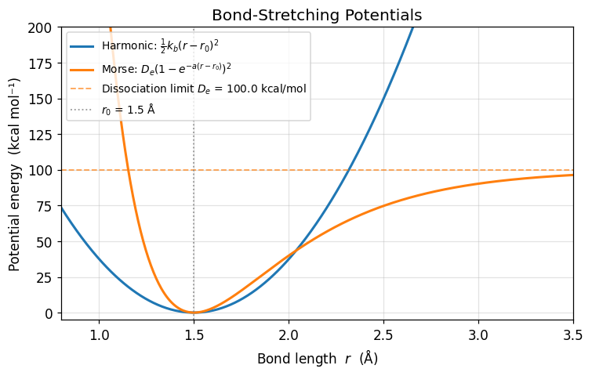
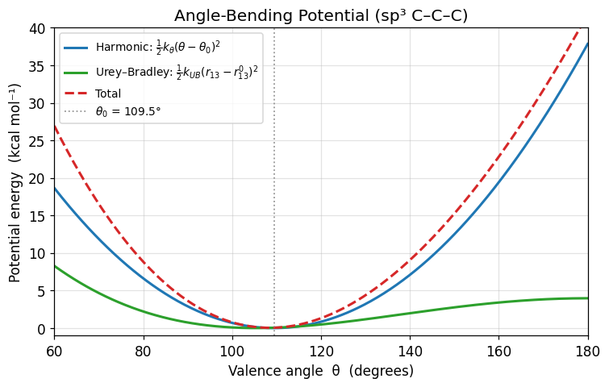
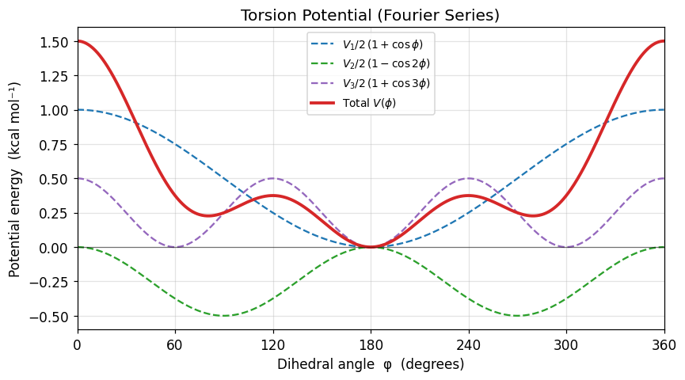
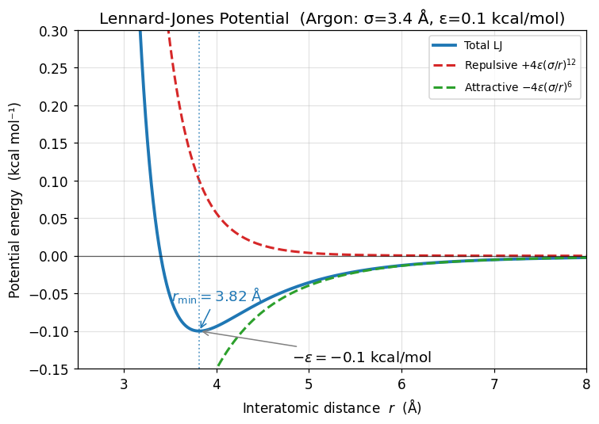
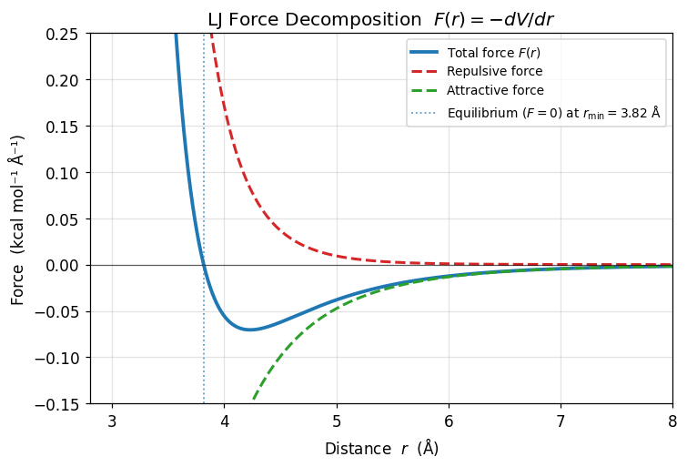
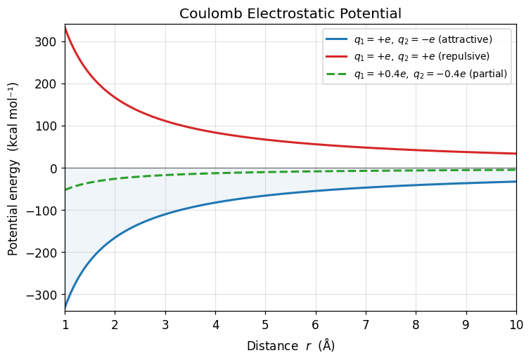
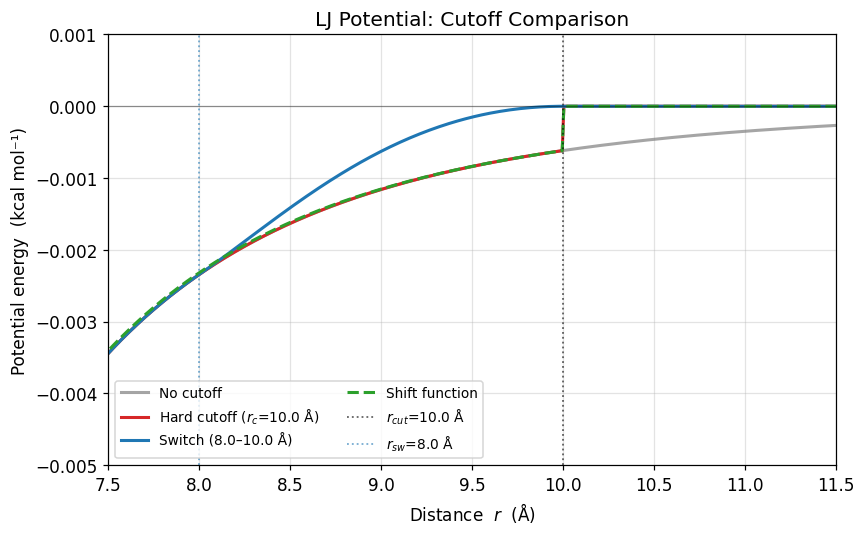
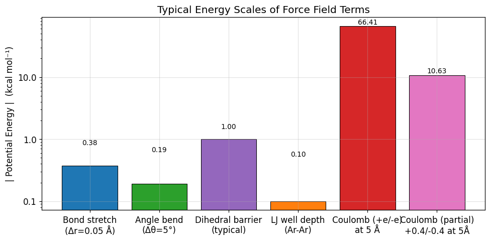
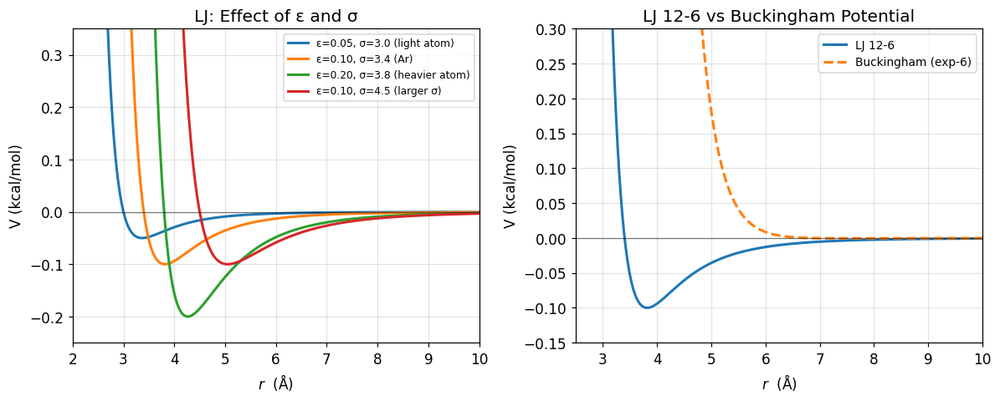

# 02 — Bonded vs. Nonbonded Interactions

[](https://colab.research.google.com/github/ppt-2/Ch121a-DFT/blob/main/Module%202%20-%20Molecular%20dynamics/notebooks/02_bonded_vs_nonbonded.ipynb)

**Ch121a — Caltech | Molecular Dynamics Module**

---

## Learning Objectives
1. Bonded (covalent-topology) interactions.
2. Harmonic and Morse bond-stretching potentials 
3. Angle-bending (harmonic + Urey–Bradley) and dihedral/torsion potentials.
4. Lennard-Jones potential in terms of repulsion, dispersion, σ, ε, and r_min.
5. Coulomb electrostatics, partial charges, and dielectric screening.
6. 1-2 / 1-3 / 1-4 exclusion rules.
7. Hard-cutoff, switching-function, and shift-function treatments of long-range interactions.


```python
# Ch121a: Molecular Dynamics — Notebook 02: Bonded vs. Nonbonded Interactions
# License: GPL-3.0 (https://www.gnu.org/licenses/gpl-3.0.en.html)

import numpy as np
import matplotlib.pyplot as plt
import matplotlib.ticker as ticker

# Global plot style
plt.rcParams.update({
    'figure.dpi': 110,
    'axes.grid': True,
    'grid.alpha': 0.35,
    'lines.linewidth': 2.0,
    'font.size': 11,
})
print('Imports OK — NumPy', np.__version__)
```

    Imports OK — NumPy 2.2.6


## 1 · Overview of Force Field Terms

A classical molecular mechanics **force field** splits the total potential energy into two classes:

$$U_{\text{total}} = U_{\text{bonded}} + U_{\text{nonbonded}}$$

| Class | Interactions | Scope |
|-------|-------------|-------|
| **Bonded** | Bond stretching, angle bending, dihedral/torsion, improper torsion | Atoms connected by covalent bonds (1-2, 1-3, 1-4) |
| **Nonbonded** | van der Waals (LJ), electrostatics (Coulomb) | All other pairs; also 1-4 with scaling |

**Key assumptions**  
* **Pairwise additive**: $U_{\text{nb}} = \sum_{i<j} u(r_{ij})$.  
  Many-body effects (polarizability, charge transfer) are folded into *effective* parameters.  
* **Fixed topology**: bond connectivity does not change during a simulation.

> **Popular force fields**: AMBER, CHARMM, GROMOS, OPLS-AA, UFF, MARTINI (coarse-grained).

## 2 · Bond Stretching

### 2a. Harmonic Potential
$$V_{\text{harm}}(r) = \tfrac{1}{2}\, k_b\,(r - r_0)^2$$

* $r_0$ — **equilibrium bond length** (e.g., 1.5 Å for C–C)
* $k_b$ — **force constant** (stiffness); units kcal mol⁻¹ Å⁻²

✅ Cheap, accurate near equilibrium.  
❌ Cannot describe bond breaking; symmetric (no anharmonicity).

### 2b. Morse Potential
$$V_{\text{Morse}}(r) = D_e\left(1 - e^{-a(r-r_0)}\right)^2$$

* $D_e$ — **dissociation energy** (well depth from minimum to dissociation limit)
* $a = \sqrt{k_b / 2 D_e}$ — **range parameter** controlling well width
* Asymptotically approaches $D_e$ as $r \to \infty$ (bond breaks)

✅ Physical dissociation; correct **anharmonicity** (asymmetric well).  
❌ More expensive; rarely used in classical MD (bond breaking needs reactive FF).

**Anharmonicity** matters for:  
* IR/Raman spectroscopy (overtone frequencies)  
* Elevated temperature simulations  
* Thermal expansion coefficients


```python
# ── Plot B: Harmonic vs. Morse bond potential ──────────────────────────────
kb   = 300.0   # kcal/mol/Ų  (C-C like)
r0   = 1.5     # Å
De   = 100.0   # kcal/mol
a    = 2.0     # Å⁻¹

r = np.linspace(0.8, 3.5, 600)

V_harm  = 0.5 * kb * (r - r0)**2
V_morse = De * (1 - np.exp(-a * (r - r0)))**2

fig, ax = plt.subplots(figsize=(7, 4.5))

ax.plot(r, V_harm,  label=r'Harmonic: $\frac{1}{2}k_b(r-r_0)^2$', color='tab:blue')
ax.plot(r, V_morse, label=r'Morse: $D_e(1-e^{-a(r-r_0)})^2$',    color='tab:orange')
ax.axhline(De, color='tab:orange', ls='--', lw=1.2, alpha=0.7, label=f'Dissociation limit $D_e$ = {De} kcal/mol')
ax.axvline(r0, color='grey', ls=':', lw=1.2, alpha=0.8, label=f'$r_0$ = {r0} Å')

ax.set_xlim(r.min(), r.max())
ax.set_ylim(-5, 200)
ax.set_xlabel('Bond length  $r$  (Å)')
ax.set_ylabel('Potential energy  (kcal mol⁻¹)')
ax.set_title('Bond-Stretching Potentials')
ax.legend(fontsize=9)
plt.tight_layout()
plt.show()
```


    

    


## 3 · Angle Bending

### Harmonic Angle Potential
$$V_{\theta}(\theta) = \tfrac{1}{2}\, k_\theta\,(\theta - \theta_0)^2$$

* $\theta_0$ — equilibrium valence angle (e.g., 109.5° for sp³ carbon)
* $k_\theta$ — bending force constant (kcal mol⁻¹ rad⁻²)

### Urey–Bradley Term (CHARMM)
$$V_{\text{UB}}(r_{13}) = \tfrac{1}{2}\, k_{\text{UB}}\,(r_{13} - r_{13}^0)^2$$

An additional harmonic spring between the **1-3 atoms** (the two end atoms of the A–B–C angle). It captures coupling between bond stretching and angle bending without explicit cross terms, improving agreement with vibrational frequencies.

> The Urey–Bradley term is important in CHARMM for reproducing IR spectra of water and proteins.


```python
# ── Plot C: Angle bending — Harmonic + Urey-Bradley ───────────────────────
k_theta = 50.0          # kcal/mol/rad²
theta0  = np.radians(109.5)   # equilibrium angle (rad)
k_UB    = 20.0          # kcal/mol/Ų  (Urey-Bradley)
r13_0   = 2.45          # Å  (1-3 distance at equilibrium, tetrahedral C-C-C)

theta_deg = np.linspace(60, 180, 500)
theta_rad = np.radians(theta_deg)

# Harmonic angle
V_angle = 0.5 * k_theta * (theta_rad - theta0)**2

# Approximate r13 via law of cosines: r13 ≈ sqrt(2)*r_bond*sqrt(1-cos θ)
# Using r_bond = 1.54 Å (C-C)
r_bond = 1.54
r13 = np.sqrt(2) * r_bond * np.sqrt(np.clip(1 - np.cos(theta_rad), 0, None))
V_UB = 0.5 * k_UB * (r13 - r13_0)**2

V_total = V_angle + V_UB

fig, ax = plt.subplots(figsize=(7, 4.5))
ax.plot(theta_deg, V_angle,  label=r'Harmonic: $\frac{1}{2}k_\theta(\theta-\theta_0)^2$', color='tab:blue')
ax.plot(theta_deg, V_UB,    label=r'Urey–Bradley: $\frac{1}{2}k_{UB}(r_{13}-r_{13}^0)^2$', color='tab:green')
ax.plot(theta_deg, V_total, label='Total', color='tab:red', ls='--')
ax.axvline(np.degrees(theta0), color='grey', ls=':', lw=1.2, alpha=0.8, label=f'$\\theta_0$ = 109.5°')

ax.set_xlabel('Valence angle  θ  (degrees)')
ax.set_ylabel('Potential energy  (kcal mol⁻¹)')
ax.set_title('Angle-Bending Potential (sp³ C–C–C)')
ax.legend(fontsize=9)
ax.set_xlim(60, 180)
ax.set_ylim(-1, 40)
plt.tight_layout()
plt.show()
```


    

    


## 4 · Dihedral / Torsion Potentials

### Proper Dihedral (Fourier series)
$$V(\phi) = \sum_{n=1}^{N} \frac{V_n}{2}\left[1 + \cos(n\phi - \delta_n)\right]$$

* $\phi$ — dihedral angle (0–360°) between the planes A-B-C and B-C-D
* $n$ — **multiplicity** (periodicity of the barrier)
* $V_n$ — **barrier height** for the n-th term (kcal/mol)
* $\delta_n$ — **phase angle** (sets the position of minima)

Physical meaning: rotation about the central bond B–C. The barrier arises from hyperconjugation, steric interactions, and lone-pair repulsion.

### Improper Dihedral
Used to **enforce planarity** of sp² groups (aromatic rings, peptide bonds, carbonyls):
$$V_{\text{imp}}(\xi) = k_{\text{imp}}(\xi - \xi_0)^2 \quad \text{or} \quad \frac{V_{\text{imp}}}{2}(1+\cos(2\xi))$$

### Ryckaert–Bellemans Form (alkanes in GROMOS)
$$V_{\text{RB}}(\phi) = \sum_{n=0}^{5} C_n \cos^n(\phi - 180°)$$

Efficient polynomial form equivalent to the Fourier series.


```python
# ── Plot D: Dihedral / torsion potential ───────────────────────────────────
V1, V2, V3 = 1.0, -0.5, 0.5   # kcal/mol  (example butane-like)

phi = np.linspace(0, 360, 720)
phi_r = np.radians(phi)

term1 = (V1 / 2) * (1 + np.cos(phi_r))
term2 = (V2 / 2) * (1 - np.cos(2 * phi_r))
term3 = (V3 / 2) * (1 + np.cos(3 * phi_r))
V_total = term1 + term2 + term3

fig, ax = plt.subplots(figsize=(8, 4.5))
ax.plot(phi, term1,   label=r'$V_1/2\,(1+\cos\phi)$',      color='tab:blue',   ls='--', lw=1.5)
ax.plot(phi, term2,   label=r'$V_2/2\,(1-\cos 2\phi)$',    color='tab:green',  ls='--', lw=1.5)
ax.plot(phi, term3,   label=r'$V_3/2\,(1+\cos 3\phi)$',    color='tab:purple', ls='--', lw=1.5)
ax.plot(phi, V_total, label='Total $V(\\phi)$',              color='tab:red',    lw=2.5)
ax.axhline(0, color='k', lw=0.8, alpha=0.5)

ax.set_xlabel('Dihedral angle  φ  (degrees)')
ax.set_ylabel('Potential energy  (kcal mol⁻¹)')
ax.set_title('Torsion Potential (Fourier Series)')
ax.set_xticks(range(0, 361, 60))
ax.legend(fontsize=9)
ax.set_xlim(0, 360)
plt.tight_layout()
plt.show()
```


    

    


## 5 · Nonbonded Interactions Overview

For all atom pairs **not** directly bonded (and some 1-4 pairs with scaling):

$$U_{\text{nonbonded}} = U_{\text{vdW}} + U_{\text{elec}}$$

**Pairwise additive approximation**:
$$U_{\text{nb}} = \sum_{i<j} \left[ u_{\text{LJ}}(r_{ij}) + u_{\text{Coulomb}}(r_{ij}) \right]$$

This is an $O(N^2)$ sum — the computational bottleneck of MD.  
Mitigations: **neighbor lists** (Verlet list), **cutoffs**, **PME/Ewald** for electrostatics.

| Property | vdW (LJ) | Electrostatics |
|----------|----------|----------------|
| Decay | $r^{-6}$ (attractive) | $r^{-1}$ |
| Range | Short (< 12 Å) | Long-range |
| Origin | Induced-dipole / exchange repulsion | Coulomb's law |
| Params | ε, σ (per atom type) | $q_i$ (per atom) |

## 6 · Lennard-Jones Potential

$$V_{\text{LJ}}(r) = 4\varepsilon\left[\left(\frac{\sigma}{r}\right)^{12} - \left(\frac{\sigma}{r}\right)^{6}\right]$$

| Parameter | Meaning |
|-----------|--------|
| $\sigma$ | **Collision diameter** — distance at which $V_{LJ}=0$ (zero crossing) |
| $\varepsilon$ | **Well depth** — magnitude of the minimum energy |
| $r_{\min} = 2^{1/6}\sigma$ | Distance at potential minimum ($V = -\varepsilon$) |

**Decomposition**:  
* **Repulsive** $+4\varepsilon(\sigma/r)^{12}$: Pauli exclusion / exchange repulsion (steeply rises as atoms overlap)  
* **Attractive** $-4\varepsilon(\sigma/r)^{6}$: London dispersion (induced-dipole interaction, $C_6/r^6$)

**Alternative A/B form**:
$$V_{\text{LJ}}(r) = \frac{A}{r^{12}} - \frac{B}{r^6}, \quad A = 4\varepsilon\sigma^{12},\; B = 4\varepsilon\sigma^6$$

> Unlike-pair parameters are usually derived via **Lorentz–Berthelot** combining rules:
> $\sigma_{ij} = (\sigma_i + \sigma_j)/2$, $\varepsilon_{ij} = \sqrt{\varepsilon_i \varepsilon_j}$.


```python
# ── Plot E: Lennard-Jones potential decomposition ──────────────────────────
eps   = 0.1    # kcal/mol  (argon ≈ 0.238 kJ/mol ≈ 0.0569 kcal/mol; using 0.1 for clarity)
sigma = 3.4    # Å  (argon)
r_min_lj = 2**(1/6) * sigma

r = np.linspace(2.5, 8.0, 800)
V_rep  =  4 * eps * (sigma / r)**12
V_att  = -4 * eps * (sigma / r)**6
V_lj   = V_rep + V_att

fig, ax = plt.subplots(figsize=(7, 5))

ax.plot(r, V_lj,  label='Total LJ',  color='tab:blue',   lw=2.5)
ax.plot(r, V_rep, label='Repulsive $+4\\varepsilon(\\sigma/r)^{12}$',  color='tab:red',    ls='--')
ax.plot(r, V_att, label='Attractive $-4\\varepsilon(\\sigma/r)^6$', color='tab:green',  ls='--')
ax.axhline(0, color='k', lw=0.8, alpha=0.6)

# Annotate minimum and sigma
ax.axvline(r_min_lj, color='tab:blue', ls=':', lw=1.2, alpha=0.7)
ax.annotate(f'$r_{{\\min}}={r_min_lj:.2f}$ Å', xy=(r_min_lj, -eps),
            xytext=(r_min_lj - 0.3, -eps + 0.04),
            arrowprops=dict(arrowstyle='->', color='tab:blue'), fontsize=12, color='tab:blue')
ax.annotate(f'$-\\varepsilon = -{eps}$ kcal/mol', xy=(r_min_lj, -eps),
            xytext=(r_min_lj + 1.0, -eps - 0.04),
            arrowprops=dict(arrowstyle='->', color='grey'), fontsize=12)

ax.set_ylim(-0.15, 0.30)
ax.set_xlim(2.5, 8.0)
ax.set_xlabel('Interatomic distance  $r$  (Å)')
ax.set_ylabel('Potential energy  (kcal mol⁻¹)')
ax.set_title(f'Lennard-Jones Potential  (Argon: σ={sigma} Å, ε={eps} kcal/mol)')
ax.legend(fontsize=9)
plt.tight_layout()
plt.show()
```


    

    


```python
# ── Plot F: LJ Force decomposition  F(r) = -dV/dr ────────────────────────
# Analytical derivatives:
#   F_rep = -d/dr [+4ε(σ/r)^12] = +48ε σ^12 / r^13
#   F_att = -d/dr [-4ε(σ/r)^6 ] = -24ε σ^6  / r^7
#   F_tot = 4ε/r * [-12(σ/r)^12 + 6(σ/r)^6]

r = np.linspace(2.8, 8.0, 800)

F_rep =  48 * eps * sigma**12 / r**13
F_att = -24 * eps * sigma**6  / r**7
F_tot = F_rep + F_att

# Zero-force (equilibrium) position
r_eq = r_min_lj   # same as r_min for LJ

fig, ax = plt.subplots(figsize=(7, 4.8))
ax.plot(r, F_tot, label='Total force $F(r)$', color='tab:blue',   lw=2.5)
ax.plot(r, F_rep, label='Repulsive force',     color='tab:red',   ls='--')
ax.plot(r, F_att, label='Attractive force',    color='tab:green', ls='--')
ax.axhline(0, color='k', lw=0.8, alpha=0.6)
ax.axvline(r_eq, color='tab:blue', ls=':', lw=1.2, alpha=0.7,
           label=f'Equilibrium ($F=0$) at $r_{{\\min}}={r_eq:.2f}$ Å')

ax.set_ylim(-0.15, 0.25)
ax.set_xlim(2.8, 8.0)
ax.set_xlabel('Distance  $r$  (Å)')
ax.set_ylabel('Force  (kcal mol⁻¹ Å⁻¹)')
ax.set_title('LJ Force Decomposition  $F(r) = -dV/dr$')
ax.legend(fontsize=9)
plt.tight_layout()
plt.show()
```


    

    


## 7 · Electrostatic Interactions

### Coulomb's Law
$$V_{\text{Coulomb}}(r) = \frac{q_i q_j}{4\pi\varepsilon_0\, r} = \frac{q_i q_j}{\varepsilon_r\, r} \cdot 332.06 \text{ kcal/mol}$$

where 332.06 kcal Å mol⁻¹ e⁻² is the conversion factor (using partial charges in units of elementary charge $e$).

**Key features**:  
* **Long-range** $\sim 1/r$ decay — much slower than LJ ($1/r^6$); requires special handling  
* **Attractive** ($q_i q_j < 0$) or **repulsive** ($q_i q_j > 0$) depending on sign of charges  

### Partial Charges
Atoms carry *partial* charges $q_i$ (not integers). Derived from:  
* QM electrostatic potential fitting (RESP, ESP)  
* Population analysis (Mulliken, NBO, Hirshfeld)  

### Dielectric Screening
In implicit-solvent models, introduce relative permittivity $\varepsilon_r$:
$$V = \frac{q_i q_j}{4\pi\varepsilon_0\,\varepsilon_r\, r}$$

Water at 300 K: $\varepsilon_r \approx 78.5$ — greatly reduces electrostatic interactions at long range.

> **Long-range problem**: For an ionic crystal, the electrostatic energy converges only conditionally. This is why **Ewald summation** (or PME) is essential in periodic boundary conditions.


```python
# ── Plot G: Coulomb potential ──────────────────────────────────────────────
# Conversion: 1 e² / Å = 332.06 kcal/mol
COULOMB = 332.06   # kcal/mol  (e units, Å)

r = np.linspace(1.0, 10.0, 800)

# Opposite charges (attractive): q1=+1e, q2=-1e
q1_opp, q2_opp = +1.0, -1.0
V_attract = COULOMB * q1_opp * q2_opp / r

# Same charges (repulsive): q1=+1e, q2=+1e
q1_rep, q2_rep = +1.0, +1.0
V_repuls  = COULOMB * q1_rep  * q2_rep  / r

# Partial charges example: +0.4e, -0.4e (like backbone C=O)
V_partial = COULOMB * 0.4 * (-0.4) / r

fig, ax = plt.subplots(figsize=(7, 4.8))
ax.plot(r, V_attract, label=r'$q_1=+e,\; q_2=-e$ (attractive)',        color='tab:blue')
ax.plot(r, V_repuls,  label=r'$q_1=+e,\; q_2=+e$ (repulsive)',         color='tab:red')
ax.plot(r, V_partial, label=r'$q_1=+0.4e,\; q_2=-0.4e$ (partial)',     color='tab:green', ls='--')
ax.axhline(0, color='k', lw=0.8, alpha=0.5)

# Annotate 1/r guide
r_ref = np.linspace(1.0, 10.0, 800)
ax.fill_between(r_ref, V_attract, 0, alpha=0.07, color='tab:blue')

ax.set_xlim(1, 10)
ax.set_ylim(-340, 340)
ax.set_xlabel('Distance  $r$  (Å)')
ax.set_ylabel('Potential energy  (kcal mol⁻¹)')
ax.set_title('Coulomb Electrostatic Potential')
ax.legend(fontsize=9)
plt.tight_layout()
plt.show()

print(f'At 5 Å, +e/-e interaction: {COULOMB * (+1) * (-1) / 5.0:.1f} kcal/mol')
```


    

    


    At 5 Å, +e/-e interaction: -66.4 kcal/mol


## 8 · Exclusion Rules (1-2, 1-3, 1-4)

Nonbonded terms are **excluded or scaled** for closely bonded atoms because:
1. The bonded terms already capture covalent geometry at short range.
2. The LJ repulsive wall would be nonphysically huge for directly bonded atoms.

| Pair type | Separation | LJ | Electrostatic |
|-----------|-----------|-----|---------------|
| **1-2** | Directly bonded | **0** (excluded) | **0** (excluded) |
| **1-3** | Two bonds apart | **0** (excluded) | **0** (excluded) |
| **1-4** | Three bonds apart | **scaled** (e.g., 0.5 in OPLS) | **scaled** (e.g., 0.5 in OPLS) |
| **1-5+** | All others | Full | Full |

Different force fields use different 1-4 scaling factors:  
* **AMBER**: 1/1.2 (LJ) and 1/1.2 (elec)  
* **OPLS-AA**: 0.5 for both LJ and elec  
* **CHARMM**: 1.0 for LJ (adjusted ε), 1.0 for elec
* _Though we are still discussing class-II nonreactive force-fields, in reactive (e.g. **ReaxFF, RexPoN**) FFs, exclusions are handled with pairwise bond-order cutoffs (quite dynamic!)_

### Neighbor List (Verlet List)
To avoid re-evaluating all $O(N^2)$ pairs at each step, atoms within a **skin distance** ($r_{\text{cut}} + \delta$) are cached. The list is rebuilt every ~20 steps.


```python
# ── Code H: 1-2 / 1-3 / 1-4 exclusion rules demo ─────────────────────────
# Simple propane topology:  C1 - C2 - C3
#   atoms: 0=C1, 1=C2, 2=C3
#   (hydrogen atoms omitted for clarity)

atoms = ['C1', 'C2', 'C3']
bonds = [(0, 1), (1, 2)]   # 1-2 pairs (directly bonded)

def find_pairs_up_to_14(atoms, bonds):
    """Classify all unique atom pairs for a linear chain topology."""
    n = len(atoms)
    # Build adjacency
    from collections import defaultdict, deque
    adj = defaultdict(set)
    for (i, j) in bonds:
        adj[i].add(j); adj[j].add(i)

    def shortest_path(src, dst):
        if src == dst: return 0
        visited = {src: 0}
        q = deque([src])
        while q:
            node = q.popleft()
            for nb in adj[node]:
                if nb not in visited:
                    visited[nb] = visited[node] + 1
                    if nb == dst: return visited[nb]
                    q.append(nb)
        return float('inf')

    rows = []
    for i in range(n):
        for j in range(i + 1, n):
            sep = shortest_path(i, j)
            if   sep == 1: label, lj_scale, q_scale = '1-2', 0.0, 0.0
            elif sep == 2: label, lj_scale, q_scale = '1-3', 0.0, 0.0
            elif sep == 3: label, lj_scale, q_scale = '1-4', 0.5, 0.5
            else:          label, lj_scale, q_scale = '1-5+',1.0, 1.0
            rows.append((atoms[i], atoms[j], label, lj_scale, q_scale))
    return rows

pairs = find_pairs_up_to_14(atoms, bonds)

print(f"{'Pair':<12} {'Type':<6} {'LJ scale':>10} {'Elec scale':>12}")
print('-' * 44)
for (a, b, lbl, lj, q) in pairs:
    print(f'{a+"-"+b:<12} {lbl:<6} {lj:>10.1f} {q:>12.1f}')
```

    Pair         Type     LJ scale   Elec scale
    --------------------------------------------
    C1-C2        1-2           0.0          0.0
    C1-C3        1-3           0.0          0.0
    C2-C3        1-2           0.0          0.0


## 9 · Cutoff Methods for Nonbonded Interactions

Computing all $O(N^2)$ pairs is prohibitive for large systems. Common strategies:

### 1. Hard Cutoff
$$V(r) = \begin{cases} V_{\text{LJ}}(r) & r < r_{\text{cut}} \\ 0 & r \ge r_{\text{cut}} \end{cases}$$
⚠️ Discontinuity in $V$ and $F$ at $r_{\text{cut}}$ → energy drift, artifacts in dynamics.

### 2. Switching Function
Smoothly scales $V$ to zero between $r_{\text{sw}}$ and $r_{\text{cut}}$:
$$V_{\text{sw}}(r) = V(r) \cdot S(r), \quad S(r) = \frac{(r_{\text{cut}}^2 - r^2)^2(r_{\text{cut}}^2 + 2r^2 - 3r_{\text{sw}}^2)}{(r_{\text{cut}}^2 - r_{\text{sw}}^2)^3}$$
✅ Continuous forces; minimal artifact.

### 3. Shift Function
$$V_{\text{shift}}(r) = V(r) - V(r_{\text{cut}}) \cdot \left(1 - \frac{r}{r_{\text{cut}}}\right)^2$$
Shifts the entire potential so $V(r_{\text{cut}})=0$ — useful for NVT simulations.

### 4. Ewald Summation / PME
For **electrostatics** with PBC: splits $1/r$ into a short-range real-space sum and a long-range reciprocal-space sum. Particle Mesh Ewald (PME) scales as $O(N \log N)$.


```python
# ── Plot I: LJ with hard cutoff, switching, and shift functions ────────────
eps_i, sigma_i = 0.1, 3.4   # same argon parameters
r_cut = 10.0    # Å
r_sw  =  8.0    # Å  (switching starts here)

r = np.linspace(2.5, 11.5, 1000)

def V_lj_func(r, eps, sigma):
    return 4 * eps * ((sigma / r)**12 - (sigma / r)**6)

V_full = V_lj_func(r, eps_i, sigma_i)

# 1) No cutoff
V_nocutoff = V_full.copy()

# 2) Hard cutoff
V_hard = np.where(r < r_cut, V_full, 0.0)

# 3) Switching function (CHARMM-style)
def switching(r, r_sw, r_cut):
    S = np.ones_like(r)
    mask = (r >= r_sw) & (r < r_cut)
    rm, rc = r_sw**2, r_cut**2
    ri = r[mask]**2
    S[mask] = (rc - ri)**2 * (rc + 2*ri - 3*rm) / (rc - rm)**3
    S[r >= r_cut] = 0.0
    return S

S   = switching(r, r_sw, r_cut)
V_sw = V_full * S

# 4) Shift function
V_at_rcut = V_lj_func(np.array([r_cut]), eps_i, sigma_i)[0]
V_shift = np.where(r < r_cut,
                   V_full - V_at_rcut * (1 - r / r_cut)**2,
                   0.0)

fig, ax = plt.subplots(figsize=(8, 5))
ax.plot(r, V_nocutoff, label='No cutoff',                  color='tab:grey',   lw=2.0, alpha=0.7)
ax.plot(r, V_hard,     label=f'Hard cutoff ($r_c$={r_cut} Å)',   color='tab:red',    lw=2.0)
ax.plot(r, V_sw,       label=f'Switch ({r_sw}–{r_cut} Å)', color='tab:blue',   lw=2.0)
ax.plot(r, V_shift,    label='Shift function',              color='tab:green',  lw=2.0, ls='--')

ax.axvline(r_cut, color='k',       ls=':',  lw=1.2, alpha=0.6, label=f'$r_{{cut}}$={r_cut} Å')
ax.axvline(r_sw,  color='tab:blue',ls=':',  lw=1.2, alpha=0.6, label=f'$r_{{sw}}$={r_sw} Å')
ax.axhline(0,     color='k',       lw=0.8,  alpha=0.4)

ax.set_xlim(7.5, 11.5)
ax.set_ylim(-0.0050, 0.001)
ax.set_xlabel('Distance  $r$  (Å)')
ax.set_ylabel('Potential energy  (kcal mol⁻¹)')
ax.set_title('LJ Potential: Cutoff Comparison')
ax.legend(fontsize=9, ncol=2)
plt.tight_layout()
plt.show()
```


    

    


## 10 · Putting It Together — Energy Scale Comparison

The plots below give a side-by-side visual summary of **typical energy scales** for all force field terms at physiologically relevant geometries.

Key takeaways from the magnitudes:
* **Bond stretching**: very stiff ($\sim$300 kcal/mol/Ų) — vibrations are fast (10–100 fs)
* **Angle bending**: ~10× softer than bonds
* **Dihedral**: barriers typically 0.1–5 kcal/mol — slow (ps–ns timescales)
* **LJ well depth**: ~0.1 kcal/mol per pair (van der Waals is weak but additive)
* **Coulomb** at 5 Å between unit charges: ~66 kcal/mol — often dominant in biomolecules


```python
# ── Summary: Energy scale comparison bar chart ─────────────────────────────
labels = [
    'Bond stretch\n(Δr=0.05 Å)',
    'Angle bend\n(Δθ=5°)',
    'Dihedral barrier\n(typical)',
    'LJ well depth\n(Ar-Ar)',
    'Coulomb (+e/-e)\nat 5 Å',
    'Coulomb (partial)\n+0.4/-0.4 at 5Å',
]

# Compute representative values
E_bond    = 0.5 * 300.0 * (0.05)**2                    # kcal/mol
E_angle   = 0.5 * 50.0  * np.radians(5.0)**2           # kcal/mol
E_dih     = 1.0                                         # kcal/mol (V1 barrier)
E_lj      = 0.1                                         # kcal/mol (ε for Ar)
E_coul_e  = abs(COULOMB * (+1) * (-1) / 5.0)           # kcal/mol
E_coul_p  = abs(COULOMB * 0.4 * (-0.4) / 5.0)         # kcal/mol

energies = [E_bond, E_angle, E_dih, E_lj, E_coul_e, E_coul_p]
colors   = ['tab:blue','tab:green','tab:purple','tab:orange','tab:red','tab:pink']

fig, ax = plt.subplots(figsize=(9, 4.5))
bars = ax.bar(labels, energies, color=colors, edgecolor='black', linewidth=0.7)

for bar, val in zip(bars, energies):
    ax.text(bar.get_x() + bar.get_width()/2, bar.get_height() + 0.4,
            f'{val:.2f}', ha='center', va='bottom', fontsize=9)

ax.set_ylabel('| Potential Energy |  (kcal mol⁻¹)')
ax.set_title('Typical Energy Scales of Force Field Terms')
ax.set_yscale('log')
ax.yaxis.set_major_formatter(ticker.ScalarFormatter())
plt.tight_layout()
plt.show()
```


    

    


## Summary / Key Takeaways

| Interaction | Form | Key parameters | Typical range |
|---|---|---|---|
| Bond stretch | Harmonic / Morse | $k_b$, $r_0$; $D_e$, $a$ | ~300 kcal/mol/Ų |
| Angle bend | Harmonic + UB | $k_\theta$, $\theta_0$ | ~50 kcal/mol/rad² |
| Proper dihedral | Fourier series | $V_n$, $n$, $\delta$ | 0.1–5 kcal/mol |
| Improper dihedral | Harmonic / cosine | $k_{\text{imp}}$, $\xi_0$ | enforces planarity |
| LJ (vdW) | $4\varepsilon[(\sigma/r)^{12}-(\sigma/r)^6]$ | $\varepsilon$, $\sigma$ | short-range |
| Coulomb | $q_i q_j / (4\pi\varepsilon_0 r)$ | $q_i$ | long-range (PME) |

**Critical design rules**:  
* Exclude 1-2 and 1-3 nonbonded pairs; scale 1-4 pairs.  
* Use a **switching function** or **PME** rather than a hard cutoff.  
* The $r^{-12}$ repulsion is purely empirical (computational convenience); $r^{-6}$ attraction is physically motivated.  
* Force field parameters are **not transferable** between different force fields without re-validation.


```python
# ── Bonus: LJ parameter sensitivity — vary ε and σ ────────────────────────
r = np.linspace(2.0, 10.0, 800)

params = [
    (0.05,  3.0, 'ε=0.05, σ=3.0 (light atom)'),
    (0.10,  3.4, 'ε=0.10, σ=3.4 (Ar)'),
    (0.20,  3.8, 'ε=0.20, σ=3.8 (heavier atom)'),
    (0.10,  4.5, 'ε=0.10, σ=4.5 (larger σ)'),
]

fig, axes = plt.subplots(1, 2, figsize=(11, 4.5))

for (ep, sg, lbl) in params:
    v = 4 * ep * ((sg/r)**12 - (sg/r)**6)
    axes[0].plot(r, v, label=lbl)

axes[0].axhline(0, color='k', lw=0.8, alpha=0.5)
axes[0].set_ylim(-0.25, 0.35)
axes[0].set_xlim(2.0, 10.0)
axes[0].set_xlabel('$r$  (Å)'); axes[0].set_ylabel('V (kcal/mol)')
axes[0].set_title('LJ: Effect of ε and σ'); axes[0].legend(fontsize=8)

# Right panel: LJ vs Buckingham (exp-6) comparison
ep_b, sg_b, A_exp, rho_exp, C6 = 0.1, 3.4, 3e5, 0.35, 100.0
V_lj_b  = 4*ep_b*((sg_b/r)**12 - (sg_b/r)**6)
V_buck  = A_exp * np.exp(-r / rho_exp) - C6 / r**6
V_buck  = np.where(r > 2.5, V_buck, np.nan)   # avoid blow-up

axes[1].plot(r, V_lj_b, label='LJ 12-6', color='tab:blue', lw=2)
axes[1].plot(r, V_buck, label='Buckingham (exp-6)', color='tab:orange', lw=2, ls='--')
axes[1].axhline(0, color='k', lw=0.8, alpha=0.5)
axes[1].set_ylim(-0.15, 0.30)
axes[1].set_xlim(2.5, 10.0)
axes[1].set_xlabel('$r$  (Å)'); axes[1].set_ylabel('V (kcal/mol)')
axes[1].set_title('LJ 12-6 vs Buckingham Potential')
axes[1].legend(fontsize=9)

plt.tight_layout()
plt.show()
```


    

    


## References

1. **Frenkel & Smit** — *Understanding Molecular Simulation* (2nd ed.), Academic Press, 2002.  
   Chapters 2–4: Force fields, LJ fluid, Ewald summation.

2. **Allen & Tildesley** — *Computer Simulation of Liquids* (2nd ed.), Oxford University Press, 2017.  
   Chapter 2: Intermolecular forces.

3. **MacKerell *et al.*** — *All-Atom Empirical Potential for Molecular Modeling and Dynamics Studies of Proteins*, J. Phys. Chem. B **102**, 3586 (1998). CHARMM27 force field.

4. **Cornell *et al.*** — *A Second Generation Force Field for the Simulation of Proteins, Nucleic Acids, and Organic Molecules*, J. Am. Chem. Soc. **117**, 5179 (1995). AMBER ff94.

5. **Jorgensen *et al.*** — *Development and Testing of the OPLS All-Atom Force Field on Conformational Energetics and Properties of Organic Liquids*, J. Am. Chem. Soc. **118**, 11225 (1996).

6. **Essmann *et al.*** — *A Smooth Particle Mesh Ewald Method*, J. Chem. Phys. **103**, 8577 (1995).

7. **Morse** — *Diatomic Molecules According to the Wave Mechanics. II. Vibrational Levels*, Phys. Rev. **34**, 57 (1929).
