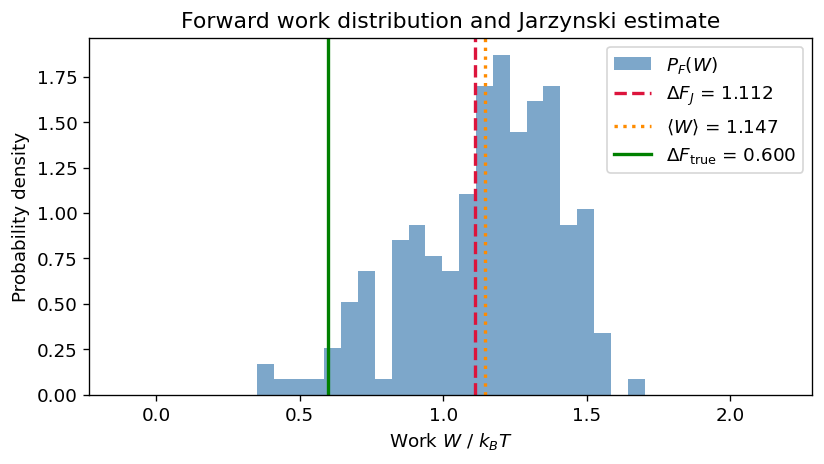
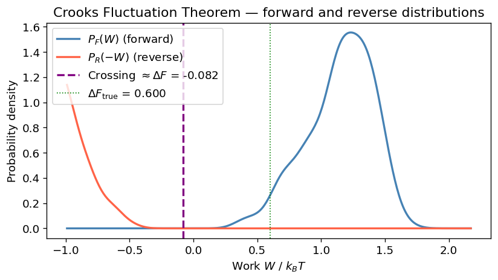
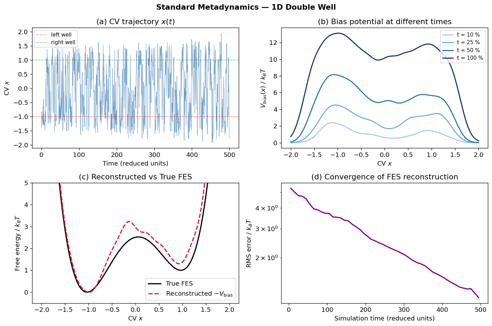
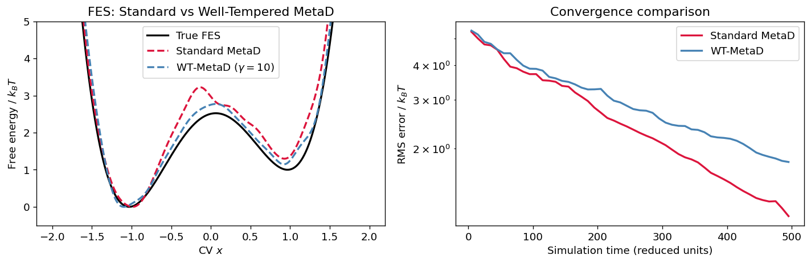
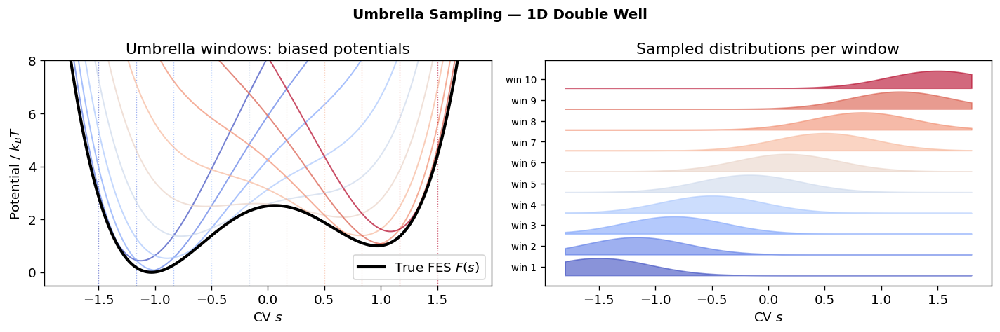
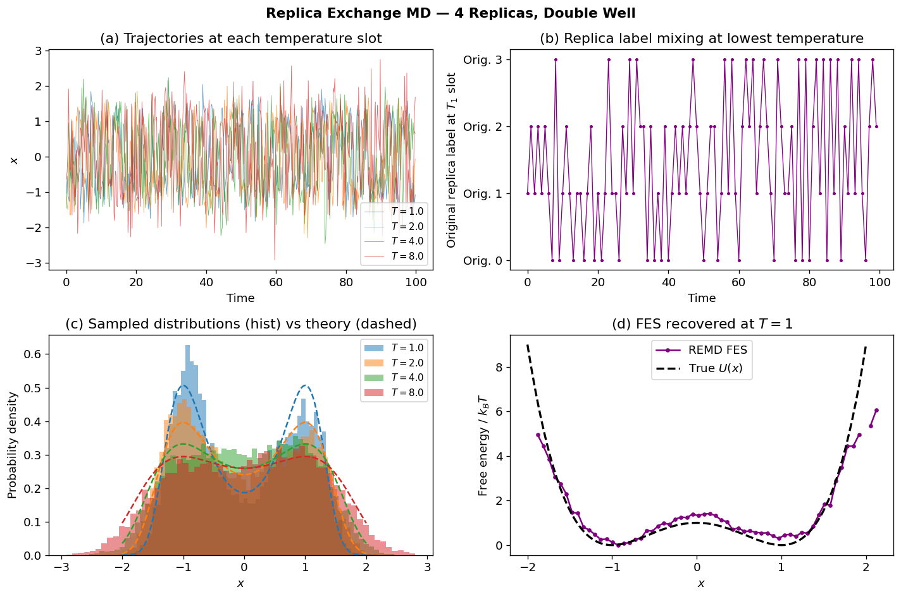

# 05 — Non-Equilibrium MD & Metadynamics

[](https://colab.research.google.com/github/ppt-2/Ch121a-DFT/blob/main/Module%202%20-%20Molecular%20dynamics/notebooks/05_nonequilibrium_md_metadynamics.ipynb)


## Learning Objectives
1. Non-equilibrium MD (NEMD) simulations.
2. Linear response theory and Green-Kubo relations.
3. Steered MD (SMD) and compute work along a pulling trajectory.
4. Jarzynski equality and Crooks fluctuation theorem to extract free energies from NEMD.
5. Why enhanced sampling is necessary and what are the available strategies?
6. Standard and well-tempered metadynamics in 1D.
7. Umbrella sampling and WHAM/MBAR post-processing.
8. A toy replica-exchange MD (REMD) simulation.


```python
# Ch121a: Molecular Dynamics — Notebook 05: Non-Equilibrium MD & Metadynamics
# License: GPL-3.0 (https://www.gnu.org/licenses/gpl-3.0.en.html)

import numpy as np
import matplotlib.pyplot as plt
import matplotlib.gridspec as gridspec
from scipy.stats import gaussian_kde
from scipy.integrate import quad
from scipy.optimize import minimize_scalar

rng = np.random.default_rng(42)
plt.rcParams.update({'figure.dpi': 120, 'font.size': 11})

```

---
## Section 1: Non-Equilibrium MD (NEMD)


### 1.1 Introduction to NEMD

Non-equilibrium MD intentionally drives the system away from equilibrium using an external perturbation and monitors the response. Three major classes:

| Class | Description | Example |
|---|---|---|
| (a) Driven steady-state | Constant perturbation → non-equilibrium steady state | Couette shear flow, electric field |
| (b) Transient | Force suddenly switched; monitor relaxation | Step perturbation, thermal quench |
| (c) Free-energy from pulling | Time-dependent force along reaction coordinate | Steered MD (SMD), constant-force pulling |

**Why NEMD?**

- Transport coefficients (viscosity $\eta$, thermal conductivity $\kappa$, diffusivity $D$) are hard to compute accurately from equilibrium fluctuations alone.
- SMD provides direct access to free energy differences along a chosen reaction coordinate.
- Response functions connect the *perturbation* to the *observable*, linking NEMD to equilibrium correlation functions.


### 1.2 Linear Response Theory & Green-Kubo Relations

For a system subject to a small step perturbation $F_{\text{ext}}$ (switched on at $t=0$) that couples to observable $A$, linear response theory predicts:

$$\langle \delta A(t) \rangle = \beta F_{\text{ext}} \int_0^t \langle A(0)\,\dot{A}(s) \rangle_{\text{eq}}\, ds$$

In the long-time (steady-state) limit, the **Green-Kubo** relation gives the transport coefficient $L$ as:

$$L = \int_0^\infty \langle A(0)\,A(t) \rangle_{\text{eq}}\, dt$$

**Examples:**

| Coefficient | Green-Kubo Integral |
|---|---|
| Shear viscosity $\eta$ | $\dfrac{V}{k_B T} \displaystyle\int_0^\infty \langle P_{xz}(0)\,P_{xz}(t)\rangle\,dt$ |
| Thermal conductivity $\kappa$ | $\dfrac{V}{k_B T^2} \displaystyle\int_0^\infty \langle J_x^Q(0)\,J_x^Q(t)\rangle\,dt$ |
| Self-diffusion $D$ | $\dfrac{1}{3} \displaystyle\int_0^\infty \langle \mathbf{v}(0)\cdot\mathbf{v}(t)\rangle\,dt$ |

Green-Kubo connects equilibrium fluctuations to dissipative transport — a central result of non-equilibrium statistical mechanics.


### 1.3 Steered Molecular Dynamics (SMD)

In SMD a time-dependent external force is applied along a chosen **reaction coordinate** $x$:

$$F_{\text{ext}}(t) = k_{\text{spring}}\bigl(v_{\text{pull}}\,t - x(t)\bigr)$$

This mimics an AFM tip or optical trap attached to the molecule via a harmonic spring moving at constant velocity $v_{\text{pull}}$.

**Work done on the system:**

$$W = \int_0^\tau F_{\text{ext}}(t)\,\dot{x}\,dt$$

**Two variants:**

| Variant | Control parameter | Measured quantity |
|---|---|---|
| Constant velocity | $v_{\text{pull}}$ | Force vs extension |
| Constant force | $F_{\text{ext}} = \text{const}$ | Extension vs time |

**Applications:** protein unfolding (titin, GFP), ligand unbinding ($k_{\text{off}}$), membrane permeation free energies, SMFS (single-molecule force spectroscopy).


### 1.4 Jarzynski Equality

Jarzynski (1997) proved that the **exact** free energy difference between two equilibrium states A and B can be recovered from an *ensemble* of non-equilibrium work measurements:

$$\boxed{\bigl\langle e^{-W/k_BT}\bigr\rangle = e^{-\Delta F/k_BT}}$$

**Derivation sketch:**

1. Start from a canonical ensemble (state A, Hamiltonian $H_A$).
2. Switch to Hamiltonian $H_B$ via protocol $\lambda(t)$, $0 \le t \le \tau$.
3. Work $W = H_B(\Gamma_\tau) - H_A(\Gamma_0)$ evaluated along each trajectory.
4. Average over all initial conditions drawn from $e^{-\beta H_A}/Z_A$ and all realizations of the dynamics.

**Key implications:**

- **Second law** follows as a corollary via Jensen's inequality: $\langle W \rangle \ge \Delta F$ (with equality only for quasi-static processes).
- **Caveats:** rare, low-dissipation trajectories dominate the exponential average. Many realizations are needed for convergence, especially when dissipation $\langle W \rangle - \Delta F \gg k_BT$.
- **Statistical estimator:**

$$\Delta F_J = -k_BT \ln \frac{1}{N}\sum_{i=1}^{N} e^{-W_i/k_BT}$$


### 1.5 Crooks Fluctuation Theorem (CFT)

Crooks (1999) derived a more powerful relation connecting the **forward** ($F$: A→B) and **reverse** ($R$: B→A) work distributions:

$$\boxed{\frac{P_F(W)}{P_R(-W)} = e^{(W-\Delta F)/k_BT}}$$

**Crossing-point method:** At $W = \Delta F$:

$$P_F(\Delta F) = P_R(-\Delta F)$$

The two distributions cross exactly at $W = \Delta F$, giving a direct graphical estimate.

**Bennett Acceptance Ratio (BAR):** Uses all work values optimally:

$$\Delta F_{\text{BAR}} = k_BT \ln\frac{\langle f(\Delta F_{\text{BAR}} - W_F) \rangle_F}{\langle f(W_R - \Delta F_{\text{BAR}}) \rangle_R}$$

where $f(x) = 1/(1+e^{x/k_BT})$ is the Fermi function. Solved self-consistently.

**Advantages over Jarzynski:**
- Uses both forward *and* reverse trajectories → lower variance.
- More robust when dissipation is large.
- Jarzynski equality is recovered by integrating CFT over $W$.


```python
# --- Potential energy and gradient ---
def U_pull(x):
    """Slightly asymmetric double-well (reduced units, k_BT=1)."""
    return (x**2 - 1)**2 + 0.3 * x

def dU_pull_dx(x):
    return 4.0 * x * (x**2 - 1) + 0.3

# --- Parameters ---
kBT     = 1.0    # thermal energy
gamma   = 1.0    # friction coefficient
dt      = 0.01   # time step
N_steps = 200    # steps per trajectory
N_traj  = 200    # number of trajectories
k_pull  = 0.5    # spring constant
v_pull  = 0.2    # pulling velocity (reduced units)

noise_std = np.sqrt(2.0 * kBT * gamma * dt)  # fluctuation-dissipation theorem

def run_pulling(x0, forward=True, seed=0):
    """Run one SMD trajectory; forward=True: left→right, False: right→left.
    Returns accumulated work W.
    """
    local_rng = np.random.default_rng(seed)
    x    = x0
    W    = 0.0
    sign = 1.0 if forward else -1.0
    for step in range(N_steps):
        t        = step * dt
        anchor   = sign * v_pull * t
        F_spring = k_pull * (anchor - x)
        # Overdamped Langevin step
        dx = ((-dU_pull_dx(x) + F_spring) / gamma) * dt \
             + noise_std * local_rng.standard_normal()
        W += F_spring * dx   # incremental work done by spring
        x += dx
    return W

# --- Run forward (left→right) and reverse (right→left) pulling ---
x_left  = -1.0
x_right =  1.0

W_forward = np.array([run_pulling(x_left,  forward=True,  seed=i)         for i in range(N_traj)])
W_reverse = np.array([run_pulling(x_right, forward=False, seed=i+N_traj)  for i in range(N_traj)])

print(f"Forward work:  mean = {W_forward.mean():.3f} k_BT,  std = {W_forward.std():.3f} k_BT")
print(f"Reverse work:  mean = {W_reverse.mean():.3f} k_BT,  std = {W_reverse.std():.3f} k_BT")

```

    Forward work:  mean = 1.147 k_BT,  std = 0.256 k_BT
    Reverse work:  mean = 1.162 k_BT,  std = 0.223 k_BT


```python
# --- Jarzynski free energy estimate ---
def jarzynski(W, kBT=1.0):
    """Numerically stable Jarzynski estimator using log-sum-exp trick."""
    exponents = -W / kBT
    max_exp   = exponents.max()
    return -kBT * (np.log(np.mean(np.exp(exponents - max_exp))) + max_exp)

dF_J   = jarzynski(W_forward)
dF_avg = W_forward.mean()

# True ΔF from potential minima
res_left  = minimize_scalar(U_pull, bounds=(-1.5, -0.5), method='bounded')
res_right = minimize_scalar(U_pull, bounds=( 0.5,  1.5), method='bounded')
dF_true   = res_right.fun - res_left.fun

print("┌──────────────────────────────────────────┐")
print("│   Free energy comparison  (k_BT units)   │")
print("├──────────────────────────────────────────┤")
print(f"│  ΔF_Jarzynski  = {dF_J:+.4f}                  │")
print(f"│  ⟨W⟩           = {dF_avg:+.4f}                  │")
print(f"│  ΔF_true       = {dF_true:+.4f}                  │")
print(f"│  Dissipation   = {dF_avg - dF_true:+.4f}                  │")
print("└──────────────────────────────────────────┘")

fig, ax = plt.subplots(figsize=(7, 4))
bins = np.linspace(W_forward.min() - 0.5, W_forward.max() + 0.5, 40)
ax.hist(W_forward, bins=bins, density=True, alpha=0.7, color='steelblue', label='$P_F(W)$')
ax.axvline(dF_J,    color='crimson',   lw=2, linestyle='--', label=f'$\\Delta F_J$ = {dF_J:.3f}')
ax.axvline(dF_avg,  color='darkorange', lw=2, linestyle=':',  label=f'$\\langle W \\rangle$ = {dF_avg:.3f}')
ax.axvline(dF_true, color='green',     lw=2, linestyle='-',  label=f'$\\Delta F_{{\\rm true}}$ = {dF_true:.3f}')
ax.set_xlabel('Work $W$ / $k_BT$')
ax.set_ylabel('Probability density')
ax.set_title('Forward work distribution and Jarzynski estimate')
ax.legend()
plt.tight_layout()
plt.show()

```

    ┌──────────────────────────────────────────┐
    │   Free energy comparison  (k_BT units)   │
    ├──────────────────────────────────────────┤
    │  ΔF_Jarzynski  = +1.1123                  │
    │  ⟨W⟩           = +1.1469                  │
    │  ΔF_true       = +0.5996                  │
    │  Dissipation   = +0.5473                  │
    └──────────────────────────────────────────┘


    

    


```python
# --- Crooks Fluctuation Theorem: forward vs reverse distributions ---
fig, ax = plt.subplots(figsize=(7, 4))

w_min  = min(W_forward.min(), -W_reverse.min()) - 0.5
w_max  = max(W_forward.max(), -W_reverse.max()) + 0.5
w_grid = np.linspace(w_min, w_max, 400)

kde_F = gaussian_kde(W_forward,  bw_method='scott')
kde_R = gaussian_kde(-W_reverse, bw_method='scott')   # P_R(-W) on same axis

ax.plot(w_grid, kde_F(w_grid), color='steelblue', lw=2, label='$P_F(W)$ (forward)')
ax.plot(w_grid, kde_R(w_grid), color='tomato',    lw=2, label='$P_R(-W)$ (reverse)')

# Locate crossing point numerically
diff         = kde_F(w_grid) - kde_R(w_grid)
sign_changes = np.where(np.diff(np.sign(diff)))[0]
if len(sign_changes) > 0:
    idx       = sign_changes[len(sign_changes) // 2]
    dF_cross  = 0.5 * (w_grid[idx] + w_grid[idx + 1])
else:
    dF_cross  = dF_J

ax.axvline(dF_cross, color='purple', lw=2, linestyle='--',
           label=f'Crossing $\\approx \\Delta F$ = {dF_cross:.3f}')
ax.axvline(dF_true,  color='green',  lw=1, linestyle=':',
           label=f'$\\Delta F_{{\\rm true}}$ = {dF_true:.3f}')
ax.set_xlabel('Work $W$ / $k_BT$')
ax.set_ylabel('Probability density')
ax.set_title('Crooks Fluctuation Theorem — forward and reverse distributions')
ax.legend()
plt.tight_layout()
plt.show()

print(f"CFT crossing estimate: ΔF ≈ {dF_cross:.4f} k_BT")
print(f"True ΔF:               ΔF  = {dF_true:.4f} k_BT")

```


    

    


    CFT crossing estimate: ΔF ≈ -0.0818 k_BT
    True ΔF:               ΔF  = 0.5996 k_BT


---
## Section 2: Enhanced Sampling & Free Energy Methods


### 2.1 The Sampling Problem

Many processes of biological and chemical interest involve crossing **high free-energy barriers**. Standard MD gets stuck in the lowest free-energy minimum and never observes the transition.

**Timescale estimate (Arrhenius / Kramers):**

$$\tau \propto \exp\!\left(\frac{\Delta F}{k_BT}\right)$$

| Barrier $\Delta F$ | Relative escape time |
|---|---|
| 5 $k_BT$ | $\sim 150$ |
| 10 $k_BT$ | $\sim 22{,}000$ |
| 20 $k_BT$ | $\sim 5\times10^8$ |

For a barrier of 20 $k_BT$, a simulation running at 1 fs steps would need $\sim 500\,\text{M}$ steps just to observe a *single* crossing — computationally infeasible.

**Enhanced sampling strategies:**

| Category | Methods |
|---|---|
| (1) Collective variable biasing | Metadynamics, Umbrella Sampling (US), ABF, TAMD |
| (2) Temperature-based | REMD, H-REX, simulated tempering |
| (3) Path methods | Transition path sampling (TPS), string method |
| (4) Machine learning | Neural-network CVs, RAVE, DeepTICA |


### 2.2 Free Energy Surface (FES) and PMF

Given a collective variable (CV) $s$, the **free energy surface** is:

$$F(s) = -k_BT \ln P(s) + \text{const}$$

where $P(s)$ is the equilibrium probability density of observing value $s$.

The FES is also called the **potential of mean force (PMF)** because:

$$-\frac{\partial F(s)}{\partial s} = \left\langle -\frac{\partial U}{\partial s}\right\rangle_s$$

is the mean force at fixed $s$.

**Topography of the FES:**
- **Minima** = metastable states (long-lived configurations)
- **Saddle points** = transition states
- **Barrier height** $\Delta F^\ddagger$ controls the rate via Kramers' theory

The goal of enhanced sampling is to recover $F(s)$ efficiently despite high barriers.


### 2.3 Solvation Free Energy via Free Energy Perturbation (FEP) in LAMMPS

The **solvation free energy** ($\Delta G_{\mathrm{solv}}$) measures the reversible work to transfer a molecule from gas phase into water. In an alchemical FEP setup, this is computed by gradually turning off (or on) solute interactions with the solvent across a coupling parameter $\lambda\in[0,1]$.

For hydration in water:

$$\Delta G_{\mathrm{hyd}} = -k_BT\ln\left\langle e^{-\beta( U_{\lambda+\Delta\lambda}-U_{\lambda})}\right\rangle_{\lambda},\qquad \Delta G_{\mathrm{solv}}=\sum_{\lambda}\Delta G_{\lambda\to\lambda+\Delta\lambda}$$

A practical protocol is to decouple in two stages:
1. **Electrostatics decoupling** ($q\to 0$) over several $\lambda$ windows.
2. **van der Waals decoupling** ($\epsilon\to 0$) with a soft-core treatment to avoid endpoint singularities.

#### Example setup outline (CO$_2$ and HCO$_3^-$ in water)

1. Build two solvated systems (same water model and box protocol):
   - water + one **CO$_2$** molecule
   - water + one **HCO$_3^-$** ion
2. Equilibrate each system (NPT then NVT).
3. Define a $\lambda$ schedule (e.g., 0.0, 0.05, ..., 1.0) and run independent windows.
4. In each window, sample $\Delta U$ between adjacent $\lambda$ states using FEP computes, then integrate/sum to get $\Delta G$.
5. For **HCO$_3^-$** (charged solute), include standard finite-size/electrostatic corrections and keep the treatment consistent across all windows.

Illustrative LAMMPS input skeleton (adapt pair styles/force-field terms to your model):

```lammps
units real
atom_style full
read_data co2_water.data   # or hco3_water.data

pair_style lj/cut/coul/long 10.0
kspace_style pppm 1e-4

# define lambda for this window
variable lam equal 0.30

# alchemical scaling for selected solute type(s)
# (use your LAMMPS FEP workflow: compute fep / adapt-fep style commands)
# compute cFEP all fep ...

fix nvt_all all nvt temp 298.15 298.15 100.0
timestep 1.0
run 200000

# collect <exp(-beta*DeltaU)> or DeltaU statistics per window
```

Post-process all windows with BAR/MBAR for improved numerical efficiency versus direct exponential averaging, and report uncertainty from block averaging or bootstrap across windows.


---
## Section 3: Metadynamics


### 3.1 Collective Variables (CVs)

A collective variable (CV) $s = f(\mathbf{r}_1, \ldots, \mathbf{r}_N)$ is a low-dimensional function of atomic coordinates that:

1. **Distinguishes** metastable states (different $s$ values in reactant and product).
2. **Captures** the slow (rate-limiting) degree of freedom.
3. Is **differentiable** so the bias force $-\partial V_{\text{bias}}/\partial \mathbf{r}$ can be computed.

**Common CVs in biomolecular simulation:**

| CV | Formula | Application |
|---|---|---|
| End-to-end distance | $|\mathbf{r}_N - \mathbf{r}_1|$ | Polymer stretching, protein unfolding |
| Dihedral angle | $\phi(\mathbf{r}_i, \mathbf{r}_j, \mathbf{r}_k, \mathbf{r}_l)$ | Alanine dipeptide, peptide folding |
| Coordination number | $\sum_j \frac{1-(r_{ij}/r_0)^n}{1-(r_{ij}/r_0)^m}$ | Ion solvation, contact formation |
| Radius of gyration | $\sqrt{\frac{1}{N}\sum_i |\mathbf{r}_i - \bar{\mathbf{r}}|^2}$ | Protein compactness |

> **Caveat:** A poorly chosen CV that is *orthogonal* to the true reaction coordinate will lead to incorrect or non-converged FES. Choosing CVs is the most difficult and important step in CV-based enhanced sampling.


### 3.2 The Metadynamics Algorithm

Metadynamics (Laio & Parrinello, 2002) discourages the system from revisiting previously sampled CV values by depositing Gaussian hills in CV space:

$$V_{\text{bias}}(s, t) = \sum_{\substack{t' < t \\ t' = n\tau_G}} w \exp\!\left(-\frac{|s - s(t')|^2}{2\sigma_s^2}\right)$$

**Parameters:**

| Symbol | Meaning | Typical value |
|---|---|---|
| $w$ | Gaussian height | 0.1–1.0 $k_BT$ |
| $\sigma_s$ | Gaussian width | $\sim 1/3$ of basin width |
| $\tau_G$ | Deposition frequency | 100–1000 steps |

**How it works:**

1. Run dynamics in $U(s) + V_{\text{bias}}(s,t)$.
2. Periodically add a Gaussian at the current $s$ value.
3. The bias fills free energy wells, pushing the system over barriers.
4. In the converged limit: $V_{\text{bias}}(s, t\to\infty) \approx -F(s) + C$.

**FES recovery:**

$$F(s) \approx -V_{\text{bias}}(s,\, t_{\text{final}}) + \text{const}$$


### 3.3 Well-Tempered Metadynamics (WT-MetaD)

Standard metadynamics never converges — it keeps depositing hills after the FES is filled. **Well-tempered metadynamics** (Barducci, Bussi & Parrinello, 2008) uses a height that *decreases* with how often a region has been visited:

$$w(s, t) = w_0 \exp\!\left(-\frac{V_{\text{bias}}(s, t)}{k_B \Delta T}\right)$$

**Bias factor:** $\gamma = (T + \Delta T)/T$, where $\Delta T$ is an effective temperature elevation.

In the converged limit:

$$V_{\text{bias}}(s, \infty) = -\frac{\Delta T}{T + \Delta T}\, F(s) + C$$

**FES recovery:**

$$F(s) = -\frac{T + \Delta T}{\Delta T}\, V_{\text{bias}}(s, \infty) + C'$$

**Advantages over standard MetaD:**
- Converges to a stationary distribution (explores CV space in proportion to $e^{-F/k_B(T+\Delta T)}$).
- Hills become infinitesimally small once the FES is filled — no over-filling.
- $\Delta T \to \infty$ recovers standard metadynamics; $\Delta T \to 0$ gives standard MD.

> **Typical settings:** $\gamma = 10$–$30$ (i.e., $\Delta T = 9T$–$29T$ at 300 K).


```python
# =============================================================
# 1D Standard Metadynamics
# =============================================================

def U_meta(x):
    """Double-well: U(x) = 2*(x^2-1)^2 + 0.5*x  (k_BT units, T=1)."""
    return 2.0 * (x**2 - 1)**2 + 0.5 * x

def dU_meta_dx(x):
    return 8.0 * x * (x**2 - 1) + 0.5


class Metadynamics1D:
    """Simple 1D metadynamics / well-tempered metadynamics engine."""

    def __init__(self, w=0.1, sigma=0.15, dep_freq=100, well_tempered=False, delta_T=9.0):
        self.w        = w
        self.sigma    = sigma
        self.dep_freq = dep_freq
        self.wt       = well_tempered
        self.delta_T  = delta_T
        self.hills_x  = []
        self.hills_w  = []

    def V_bias(self, x):
        if not self.hills_x:
            return 0.0
        c = np.asarray(self.hills_x)
        h = np.asarray(self.hills_w)
        return float(np.sum(h * np.exp(-0.5 * ((x - c) / self.sigma)**2)))

    def dV_bias_dx(self, x):
        if not self.hills_x:
            return 0.0
        c = np.asarray(self.hills_x)
        h = np.asarray(self.hills_w)
        g = np.exp(-0.5 * ((x - c) / self.sigma)**2)
        return float(np.sum(h * g * (-(x - c) / self.sigma**2)))

    def deposit(self, x):
        height = self.w * np.exp(-self.V_bias(x) / self.delta_T) if self.wt else self.w
        self.hills_x.append(x)
        self.hills_w.append(height)


# --- Run standard metadynamics ---
kBT_m     = 1.0
gamma_m   = 1.0
dt_m      = 0.005
N_steps_m = 100_000

meta        = Metadynamics1D(w=0.1, sigma=0.15, dep_freq=100, well_tempered=False)
x_m         = -1.0
noise_std_m = np.sqrt(2.0 * kBT_m * gamma_m * dt_m)
traj_x      = np.empty(N_steps_m)
traj_Vb     = np.empty(N_steps_m)

for step in range(N_steps_m):
    force = -dU_meta_dx(x_m) - meta.dV_bias_dx(x_m)
    x_m  += (force / gamma_m) * dt_m + noise_std_m * rng.standard_normal()
    if step % meta.dep_freq == 0:
        meta.deposit(x_m)
    traj_x[step]  = x_m
    traj_Vb[step] = meta.V_bias(x_m)

print(f"Standard MetaD complete. Hills deposited: {len(meta.hills_x)}")
print(f"Final position: x = {x_m:.3f}")

```

    Standard MetaD complete. Hills deposited: 1000
    Final position: x = -0.399


```python
# --- Evaluate FES on a grid ---
x_grid       = np.linspace(-2.0, 2.0, 400)
F_true_grid  = U_meta(x_grid)
F_true_grid -= F_true_grid.min()

V_bias_grid  = np.array([meta.V_bias(xi) for xi in x_grid])
F_recon_grid = -V_bias_grid
F_recon_grid -= F_recon_grid.min()

# Partial bias at four time snapshots
n_hills      = len(meta.hills_x)
snap_fracs   = [0.10, 0.25, 0.50, 1.00]
snap_labels  = ['10 %', '25 %', '50 %', '100 %']
snap_colors  = ['#aec6e8', '#6baed6', '#2171b5', '#08306b']

def V_bias_partial(x, n):
    if n == 0:
        return 0.0
    c = np.asarray(meta.hills_x[:n])
    h = np.asarray(meta.hills_w[:n])
    return float(np.sum(h * np.exp(-0.5 * ((x - c) / meta.sigma)**2)))

# Convergence: RMS error vs number of deposited hills
conv_n     = np.arange(10, n_hills + 1, max(1, n_hills // 50))
rms_errors = []
for nt in conv_n:
    vb_t = np.array([V_bias_partial(xi, nt) for xi in x_grid])
    f_r  = -vb_t;  f_r -= f_r.min()
    rms_errors.append(np.sqrt(np.mean((f_r - F_true_grid)**2)))

# --- 2×2 figure ---
fig, axes = plt.subplots(2, 2, figsize=(12, 8))

# (a) CV trajectory
ax = axes[0, 0]
t_axis = np.arange(N_steps_m) * dt_m
ax.plot(t_axis[::100], traj_x[::100], lw=0.6, color='steelblue', alpha=0.8)
ax.axhline(-1, color='red',   lw=1, linestyle='--', alpha=0.5, label='left well')
ax.axhline( 1, color='green', lw=1, linestyle='--', alpha=0.5, label='right well')
ax.set_xlabel('Time (reduced units)')
ax.set_ylabel('CV $x$')
ax.set_title('(a) CV trajectory $x(t)$')
ax.legend(fontsize=9)

# (b) Bias snapshots
ax = axes[0, 1]
for frac, lbl, col in zip(snap_fracs, snap_labels, snap_colors):
    nt  = max(1, int(frac * n_hills))
    vb  = np.array([V_bias_partial(xi, nt) for xi in x_grid])
    ax.plot(x_grid, vb, color=col, lw=1.8, label=f't = {lbl}')
ax.set_xlabel('CV $x$')
ax.set_ylabel('$V_{\\rm bias}(x)$ / $k_BT$')
ax.set_title('(b) Bias potential at different times')
ax.legend(fontsize=9)

# (c) FES comparison
ax = axes[1, 0]
ax.plot(x_grid, F_true_grid,  color='black',   lw=2,                 label='True FES')
ax.plot(x_grid, F_recon_grid, color='crimson',  lw=2, linestyle='--', label='Reconstructed $-V_{\\rm bias}$')
ax.set_xlabel('CV $x$')
ax.set_ylabel('Free energy / $k_BT$')
ax.set_title('(c) Reconstructed vs True FES')
ax.set_ylim(-0.5, 5)
ax.legend()

# (d) Convergence
ax = axes[1, 1]
ax.plot(conv_n * meta.dep_freq * dt_m, rms_errors, color='purple', lw=2)
ax.set_xlabel('Simulation time (reduced units)')
ax.set_ylabel('RMS error / $k_BT$')
ax.set_title('(d) Convergence of FES reconstruction')
ax.set_yscale('log')

plt.suptitle('Standard Metadynamics — 1D Double Well', fontsize=13, fontweight='bold')
plt.tight_layout()
plt.show()

```


    

    


```python
# =============================================================
# Well-Tempered Metadynamics  (γ = 10, ΔT = 9 T)
# =============================================================
delta_T_wt = 9.0
meta_wt    = Metadynamics1D(w=0.1, sigma=0.15, dep_freq=100,
                             well_tempered=True, delta_T=delta_T_wt)
x_wt       = -1.0
traj_x_wt  = np.empty(N_steps_m)

for step in range(N_steps_m):
    force  = -dU_meta_dx(x_wt) - meta_wt.dV_bias_dx(x_wt)
    x_wt  += (force / gamma_m) * dt_m + noise_std_m * rng.standard_normal()
    if step % meta_wt.dep_freq == 0:
        meta_wt.deposit(x_wt)
    traj_x_wt[step] = x_wt

# Reconstruct FES using well-tempered correction factor
gamma_factor  = (kBT_m + delta_T_wt) / delta_T_wt   # = (T+ΔT)/ΔT
Vb_wt_grid    = np.array([meta_wt.V_bias(xi) for xi in x_grid])
F_recon_wt    = -gamma_factor * Vb_wt_grid
F_recon_wt   -= F_recon_wt.min()

# Convergence comparison
n_hills_wt   = len(meta_wt.hills_x)

def V_bias_partial_wt(x, n):
    if n == 0:
        return 0.0
    c = np.asarray(meta_wt.hills_x[:n])
    h = np.asarray(meta_wt.hills_w[:n])
    return float(np.sum(h * np.exp(-0.5 * ((x - c) / meta_wt.sigma)**2)))

conv_n_wt = np.arange(10, n_hills_wt + 1, max(1, n_hills_wt // 50))
rms_wt    = []
for nt in conv_n_wt:
    vb_t = np.array([V_bias_partial_wt(xi, nt) for xi in x_grid])
    f_r  = -gamma_factor * vb_t
    f_r -= f_r.min()
    rms_wt.append(np.sqrt(np.mean((f_r - F_true_grid)**2)))

# --- Comparison plots ---
fig, axes = plt.subplots(1, 2, figsize=(12, 4))

ax = axes[0]
ax.plot(x_grid, F_true_grid,  color='black',     lw=2,               label='True FES')
ax.plot(x_grid, F_recon_grid, color='crimson',   lw=2, linestyle='--', label='Standard MetaD')
ax.plot(x_grid, F_recon_wt,   color='steelblue', lw=2, linestyle='--', label='WT-MetaD ($\\gamma=10$)')
ax.set_xlabel('CV $x$')
ax.set_ylabel('Free energy / $k_BT$')
ax.set_title('FES: Standard vs Well-Tempered MetaD')
ax.set_ylim(-0.5, 5)
ax.legend()

ax = axes[1]
t_std = conv_n    * meta.dep_freq    * dt_m
t_wt  = conv_n_wt * meta_wt.dep_freq * dt_m
ax.plot(t_std, rms_errors, color='crimson',   lw=2, label='Standard MetaD')
ax.plot(t_wt,  rms_wt,     color='steelblue', lw=2, label='WT-MetaD')
ax.set_xlabel('Simulation time (reduced units)')
ax.set_ylabel('RMS error / $k_BT$')
ax.set_title('Convergence comparison')
ax.set_yscale('log')
ax.legend()

plt.tight_layout()
plt.show()

print(f"Final RMS error — Standard MetaD : {rms_errors[-1]:.4f} k_BT")
print(f"Final RMS error — WT-MetaD       : {rms_wt[-1]:.4f} k_BT")

```


    

    


    Final RMS error — Standard MetaD : 1.1432 k_BT
    Final RMS error — WT-MetaD       : 1.7917 k_BT


---
## Section 4: Other Enhanced Sampling Methods


### 4.1 Umbrella Sampling

Umbrella sampling (Torrie & Valleau, 1977) applies a **harmonic bias** to restrain the system near target CV values:

$$V_{\text{bias}}^{(i)}(s) = \tfrac{1}{2}\, k_{\text{US}}\, (s - s_0^{(i)})^2$$

A series of windows with centres $s_0^{(1)}, s_0^{(2)}, \ldots, s_0^{(M)}$ spanning the CV range ensures continuous coverage.

**Post-processing to recover the unbiased FES:**

| Method | Description |
|---|---|
| **WHAM** | Self-consistent equations that combine histograms from all windows |
| **MBAR** | Maximum-likelihood estimator; more accurate than WHAM |

**Advantages:**
- Very reliable and well-validated.
- Parallelisable — windows run as independent simulations.
- Errors can be quantified with block analysis.

**Disadvantages:**
- Requires prior knowledge of the CV range.
- Each window needs independent equilibration.
- Total cost scales as $M \times T_{\text{window}}$.


```python
# --- Umbrella sampling: visual illustration ---
x_us  = np.linspace(-1.8, 1.8, 500)
F_dw  = U_meta(x_us);  F_dw -= F_dw.min()

n_windows = 10
s0_vals   = np.linspace(-1.5, 1.5, n_windows)
k_US      = 5.0   # k_BT per (reduced length)^2
sigma_us  = 1.0 / np.sqrt(k_US)

fig, axes = plt.subplots(1, 2, figsize=(12, 4))
cmap_us   = plt.cm.coolwarm(np.linspace(0, 1, n_windows))

# Left: FES + biased effective potentials
ax = axes[0]
ax.plot(x_us, F_dw, 'k-', lw=2.5, zorder=5, label='True FES $F(s)$')
for i, s0 in enumerate(s0_vals):
    V_us = 0.5 * k_US * (x_us - s0)**2
    ax.plot(x_us, F_dw + V_us, color=cmap_us[i], lw=1.2, alpha=0.7)
    ax.axvline(s0, color=cmap_us[i], lw=0.8, linestyle=':', alpha=0.6)
ax.set_xlabel('CV $s$')
ax.set_ylabel('Potential / $k_BT$')
ax.set_title('Umbrella windows: biased potentials')
ax.set_ylim(-0.5, 8)
ax.legend()

# Right: approximate sampled distribution per window
ax = axes[1]
for i, s0 in enumerate(s0_vals):
    p_us  = np.exp(-0.5 * ((x_us - s0) / sigma_us)**2)
    p_us /= p_us.max()
    ax.fill_between(x_us, i * 1.2, i * 1.2 + p_us, color=cmap_us[i], alpha=0.6)
ax.set_xlabel('CV $s$')
ax.set_yticks(np.arange(n_windows) * 1.2 + 0.5)
ax.set_yticklabels([f'win {i+1}' for i in range(n_windows)], fontsize=8)
ax.set_title('Sampled distributions per window')

plt.suptitle('Umbrella Sampling — 1D Double Well', fontsize=12, fontweight='bold')
plt.tight_layout()
plt.show()

print(f"Window spacing : {s0_vals[1]-s0_vals[0]:.3f}")
print(f"Sampling width : {2*sigma_us:.3f}  (need spacing ≤ width for overlap)")

```


    

    


    Window spacing : 0.333
    Sampling width : 0.894  (need spacing ≤ width for overlap)


### 4.2 Replica Exchange MD (REMD / Parallel Tempering)

REMD (Sugita & Okamoto, 1999) runs $N$ copies (replicas) of the system at **different temperatures** $T_1 < T_2 < \cdots < T_N$ simultaneously.

Periodically, adjacent replicas attempt to **exchange configurations** with Metropolis acceptance:

$$P_{\rm acc}(i \leftrightarrow j) = \min\!\left(1,\ e^{(\beta_i - \beta_j)(U_j - U_i)}\right)$$

where $\beta_k = 1/(k_B T_k)$.

**Why it works:**
- High-$T$ replicas overcome barriers freely.
- Exchanges carry high-$T$ configurations *down* to low-$T$ replicas.
- Low-$T$ replicas accumulate correct (canonical) statistics.

**Temperature spacing guidelines:**
- Acceptance ratio $\approx 20$–$30\%$ is optimal.
- For proteins: typically $\Delta T / T \approx 5$–$10\%$ per replica.

**Variants:**
- **H-REX (Hamiltonian REMD):** replicas differ in Hamiltonian, not temperature (e.g., alchemical $\lambda$).
- **REST2:** rescales protein–protein interactions for more efficient tempering.


```python
# =============================================================
# Toy Replica Exchange MD — 4 replicas, symmetric double well
# =============================================================

def U_remd(x):
    return (x**2 - 1)**2

def dU_remd(x):
    return 4.0 * x * (x**2 - 1)

temperatures = np.array([1.0, 2.0, 4.0, 8.0])
n_rep        = len(temperatures)
n_steps_re   = 10_000
swap_freq    = 100
dt_re        = 0.01

x_rep        = np.full(n_rep, -1.0)        # all start in left well
labels       = np.arange(n_rep)            # label[i] = original replica at slot i
traj_rep     = np.empty((n_steps_re, n_rep))
traj_label   = np.empty((n_steps_re, n_rep), dtype=int)
n_attempts   = 0
n_accepted   = 0

for step in range(n_steps_re):
    for r in range(n_rep):
        noise_r   = np.sqrt(2.0 * temperatures[r] * dt_re) * rng.standard_normal()
        x_rep[r] += -dU_remd(x_rep[r]) * dt_re + noise_r

    if step % swap_freq == 0:
        for r in rng.permutation(n_rep - 1):
            n_attempts += 1
            beta_r  = 1.0 / temperatures[r]
            beta_rp = 1.0 / temperatures[r + 1]
            delta   = (beta_r - beta_rp) * (U_remd(x_rep[r + 1]) - U_remd(x_rep[r]))
            if np.log(rng.uniform()) < delta:
                x_rep[r], x_rep[r + 1]     = x_rep[r + 1], x_rep[r]
                labels[r], labels[r + 1]   = labels[r + 1], labels[r]
                n_accepted += 1

    traj_rep[step]   = x_rep.copy()
    traj_label[step] = labels.copy()

print(f"Swap acceptance rate: {n_accepted / n_attempts:.2%}")

# --- Plots ---
fig, axes   = plt.subplots(2, 2, figsize=(12, 8))
colors_rep  = ['#1f77b4', '#ff7f0e', '#2ca02c', '#d62728']
t_axis_re   = np.arange(n_steps_re) * dt_re
x_hist      = np.linspace(-2, 2, 200)

ax = axes[0, 0]
for r in range(n_rep):
    ax.plot(t_axis_re[::20], traj_rep[::20, r], lw=0.5,
            color=colors_rep[r], alpha=0.7, label=f'$T={temperatures[r]}$')
ax.set_xlabel('Time')
ax.set_ylabel('$x$')
ax.set_title('(a) Trajectories at each temperature slot')
ax.legend(fontsize=9)

ax = axes[0, 1]
ax.plot(t_axis_re[::swap_freq], traj_label[::swap_freq, 0],
        'o-', ms=2, lw=0.8, color='purple')
ax.set_xlabel('Time')
ax.set_ylabel('Original replica label at $T_1$ slot')
ax.set_title('(b) Replica label mixing at lowest temperature')
ax.set_yticks(range(n_rep))
ax.set_yticklabels([f'Orig. {i}' for i in range(n_rep)])

ax = axes[1, 0]
for r in range(n_rep):
    ax.hist(traj_rep[:, r], bins=60, density=True, alpha=0.5,
            color=colors_rep[r], label=f'$T={temperatures[r]}$')
    p_theory  = np.exp(-U_remd(x_hist) / temperatures[r])
    p_theory /= np.trapz(p_theory, x_hist)
    ax.plot(x_hist, p_theory, color=colors_rep[r], lw=1.5, linestyle='--')
ax.set_xlabel('$x$')
ax.set_ylabel('Probability density')
ax.set_title('(c) Sampled distributions (hist) vs theory (dashed)')
ax.legend(fontsize=9)

ax = axes[1, 1]
counts, bin_edges = np.histogram(traj_rep[:, 0], bins=60, density=True)
bin_centres       = 0.5 * (bin_edges[:-1] + bin_edges[1:])
with np.errstate(divide='ignore'):
    fes_remd  = -temperatures[0] * np.log(np.where(counts > 0, counts, np.nan))
fes_remd -= np.nanmin(fes_remd)
ax.plot(bin_centres, fes_remd, 'o-', ms=3, color='purple', label='REMD FES')
ax.plot(x_hist, U_remd(x_hist) - U_remd(x_hist).min(), 'k--', lw=2, label='True $U(x)$')
ax.set_xlabel('$x$')
ax.set_ylabel('Free energy / $k_BT$')
ax.set_title('(d) FES recovered at $T=1$')
ax.legend()

plt.suptitle('Replica Exchange MD — 4 Replicas, Double Well', fontsize=13, fontweight='bold')
plt.tight_layout()
plt.show()

```

    Swap acceptance rate: 95.00%


    /tmp/ipykernel_402687/1962342031.py:74: DeprecationWarning: `trapz` is deprecated. Use `trapezoid` instead, or one of the numerical integration functions in `scipy.integrate`.
      p_theory /= np.trapz(p_theory, x_hist)


    

    


---
## Summary: Key Takeaways

### Non-Equilibrium MD
- NEMD drives the system away from equilibrium; three classes: driven steady-state, transient, and free-energy pulling.
- **Green-Kubo**: transport coefficients = integrals of equilibrium autocorrelation functions.
- **Jarzynski equality**: $\langle e^{-W/k_BT} \rangle = e^{-\Delta F/k_BT}$ — exact free energies from non-equilibrium work.
- **Crooks theorem**: forward/reverse work distributions cross at $W = \Delta F$ — more robust than Jarzynski alone.

### Enhanced Sampling
- High free-energy barriers ($\Delta F \gg k_BT$) make rare events inaccessible to standard MD.
- **Metadynamics** fills FES wells with Gaussians; well-tempered variant ensures convergence.
- **Umbrella sampling** restrains the system at target CV values; WHAM/MBAR combine windows to yield the unbiased FES.
- **REMD** uses a temperature ladder + Metropolis exchanges; high-$T$ replicas accelerate barrier crossing.

| Task | Recommended method |
|---|---|
| Binding/unbinding free energy | FEP, MBAR, or metadynamics |
| Protein folding pathway | Metadynamics + dihedral CVs, TPS |
| Transport coefficient | NEMD (SLLOD) or Green-Kubo |
| Protein conformational sampling | REMD or REST2 |
| Single-molecule mechanics | SMD + Jarzynski / Crooks |


## References

1. Jarzynski, C. (1997). *Nonequilibrium equality for free energy differences.* **Phys. Rev. Lett.** 78, 2690. https://doi.org/10.1103/PhysRevLett.78.2690
2. Crooks, G. E. (1999). *Entropy production fluctuation theorem and the nonequilibrium work relation for free energy differences.* **Phys. Rev. E** 60, 2721. https://doi.org/10.1103/PhysRevE.60.2721
3. Laio, A. & Parrinello, M. (2002). *Escaping free-energy minima.* **PNAS** 99, 12562. https://doi.org/10.1073/pnas.202427399
4. Barducci, A., Bussi, G. & Parrinello, M. (2008). *Well-Tempered Metadynamics.* **Phys. Rev. Lett.** 100, 020603. https://doi.org/10.1103/PhysRevLett.100.020603
5. Torrie, G. M. & Valleau, J. P. (1977). *Nonphysical sampling distributions in Monte Carlo free-energy estimation: Umbrella sampling.* **J. Comput. Phys.** 23, 187.
6. Sugita, Y. & Okamoto, Y. (1999). *Replica-exchange molecular dynamics method for protein folding.* **Chem. Phys. Lett.** 314, 141. https://doi.org/10.1016/S0009-2614(99)01123-9
7. Bennett, C. H. (1976). *Efficient estimation of free energy differences from Monte Carlo data.* **J. Comput. Phys.** 22, 245.
8. Frenkel, D. & Smit, B. (2002). *Understanding Molecular Simulation* (2nd ed.). Academic Press.
9. Tuckerman, M. E. (2010). *Statistical Mechanics: Theory and Molecular Simulation.* Oxford University Press.
10. Lemkul, J. A. *Free Energy of Solvation (GROMACS tutorial).* http://www.mdtutorials.com/gmx/free_energy/index.html

