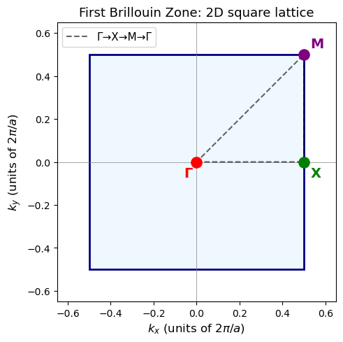

**Ch121a | Module 3: Periodic DFT**

[](https://colab.research.google.com/github/ppt-2/Ch121a-DFT/blob/main/Module3_Periodic-DFT/notebooks/01_finite_to_periodic_dft.ipynb)

# Notebook 1: From Finite to Periodic DFT

---

## Learning Objectives

- From molecular to periodic DFT
- **Supercell** and periodic boundary conditions (PBC)
- Bloch's theorem and crystal momentum **k**
- Brillouin zone (BZ), reciprocal lattice, and high-symmetry points
- Band structure diagrams to molecular orbital (MO) diagrams
- How periodic DFT uses plane-wave basis sets and pseudopotentials in practice
- Why exchange-correlation functional choice (Jacob's ladder rungs) matters
- Main application domains of periodic DFT


## 1. From Molecules to Crystals: What Changes?

In **molecular (finite) DFT** (Module 1), the system is isolated: atoms sit in a vacuum box, and the wavefunction decays to zero at the boundaries. In **periodic DFT**, the system repeats infinitely in one or more directions via **periodic boundary conditions (PBC)**, that we already understood in the context of classical MD simulations (Module 2).

### Supercell

The fundamental unit of a periodic calculation is the **supercell** — a parallelepiped defined by three lattice vectors **a₁**, **a₂**, **a₃**. The infinite crystal is obtained by repeating this cell in all directions:

$$\mathbf{R} = n_1 \mathbf{a}_1 + n_2 \mathbf{a}_2 + n_3 \mathbf{a}_3 \quad (n_1, n_2, n_3 \in \mathbb{Z})$$

Implications:
- **No molecular edges** — atoms near the cell boundary interact with images on the opposite side
- **Basis set changes** — plane-waves (periodic) replace Gaussian orbitals (localized)
- **k-point sampling** — replaces the single-point evaluation of a molecule

### POSCAR Example: Si Conventional Cell

```
Si
1.0
  5.4310  0.0000  0.0000
  0.0000  5.4310  0.0000
  0.0000  0.0000  5.4310
Si
8
Direct
  0.000  0.000  0.000
  0.250  0.250  0.250
  0.500  0.500  0.000
  0.750  0.750  0.250
  0.500  0.000  0.500
  0.750  0.250  0.750
  0.000  0.500  0.500
  0.250  0.750  0.750
```


```python

```


```python
from ase.io import read
import py3Dmol
import numpy as np

atoms = read("../tmp/sample/POSCAR_Si_conv_cell")
atoms = atoms.repeat((3,3,3))
symbols = atoms.get_chemical_symbols()
positions = atoms.get_positions()

xyz_str = f"{len(symbols)}\nPOSCAR\n"
for s, (x, y, z) in zip(symbols, positions):
    xyz_str += f"{s} {x:.6f} {y:.6f} {z:.6f}\n"

cell = atoms.get_cell()      # 3x3 lattice vectors
a, b, c = cell[0], cell[1], cell[2]

origin = np.zeros(3)

corners = [
    origin,
    a,
    b,
    c,
    a + b,
    a + c,
    b + c,
    a + b + c
]

edges = [
    (0,1), (0,2), (0,3),
    (1,4), (1,5),
    (2,4), (2,6),
    (3,5), (3,6),
    (4,7), (5,7), (6,7)
]
view = py3Dmol.view(width=800, height=500)

# Add coordinates
view.addModel(xyz_str, "xyz")
view.setStyle({
    'sphere': {'scale': 0.5,
        'shininess': 80,
        'specular': 'white'
},
    'stick': {'radius': 0.15}
})
for i, j in edges:
    p1 = corners[i]
    p2 = corners[j]
    view.addLine({
        'start': {'x': float(p1[0]), 'y': float(p1[1]), 'z': float(p1[2])},
        'end':   {'x': float(p2[0]), 'y': float(p2[1]), 'z': float(p2[2])},
        'color': 'black',
        'radius': 0.08
    })

element_colors = {
    "H":  "#FFFFFF",   # white
    "O":  "#FF0D0D",   # red
    "Si": "#B0B7C6",   # steel (metallic gray-blue)
    "C":  "#808080",   # gray
    "Ti": "#FF77AA",   # pink
    "Mo": "#4F7942"
}
# Apply element-specific colors
for elem, color in element_colors.items():
    view.setStyle(
        {'elem': elem},
        {
            'sphere': {'scale': 0.3, 'color': color},
            'stick':  {'radius': 0.15, 'color': color}
        }
    )

view.setBackgroundColor('white')
view.setProjection("orthographic")
view.zoomTo()
#view.show()
```


<div id="3dmolviewer_17769914588023996"  style="position: relative; width: 800px; height: 500px;">
        <p id="3dmolwarning_17769914588023996" style="background-color:#ffcccc;color:black">3Dmol.js failed to load for some reason.  Please check your browser console for error messages.<br></p>
        </div>
<script>

var loadScriptAsync = function(uri){
  return new Promise((resolve, reject) => {
    //this is to ignore the existence of requirejs amd
    var savedexports, savedmodule;
    if (typeof exports !== 'undefined') savedexports = exports;
    else exports = {}
    if (typeof module !== 'undefined') savedmodule = module;
    else module = {}

    var tag = document.createElement('script');
    tag.src = uri;
    tag.async = true;
    tag.onload = () => {
        exports = savedexports;
        module = savedmodule;
        resolve();
    };
  var firstScriptTag = document.getElementsByTagName('script')[0];
  firstScriptTag.parentNode.insertBefore(tag, firstScriptTag);
});
};

if(typeof $3Dmolpromise === 'undefined') {
$3Dmolpromise = null;
  $3Dmolpromise = loadScriptAsync('https://cdn.jsdelivr.net/npm/3dmol@2.5.4/build/3Dmol-min.js');
}

var viewer_17769914588023996 = null;
var warn = document.getElementById("3dmolwarning_17769914588023996");
if(warn) {
    warn.parentNode.removeChild(warn);
}
$3Dmolpromise.then(function() {
viewer_17769914588023996 = $3Dmol.createViewer(document.getElementById("3dmolviewer_17769914588023996"),{backgroundColor:"white"});
viewer_17769914588023996.zoomTo();
	viewer_17769914588023996.addModel("216\nPOSCAR\nSi 0.000000 0.000000 0.000000\nSi 1.357750 1.357750 1.357750\nSi 2.715500 2.715500 0.000000\nSi 4.073250 4.073250 1.357750\nSi 2.715500 0.000000 2.715500\nSi 4.073250 1.357750 4.073250\nSi 0.000000 2.715500 2.715500\nSi 1.357750 4.073250 4.073250\nSi 0.000000 0.000000 5.431000\nSi 1.357750 1.357750 6.788750\nSi 2.715500 2.715500 5.431000\nSi 4.073250 4.073250 6.788750\nSi 2.715500 0.000000 8.146500\nSi 4.073250 1.357750 9.504250\nSi 0.000000 2.715500 8.146500\nSi 1.357750 4.073250 9.504250\nSi 0.000000 0.000000 10.862000\nSi 1.357750 1.357750 12.219750\nSi 2.715500 2.715500 10.862000\nSi 4.073250 4.073250 12.219750\nSi 2.715500 0.000000 13.577500\nSi 4.073250 1.357750 14.935250\nSi 0.000000 2.715500 13.577500\nSi 1.357750 4.073250 14.935250\nSi 0.000000 5.431000 0.000000\nSi 1.357750 6.788750 1.357750\nSi 2.715500 8.146500 0.000000\nSi 4.073250 9.504250 1.357750\nSi 2.715500 5.431000 2.715500\nSi 4.073250 6.788750 4.073250\nSi 0.000000 8.146500 2.715500\nSi 1.357750 9.504250 4.073250\nSi 0.000000 5.431000 5.431000\nSi 1.357750 6.788750 6.788750\nSi 2.715500 8.146500 5.431000\nSi 4.073250 9.504250 6.788750\nSi 2.715500 5.431000 8.146500\nSi 4.073250 6.788750 9.504250\nSi 0.000000 8.146500 8.146500\nSi 1.357750 9.504250 9.504250\nSi 0.000000 5.431000 10.862000\nSi 1.357750 6.788750 12.219750\nSi 2.715500 8.146500 10.862000\nSi 4.073250 9.504250 12.219750\nSi 2.715500 5.431000 13.577500\nSi 4.073250 6.788750 14.935250\nSi 0.000000 8.146500 13.577500\nSi 1.357750 9.504250 14.935250\nSi 0.000000 10.862000 0.000000\nSi 1.357750 12.219750 1.357750\nSi 2.715500 13.577500 0.000000\nSi 4.073250 14.935250 1.357750\nSi 2.715500 10.862000 2.715500\nSi 4.073250 12.219750 4.073250\nSi 0.000000 13.577500 2.715500\nSi 1.357750 14.935250 4.073250\nSi 0.000000 10.862000 5.431000\nSi 1.357750 12.219750 6.788750\nSi 2.715500 13.577500 5.431000\nSi 4.073250 14.935250 6.788750\nSi 2.715500 10.862000 8.146500\nSi 4.073250 12.219750 9.504250\nSi 0.000000 13.577500 8.146500\nSi 1.357750 14.935250 9.504250\nSi 0.000000 10.862000 10.862000\nSi 1.357750 12.219750 12.219750\nSi 2.715500 13.577500 10.862000\nSi 4.073250 14.935250 12.219750\nSi 2.715500 10.862000 13.577500\nSi 4.073250 12.219750 14.935250\nSi 0.000000 13.577500 13.577500\nSi 1.357750 14.935250 14.935250\nSi 5.431000 0.000000 0.000000\nSi 6.788750 1.357750 1.357750\nSi 8.146500 2.715500 0.000000\nSi 9.504250 4.073250 1.357750\nSi 8.146500 0.000000 2.715500\nSi 9.504250 1.357750 4.073250\nSi 5.431000 2.715500 2.715500\nSi 6.788750 4.073250 4.073250\nSi 5.431000 0.000000 5.431000\nSi 6.788750 1.357750 6.788750\nSi 8.146500 2.715500 5.431000\nSi 9.504250 4.073250 6.788750\nSi 8.146500 0.000000 8.146500\nSi 9.504250 1.357750 9.504250\nSi 5.431000 2.715500 8.146500\nSi 6.788750 4.073250 9.504250\nSi 5.431000 0.000000 10.862000\nSi 6.788750 1.357750 12.219750\nSi 8.146500 2.715500 10.862000\nSi 9.504250 4.073250 12.219750\nSi 8.146500 0.000000 13.577500\nSi 9.504250 1.357750 14.935250\nSi 5.431000 2.715500 13.577500\nSi 6.788750 4.073250 14.935250\nSi 5.431000 5.431000 0.000000\nSi 6.788750 6.788750 1.357750\nSi 8.146500 8.146500 0.000000\nSi 9.504250 9.504250 1.357750\nSi 8.146500 5.431000 2.715500\nSi 9.504250 6.788750 4.073250\nSi 5.431000 8.146500 2.715500\nSi 6.788750 9.504250 4.073250\nSi 5.431000 5.431000 5.431000\nSi 6.788750 6.788750 6.788750\nSi 8.146500 8.146500 5.431000\nSi 9.504250 9.504250 6.788750\nSi 8.146500 5.431000 8.146500\nSi 9.504250 6.788750 9.504250\nSi 5.431000 8.146500 8.146500\nSi 6.788750 9.504250 9.504250\nSi 5.431000 5.431000 10.862000\nSi 6.788750 6.788750 12.219750\nSi 8.146500 8.146500 10.862000\nSi 9.504250 9.504250 12.219750\nSi 8.146500 5.431000 13.577500\nSi 9.504250 6.788750 14.935250\nSi 5.431000 8.146500 13.577500\nSi 6.788750 9.504250 14.935250\nSi 5.431000 10.862000 0.000000\nSi 6.788750 12.219750 1.357750\nSi 8.146500 13.577500 0.000000\nSi 9.504250 14.935250 1.357750\nSi 8.146500 10.862000 2.715500\nSi 9.504250 12.219750 4.073250\nSi 5.431000 13.577500 2.715500\nSi 6.788750 14.935250 4.073250\nSi 5.431000 10.862000 5.431000\nSi 6.788750 12.219750 6.788750\nSi 8.146500 13.577500 5.431000\nSi 9.504250 14.935250 6.788750\nSi 8.146500 10.862000 8.146500\nSi 9.504250 12.219750 9.504250\nSi 5.431000 13.577500 8.146500\nSi 6.788750 14.935250 9.504250\nSi 5.431000 10.862000 10.862000\nSi 6.788750 12.219750 12.219750\nSi 8.146500 13.577500 10.862000\nSi 9.504250 14.935250 12.219750\nSi 8.146500 10.862000 13.577500\nSi 9.504250 12.219750 14.935250\nSi 5.431000 13.577500 13.577500\nSi 6.788750 14.935250 14.935250\nSi 10.862000 0.000000 0.000000\nSi 12.219750 1.357750 1.357750\nSi 13.577500 2.715500 0.000000\nSi 14.935250 4.073250 1.357750\nSi 13.577500 0.000000 2.715500\nSi 14.935250 1.357750 4.073250\nSi 10.862000 2.715500 2.715500\nSi 12.219750 4.073250 4.073250\nSi 10.862000 0.000000 5.431000\nSi 12.219750 1.357750 6.788750\nSi 13.577500 2.715500 5.431000\nSi 14.935250 4.073250 6.788750\nSi 13.577500 0.000000 8.146500\nSi 14.935250 1.357750 9.504250\nSi 10.862000 2.715500 8.146500\nSi 12.219750 4.073250 9.504250\nSi 10.862000 0.000000 10.862000\nSi 12.219750 1.357750 12.219750\nSi 13.577500 2.715500 10.862000\nSi 14.935250 4.073250 12.219750\nSi 13.577500 0.000000 13.577500\nSi 14.935250 1.357750 14.935250\nSi 10.862000 2.715500 13.577500\nSi 12.219750 4.073250 14.935250\nSi 10.862000 5.431000 0.000000\nSi 12.219750 6.788750 1.357750\nSi 13.577500 8.146500 0.000000\nSi 14.935250 9.504250 1.357750\nSi 13.577500 5.431000 2.715500\nSi 14.935250 6.788750 4.073250\nSi 10.862000 8.146500 2.715500\nSi 12.219750 9.504250 4.073250\nSi 10.862000 5.431000 5.431000\nSi 12.219750 6.788750 6.788750\nSi 13.577500 8.146500 5.431000\nSi 14.935250 9.504250 6.788750\nSi 13.577500 5.431000 8.146500\nSi 14.935250 6.788750 9.504250\nSi 10.862000 8.146500 8.146500\nSi 12.219750 9.504250 9.504250\nSi 10.862000 5.431000 10.862000\nSi 12.219750 6.788750 12.219750\nSi 13.577500 8.146500 10.862000\nSi 14.935250 9.504250 12.219750\nSi 13.577500 5.431000 13.577500\nSi 14.935250 6.788750 14.935250\nSi 10.862000 8.146500 13.577500\nSi 12.219750 9.504250 14.935250\nSi 10.862000 10.862000 0.000000\nSi 12.219750 12.219750 1.357750\nSi 13.577500 13.577500 0.000000\nSi 14.935250 14.935250 1.357750\nSi 13.577500 10.862000 2.715500\nSi 14.935250 12.219750 4.073250\nSi 10.862000 13.577500 2.715500\nSi 12.219750 14.935250 4.073250\nSi 10.862000 10.862000 5.431000\nSi 12.219750 12.219750 6.788750\nSi 13.577500 13.577500 5.431000\nSi 14.935250 14.935250 6.788750\nSi 13.577500 10.862000 8.146500\nSi 14.935250 12.219750 9.504250\nSi 10.862000 13.577500 8.146500\nSi 12.219750 14.935250 9.504250\nSi 10.862000 10.862000 10.862000\nSi 12.219750 12.219750 12.219750\nSi 13.577500 13.577500 10.862000\nSi 14.935250 14.935250 12.219750\nSi 13.577500 10.862000 13.577500\nSi 14.935250 12.219750 14.935250\nSi 10.862000 13.577500 13.577500\nSi 12.219750 14.935250 14.935250\n","xyz");
	viewer_17769914588023996.setStyle({"sphere": {"scale": 0.5, "shininess": 80, "specular": "white"}, "stick": {"radius": 0.15}});
	viewer_17769914588023996.addLine({"start": {"x": 0.0, "y": 0.0, "z": 0.0}, "end": {"x": 16.293, "y": 0.0, "z": 0.0}, "color": "black", "radius": 0.08});
	viewer_17769914588023996.addLine({"start": {"x": 0.0, "y": 0.0, "z": 0.0}, "end": {"x": 0.0, "y": 16.293, "z": 0.0}, "color": "black", "radius": 0.08});
	viewer_17769914588023996.addLine({"start": {"x": 0.0, "y": 0.0, "z": 0.0}, "end": {"x": 0.0, "y": 0.0, "z": 16.293}, "color": "black", "radius": 0.08});
	viewer_17769914588023996.addLine({"start": {"x": 16.293, "y": 0.0, "z": 0.0}, "end": {"x": 16.293, "y": 16.293, "z": 0.0}, "color": "black", "radius": 0.08});
	viewer_17769914588023996.addLine({"start": {"x": 16.293, "y": 0.0, "z": 0.0}, "end": {"x": 16.293, "y": 0.0, "z": 16.293}, "color": "black", "radius": 0.08});
	viewer_17769914588023996.addLine({"start": {"x": 0.0, "y": 16.293, "z": 0.0}, "end": {"x": 16.293, "y": 16.293, "z": 0.0}, "color": "black", "radius": 0.08});
	viewer_17769914588023996.addLine({"start": {"x": 0.0, "y": 16.293, "z": 0.0}, "end": {"x": 0.0, "y": 16.293, "z": 16.293}, "color": "black", "radius": 0.08});
	viewer_17769914588023996.addLine({"start": {"x": 0.0, "y": 0.0, "z": 16.293}, "end": {"x": 16.293, "y": 0.0, "z": 16.293}, "color": "black", "radius": 0.08});
	viewer_17769914588023996.addLine({"start": {"x": 0.0, "y": 0.0, "z": 16.293}, "end": {"x": 0.0, "y": 16.293, "z": 16.293}, "color": "black", "radius": 0.08});
	viewer_17769914588023996.addLine({"start": {"x": 16.293, "y": 16.293, "z": 0.0}, "end": {"x": 16.293, "y": 16.293, "z": 16.293}, "color": "black", "radius": 0.08});
	viewer_17769914588023996.addLine({"start": {"x": 16.293, "y": 0.0, "z": 16.293}, "end": {"x": 16.293, "y": 16.293, "z": 16.293}, "color": "black", "radius": 0.08});
	viewer_17769914588023996.addLine({"start": {"x": 0.0, "y": 16.293, "z": 16.293}, "end": {"x": 16.293, "y": 16.293, "z": 16.293}, "color": "black", "radius": 0.08});
	viewer_17769914588023996.setStyle({"elem": "H"},{"sphere": {"scale": 0.3, "color": "#FFFFFF"}, "stick": {"radius": 0.15, "color": "#FFFFFF"}});
	viewer_17769914588023996.setStyle({"elem": "O"},{"sphere": {"scale": 0.3, "color": "#FF0D0D"}, "stick": {"radius": 0.15, "color": "#FF0D0D"}});
	viewer_17769914588023996.setStyle({"elem": "Si"},{"sphere": {"scale": 0.3, "color": "#B0B7C6"}, "stick": {"radius": 0.15, "color": "#B0B7C6"}});
	viewer_17769914588023996.setStyle({"elem": "C"},{"sphere": {"scale": 0.3, "color": "#808080"}, "stick": {"radius": 0.15, "color": "#808080"}});
	viewer_17769914588023996.setStyle({"elem": "Ti"},{"sphere": {"scale": 0.3, "color": "#FF77AA"}, "stick": {"radius": 0.15, "color": "#FF77AA"}});
	viewer_17769914588023996.setStyle({"elem": "Mo"},{"sphere": {"scale": 0.3, "color": "#4F7942"}, "stick": {"radius": 0.15, "color": "#4F7942"}});
	viewer_17769914588023996.setBackgroundColor("white");
	viewer_17769914588023996.setProjection("orthographic");
	viewer_17769914588023996.zoomTo();
viewer_17769914588023996.render();
});
</script>


    <py3Dmol.view at 0x7fc5dba7e110>


### Conventional, primitive, and super-cells of Si

 


```python
from ase.io import read
import py3Dmol
import numpy as np

atoms = read("../tmp/sample/Cu_mp-30_primitive.cif")
atoms = atoms.repeat((1,1,1))
symbols = atoms.get_chemical_symbols()
positions = atoms.get_positions()

xyz_str = f"{len(symbols)}\nPOSCAR\n"
for s, (x, y, z) in zip(symbols, positions):
    xyz_str += f"{s} {x:.6f} {y:.6f} {z:.6f}\n"

cell = atoms.get_cell()      # 3x3 lattice vectors
a, b, c = cell[0], cell[1], cell[2]

origin = np.zeros(3)

corners = [
    origin,
    a,
    b,
    c,
    a + b,
    a + c,
    b + c,
    a + b + c
]

edges = [
    (0,1), (0,2), (0,3),
    (1,4), (1,5),
    (2,4), (2,6),
    (3,5), (3,6),
    (4,7), (5,7), (6,7)
]
view = py3Dmol.view(width=800, height=500)

# Add coordinates
view.addModel(xyz_str, "xyz")
view.setStyle({
    'sphere': {'scale': 0.5,
        'shininess': 80,
        'specular': 'white'
},
    'stick': {'radius': 0.15}
})
for i, j in edges:
    p1 = corners[i]
    p2 = corners[j]
    view.addLine({
        'start': {'x': float(p1[0]), 'y': float(p1[1]), 'z': float(p1[2])},
        'end':   {'x': float(p2[0]), 'y': float(p2[1]), 'z': float(p2[2])},
        'color': 'black',
        'radius': 0.08
    })

element_colors = {
    "H":  "#FFFFFF",   # white
    "O":  "#FF0D0D",   # red
    "Si": "#B0B7C6",   # steel (metallic gray-blue)
    "C":  "#808080",   # gray
    "Ti": "#FF77AA",   # pink
    "Mo": "#4F7942"
}
# Apply element-specific colors
for elem, color in element_colors.items():
    view.setStyle(
        {'elem': elem},
        {
            'sphere': {'scale': 0.3, 'color': color},
            'stick':  {'radius': 0.15, 'color': color}
        }
    )

view.setBackgroundColor('white')
view.setProjection("orthographic")
view.zoomTo()
view.show()
```


<div id="3dmolviewer_177699146848842"  style="position: relative; width: 800px; height: 500px;">
        <p id="3dmolwarning_177699146848842" style="background-color:#ffcccc;color:black">3Dmol.js failed to load for some reason.  Please check your browser console for error messages.<br></p>
        </div>
<script>

var loadScriptAsync = function(uri){
  return new Promise((resolve, reject) => {
    //this is to ignore the existence of requirejs amd
    var savedexports, savedmodule;
    if (typeof exports !== 'undefined') savedexports = exports;
    else exports = {}
    if (typeof module !== 'undefined') savedmodule = module;
    else module = {}

    var tag = document.createElement('script');
    tag.src = uri;
    tag.async = true;
    tag.onload = () => {
        exports = savedexports;
        module = savedmodule;
        resolve();
    };
  var firstScriptTag = document.getElementsByTagName('script')[0];
  firstScriptTag.parentNode.insertBefore(tag, firstScriptTag);
});
};

if(typeof $3Dmolpromise === 'undefined') {
$3Dmolpromise = null;
  $3Dmolpromise = loadScriptAsync('https://cdn.jsdelivr.net/npm/3dmol@2.5.4/build/3Dmol-min.js');
}

var viewer_177699146848842 = null;
var warn = document.getElementById("3dmolwarning_177699146848842");
if(warn) {
    warn.parentNode.removeChild(warn);
}
$3Dmolpromise.then(function() {
viewer_177699146848842 = $3Dmol.createViewer(document.getElementById("3dmolviewer_177699146848842"),{backgroundColor:"white"});
viewer_177699146848842.zoomTo();
	viewer_177699146848842.addModel("1\nPOSCAR\nCu 0.000000 0.000000 0.000000\n","xyz");
	viewer_177699146848842.setStyle({"sphere": {"scale": 0.5, "shininess": 80, "specular": "white"}, "stick": {"radius": 0.15}});
	viewer_177699146848842.addLine({"start": {"x": 0.0, "y": 0.0, "z": 0.0}, "end": {"x": 2.56061892, "y": 0.0, "z": 0.0}, "color": "black", "radius": 0.08});
	viewer_177699146848842.addLine({"start": {"x": 0.0, "y": 0.0, "z": 0.0}, "end": {"x": 1.2803094600000002, "y": 2.217561034131073, "z": 0.0}, "color": "black", "radius": 0.08});
	viewer_177699146848842.addLine({"start": {"x": 0.0, "y": 0.0, "z": 0.0}, "end": {"x": 1.2803094600000002, "y": 0.7391870113770245, "z": 2.090736593238846}, "color": "black", "radius": 0.08});
	viewer_177699146848842.addLine({"start": {"x": 2.56061892, "y": 0.0, "z": 0.0}, "end": {"x": 3.8409283800000003, "y": 2.217561034131073, "z": 0.0}, "color": "black", "radius": 0.08});
	viewer_177699146848842.addLine({"start": {"x": 2.56061892, "y": 0.0, "z": 0.0}, "end": {"x": 3.8409283800000003, "y": 0.7391870113770245, "z": 2.090736593238846}, "color": "black", "radius": 0.08});
	viewer_177699146848842.addLine({"start": {"x": 1.2803094600000002, "y": 2.217561034131073, "z": 0.0}, "end": {"x": 3.8409283800000003, "y": 2.217561034131073, "z": 0.0}, "color": "black", "radius": 0.08});
	viewer_177699146848842.addLine({"start": {"x": 1.2803094600000002, "y": 2.217561034131073, "z": 0.0}, "end": {"x": 2.5606189200000005, "y": 2.9567480455080974, "z": 2.090736593238846}, "color": "black", "radius": 0.08});
	viewer_177699146848842.addLine({"start": {"x": 1.2803094600000002, "y": 0.7391870113770245, "z": 2.090736593238846}, "end": {"x": 3.8409283800000003, "y": 0.7391870113770245, "z": 2.090736593238846}, "color": "black", "radius": 0.08});
	viewer_177699146848842.addLine({"start": {"x": 1.2803094600000002, "y": 0.7391870113770245, "z": 2.090736593238846}, "end": {"x": 2.5606189200000005, "y": 2.9567480455080974, "z": 2.090736593238846}, "color": "black", "radius": 0.08});
	viewer_177699146848842.addLine({"start": {"x": 3.8409283800000003, "y": 2.217561034131073, "z": 0.0}, "end": {"x": 5.121237840000001, "y": 2.9567480455080974, "z": 2.090736593238846}, "color": "black", "radius": 0.08});
	viewer_177699146848842.addLine({"start": {"x": 3.8409283800000003, "y": 0.7391870113770245, "z": 2.090736593238846}, "end": {"x": 5.121237840000001, "y": 2.9567480455080974, "z": 2.090736593238846}, "color": "black", "radius": 0.08});
	viewer_177699146848842.addLine({"start": {"x": 2.5606189200000005, "y": 2.9567480455080974, "z": 2.090736593238846}, "end": {"x": 5.121237840000001, "y": 2.9567480455080974, "z": 2.090736593238846}, "color": "black", "radius": 0.08});
	viewer_177699146848842.setStyle({"elem": "H"},{"sphere": {"scale": 0.3, "color": "#FFFFFF"}, "stick": {"radius": 0.15, "color": "#FFFFFF"}});
	viewer_177699146848842.setStyle({"elem": "O"},{"sphere": {"scale": 0.3, "color": "#FF0D0D"}, "stick": {"radius": 0.15, "color": "#FF0D0D"}});
	viewer_177699146848842.setStyle({"elem": "Si"},{"sphere": {"scale": 0.3, "color": "#B0B7C6"}, "stick": {"radius": 0.15, "color": "#B0B7C6"}});
	viewer_177699146848842.setStyle({"elem": "C"},{"sphere": {"scale": 0.3, "color": "#808080"}, "stick": {"radius": 0.15, "color": "#808080"}});
	viewer_177699146848842.setStyle({"elem": "Ti"},{"sphere": {"scale": 0.3, "color": "#FF77AA"}, "stick": {"radius": 0.15, "color": "#FF77AA"}});
	viewer_177699146848842.setStyle({"elem": "Mo"},{"sphere": {"scale": 0.3, "color": "#4F7942"}, "stick": {"radius": 0.15, "color": "#4F7942"}});
	viewer_177699146848842.setBackgroundColor("white");
	viewer_177699146848842.setProjection("orthographic");
	viewer_177699146848842.zoomTo();
viewer_177699146848842.render();
});
</script>


```python
from ase.io import read
import py3Dmol
import numpy as np

atoms = read("../tmp/sample/Cu_mp-30_conventional_standard.cif")
atoms = atoms.repeat((2,2,10))
symbols = atoms.get_chemical_symbols()
positions = atoms.get_positions()

xyz_str = f"{len(symbols)}\nPOSCAR\n"
for s, (x, y, z) in zip(symbols, positions):
    xyz_str += f"{s} {x:.6f} {y:.6f} {z:.6f}\n"

cell = atoms.get_cell()      # 3x3 lattice vectors
a, b, c = cell[0], cell[1], cell[2]

origin = np.zeros(3)

corners = [
    origin,
    a,
    b,
    c,
    a + b,
    a + c,
    b + c,
    a + b + c
]

edges = [
    (0,1), (0,2), (0,3),
    (1,4), (1,5),
    (2,4), (2,6),
    (3,5), (3,6),
    (4,7), (5,7), (6,7)
]
view = py3Dmol.view(width=800, height=500)

# Add coordinates
view.addModel(xyz_str, "xyz")
view.setStyle({
    'sphere': {'scale': 0.5,
        'shininess': 80,
        'specular': 'white'
},
    'stick': {'radius': 0.15}
})
for i, j in edges:
    p1 = corners[i]
    p2 = corners[j]
    view.addLine({
        'start': {'x': float(p1[0]), 'y': float(p1[1]), 'z': float(p1[2])},
        'end':   {'x': float(p2[0]), 'y': float(p2[1]), 'z': float(p2[2])},
        'color': 'black',
        'radius': 0.08
    })

element_colors = {
    "H":  "#FFFFFF",   # white
    "O":  "#FF0D0D",   # red
    "Si": "#B0B7C6",   # steel (metallic gray-blue)
    "C":  "#808080",   # gray
    "Ti": "#FF77AA",   # pink
    "Mo": "#4F7942"
}
# Apply element-specific colors
for elem, color in element_colors.items():
    view.setStyle(
        {'elem': elem},
        {
            'sphere': {'scale': 0.3, 'color': color},
            'stick':  {'radius': 0.15, 'color': color}
        }
    )

view.setBackgroundColor('white')
view.setProjection("orthographic")
view.zoomTo()
```


<div id="3dmolviewer_17769914786467583"  style="position: relative; width: 800px; height: 500px;">
        <p id="3dmolwarning_17769914786467583" style="background-color:#ffcccc;color:black">3Dmol.js failed to load for some reason.  Please check your browser console for error messages.<br></p>
        </div>
<script>

var loadScriptAsync = function(uri){
  return new Promise((resolve, reject) => {
    //this is to ignore the existence of requirejs amd
    var savedexports, savedmodule;
    if (typeof exports !== 'undefined') savedexports = exports;
    else exports = {}
    if (typeof module !== 'undefined') savedmodule = module;
    else module = {}

    var tag = document.createElement('script');
    tag.src = uri;
    tag.async = true;
    tag.onload = () => {
        exports = savedexports;
        module = savedmodule;
        resolve();
    };
  var firstScriptTag = document.getElementsByTagName('script')[0];
  firstScriptTag.parentNode.insertBefore(tag, firstScriptTag);
});
};

if(typeof $3Dmolpromise === 'undefined') {
$3Dmolpromise = null;
  $3Dmolpromise = loadScriptAsync('https://cdn.jsdelivr.net/npm/3dmol@2.5.4/build/3Dmol-min.js');
}

var viewer_17769914786467583 = null;
var warn = document.getElementById("3dmolwarning_17769914786467583");
if(warn) {
    warn.parentNode.removeChild(warn);
}
$3Dmolpromise.then(function() {
viewer_17769914786467583 = $3Dmol.createViewer(document.getElementById("3dmolviewer_17769914786467583"),{backgroundColor:"white"});
viewer_17769914786467583.zoomTo();
	viewer_17769914786467583.addModel("160\nPOSCAR\nCu 0.000000 0.000000 0.000000\nCu 0.000000 1.810631 1.810631\nCu 1.810631 0.000000 1.810631\nCu 1.810631 1.810631 0.000000\nCu 0.000000 0.000000 3.621262\nCu 0.000000 1.810631 5.431893\nCu 1.810631 0.000000 5.431893\nCu 1.810631 1.810631 3.621262\nCu 0.000000 0.000000 7.242524\nCu 0.000000 1.810631 9.053155\nCu 1.810631 0.000000 9.053155\nCu 1.810631 1.810631 7.242524\nCu 0.000000 0.000000 10.863786\nCu 0.000000 1.810631 12.674417\nCu 1.810631 0.000000 12.674417\nCu 1.810631 1.810631 10.863786\nCu 0.000000 0.000000 14.485048\nCu 0.000000 1.810631 16.295679\nCu 1.810631 0.000000 16.295679\nCu 1.810631 1.810631 14.485048\nCu 0.000000 0.000000 18.106310\nCu 0.000000 1.810631 19.916941\nCu 1.810631 0.000000 19.916941\nCu 1.810631 1.810631 18.106310\nCu 0.000000 0.000000 21.727572\nCu 0.000000 1.810631 23.538203\nCu 1.810631 0.000000 23.538203\nCu 1.810631 1.810631 21.727572\nCu 0.000000 0.000000 25.348834\nCu 0.000000 1.810631 27.159465\nCu 1.810631 0.000000 27.159465\nCu 1.810631 1.810631 25.348834\nCu 0.000000 0.000000 28.970096\nCu 0.000000 1.810631 30.780727\nCu 1.810631 0.000000 30.780727\nCu 1.810631 1.810631 28.970096\nCu 0.000000 0.000000 32.591358\nCu 0.000000 1.810631 34.401989\nCu 1.810631 0.000000 34.401989\nCu 1.810631 1.810631 32.591358\nCu 0.000000 3.621262 0.000000\nCu 0.000000 5.431893 1.810631\nCu 1.810631 3.621262 1.810631\nCu 1.810631 5.431893 0.000000\nCu 0.000000 3.621262 3.621262\nCu 0.000000 5.431893 5.431893\nCu 1.810631 3.621262 5.431893\nCu 1.810631 5.431893 3.621262\nCu 0.000000 3.621262 7.242524\nCu 0.000000 5.431893 9.053155\nCu 1.810631 3.621262 9.053155\nCu 1.810631 5.431893 7.242524\nCu 0.000000 3.621262 10.863786\nCu 0.000000 5.431893 12.674417\nCu 1.810631 3.621262 12.674417\nCu 1.810631 5.431893 10.863786\nCu 0.000000 3.621262 14.485048\nCu 0.000000 5.431893 16.295679\nCu 1.810631 3.621262 16.295679\nCu 1.810631 5.431893 14.485048\nCu 0.000000 3.621262 18.106310\nCu 0.000000 5.431893 19.916941\nCu 1.810631 3.621262 19.916941\nCu 1.810631 5.431893 18.106310\nCu 0.000000 3.621262 21.727572\nCu 0.000000 5.431893 23.538203\nCu 1.810631 3.621262 23.538203\nCu 1.810631 5.431893 21.727572\nCu 0.000000 3.621262 25.348834\nCu 0.000000 5.431893 27.159465\nCu 1.810631 3.621262 27.159465\nCu 1.810631 5.431893 25.348834\nCu 0.000000 3.621262 28.970096\nCu 0.000000 5.431893 30.780727\nCu 1.810631 3.621262 30.780727\nCu 1.810631 5.431893 28.970096\nCu 0.000000 3.621262 32.591358\nCu 0.000000 5.431893 34.401989\nCu 1.810631 3.621262 34.401989\nCu 1.810631 5.431893 32.591358\nCu 3.621262 0.000000 0.000000\nCu 3.621262 1.810631 1.810631\nCu 5.431893 0.000000 1.810631\nCu 5.431893 1.810631 0.000000\nCu 3.621262 0.000000 3.621262\nCu 3.621262 1.810631 5.431893\nCu 5.431893 0.000000 5.431893\nCu 5.431893 1.810631 3.621262\nCu 3.621262 0.000000 7.242524\nCu 3.621262 1.810631 9.053155\nCu 5.431893 0.000000 9.053155\nCu 5.431893 1.810631 7.242524\nCu 3.621262 0.000000 10.863786\nCu 3.621262 1.810631 12.674417\nCu 5.431893 0.000000 12.674417\nCu 5.431893 1.810631 10.863786\nCu 3.621262 0.000000 14.485048\nCu 3.621262 1.810631 16.295679\nCu 5.431893 0.000000 16.295679\nCu 5.431893 1.810631 14.485048\nCu 3.621262 0.000000 18.106310\nCu 3.621262 1.810631 19.916941\nCu 5.431893 0.000000 19.916941\nCu 5.431893 1.810631 18.106310\nCu 3.621262 0.000000 21.727572\nCu 3.621262 1.810631 23.538203\nCu 5.431893 0.000000 23.538203\nCu 5.431893 1.810631 21.727572\nCu 3.621262 0.000000 25.348834\nCu 3.621262 1.810631 27.159465\nCu 5.431893 0.000000 27.159465\nCu 5.431893 1.810631 25.348834\nCu 3.621262 0.000000 28.970096\nCu 3.621262 1.810631 30.780727\nCu 5.431893 0.000000 30.780727\nCu 5.431893 1.810631 28.970096\nCu 3.621262 0.000000 32.591358\nCu 3.621262 1.810631 34.401989\nCu 5.431893 0.000000 34.401989\nCu 5.431893 1.810631 32.591358\nCu 3.621262 3.621262 0.000000\nCu 3.621262 5.431893 1.810631\nCu 5.431893 3.621262 1.810631\nCu 5.431893 5.431893 0.000000\nCu 3.621262 3.621262 3.621262\nCu 3.621262 5.431893 5.431893\nCu 5.431893 3.621262 5.431893\nCu 5.431893 5.431893 3.621262\nCu 3.621262 3.621262 7.242524\nCu 3.621262 5.431893 9.053155\nCu 5.431893 3.621262 9.053155\nCu 5.431893 5.431893 7.242524\nCu 3.621262 3.621262 10.863786\nCu 3.621262 5.431893 12.674417\nCu 5.431893 3.621262 12.674417\nCu 5.431893 5.431893 10.863786\nCu 3.621262 3.621262 14.485048\nCu 3.621262 5.431893 16.295679\nCu 5.431893 3.621262 16.295679\nCu 5.431893 5.431893 14.485048\nCu 3.621262 3.621262 18.106310\nCu 3.621262 5.431893 19.916941\nCu 5.431893 3.621262 19.916941\nCu 5.431893 5.431893 18.106310\nCu 3.621262 3.621262 21.727572\nCu 3.621262 5.431893 23.538203\nCu 5.431893 3.621262 23.538203\nCu 5.431893 5.431893 21.727572\nCu 3.621262 3.621262 25.348834\nCu 3.621262 5.431893 27.159465\nCu 5.431893 3.621262 27.159465\nCu 5.431893 5.431893 25.348834\nCu 3.621262 3.621262 28.970096\nCu 3.621262 5.431893 30.780727\nCu 5.431893 3.621262 30.780727\nCu 5.431893 5.431893 28.970096\nCu 3.621262 3.621262 32.591358\nCu 3.621262 5.431893 34.401989\nCu 5.431893 3.621262 34.401989\nCu 5.431893 5.431893 32.591358\n","xyz");
	viewer_17769914786467583.setStyle({"sphere": {"scale": 0.5, "shininess": 80, "specular": "white"}, "stick": {"radius": 0.15}});
	viewer_17769914786467583.addLine({"start": {"x": 0.0, "y": 0.0, "z": 0.0}, "end": {"x": 7.242524, "y": 0.0, "z": 0.0}, "color": "black", "radius": 0.08});
	viewer_17769914786467583.addLine({"start": {"x": 0.0, "y": 0.0, "z": 0.0}, "end": {"x": 0.0, "y": 7.242524, "z": 0.0}, "color": "black", "radius": 0.08});
	viewer_17769914786467583.addLine({"start": {"x": 0.0, "y": 0.0, "z": 0.0}, "end": {"x": 0.0, "y": 0.0, "z": 36.21262}, "color": "black", "radius": 0.08});
	viewer_17769914786467583.addLine({"start": {"x": 7.242524, "y": 0.0, "z": 0.0}, "end": {"x": 7.242524, "y": 7.242524, "z": 0.0}, "color": "black", "radius": 0.08});
	viewer_17769914786467583.addLine({"start": {"x": 7.242524, "y": 0.0, "z": 0.0}, "end": {"x": 7.242524, "y": 0.0, "z": 36.21262}, "color": "black", "radius": 0.08});
	viewer_17769914786467583.addLine({"start": {"x": 0.0, "y": 7.242524, "z": 0.0}, "end": {"x": 7.242524, "y": 7.242524, "z": 0.0}, "color": "black", "radius": 0.08});
	viewer_17769914786467583.addLine({"start": {"x": 0.0, "y": 7.242524, "z": 0.0}, "end": {"x": 0.0, "y": 7.242524, "z": 36.21262}, "color": "black", "radius": 0.08});
	viewer_17769914786467583.addLine({"start": {"x": 0.0, "y": 0.0, "z": 36.21262}, "end": {"x": 7.242524, "y": 0.0, "z": 36.21262}, "color": "black", "radius": 0.08});
	viewer_17769914786467583.addLine({"start": {"x": 0.0, "y": 0.0, "z": 36.21262}, "end": {"x": 0.0, "y": 7.242524, "z": 36.21262}, "color": "black", "radius": 0.08});
	viewer_17769914786467583.addLine({"start": {"x": 7.242524, "y": 7.242524, "z": 0.0}, "end": {"x": 7.242524, "y": 7.242524, "z": 36.21262}, "color": "black", "radius": 0.08});
	viewer_17769914786467583.addLine({"start": {"x": 7.242524, "y": 0.0, "z": 36.21262}, "end": {"x": 7.242524, "y": 7.242524, "z": 36.21262}, "color": "black", "radius": 0.08});
	viewer_17769914786467583.addLine({"start": {"x": 0.0, "y": 7.242524, "z": 36.21262}, "end": {"x": 7.242524, "y": 7.242524, "z": 36.21262}, "color": "black", "radius": 0.08});
	viewer_17769914786467583.setStyle({"elem": "H"},{"sphere": {"scale": 0.3, "color": "#FFFFFF"}, "stick": {"radius": 0.15, "color": "#FFFFFF"}});
	viewer_17769914786467583.setStyle({"elem": "O"},{"sphere": {"scale": 0.3, "color": "#FF0D0D"}, "stick": {"radius": 0.15, "color": "#FF0D0D"}});
	viewer_17769914786467583.setStyle({"elem": "Si"},{"sphere": {"scale": 0.3, "color": "#B0B7C6"}, "stick": {"radius": 0.15, "color": "#B0B7C6"}});
	viewer_17769914786467583.setStyle({"elem": "C"},{"sphere": {"scale": 0.3, "color": "#808080"}, "stick": {"radius": 0.15, "color": "#808080"}});
	viewer_17769914786467583.setStyle({"elem": "Ti"},{"sphere": {"scale": 0.3, "color": "#FF77AA"}, "stick": {"radius": 0.15, "color": "#FF77AA"}});
	viewer_17769914786467583.setStyle({"elem": "Mo"},{"sphere": {"scale": 0.3, "color": "#4F7942"}, "stick": {"radius": 0.15, "color": "#4F7942"}});
	viewer_17769914786467583.setBackgroundColor("white");
	viewer_17769914786467583.setProjection("orthographic");
	viewer_17769914786467583.zoomTo();
viewer_17769914786467583.render();
});
</script>


    <py3Dmol.view at 0x7fc585a63f70>


```python
from pymatgen.core import Lattice, Structure
from pymatgen.core.surface import SlabGenerator

# Conventional fcc Cu lattice (use experimental or DFT lattice constant)
a = 3.615  # Å

# Build conventional fcc Cu structure
lattice = Lattice.cubic(a)
cu = Structure(
    lattice,
    ["Cu"] * 4,
    [
        [0,   0,   0],
        [0,   0.5, 0.5],
        [0.5, 0,   0.5],
        [0.5, 0.5, 0],
    ],
)

# Generate Cu(100) slab
slabgen = SlabGenerator(
    initial_structure=cu,
    miller_index=(1, 1, 1),
    min_slab_size=10.0,   # Å of slab thickness
    min_vacuum_size=15.0, # Å of vacuum
    center_slab=True
)

slab = slabgen.get_slabs()[0]

# Optional: write to POSCAR
slab.to(fmt="poscar", filename="../tmp/sample/Cu_111.vasp")

```


```python

```


```python
from ase.io import read
import py3Dmol
import numpy as np

atoms = read("../tmp/sample/Cu_100.vasp")
atoms = atoms.repeat((4,3,1))
symbols = atoms.get_chemical_symbols()
positions = atoms.get_positions()

xyz_str = f"{len(symbols)}\nPOSCAR\n"
for s, (x, y, z) in zip(symbols, positions):
    xyz_str += f"{s} {x:.6f} {y:.6f} {z:.6f}\n"

cell = atoms.get_cell()      # 3x3 lattice vectors
a, b, c = cell[0], cell[1], cell[2]

origin = np.zeros(3)

corners = [
    origin,
    a,
    b,
    c,
    a + b,
    a + c,
    b + c,
    a + b + c
]

edges = [
    (0,1), (0,2), (0,3),
    (1,4), (1,5),
    (2,4), (2,6),
    (3,5), (3,6),
    (4,7), (5,7), (6,7)
]
view = py3Dmol.view(width=800, height=500)

# Add coordinates
view.addModel(xyz_str, "xyz")
view.setStyle({
    'sphere': {'scale': 0.5,
        'shininess': 80,
        'specular': 'white'
},
    'stick': {'radius': 0.15}
})
for i, j in edges:
    p1 = corners[i]
    p2 = corners[j]
    view.addLine({
        'start': {'x': float(p1[0]), 'y': float(p1[1]), 'z': float(p1[2])},
        'end':   {'x': float(p2[0]), 'y': float(p2[1]), 'z': float(p2[2])},
        'color': 'black',
        'radius': 0.08
    })

element_colors = {
    "H":  "#FFFFFF",   # white
    "O":  "#FF0D0D",   # red
    "Si": "#B0B7C6",   # steel (metallic gray-blue)
    "C":  "#808080",   # gray
    "Ti": "#FF77AA",   # pink
    "Mo": "#4F7942"
}
# Apply element-specific colors
for elem, color in element_colors.items():
    view.setStyle(
        {'elem': elem},
        {
            'sphere': {'scale': 0.3, 'color': color},
            'stick':  {'radius': 0.15, 'color': color}
        }
    )

view.setBackgroundColor('white')
view.setProjection("orthographic")
view.zoomTo()
```


<div id="3dmolviewer_17769914972606215"  style="position: relative; width: 800px; height: 500px;">
        <p id="3dmolwarning_17769914972606215" style="background-color:#ffcccc;color:black">3Dmol.js failed to load for some reason.  Please check your browser console for error messages.<br></p>
        </div>
<script>

var loadScriptAsync = function(uri){
  return new Promise((resolve, reject) => {
    //this is to ignore the existence of requirejs amd
    var savedexports, savedmodule;
    if (typeof exports !== 'undefined') savedexports = exports;
    else exports = {}
    if (typeof module !== 'undefined') savedmodule = module;
    else module = {}

    var tag = document.createElement('script');
    tag.src = uri;
    tag.async = true;
    tag.onload = () => {
        exports = savedexports;
        module = savedmodule;
        resolve();
    };
  var firstScriptTag = document.getElementsByTagName('script')[0];
  firstScriptTag.parentNode.insertBefore(tag, firstScriptTag);
});
};

if(typeof $3Dmolpromise === 'undefined') {
$3Dmolpromise = null;
  $3Dmolpromise = loadScriptAsync('https://cdn.jsdelivr.net/npm/3dmol@2.5.4/build/3Dmol-min.js');
}

var viewer_17769914972606215 = null;
var warn = document.getElementById("3dmolwarning_17769914972606215");
if(warn) {
    warn.parentNode.removeChild(warn);
}
$3Dmolpromise.then(function() {
viewer_17769914972606215 = $3Dmol.createViewer(document.getElementById("3dmolviewer_17769914972606215"),{backgroundColor:"white"});
viewer_17769914972606215.zoomTo();
	viewer_17769914972606215.addModel("72\nPOSCAR\nCu 0.000000 -0.000000 11.748750\nCu -1.278096 1.278096 9.941250\nCu 0.000000 -0.000000 15.363750\nCu -1.278096 1.278096 13.556250\nCu 0.000000 -0.000000 18.978750\nCu -1.278096 1.278096 17.171250\nCu -2.556191 2.556191 11.748750\nCu -3.834287 3.834287 9.941250\nCu -2.556191 2.556191 15.363750\nCu -3.834287 3.834287 13.556250\nCu -2.556191 2.556191 18.978750\nCu -3.834287 3.834287 17.171250\nCu -5.112382 5.112382 11.748750\nCu -6.390478 6.390478 9.941250\nCu -5.112382 5.112382 15.363750\nCu -6.390478 6.390478 13.556250\nCu -5.112382 5.112382 18.978750\nCu -6.390478 6.390478 17.171250\nCu 2.556191 -0.000000 11.748750\nCu 1.278096 1.278096 9.941250\nCu 2.556191 -0.000000 15.363750\nCu 1.278096 1.278096 13.556250\nCu 2.556191 -0.000000 18.978750\nCu 1.278096 1.278096 17.171250\nCu 0.000000 2.556191 11.748750\nCu -1.278096 3.834287 9.941250\nCu 0.000000 2.556191 15.363750\nCu -1.278096 3.834287 13.556250\nCu 0.000000 2.556191 18.978750\nCu -1.278096 3.834287 17.171250\nCu -2.556191 5.112382 11.748750\nCu -3.834287 6.390478 9.941250\nCu -2.556191 5.112382 15.363750\nCu -3.834287 6.390478 13.556250\nCu -2.556191 5.112382 18.978750\nCu -3.834287 6.390478 17.171250\nCu 5.112382 -0.000000 11.748750\nCu 3.834287 1.278096 9.941250\nCu 5.112382 -0.000000 15.363750\nCu 3.834287 1.278096 13.556250\nCu 5.112382 -0.000000 18.978750\nCu 3.834287 1.278096 17.171250\nCu 2.556191 2.556191 11.748750\nCu 1.278096 3.834287 9.941250\nCu 2.556191 2.556191 15.363750\nCu 1.278096 3.834287 13.556250\nCu 2.556191 2.556191 18.978750\nCu 1.278096 3.834287 17.171250\nCu 0.000000 5.112382 11.748750\nCu -1.278096 6.390478 9.941250\nCu 0.000000 5.112382 15.363750\nCu -1.278096 6.390478 13.556250\nCu 0.000000 5.112382 18.978750\nCu -1.278096 6.390478 17.171250\nCu 7.668573 -0.000000 11.748750\nCu 6.390478 1.278096 9.941250\nCu 7.668573 -0.000000 15.363750\nCu 6.390478 1.278096 13.556250\nCu 7.668573 -0.000000 18.978750\nCu 6.390478 1.278096 17.171250\nCu 5.112382 2.556191 11.748750\nCu 3.834287 3.834287 9.941250\nCu 5.112382 2.556191 15.363750\nCu 3.834287 3.834287 13.556250\nCu 5.112382 2.556191 18.978750\nCu 3.834287 3.834287 17.171250\nCu 2.556191 5.112382 11.748750\nCu 1.278096 6.390478 9.941250\nCu 2.556191 5.112382 15.363750\nCu 1.278096 6.390478 13.556250\nCu 2.556191 5.112382 18.978750\nCu 1.278096 6.390478 17.171250\n","xyz");
	viewer_17769914972606215.setStyle({"sphere": {"scale": 0.5, "shininess": 80, "specular": "white"}, "stick": {"radius": 0.15}});
	viewer_17769914972606215.addLine({"start": {"x": 0.0, "y": 0.0, "z": 0.0}, "end": {"x": 10.224764055957477, "y": 0.0, "z": 8e-16}, "color": "black", "radius": 0.08});
	viewer_17769914972606215.addLine({"start": {"x": 0.0, "y": 0.0, "z": 0.0}, "end": {"x": -7.6685730419681075, "y": 7.668573041968109, "z": 6e-16}, "color": "black", "radius": 0.08});
	viewer_17769914972606215.addLine({"start": {"x": 0.0, "y": 0.0, "z": 0.0}, "end": {"x": 0.0, "y": 0.0, "z": 28.92}, "color": "black", "radius": 0.08});
	viewer_17769914972606215.addLine({"start": {"x": 10.224764055957477, "y": 0.0, "z": 8e-16}, "end": {"x": 2.5561910139893698, "y": 7.668573041968109, "z": 1.3999999999999999e-15}, "color": "black", "radius": 0.08});
	viewer_17769914972606215.addLine({"start": {"x": 10.224764055957477, "y": 0.0, "z": 8e-16}, "end": {"x": 10.224764055957477, "y": 0.0, "z": 28.92}, "color": "black", "radius": 0.08});
	viewer_17769914972606215.addLine({"start": {"x": -7.6685730419681075, "y": 7.668573041968109, "z": 6e-16}, "end": {"x": 2.5561910139893698, "y": 7.668573041968109, "z": 1.3999999999999999e-15}, "color": "black", "radius": 0.08});
	viewer_17769914972606215.addLine({"start": {"x": -7.6685730419681075, "y": 7.668573041968109, "z": 6e-16}, "end": {"x": -7.6685730419681075, "y": 7.668573041968109, "z": 28.92}, "color": "black", "radius": 0.08});
	viewer_17769914972606215.addLine({"start": {"x": 0.0, "y": 0.0, "z": 28.92}, "end": {"x": 10.224764055957477, "y": 0.0, "z": 28.92}, "color": "black", "radius": 0.08});
	viewer_17769914972606215.addLine({"start": {"x": 0.0, "y": 0.0, "z": 28.92}, "end": {"x": -7.6685730419681075, "y": 7.668573041968109, "z": 28.92}, "color": "black", "radius": 0.08});
	viewer_17769914972606215.addLine({"start": {"x": 2.5561910139893698, "y": 7.668573041968109, "z": 1.3999999999999999e-15}, "end": {"x": 2.5561910139893698, "y": 7.668573041968109, "z": 28.92}, "color": "black", "radius": 0.08});
	viewer_17769914972606215.addLine({"start": {"x": 10.224764055957477, "y": 0.0, "z": 28.92}, "end": {"x": 2.5561910139893698, "y": 7.668573041968109, "z": 28.92}, "color": "black", "radius": 0.08});
	viewer_17769914972606215.addLine({"start": {"x": -7.6685730419681075, "y": 7.668573041968109, "z": 28.92}, "end": {"x": 2.5561910139893698, "y": 7.668573041968109, "z": 28.92}, "color": "black", "radius": 0.08});
	viewer_17769914972606215.setStyle({"elem": "H"},{"sphere": {"scale": 0.3, "color": "#FFFFFF"}, "stick": {"radius": 0.15, "color": "#FFFFFF"}});
	viewer_17769914972606215.setStyle({"elem": "O"},{"sphere": {"scale": 0.3, "color": "#FF0D0D"}, "stick": {"radius": 0.15, "color": "#FF0D0D"}});
	viewer_17769914972606215.setStyle({"elem": "Si"},{"sphere": {"scale": 0.3, "color": "#B0B7C6"}, "stick": {"radius": 0.15, "color": "#B0B7C6"}});
	viewer_17769914972606215.setStyle({"elem": "C"},{"sphere": {"scale": 0.3, "color": "#808080"}, "stick": {"radius": 0.15, "color": "#808080"}});
	viewer_17769914972606215.setStyle({"elem": "Ti"},{"sphere": {"scale": 0.3, "color": "#FF77AA"}, "stick": {"radius": 0.15, "color": "#FF77AA"}});
	viewer_17769914972606215.setStyle({"elem": "Mo"},{"sphere": {"scale": 0.3, "color": "#4F7942"}, "stick": {"radius": 0.15, "color": "#4F7942"}});
	viewer_17769914972606215.setBackgroundColor("white");
	viewer_17769914972606215.setProjection("orthographic");
	viewer_17769914972606215.zoomTo();
viewer_17769914972606215.render();
});
</script>


    <py3Dmol.view at 0x7fc5c25e7910>


## 2. Bloch's Theorem and Crystal Momentum

For a Hamiltonian with the periodicity of the lattice, **Bloch's theorem** states that every eigenfunction can be written as:

$$\psi_{n\mathbf{k}}(\mathbf{r}) = e^{i\mathbf{k}\cdot\mathbf{r}} \, u_{n\mathbf{k}}(\mathbf{r})$$

where:
- **k** is the **crystal momentum** (a continuous quantum number living in the first Brillouin zone)
- *n* is the **band index**
- $u_{n\mathbf{k}}(\mathbf{r})$ has the full periodicity of the lattice: $u_{n\mathbf{k}}(\mathbf{r}+\mathbf{R}) = u_{n\mathbf{k}}(\mathbf{r})$

The plane-wave factor $e^{i\mathbf{k}\cdot\mathbf{r}}$ carries the long-range phase variation, while $u_{n\mathbf{k}}$ is cell-periodic. This factorization reduces the infinite crystal problem to solving the Kohn-Sham equations separately at each **k** point — a finite problem for each **k**.

### Physical meaning of k

- **k** is not truly momentum (crystal ≠ free space), but it labels quantum states
- **k = 0** (the Γ point) corresponds to states with the same phase in every unit cell
- Equivalent to the "molecular case" — zone-center states connect to MOs
- As **k** varies across the BZ, the allowed energies trace out **energy bands** $E_n(\mathbf{k})$

## 3. Reciprocal Lattice and Brillouin Zone

The **reciprocal lattice** is defined by vectors **b₁**, **b₂**, **b₃** satisfying:

$$\mathbf{a}_i \cdot \mathbf{b}_j = 2\pi \delta_{ij}$$

The **first Brillouin zone (BZ)** is the Wigner-Seitz cell of the reciprocal lattice — the set of all **k** points closer to the origin than to any other reciprocal lattice point.

### High-symmetry points (2D square lattice)

| Point | Coordinates (reduced) | Description |
|-------|----------------------|-------------|
| **Γ** | (0, 0) | Zone center |
| **X** | (½, 0) | Zone face center |
| **M** | (½, ½) | Zone corner |

In 3D FCC (which gives the BZ for Si, Cu, graphene interlayer):

| Point | Meaning |
|-------|---------|
| **Γ** | Zone center |
| **X** | Face center |
| **L** | Body diagonal (hexagonal face) |
| **K** | Zone edge (hexagonal, for graphene) |
| **W** | Corner |

Band structures are conventionally plotted along **high-symmetry lines** connecting these special points (e.g., Γ→X→M→Γ for a 2D square lattice, or Γ→M→K→Γ for a hexagonal lattice).

### More on Brillouin-zone concepts used in calculations

- **Why only the first BZ?** Any wavevector outside the first BZ can be translated by a reciprocal lattice vector **G** back into the first BZ without changing the physics. This is why modern electronic-structure codes report k-points in the first BZ.
- **Irreducible Brillouin zone (IBZ):** crystal symmetries (rotations, inversion, mirrors) map many k-points onto each other. So we integrate only over the IBZ and assign symmetry weights. This reduces the cost of SCF calculations.
- **Band-path vs integration mesh:** a high-symmetry path (e.g., Γ→M→K→Γ) is used for plotting bands, but total energies and forces must be converged with a uniform mesh (Monkhorst-Pack or Γ-centered grid).
- **Metals vs semiconductors:** metals need denser k-meshes because partially occupied states near the Fermi surface vary rapidly in k-space.
- **Dimensionality matters:** for slabs and 2D materials, sampling is dense in-plane but often 1 point along the non-periodic direction (e.g., 12×12×1).


## 4. Band Structure vs. Molecular Orbital Diagram

In a molecule, the electronic structure is described by discrete **molecular orbital (MO) energies** — a set of points on an energy axis. In a crystal, each MO broadens into a **band** $E_n(\mathbf{k})$ as k varies across the BZ:

| Feature | Molecule (finite DFT) | Crystal (periodic DFT) |
|---------|----------------------|----------------------|
| Quantum label | MO index *i* | Band index *n* + k vector |
| Energy spectrum | Discrete levels | Continuous bands $E_n(\mathbf{k})$ |
| Gap | HOMO-LUMO gap | Band gap at Fermi level |
| Density of states | Delta functions | Smooth DOS (van Hove singularities) |
| Occupancy | Aufbau principle | Fermi-Dirac distribution |

The **band gap** determines whether a material is a metal (no gap), semiconductor (small gap 0.1–3 eV), or insulator (large gap > 3 eV). PBE systematically underestimates band gaps by ~30–50%.

## 5. Where Periodic DFT is Applicable

Periodic DFT is the method of choice for:

- **Semiconductors and insulators**: Si, GaAs, TiO₂, ZnO, band gaps, defects, dopants
- **Metals**: Cu, Fe, Pt — Fermi surfaces, work functions, adsorption
- **Surfaces and interfaces**: catalysis, heterojunctions, 2D materials
- **2D materials**: graphene, MoS₂, h-BN, Dirac cones, excitons
- **Polarons**: charge localization in transition metal oxides (needs DFT+U or hybrid)
- **Catalysis**: adsorption energies, reaction barriers on surfaces (NEB)
- **Machine-learned interatomic potentials (MLIPs)**: training data generation for large-scale MD


```python
import numpy as np
import matplotlib.pyplot as plt
import matplotlib.patches as patches

# ─── 2D square lattice Brillouin zone with high-symmetry points ───
fig, ax = plt.subplots(figsize=(5, 5))

# First BZ is a square from (-π/a, -π/a) to (π/a, π/a)
# Use reduced coordinates: BZ boundary at ±0.5
a = 1.0  # lattice constant (arbitrary units)
bz_half = 0.5  # in units of 2π/a

# Draw the BZ square
bz = patches.Rectangle((-bz_half, -bz_half), 2*bz_half, 2*bz_half,
                        linewidth=2, edgecolor='navy', facecolor='aliceblue', zorder=1)
ax.add_patch(bz)

# High-symmetry points
hs_points = {
    'Γ': (0.0, 0.0),
    'X': (0.5, 0.0),
    'M': (0.5, 0.5),
}
colors = {'Γ': 'red', 'X': 'green', 'M': 'purple'}

for label, (kx, ky) in hs_points.items():
    ax.scatter(kx, ky, s=120, color=colors[label], zorder=5)
    offset = {'Γ': (-0.06, -0.07), 'X': (0.03, -0.07), 'M': (0.03, 0.03)}
    ax.annotate(label, (kx, ky), xytext=(kx + offset[label][0], ky + offset[label][1]),
                fontsize=14, fontweight='bold', color=colors[label])

# Draw high-symmetry path Γ→X→M→Γ
path = [(0.0, 0.0), (0.5, 0.0), (0.5, 0.5), (0.0, 0.0)]
px, py = zip(*path)
ax.plot(px, py, 'k--', lw=1.5, alpha=0.6, zorder=3, label='Γ→X→M→Γ')

ax.set_xlim(-0.65, 0.65)
ax.set_ylim(-0.65, 0.65)
ax.set_aspect('equal')
ax.set_xlabel('$k_x$ (units of $2\pi/a$)', fontsize=12)
ax.set_ylabel('$k_y$ (units of $2\pi/a$)', fontsize=12)
ax.set_title('First Brillouin Zone: 2D square lattice', fontsize=13)
ax.legend(fontsize=11, loc='upper left')
ax.axhline(0, color='gray', lw=0.5)
ax.axvline(0, color='gray', lw=0.5)
plt.tight_layout()
plt.show()
print("Γ (0,0): zone center  |  X (½,0): zone face  |  M (½,½): zone corner")
```


    

    


    Γ (0,0): zone center  |  X (½,0): zone face  |  M (½,½): zone corner


## 5. More about periodic DFT in practice: plane waves and functional rungs

Periodic Kohn-Sham DFT solves, for each band index \(n\) and k-point, an effective one-electron equation in a self-consistent loop:

1. Start from a trial electron density \(n(\mathbf{r})\)
2. Build effective potential \(V_{eff}[n]\) (external + Hartree + exchange-correlation)
3. Solve Kohn-Sham equations at all chosen k-points
4. Rebuild density from occupied states and repeat to convergence

### Why plane waves are the default for periodic DFT

- The basis naturally matches crystal periodicity and Bloch states.
- Convergence is systematic through one main basis knob (ENCUT).
- FFT-based implementations scale efficiently on modern HPC systems.
- Stress/force evaluation is robust for relaxations and AIMD in solids.

### Jacob's ladder (rungs of DFT) in periodic calculations

Exchange-correlation approximations can be viewed as climbing a ladder of increasing information content and cost:

| Rung | Typical ingredients | Common examples | Practical notes in periodic DFT |
|---|---|---|---|
| 1. LDA | local density | LDA | Fast, often overbinds lattices |
| 2. GGA | density + gradient | PBE, PBEsol | Workhorse for solids; often underestimates band gaps |
| 3. meta-GGA | + kinetic-energy density | SCAN, r2SCAN | Better structures/energetics for many materials, moderate extra cost |
------ ------ DFT + U ----- -----
| 4. Hybrid | + fraction of exact exchange | HSE06, PBE0 | Improved band gaps/level alignment, significantly higher cost |
| 5. Double-hybrid (rare in large periodic runs) | + perturbative correlation | DSD-type functionals | Usually too expensive for routine plane-wave solid-state workflows |

Key practical approximations to remember:

- **Exchange-correlation functional:** choose rung based on the target property (geometry, energies, or band structure).
- **Pseudopotential/PAW choice:** controls transferability and required cutoff.
- **Basis-set cutoff (ENCUT):** controls basis completeness for plane-wave expansions.
- **k-point sampling:** controls Brillouin-zone integration error.
- **Smearing and occupation scheme:** especially important for metals.

So in periodic DFT, accuracy can be controlled with convergence of functional rung, PAW/PP choice, ENCUT, and k-mesh.


## 6. Further Reading

- Bloch, F. *Z. Physik* **52**, 555 (1929) — original Bloch theorem paper
- Kittel, C. *Introduction to Solid State Physics*, 8th ed. (Wiley, 2005)
- Sholl, D. S. & Steckel, J. A. *Density Functional Theory: A Practical Introduction* (Wiley, 2009) — excellent intro to periodic DFT
- Kresse, G. & Furthmüller, J. *Phys. Rev. B* **54**, 11169 (1996) — VASP
- [VASP Wiki: Theoretical Background](https://www.vasp.at/wiki/index.php/Theoretical_Background)
- [Quantum ESPRESSO: Theory](https://www.quantum-espresso.org/Doc/INPUT_PW.html)

---
*Ch121a | Caltech | Module 3 — Notebook 1 of 6*
